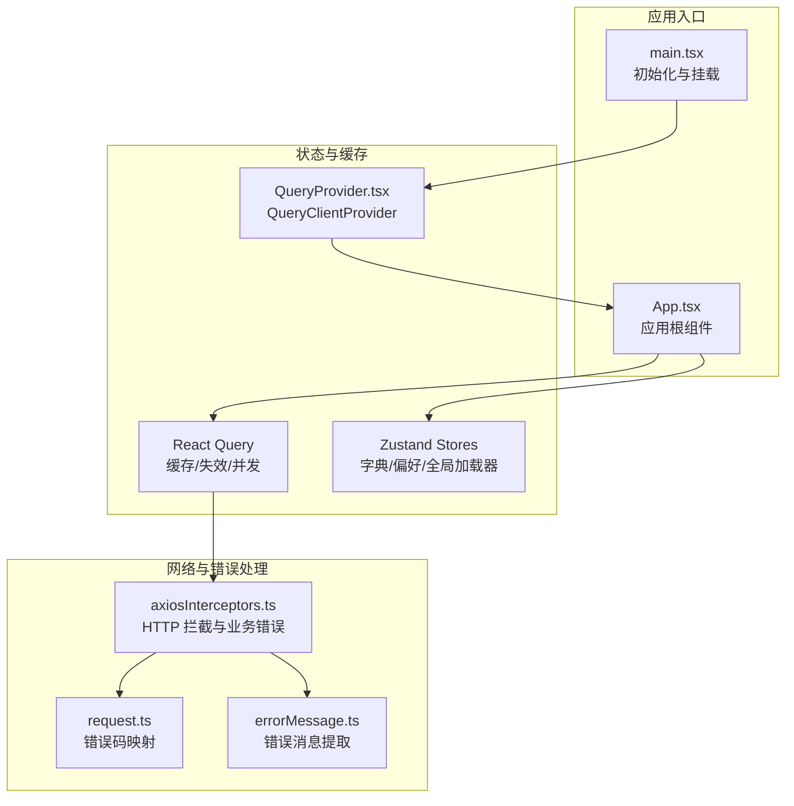
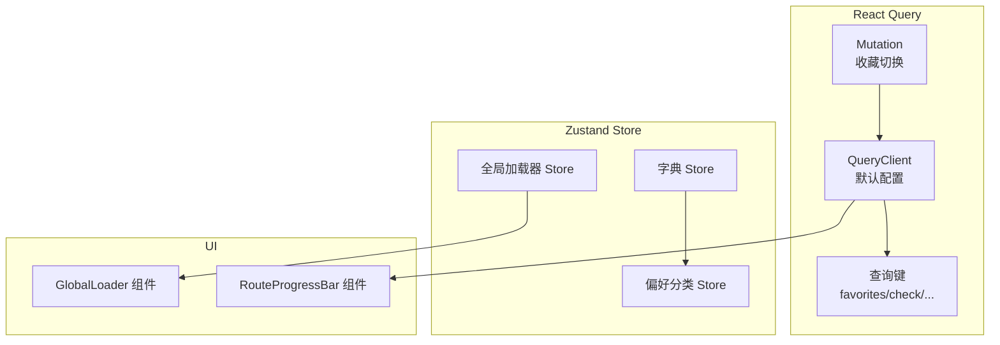
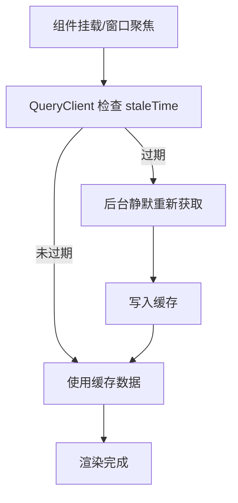
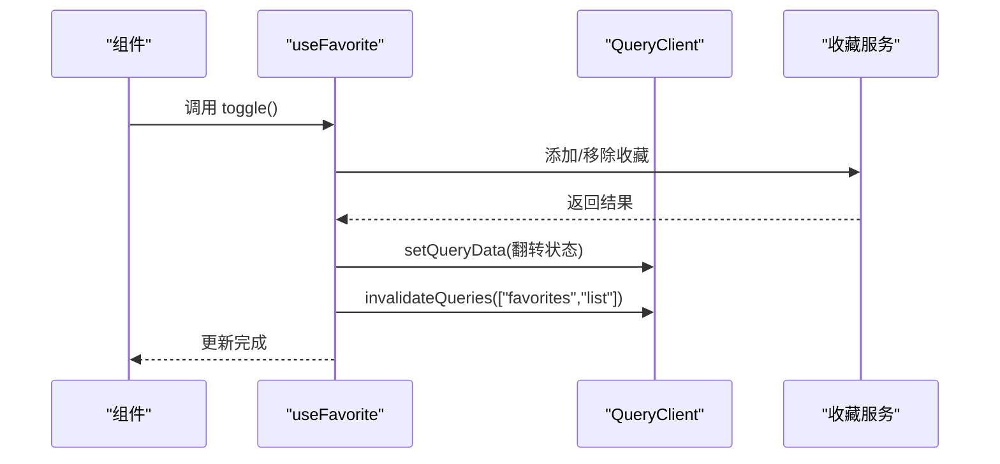
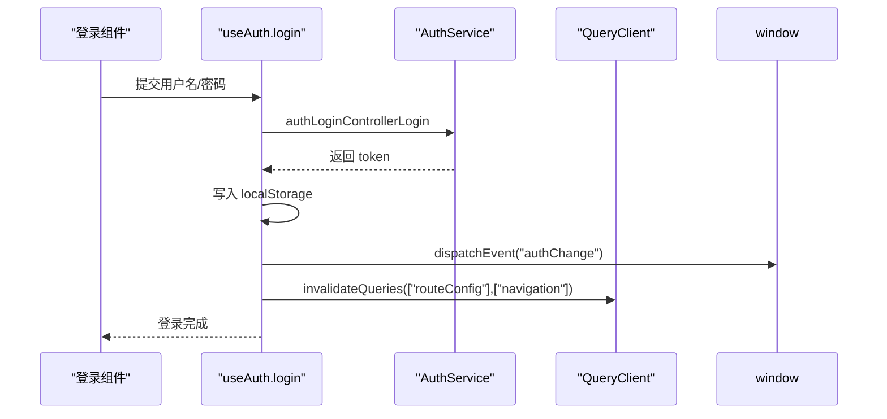
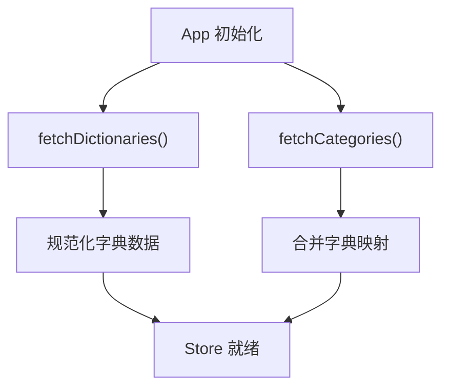
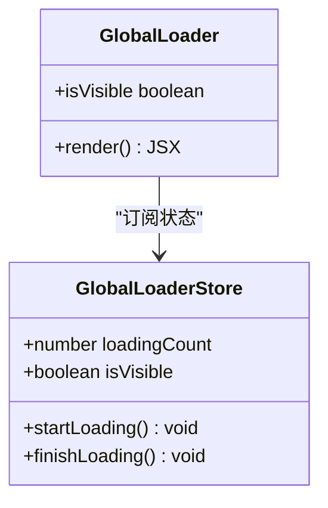
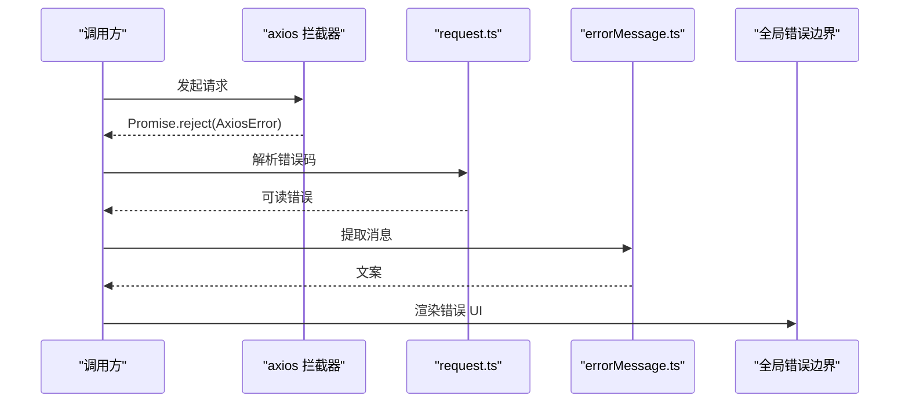
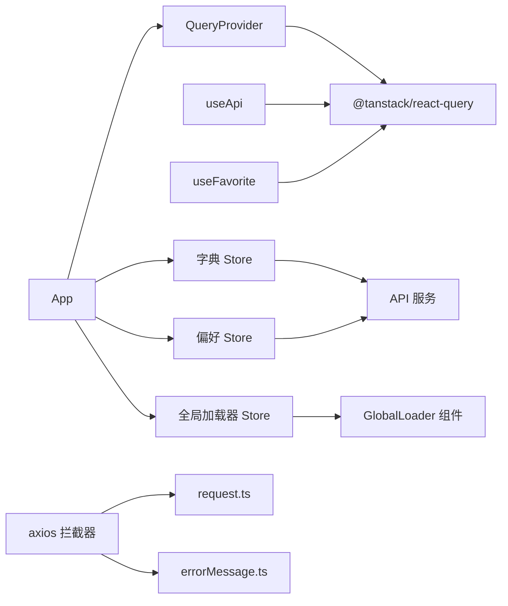

# 状态管理架构

<cite>
**本文档引用的文件**
- [src/main.tsx](file://src/main.tsx)
- [src/App.tsx](file://src/App.tsx)
- [src/providers/QueryProvider.tsx](file://src/providers/QueryProvider.tsx)
- [src/hooks/useApi.ts](file://src/hooks/useApi.ts)
- [src/hooks/useFavorite.ts](file://src/hooks/useFavorite.ts)
- [src/stores/dictionaryStore.ts](file://src/stores/dictionaryStore.ts)
- [src/stores/preferenceCategoriesStore.ts](file://src/stores/preferenceCategoriesStore.ts)
- [src/stores/globalLoaderStore.ts](file://src/stores/globalLoaderStore.ts)
- [src/modules/app/components/ui/GlobalLoader.tsx](file://src/modules/app/components/ui/GlobalLoader.tsx)
- [src/modules/app/components/ui/RouteProgressBar.tsx](file://src/modules/app/components/ui/RouteProgressBar.tsx)
- [src/api/axiosInterceptors.ts](file://src/api/axiosInterceptors.ts)
- [src/api/core/request.ts](file://src/api/core/request.ts)
- [src/utils/errorMessage.ts](file://src/utils/errorMessage.ts)
- [src/modules/app/layouts/GlobalErrorBoundary/index.tsx](file://src/modules/app/layouts/GlobalErrorBoundary/index.tsx)
</cite>

## 目录
1. [引言](#引言)
2. [项目结构](#项目结构)
3. [核心组件](#核心组件)
4. [架构总览](#架构总览)
5. [详细组件分析](#详细组件分析)
6. [依赖关系分析](#依赖关系分析)
7. [性能考量](#性能考量)
8. [故障排查指南](#故障排查指南)
9. [结论](#结论)

## 引言
本文件系统性梳理 zTorrent-site 的状态管理架构，重点阐述 React Query 作为主要状态管理工具的设计决策与实现策略，覆盖全局状态管理、本地状态存储与上下文管理的协同方式，以及数据缓存策略、查询配置与错误处理机制。文档旨在帮助开发者高效理解并扩展应用的状态管理方案。

## 项目结构
应用采用“React Query 主驱动 + 局部 Zustand Store + 上下文 Provider”的混合架构：
- React Query 负责网络数据的缓存、失效与并发控制，提供全局查询客户端与默认配置。
- 局部状态使用 Zustand Store 管理轻量、非网络状态（如全局加载器、字典与用户偏好分类）。
- 上下文（Context）与 Provider 提供主题、权限、用户摘要、下载器等横切能力。
- 全局错误边界与拦截器共同保障错误可见性与一致性。

图表来源
- [src/main.tsx](file://src/main.tsx#L1-L18)
- [src/App.tsx](file://src/App.tsx#L1-L52)
- [src/providers/QueryProvider.tsx](file://src/providers/QueryProvider.tsx#L1-L30)
- [src/api/axiosInterceptors.ts](file://src/api/axiosInterceptors.ts#L237-L270)
- [src/api/core/request.ts](file://src/api/core/request.ts#L252-L284)
- [src/utils/errorMessage.ts](file://src/utils/errorMessage.ts#L1-L11)

章节来源
- [src/main.tsx](file://src/main.tsx#L1-L18)
- [src/App.tsx](file://src/App.tsx#L1-L52)

## 核心组件
- QueryProvider：提供全局 QueryClient，默认配置面向“秒开体验”，强调挂载即刷新与后台静默更新。
- useApi：封装认证、种子、用户资料等常用 API 调用，结合 React Query 的查询客户端进行缓存与失效。
- useFavorite：典型 React Query 使用范式，结合 useMutation 实现收藏状态的即时乐观更新与列表失效。
- 字典与偏好 Store：Zustand Store 管理分类字典与用户偏好分类，配合 App 初始化阶段一次性拉取。
- 全局加载器：Zustand Store + 组件，基于引用计数控制全局加载指示器显示。
- 错误处理链路：axios 拦截器 + 错误码映射 + 错误消息提取 + 全局错误边界。

章节来源
- [src/providers/QueryProvider.tsx](file://src/providers/QueryProvider.tsx#L1-L30)
- [src/hooks/useApi.ts](file://src/hooks/useApi.ts#L1-L312)
- [src/hooks/useFavorite.ts](file://src/hooks/useFavorite.ts#L1-L76)
- [src/stores/dictionaryStore.ts](file://src/stores/dictionaryStore.ts#L1-L119)
- [src/stores/preferenceCategoriesStore.ts](file://src/stores/preferenceCategoriesStore.ts#L1-L163)
- [src/stores/globalLoaderStore.ts](file://src/stores/globalLoaderStore.ts#L1-L36)
- [src/modules/app/components/ui/GlobalLoader.tsx](file://src/modules/app/components/ui/GlobalLoader.tsx#L1-L107)
- [src/api/axiosInterceptors.ts](file://src/api/axiosInterceptors.ts#L237-L270)
- [src/api/core/request.ts](file://src/api/core/request.ts#L252-L284)
- [src/utils/errorMessage.ts](file://src/utils/errorMessage.ts#L1-L11)

## 架构总览
React Query 作为主状态管理工具，负责：
- 默认缓存策略：staleTime=0、gcTime 较长，确保“秒开”体验与后台静默更新。
- 重新获取策略：refetchOnMount=true、refetchOnWindowFocus=false，减少标签页切换抖动。
- 失败重试：retry=1，提升弱网稳定性。
- 与局部状态协作：通过 queryClient.invalidateQueries 与 setQueryData 实现跨组件的即时状态同步。

Zustand Store 负责：
- 字典与偏好：一次性拉取、前端规范化、按需查询 label。
- 全局加载器：引用计数模式，多处并发加载时统一显示。

上下文与 Provider：
- 权限、用户摘要、下载器等上下文提供者贯穿应用，与 QueryProvider 并列。

图表来源
- [src/providers/QueryProvider.tsx](file://src/providers/QueryProvider.tsx#L5-L22)
- [src/hooks/useFavorite.ts](file://src/hooks/useFavorite.ts#L22-L68)
- [src/stores/dictionaryStore.ts](file://src/stores/dictionaryStore.ts#L53-L118)
- [src/stores/preferenceCategoriesStore.ts](file://src/stores/preferenceCategoriesStore.ts#L44-L162)
- [src/stores/globalLoaderStore.ts](file://src/stores/globalLoaderStore.ts#L19-L35)
- [src/modules/app/components/ui/GlobalLoader.tsx](file://src/modules/app/components/ui/GlobalLoader.tsx#L10-L91)
- [src/modules/app/components/ui/RouteProgressBar.tsx](file://src/modules/app/components/ui/RouteProgressBar.tsx#L82-L101)

## 详细组件分析

### React Query 默认配置与缓存策略
- staleTime=0：数据立即视为过期，保证窗口焦点或组件挂载时后台静默刷新。
- gcTime=10 分钟：延长缓存生命周期，提升“秒开”体验。
- refetchOnMount=true：组件重新挂载时检查更新，利用缓存快速呈现。
- refetchOnWindowFocus=false：避免频繁标签页切换导致的重复请求。
- retry=1：弱网场景下提升成功率。

图表来源
- [src/providers/QueryProvider.tsx](file://src/providers/QueryProvider.tsx#L5-L22)

章节来源
- [src/providers/QueryProvider.tsx](file://src/providers/QueryProvider.tsx#L1-L30)

### 收藏状态管理（useFavorite）
- 查询键：["favorites","check", targetType, targetId]，独立缓存每条目标的收藏状态。
- 初始值：若传入 initialValue，启用 initialData，避免发起检查请求。
- 乐观更新：toggle 成功后直接 setQueryData 翻转状态，提升交互流畅度。
- 列表同步：成功后 invalidateQueries(["favorites","list"])，确保收藏列表实时更新。
- 错误处理：mutation 成功回调内统一 toast 提示，失败由调用方捕获。

图表来源
- [src/hooks/useFavorite.ts](file://src/hooks/useFavorite.ts#L47-L68)

章节来源
- [src/hooks/useFavorite.ts](file://src/hooks/useFavorite.ts#L1-L76)

### 认证与路由配置联动（useApi.useAuth）
- 登录流程：调用认证接口获取 token，写入 localStorage，触发自定义 authChange 事件。
- 状态刷新：invalidateQueries(["routeConfig"]) 与 ["navigation"]，确保路由守卫与导航菜单及时更新。
- 注册/验证码：统一错误消息提取，异常向上抛出以便调用方处理。
- 登出：移除 token，invalidateQueries(["navigation"])。

图表来源
- [src/hooks/useApi.ts](file://src/hooks/useApi.ts#L19-L65)

章节来源
- [src/hooks/useApi.ts](file://src/hooks/useApi.ts#L1-L141)

### 字典与偏好分类（Zustand Store）
- 字典 Store：一次性拉取 categories、userOrderBy、adminSortBy、queryOps，前端规范化并提供 getLabelByKey 查询。
- 偏好分类 Store：从用户偏好接口获取分类配置，结合字典映射填充 label，提供可见分类 keys 的便捷查询。
- 初始化：App.tsx 在应用启动时并行拉取字典与偏好，确保后续组件可用。

图表来源
- [src/App.tsx](file://src/App.tsx#L25-L31)
- [src/stores/dictionaryStore.ts](file://src/stores/dictionaryStore.ts#L58-L107)
- [src/stores/preferenceCategoriesStore.ts](file://src/stores/preferenceCategoriesStore.ts#L58-L121)

章节来源
- [src/App.tsx](file://src/App.tsx#L1-L52)
- [src/stores/dictionaryStore.ts](file://src/stores/dictionaryStore.ts#L1-L119)
- [src/stores/preferenceCategoriesStore.ts](file://src/stores/preferenceCategoriesStore.ts#L1-L163)

### 全局加载器（Zustand + 组件）
- 引用计数：多个并发加载任务 startLoading()/finishLoading()，仅当计数归零时隐藏。
- 组件：GlobalLoader 单例挂载于应用根部，动画与视觉反馈由组件自身实现。
- 触发器：GlobalLoaderTrigger 在 Suspense 场景中自动开始/结束加载。

图表来源
- [src/stores/globalLoaderStore.ts](file://src/stores/globalLoaderStore.ts#L19-L35)
- [src/modules/app/components/ui/GlobalLoader.tsx](file://src/modules/app/components/ui/GlobalLoader.tsx#L10-L91)

章节来源
- [src/stores/globalLoaderStore.ts](file://src/stores/globalLoaderStore.ts#L1-L36)
- [src/modules/app/components/ui/GlobalLoader.tsx](file://src/modules/app/components/ui/GlobalLoader.tsx#L1-L107)

### 错误处理与全局兜底
- axios 拦截器：统一处理业务错误码与 HTTP 非 2xx，构造 AxiosError 并中断链路。
- 错误码映射：request.ts 将常见 HTTP 状态映射为可读错误。
- 错误消息提取：errorMessage.ts 从多种响应形态中提取人类可读消息。
- 全局错误边界：AppGlobalErrorBoundary 捕获渲染错误，提供友好降级 UI 与恢复操作。

图表来源
- [src/api/axiosInterceptors.ts](file://src/api/axiosInterceptors.ts#L237-L270)
- [src/api/core/request.ts](file://src/api/core/request.ts#L252-L284)
- [src/utils/errorMessage.ts](file://src/utils/errorMessage.ts#L1-L11)
- [src/modules/app/layouts/GlobalErrorBoundary/index.tsx](file://src/modules/app/layouts/GlobalErrorBoundary/index.tsx#L17-L38)

章节来源
- [src/api/axiosInterceptors.ts](file://src/api/axiosInterceptors.ts#L237-L270)
- [src/api/core/request.ts](file://src/api/core/request.ts#L252-L284)
- [src/utils/errorMessage.ts](file://src/utils/errorMessage.ts#L1-L11)
- [src/modules/app/layouts/GlobalErrorBoundary/index.tsx](file://src/modules/app/layouts/GlobalErrorBoundary/index.tsx#L1-L38)

## 依赖关系分析
- QueryProvider 依赖 @tanstack/react-query，向子树提供 QueryClient。
- useApi 依赖 lazy 生成的服务与 useQueryClient，结合 localStorage 与自定义事件。
- useFavorite 依赖 @tanstack/react-query 的 useQuery/useMutation/useQueryClient。
- 字典与偏好 Store 依赖 API 服务与彼此状态。
- 全局加载器 Store 与组件解耦，通过订阅实现状态驱动。
- 错误处理链路自下而上串联，形成统一的错误体验。

图表来源
- [src/providers/QueryProvider.tsx](file://src/providers/QueryProvider.tsx#L1-L30)
- [src/hooks/useApi.ts](file://src/hooks/useApi.ts#L1-L312)
- [src/hooks/useFavorite.ts](file://src/hooks/useFavorite.ts#L1-L76)
- [src/stores/dictionaryStore.ts](file://src/stores/dictionaryStore.ts#L1-L119)
- [src/stores/preferenceCategoriesStore.ts](file://src/stores/preferenceCategoriesStore.ts#L1-L163)
- [src/stores/globalLoaderStore.ts](file://src/stores/globalLoaderStore.ts#L1-L36)
- [src/modules/app/components/ui/GlobalLoader.tsx](file://src/modules/app/components/ui/GlobalLoader.tsx#L1-L107)
- [src/api/axiosInterceptors.ts](file://src/api/axiosInterceptors.ts#L237-L270)
- [src/api/core/request.ts](file://src/api/core/request.ts#L252-L284)
- [src/utils/errorMessage.ts](file://src/utils/errorMessage.ts#L1-L11)
- [src/App.tsx](file://src/App.tsx#L1-L52)

章节来源
- [src/App.tsx](file://src/App.tsx#L1-L52)
- [src/providers/QueryProvider.tsx](file://src/providers/QueryProvider.tsx#L1-L30)

## 性能考量
- 缓存策略
  - staleTime=0 与 refetchOnMount=true 保证“秒开”体验，后台静默刷新避免阻塞首屏。
  - gcTime 延长至 10 分钟，降低页面返回时的重复请求压力。
- 重新获取控制
  - refetchOnWindowFocus=false 减少标签页切换抖动；必要时可在特定页面显式 refetch。
- 乐观更新
  - useFavorite 通过 setQueryData 立即更新 UI，减少等待时间；随后通过 invalidateQueries 同步列表。
- 并发与引用计数
  - 全局加载器采用引用计数，避免多处并发加载导致的闪烁与重复显示。
- 错误与重试
  - retry=1 提升弱网稳定性；axios 拦截器与错误码映射减少无效重试与重复提示。

## 故障排查指南
- 登录后路由未更新
  - 检查是否调用 invalidateQueries(["routeConfig"],["navigation"])。
  - 确认自定义 authChange 事件是否被路由守卫监听。
- 收藏状态不同步
  - 确认 mutation onSuccess 是否执行 setQueryData 与 invalidateQueries(["favorites","list"])。
  - 检查查询键是否一致（targetType 与 targetId）。
- 全局加载器不消失
  - 确认每个 startLoading() 是否有对应的 finishLoading() 调用。
  - 检查是否存在未完成的异步任务或 Suspense 边界未正确包裹。
- 错误消息不明确
  - 检查 axios 拦截器是否正确抛出 AxiosError。
  - 使用 errorMessage.extractErrorMessage 统一提取消息。
- 渲染错误导致白屏
  - 查看全局错误边界日志，定位具体组件与错误堆栈。

章节来源
- [src/hooks/useApi.ts](file://src/hooks/useApi.ts#L46-L65)
- [src/hooks/useFavorite.ts](file://src/hooks/useFavorite.ts#L56-L68)
- [src/stores/globalLoaderStore.ts](file://src/stores/globalLoaderStore.ts#L22-L34)
- [src/api/axiosInterceptors.ts](file://src/api/axiosInterceptors.ts#L237-L270)
- [src/utils/errorMessage.ts](file://src/utils/errorMessage.ts#L1-L11)
- [src/modules/app/layouts/GlobalErrorBoundary/index.tsx](file://src/modules/app/layouts/GlobalErrorBoundary/index.tsx#L17-L38)

## 结论
本项目以 React Query 为核心，结合 Zustand Store 与上下文 Provider，构建了清晰、可扩展且高性能的状态管理体系。通过合理的缓存与重新获取策略、乐观更新与失效同步、统一的错误处理与全局兜底，实现了良好的用户体验与开发效率。建议在新增功能时遵循现有模式：优先使用 React Query 管理网络数据，局部轻量状态使用 Zustand Store，错误处理与加载指示器保持一致风格，持续优化缓存键与失效范围，确保状态一致性与性能平衡。