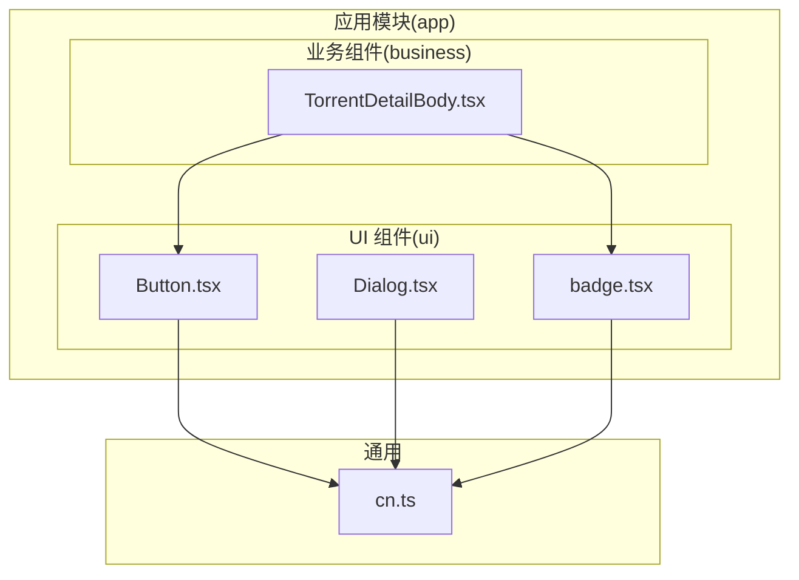
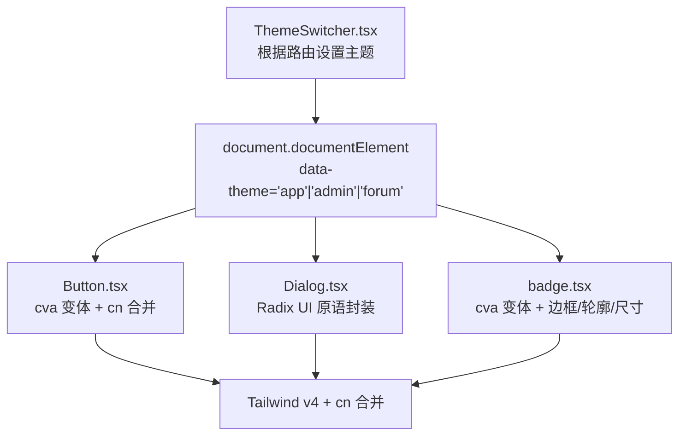
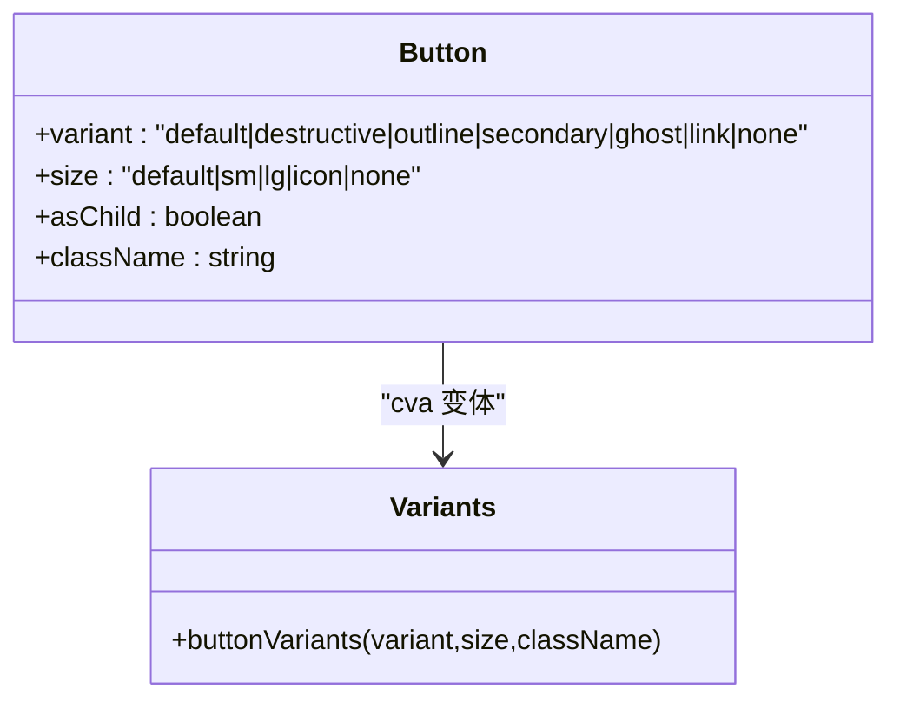
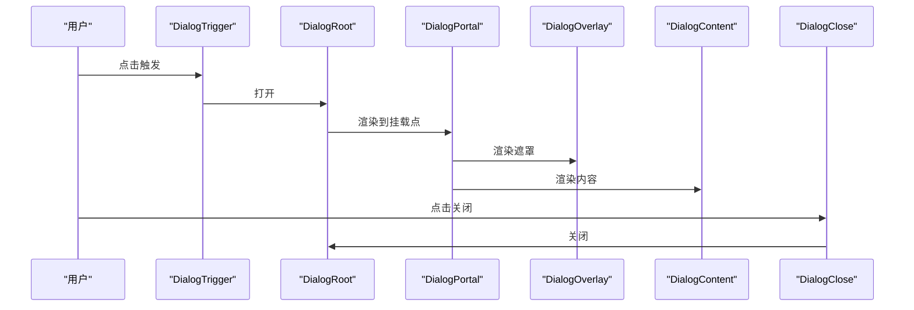
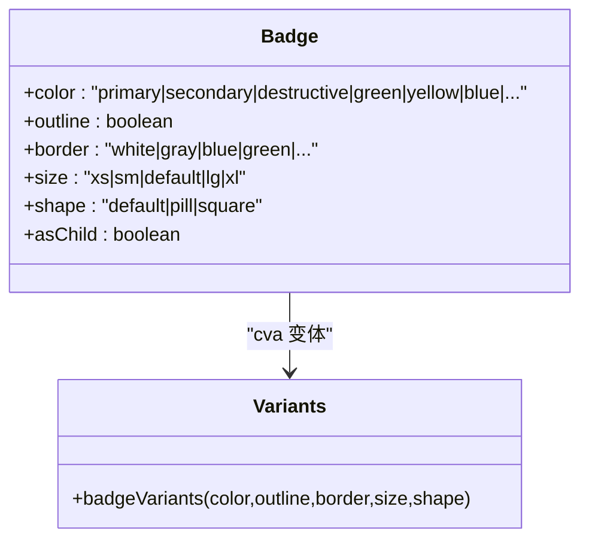
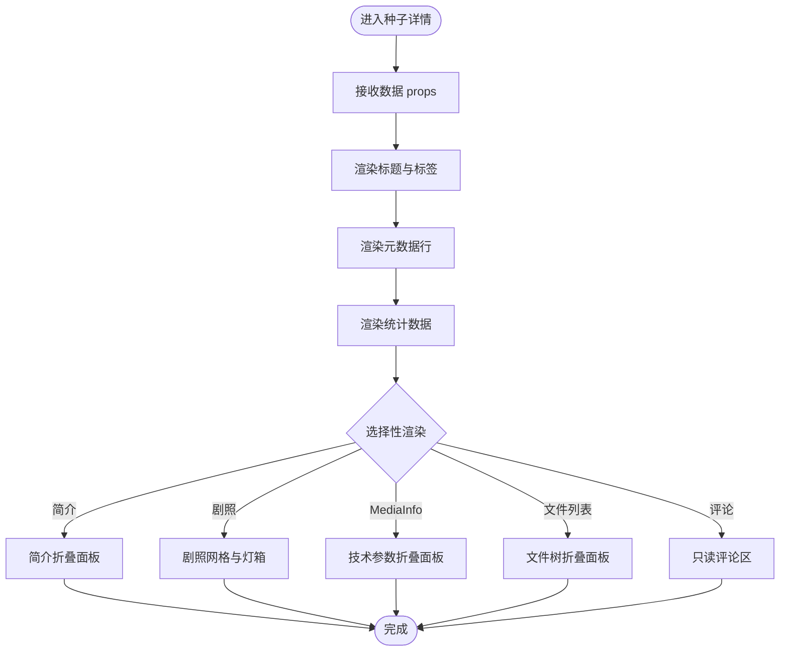
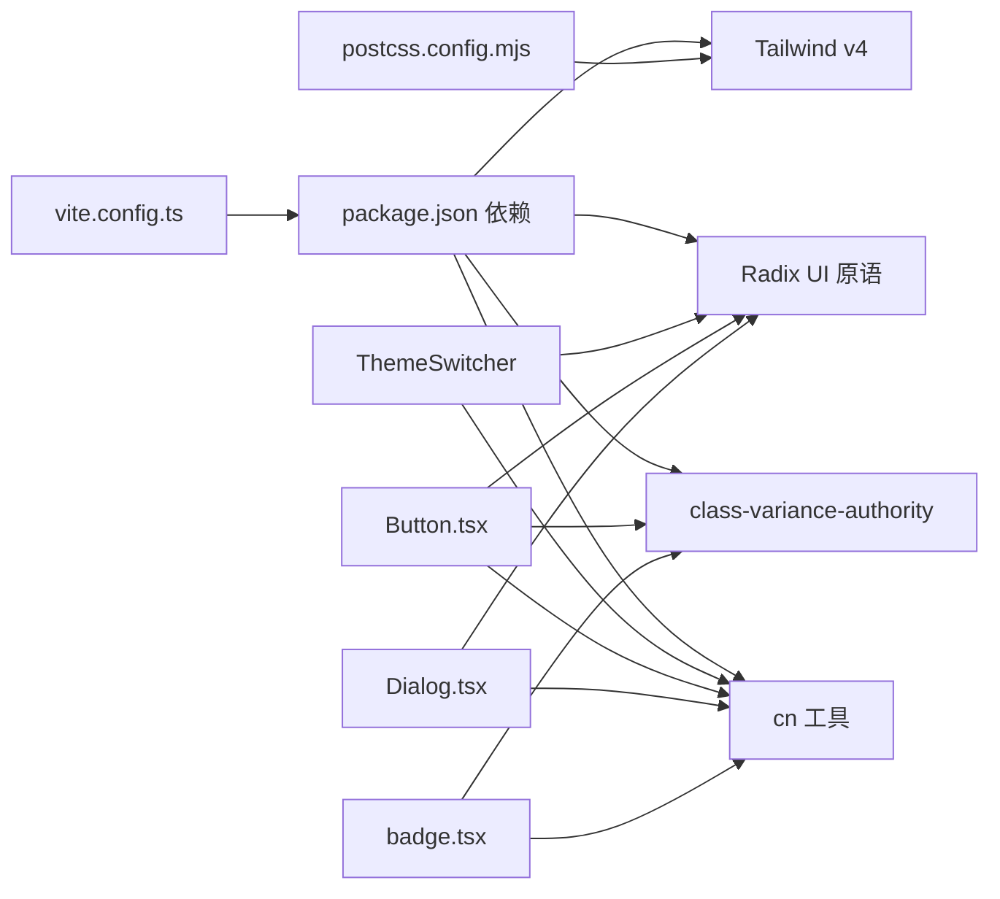

# 组件库设计

<cite>
**本文引用的文件**
- [ThemeSwitcher.tsx](file://src/components/ThemeSwitcher.tsx)
- [Guidelines.md](file://src/guidelines/Guidelines.md)
- [admin-design-system.md](file://src/guidelines/admin-design-system.md)
- [Button.tsx](file://src/modules/app/components/ui/Button.tsx)
- [Dialog.tsx](file://src/modules/app/components/ui/Dialog.tsx)
- [badge.tsx](file://src/modules/app/components/ui/badge.tsx)
- [TorrentDetailBody.tsx](file://src/modules/app/components/business/TorrentDetailBody.tsx)
- [cn.ts](file://src/utils/cn.ts)
- [package.json](file://package.json)
- [postcss.config.mjs](file://postcss.config.mjs)
- [vite.config.ts](file://vite.config.ts)
</cite>

## 目录
1. [引言](#引言)
2. [项目结构](#项目结构)
3. [核心组件](#核心组件)
4. [架构总览](#架构总览)
5. [组件详解](#组件详解)
6. [依赖关系分析](#依赖关系分析)
7. [性能考量](#性能考量)
8. [故障排查指南](#故障排查指南)
9. [结论](#结论)
10. [附录](#附录)

## 引言
本文件面向 zTorrent-site 的组件库设计，围绕基于 Radix UI 与 Tailwind CSS 的组件体系，系统阐述基础组件、复合组件与业务组件的分类与设计规范；解释可复用性设计、样式系统与主题定制机制；并提供使用指南与扩展方法，帮助开发者构建一致、可维护的用户界面。

## 项目结构
组件库位于应用模块的通用 UI 区域，采用“按功能域分层 + 组件分层”的组织方式：
- 基础组件集中于 app 模块的 ui 子目录，遵循 Radix UI 原语封装与 Tailwind 原子化样式。
- 复合组件在 ui 下进一步组合基础组件，形成更高阶的交互单元。
- 业务组件在 components/business 下，将基础/复合组件组合为具体业务场景的页面片段。

图表来源
- [Button.tsx](file://src/modules/app/components/ui/Button.tsx#L1-L72)
- [Dialog.tsx](file://src/modules/app/components/ui/Dialog.tsx#L1-L136)
- [badge.tsx](file://src/modules/app/components/ui/badge.tsx#L1-L102)
- [TorrentDetailBody.tsx](file://src/modules/app/components/business/TorrentDetailBody.tsx#L1-L371)
- [cn.ts](file://src/utils/cn.ts#L1-L6)

章节来源
- [Guidelines.md](file://src/guidelines/Guidelines.md#L22-L37)
- [vite.config.ts](file://vite.config.ts#L29-L34)

## 核心组件
- 基础组件：以 Radix UI 原语为基础，结合 class-variance-authority 提供变体与尺寸，使用 cn 工具合并类名，确保样式一致性与可扩展性。
- 复合组件：在基础组件之上，封装交互与布局，如对话框系列（Root/Trigger/Portal/Overlay/Content/Close/Header/Footer/Title/Description）。
- 业务组件：面向具体业务场景，组合基础/复合组件，承担数据展示与交互职责，如种子详情主体内容。

章节来源
- [Button.tsx](file://src/modules/app/components/ui/Button.tsx#L1-L72)
- [Dialog.tsx](file://src/modules/app/components/ui/Dialog.tsx#L1-L136)
- [badge.tsx](file://src/modules/app/components/ui/badge.tsx#L1-L102)
- [TorrentDetailBody.tsx](file://src/modules/app/components/business/TorrentDetailBody.tsx#L1-L371)

## 架构总览
组件库遵循“原语封装 + 变体系统 + 原子化样式 + 主题驱动”的架构：
- 原语封装：以 Radix UI 为核心，保证无障碍与可访问性。
- 变体系统：通过 class-variance-authority 定义变体与默认值，统一风格。
- 原子化样式：Tailwind v4 与 cn 工具确保类名合并与优先级正确。
- 主题驱动：通过根节点 data-theme 属性切换主题上下文，影响全局 CSS 变量与组件外观。

图表来源
- [ThemeSwitcher.tsx](file://src/components/ThemeSwitcher.tsx#L1-L23)
- [Button.tsx](file://src/modules/app/components/ui/Button.tsx#L1-L72)
- [Dialog.tsx](file://src/modules/app/components/ui/Dialog.tsx#L1-L136)
- [badge.tsx](file://src/modules/app/components/ui/badge.tsx#L1-L102)
- [postcss.config.mjs](file://postcss.config.mjs#L1-L6)

章节来源
- [Guidelines.md](file://src/guidelines/Guidelines.md#L49-L54)
- [ThemeSwitcher.tsx](file://src/components/ThemeSwitcher.tsx#L1-L23)

## 组件详解

### 基础组件：Button
- 设计要点
  - 使用 cva 定义 variant 与 size 变体，支持 asChild 渲染为任意元素。
  - 通过 cn 合并传入 className，确保覆盖顺序与冲突消除。
  - 支持禁用、聚焦可见边框、错误态等通用状态。
- 可复用性
  - 通过变体与尺寸抽象，满足页面 Toolbar、表格行内、弹窗底部等多场景。
  - 与图标组合时自动适配尺寸与间距。
- 主题与样式
  - 依赖根节点 data-theme 与 Tailwind 颜色变量，确保在不同主题下呈现一致的对比度与可读性。

图表来源
- [Button.tsx](file://src/modules/app/components/ui/Button.tsx#L7-L37)

章节来源
- [Button.tsx](file://src/modules/app/components/ui/Button.tsx#L1-L72)
- [Guidelines.md](file://src/guidelines/Guidelines.md#L49-L54)

### 复合组件：Dialog（对话框系列）
- 设计要点
  - 封装 Root、Trigger、Portal、Overlay、Content、Close、Header、Footer、Title、Description。
  - 使用 Radix UI 原语，确保开启动画与无障碍行为。
  - 通过 cn 合并类名，支持自定义容器尺寸与动画。
- 可复用性
  - 以“容器 + 结构化布局”的方式，统一弹窗的头部、内容、底部与关闭按钮。
  - 可在业务组件中直接复用，减少样板代码。
- 主题与样式
  - 依赖主题上下文与 Tailwind 颜色变量，保证在不同主题下的视觉一致性。

图表来源
- [Dialog.tsx](file://src/modules/app/components/ui/Dialog.tsx#L9-L135)

章节来源
- [Dialog.tsx](file://src/modules/app/components/ui/Dialog.tsx#L1-L136)

### 基础组件：Badge（徽章）
- 设计要点
  - 提供 color、outline、border、size、shape 等变体，覆盖多语义场景。
  - 支持 asChild，便于在链接等元素中使用。
- 可复用性
  - 通过变体系统快速表达状态与语义，避免重复定义样式。
- 主题与样式
  - 与主题上下文联动，确保在深浅色模式下的可读性。

图表来源
- [badge.tsx](file://src/modules/app/components/ui/badge.tsx#L7-L77)

章节来源
- [badge.tsx](file://src/modules/app/components/ui/badge.tsx#L1-L102)

### 业务组件：TorrentDetailBody（种子详情主体）
- 设计要点
  - 将种子标题、标签、元数据、统计数据、简介、剧照、MediaInfo、文件树、评论等模块化组织。
  - 使用 Badge、Button、Separator 等基础/复合组件，形成高内聚低耦合的业务视图。
  - 支持展开/收起、轻量灯箱、文件树递归渲染等交互。
- 可复用性
  - 通过 props 输入聚合数据，便于在不同页面复用。
  - 局部组件（如文件项）内联实现，保证任务独立性，后续可迁移为通用组件。
- 主题与样式
  - 依赖主题上下文与 Tailwind 原子类，确保在不同主题下的阅读体验。

图表来源
- [TorrentDetailBody.tsx](file://src/modules/app/components/business/TorrentDetailBody.tsx#L101-L371)

章节来源
- [TorrentDetailBody.tsx](file://src/modules/app/components/business/TorrentDetailBody.tsx#L1-L371)

## 依赖关系分析
- 样式系统
  - Tailwind v4 通过 PostCSS 插件启用，cn 工具负责类名合并与冲突消除。
- 原语与变体
  - Radix UI 原语提供无障碍与可访问性保障；class-variance-authority 提供变体系统。
- 主题系统
  - ThemeSwitcher 根据路由路径设置 documentElement 的 data-theme，影响全局 CSS 变量与组件外观。
- 构建与别名
  - Vite 配置了 @ 别名与 vendor 分包策略，提升构建性能与缓存命中率。

图表来源
- [package.json](file://package.json#L5-L91)
- [postcss.config.mjs](file://postcss.config.mjs#L1-L6)
- [vite.config.ts](file://vite.config.ts#L1-L86)
- [ThemeSwitcher.tsx](file://src/components/ThemeSwitcher.tsx#L1-L23)
- [Button.tsx](file://src/modules/app/components/ui/Button.tsx#L1-L72)
- [Dialog.tsx](file://src/modules/app/components/ui/Dialog.tsx#L1-L136)
- [badge.tsx](file://src/modules/app/components/ui/badge.tsx#L1-L102)

章节来源
- [package.json](file://package.json#L5-L91)
- [postcss.config.mjs](file://postcss.config.mjs#L1-L6)
- [vite.config.ts](file://vite.config.ts#L29-L34)

## 性能考量
- 按需加载与代码分割：路由组件使用懒加载，Vite 配置 vendor 分包，降低首屏体积。
- 渲染优化：合理使用 useMemo/useCallback，避免不必要的重渲染。
- 样式体积：Tailwind 原子化类名减少重复样式，cn 工具避免冗余类名。
- 动画与交互：Radix UI 原语自带开启动画，注意在低端设备上的性能影响。

章节来源
- [Guidelines.md](file://src/guidelines/Guidelines.md#L131-L135)
- [vite.config.ts](file://vite.config.ts#L60-L79)

## 故障排查指南
- 类名冲突与覆盖问题
  - 确保使用 cn 工具合并类名，避免直接拼接字符串导致优先级异常。
- 主题不生效
  - 检查 ThemeSwitcher 是否根据当前路由设置了正确的 data-theme 值。
  - 确认 Tailwind CSS 变量在目标主题下可用。
- 变体与尺寸无效
  - 检查传入的 variant/size 是否在 cva 定义范围内，null 值会被映射为 none 变体。
- 动画与焦点问题
  - 确保 Radix UI 原语的根节点 data-slot 与样式选择器匹配，避免动画或焦点样式丢失。

章节来源
- [cn.ts](file://src/utils/cn.ts#L1-L6)
- [ThemeSwitcher.tsx](file://src/components/ThemeSwitcher.tsx#L1-L23)
- [Button.tsx](file://src/modules/app/components/ui/Button.tsx#L54-L61)
- [Dialog.tsx](file://src/modules/app/components/ui/Dialog.tsx#L55-L72)

## 结论
本组件库以 Radix UI 为骨架、Tailwind 为皮肤、class-variance-authority 为调色盘，辅以 cn 工具与主题系统，实现了高内聚、低耦合、可扩展的 UI 体系。通过基础组件、复合组件与业务组件的分层设计，开发者可以在统一规范下快速搭建一致、可维护的用户界面。

## 附录

### 设计规范速览
- 按钮交互与样式
  - 主要操作使用 primary，次要操作使用 default，危险操作使用 danger，行内操作使用 link。
- 标签色彩与变体
  - 颜色即语义，保持全站一致；优先使用 Filled，谨慎使用 Solid。
- 字体与排版
  - 默认使用标准字号与字重，标题与表头可加粗；对齐方式按场景设定。
- 间距与布局
  - 按照规范设置 gap 与 p/space，保证视觉节奏。

章节来源
- [admin-design-system.md](file://src/guidelines/admin-design-system.md#L7-L149)