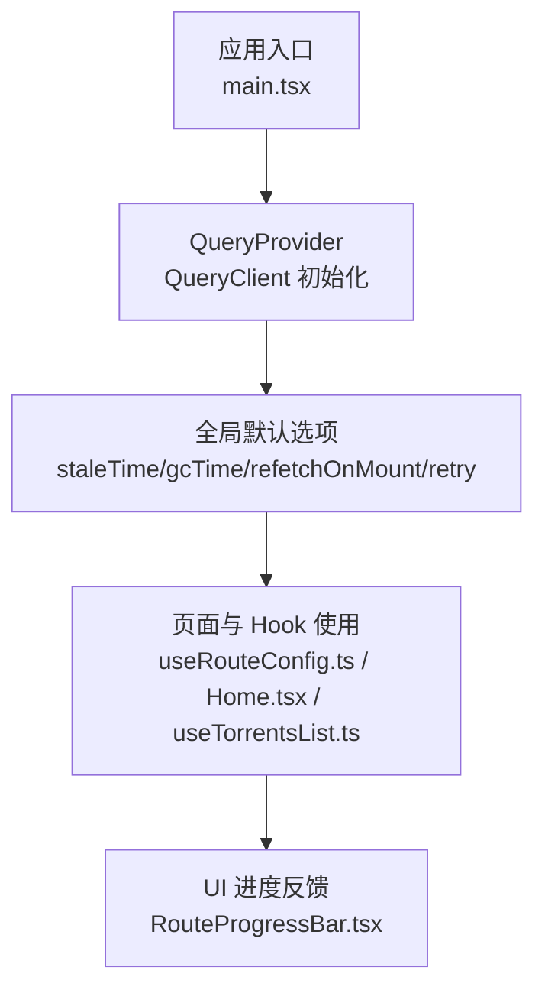
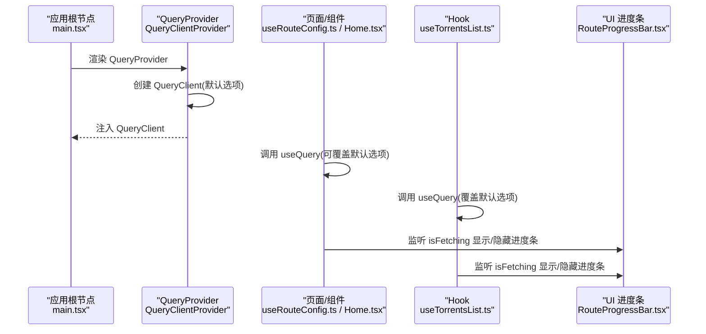
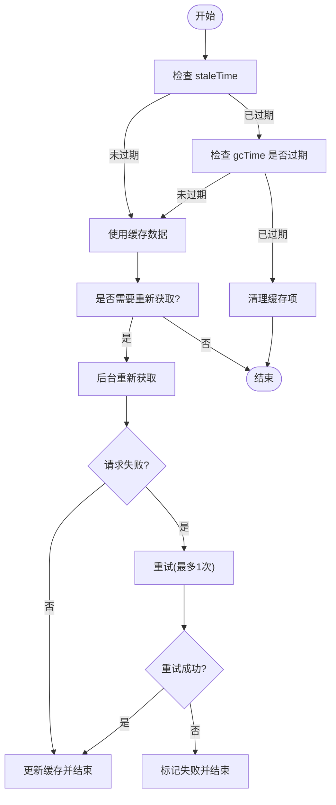
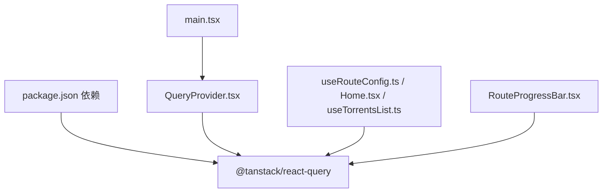

# React Query 配置

<cite>
**本文引用的文件**
- [QueryProvider.tsx](file://src/providers/QueryProvider.tsx)
- [main.tsx](file://src/main.tsx)
- [useRouteConfig.ts](file://src/hooks/useRouteConfig.ts)
- [Home.tsx](file://src/modules/app/pages/Home.tsx)
- [useTorrentsList.ts](file://src/modules/app/pages/TorrentsList/hooks/UseTorrentsList.ts)
- [RouteProgressBar.tsx](file://src/modules/app/components/ui/RouteProgressBar.tsx)
- [package.json](file://package.json)
</cite>

## 目录
1. [简介](#简介)
2. [项目结构](#项目结构)
3. [核心组件](#核心组件)
4. [架构总览](#架构总览)
5. [详细组件分析](#详细组件分析)
6. [依赖关系分析](#依赖关系分析)
7. [性能考量](#性能考量)
8. [故障排查指南](#故障排查指南)
9. [结论](#结论)
10. [附录](#附录)

## 简介
本文件围绕 React Query 在本项目的初始化与配置展开，系统性阐述 QueryClient 的默认选项、缓存策略、生命周期管理、重新获取策略与错误重试机制，并结合项目中的实际用法，给出性能优化建议、内存管理策略与调优指南。

## 项目结构
React Query 在本项目中的入口与配置集中在 Provider 层，随后在各页面与 Hook 中按需覆盖默认行为。整体结构如下：

图表来源
- [main.tsx](file://src/main.tsx#L9-L16)
- [QueryProvider.tsx](file://src/providers/QueryProvider.tsx#L4-L29)
- [useRouteConfig.ts](file://src/hooks/useRouteConfig.ts#L63-L100)
- [Home.tsx](file://src/modules/app/pages/Home.tsx#L123-L127)
- [useTorrentsList.ts](file://src/modules/app/pages/TorrentsList/hooks/UseTorrentsList.ts#L113-L118)
- [RouteProgressBar.tsx](file://src/modules/app/components/ui/RouteProgressBar.tsx#L88-L98)

章节来源
- [main.tsx](file://src/main.tsx#L1-L18)
- [QueryProvider.tsx](file://src/providers/QueryProvider.tsx#L1-L30)

## 核心组件
- QueryClientProvider：在应用根部注入 QueryClient 实例，使整个应用具备 React Query 的缓存与并发能力。
- QueryClient 默认选项：集中定义于 QueryProvider 内，作为全局默认行为，具体参数包括：
  - staleTime：数据被视为“新鲜”的时长。项目默认为 0，表示数据随时过期，便于在窗口聚焦或组件挂载时进行后台静默更新。
  - gcTime：缓存项在过期后的保留时间。项目默认为 10 分钟，提升用户返回页面时的“秒开”体验。
  - refetchOnMount：组件挂载时是否重新获取。项目默认开启，确保页面重新进入时能及时更新。
  - refetchOnWindowFocus：窗口获得焦点时是否重新获取。项目默认关闭，避免频繁切换标签页导致的重复请求。
  - retry：请求失败时的重试次数。项目默认为 1 次，兼顾稳定性与用户体验。

章节来源
- [QueryProvider.tsx](file://src/providers/QueryProvider.tsx#L5-L22)

## 架构总览
下图展示了应用启动、QueryClient 注入以及数据获取的整体流程：

图表来源
- [main.tsx](file://src/main.tsx#L9-L16)
- [QueryProvider.tsx](file://src/providers/QueryProvider.tsx#L4-L29)
- [useRouteConfig.ts](file://src/hooks/useRouteConfig.ts#L63-L100)
- [Home.tsx](file://src/modules/app/pages/Home.tsx#L123-L127)
- [useTorrentsList.ts](file://src/modules/app/pages/TorrentsList/hooks/UseTorrentsList.ts#L113-L118)
- [RouteProgressBar.tsx](file://src/modules/app/components/ui/RouteProgressBar.tsx#L88-L98)

## 详细组件分析

### QueryClient 初始化与默认选项
- 初始化位置：应用入口通过 QueryProvider 注入 QueryClient。
- 默认选项要点：
  - staleTime: 0，确保数据随时过期，利于在窗口聚焦或挂载时进行后台静默更新。
  - gcTime: 10 分钟，延长缓存保留时间，提升页面返回时的响应速度。
  - refetchOnMount: true，保证页面重新进入时能及时刷新。
  - refetchOnWindowFocus: false，避免频繁切换标签页带来的重复请求。
  - retry: 1，对偶发网络错误进行一次自动重试。

章节来源
- [QueryProvider.tsx](file://src/providers/QueryProvider.tsx#L5-L22)
- [main.tsx](file://src/main.tsx#L9-L16)

### 页面与 Hook 中的覆盖用法
- 动态路由配置 useRouteConfig：使用默认 staleTime 与 retry，并通过 enabled 控制请求条件。
- 首页数据 Home：多处 useQuery 设置了不同的 staleTime，用于平衡实时性与性能。
- 种子列表 useTorrentsList：覆盖默认选项，关闭多种自动重新获取，延长 gcTime，减少不必要的网络请求。

章节来源
- [useRouteConfig.ts](file://src/hooks/useRouteConfig.ts#L63-L100)
- [Home.tsx](file://src/modules/app/pages/Home.tsx#L123-L127)
- [Home.tsx](file://src/modules/app/pages/Home.tsx#L207-L220)
- [Home.tsx](file://src/modules/app/pages/Home.tsx#L256-L270)
- [useTorrentsList.ts](file://src/modules/app/pages/TorrentsList/hooks/UseTorrentsList.ts#L113-L118)

### 缓存生命周期与重新获取策略
- 生命周期管理：
  - 数据在 staleTime 到期后即被视为陈旧，但仍在 gcTime 内保留在内存中。
  - gcTime 过后，缓存项被清理，释放内存。
- 重新获取策略：
  - 组件挂载时：若启用 refetchOnMount，则在后台重新获取并静默更新。
  - 窗口聚焦时：若启用 refetchOnWindowFocus，则在后台重新获取。
  - 网络恢复时：可通过 refetchOnReconnect 控制是否重新获取。
- 错误重试：
  - retry 次数为 1，失败后不会无限重试，避免对服务端造成压力。

图表来源
- [QueryProvider.tsx](file://src/providers/QueryProvider.tsx#L9-L19)
- [useTorrentsList.ts](file://src/modules/app/pages/TorrentsList/hooks/UseTorrentsList.ts#L113-L118)

### 错误处理与用户反馈
- API 层拦截器对业务错误进行统一处理，并在开发环境输出详细日志。
- 错误消息提取工具支持从不同层级提取错误信息，便于 UI 友好提示。
- 页面与 Hook 中的错误状态与重试回调配合使用，提升用户可控性。

章节来源
- [axiosInterceptors.ts](file://src/api/axiosInterceptors.ts#L207-L239)
- [errorMessage.ts](file://src/utils/errorMessage.ts#L1-L11)

### UI 进度条与并发状态
- RouteProgressBar 监听全局 isFetching，当存在后台请求时显示进度条，提升交互反馈。
- 该模式与 QueryClientProvider 的默认选项配合，确保在用户操作时提供明确的加载信号。

章节来源
- [RouteProgressBar.tsx](file://src/modules/app/components/ui/RouteProgressBar.tsx#L88-L98)

## 依赖关系分析
- React Query 版本：项目使用 @tanstack/react-query ^5.90.11，具备稳定的默认选项与生命周期管理能力。
- 应用层依赖：
  - QueryProvider 依赖 React 与 @tanstack/react-query。
  - 页面与 Hook 通过 useQuery 使用 QueryClient 的缓存与并发能力。
  - UI 进度条依赖 React Query 的 isFetching 状态。

图表来源
- [package.json](file://package.json#L37-L37)
- [main.tsx](file://src/main.tsx#L9-L16)
- [QueryProvider.tsx](file://src/providers/QueryProvider.tsx#L1-L2)
- [useRouteConfig.ts](file://src/hooks/useRouteConfig.ts#L7-L7)
- [Home.tsx](file://src/modules/app/pages/Home.tsx#L123-L127)
- [useTorrentsList.ts](file://src/modules/app/pages/TorrentsList/hooks/UseTorrentsList.ts#L113-L118)
- [RouteProgressBar.tsx](file://src/modules/app/components/ui/RouteProgressBar.tsx#L88-L98)

章节来源
- [package.json](file://package.json#L37-L37)

## 性能考量
- 缓存策略调优
  - 对高频、低频变更的数据采用差异化 staleTime，平衡实时性与带宽消耗。
  - 对需要“秒开”体验的页面，适当提高 gcTime，减少返回页面时的等待。
- 重新获取控制
  - 关闭不必要的 refetchOnWindowFocus 与 refetchOnReconnect，降低标签页切换与网络波动带来的请求压力。
  - 对于列表类页面，关闭 refetchOnMount 并延长 gcTime，避免频繁刷新。
- 错误重试与容错
  - 合理设置 retry 次数，避免对服务端造成抖动。
  - 结合 UI 进度条与错误提示，提升用户感知与可控性。
- 内存管理
  - 合理设置 gcTime，确保过期数据在合适的时间被清理，避免内存泄漏。
  - 对长时间驻留的页面，关注缓存项数量与大小，必要时通过查询键区分缓存域。

## 故障排查指南
- 页面返回数据未更新
  - 检查 staleTime 与 gcTime 设置，确认数据是否仍处于缓存期内。
  - 若启用了 refetchOnMount，确认页面是否正确触发挂载逻辑。
- 标签页频繁刷新导致请求过多
  - 检查 refetchOnWindowFocus 是否被意外开启，必要时在页面 Hook 中覆盖为 false。
- 列表页面加载缓慢
  - 检查是否启用了过多的自动重新获取，考虑关闭 refetchOnMount 与 refetchOnWindowFocus，并延长 gcTime。
- 错误重试无效
  - 确认 retry 次数设置为正数，且错误类型允许重试。
  - 检查 API 层拦截器是否将业务错误映射为标准错误状态，以便 React Query 正确识别。

章节来源
- [QueryProvider.tsx](file://src/providers/QueryProvider.tsx#L9-L19)
- [useTorrentsList.ts](file://src/modules/app/pages/TorrentsList/hooks/UseTorrentsList.ts#L113-L118)
- [axiosInterceptors.ts](file://src/api/axiosInterceptors.ts#L207-L239)

## 结论
本项目通过在 QueryProvider 中集中配置默认选项，实现了全局一致的缓存与重新获取策略，并在页面与 Hook 层面按需覆盖，形成“全局默认 + 局部定制”的灵活配置体系。结合合理的 staleTime、gcTime、refetch 策略与错误重试设置，既提升了用户体验，也兼顾了性能与资源占用。建议在后续迭代中持续监控关键页面的缓存命中率与请求频率，按需微调参数，确保系统在高并发场景下的稳定与高效。

## 附录
- 关键参数速览
  - staleTime：数据新鲜度阈值，默认 0（随时过期），可在页面 Hook 中按需调整。
  - gcTime：缓存保留时间，默认 10 分钟，适合“秒开”体验。
  - refetchOnMount：组件挂载时重新获取，默认开启。
  - refetchOnWindowFocus：窗口聚焦时重新获取，默认关闭。
  - retry：失败重试次数，默认 1 次。

章节来源
- [QueryProvider.tsx](file://src/providers/QueryProvider.tsx#L9-L19)
- [useRouteConfig.ts](file://src/hooks/useRouteConfig.ts#L96-L97)
- [Home.tsx](file://src/modules/app/pages/Home.tsx#L126-L126)
- [Home.tsx](file://src/modules/app/pages/Home.tsx#L219-L219)
- [Home.tsx](file://src/modules/app/pages/Home.tsx#L269-L269)
- [useTorrentsList.ts](file://src/modules/app/pages/TorrentsList/hooks/UseTorrentsList.ts#L113-L118)