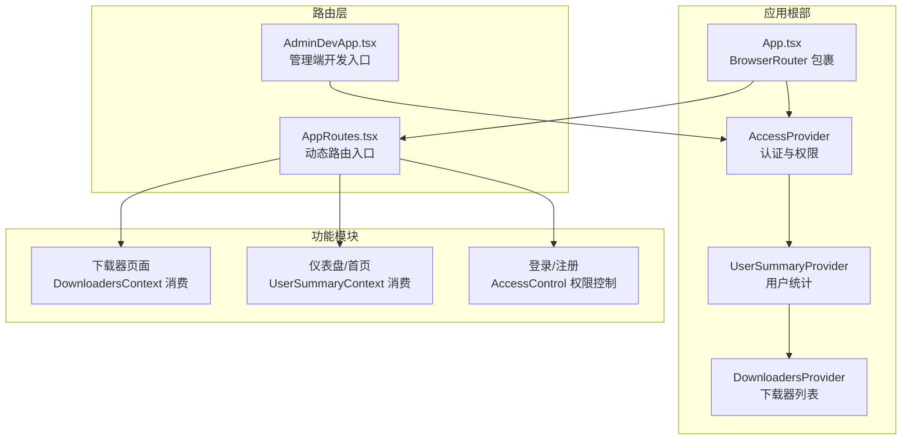
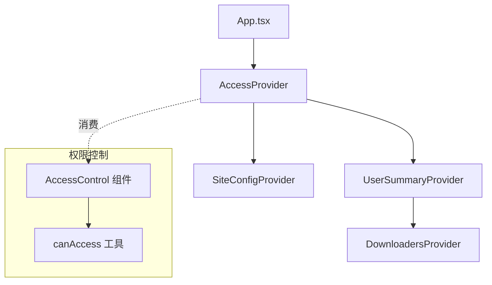
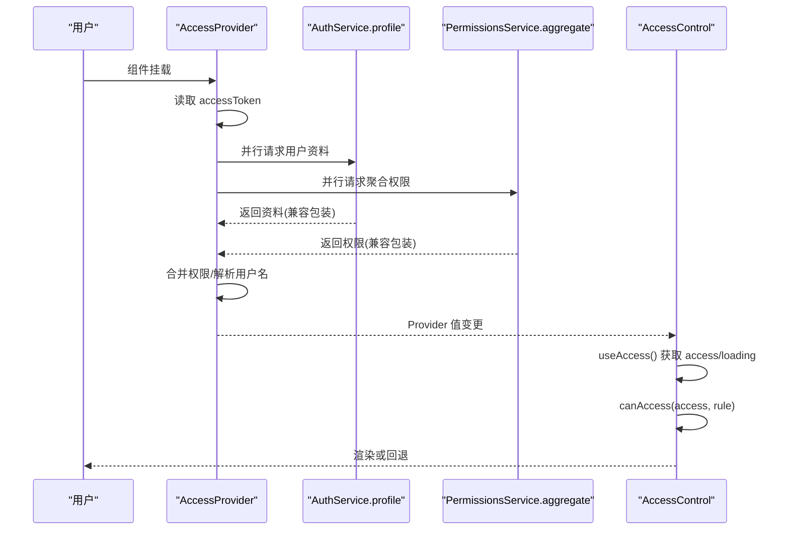
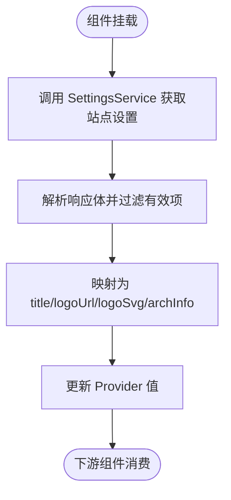
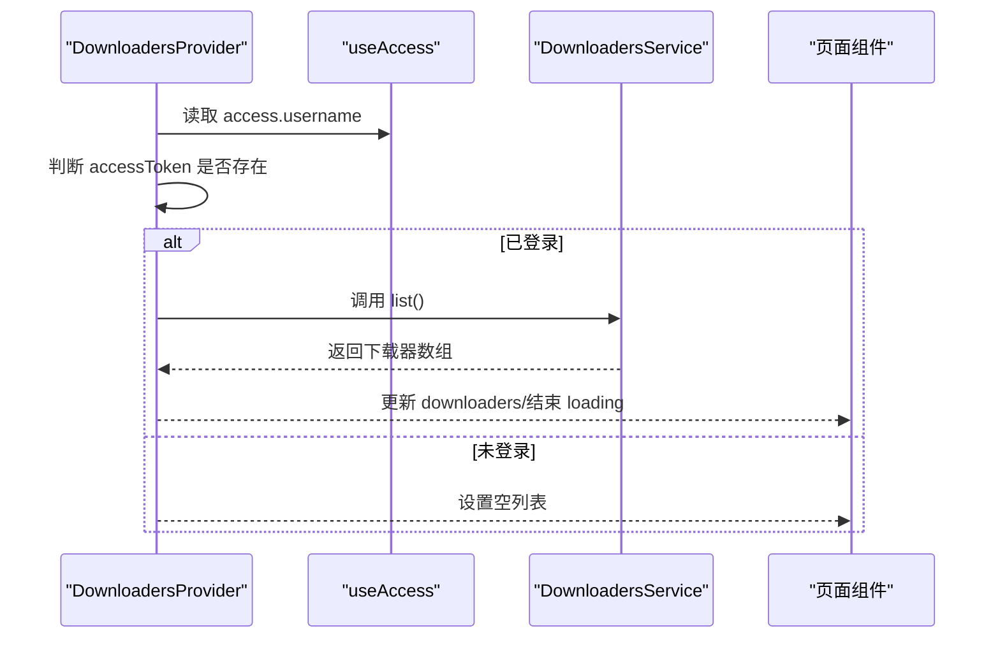
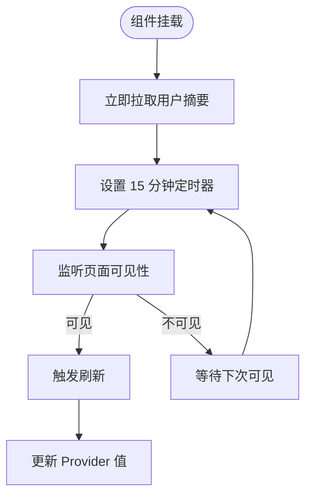
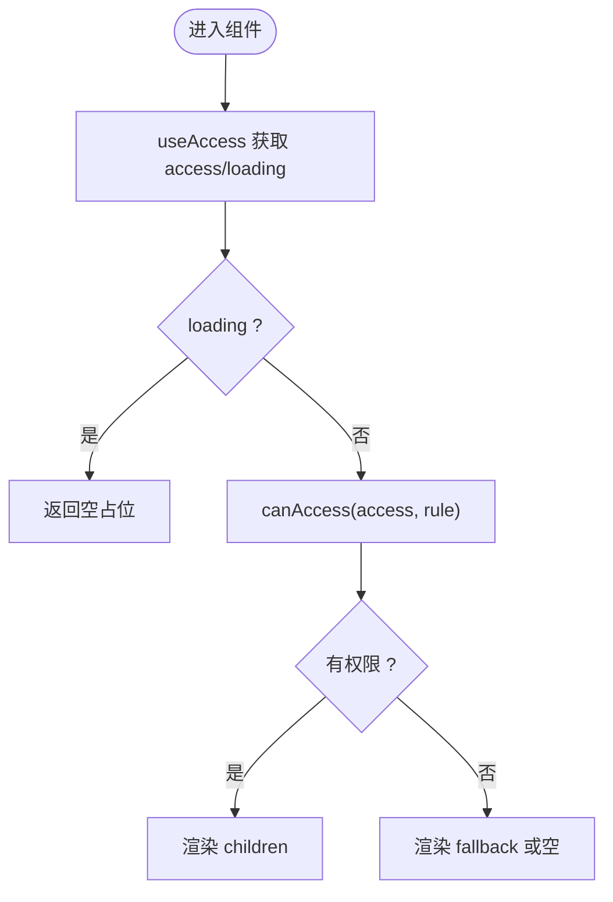
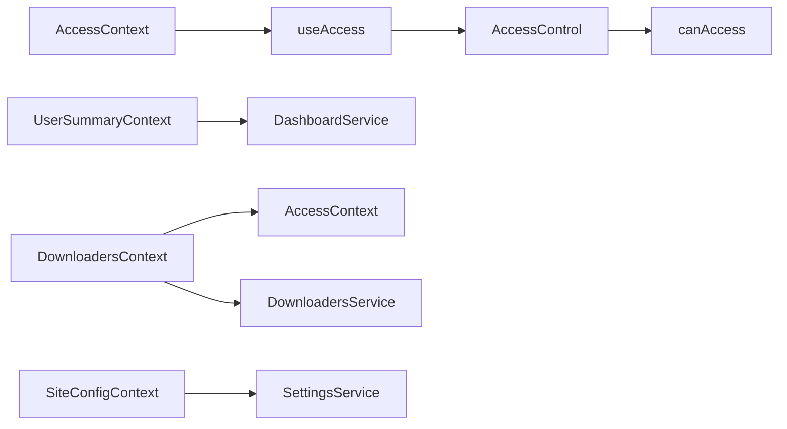

# 上下文管理

<cite>
**本文引用的文件**
- [src/context/AccessContext.tsx](file://src/context/AccessContext.tsx)
- [src/context/SiteConfigContext.tsx](file://src/context/SiteConfigContext.tsx)
- [src/modules/app/context/DownloadersContext.tsx](file://src/modules/app/context/DownloadersContext.tsx)
- [src/modules/app/context/UserSummaryContext.tsx](file://src/modules/app/context/UserSummaryContext.tsx)
- [src/permissions/AccessControl.tsx](file://src/permissions/AccessControl.tsx)
- [src/utils/access.ts](file://src/utils/access.ts)
- [src/App.tsx](file://src/App.tsx)
- [src/modules/admin/AdminDevApp.tsx](file://src/modules/admin/AdminDevApp.tsx)
- [src/routes/AppRoutes.tsx](file://src/routes/AppRoutes.tsx)
</cite>

## 目录
1. [引言](#引言)
2. [项目结构](#项目结构)
3. [核心组件](#核心组件)
4. [架构总览](#架构总览)
5. [详细组件分析](#详细组件分析)
6. [依赖分析](#依赖分析)
7. [性能考虑](#性能考虑)
8. [故障排查指南](#故障排查指南)
9. [结论](#结论)
10. [附录](#附录)

## 引言
本文件系统化梳理 zTorrent 站点的上下文管理方案，围绕 React Context 的设计模式，解释提供者与消费者模式在项目中的落地方式。重点覆盖以下上下文：
- 认证与访问控制上下文（AccessContext）
- 站点配置上下文（SiteConfigContext）
- 下载器上下文（DownloadersContext）
- 用户摘要上下文（UserSummaryContext）

文档将阐述状态传递机制、状态更新传播路径、性能优化策略，并给出上下文组合、嵌套与最佳实践建议；同时提供调试方法与常见问题解决方案。

## 项目结构
上下文体系在应用启动时被统一注入到根节点，随后按需在各功能模块中消费。整体结构如下：

图表来源
- [src/App.tsx](file://src/App.tsx#L33-L49)
- [src/routes/AppRoutes.tsx](file://src/routes/AppRoutes.tsx#L1-L40)
- [src/modules/admin/AdminDevApp.tsx](file://src/modules/admin/AdminDevApp.tsx#L74-L90)

章节来源
- [src/App.tsx](file://src/App.tsx#L33-L49)
- [src/routes/AppRoutes.tsx](file://src/routes/AppRoutes.tsx#L1-L40)
- [src/modules/admin/AdminDevApp.tsx](file://src/modules/admin/AdminDevApp.tsx#L74-L90)

## 核心组件
本节概述四个上下文的核心职责、状态模型与典型使用场景。

- 认证与访问控制上下文（AccessContext）
  - 职责：拉取并聚合用户角色与权限，暴露加载状态、错误与重载能力。
  - 关键状态：access（roles、permissions、username、avatar）、loading、error、reload。
  - 提供者：AccessProvider。
  - 消费者：useAccess。

- 站点配置上下文（SiteConfigContext）
  - 职责：读取站点设置（标题、Logo、架构信息等），供 UI 统一展示。
  - 关键状态：title、logoUrl、logoSvg、archInfo。
  - 提供者：SiteConfigProvider。
  - 消费者：useSiteConfig。

- 下载器上下文（DownloadersContext）
  - 职责：拉取并缓存用户可用的下载器列表，支持刷新。
  - 关键状态：downloaders、loading、refresh。
  - 提供者：DownloadersProvider。
  - 消费者：useDownloaders。

- 用户摘要上下文（UserSummaryContext）
  - 职责：周期性拉取用户上传/下载量、分享率、魔力值、未读消息数等。
  - 关键状态：data、isLoading、error、refresh。
  - 提供者：UserSummaryProvider。
  - 消费者：useUserSummary。

章节来源
- [src/context/AccessContext.tsx](file://src/context/AccessContext.tsx#L30-L57)
- [src/context/SiteConfigContext.tsx](file://src/context/SiteConfigContext.tsx#L4-L11)
- [src/modules/app/context/DownloadersContext.tsx](file://src/modules/app/context/DownloadersContext.tsx#L5-L26)
- [src/modules/app/context/UserSummaryContext.tsx](file://src/modules/app/context/UserSummaryContext.tsx#L4-L26)

## 架构总览
上下文在应用启动阶段被注入，形成“根提供者 → 功能模块”的层级结构。访问控制上下文作为全局认证中枢，驱动其他上下文的状态变更与权限控制组件的行为。

图表来源
- [src/App.tsx](file://src/App.tsx#L33-L49)
- [src/context/AccessContext.tsx](file://src/context/AccessContext.tsx#L64-L172)
- [src/modules/app/context/UserSummaryContext.tsx](file://src/modules/app/context/UserSummaryContext.tsx#L28-L103)
- [src/modules/app/context/DownloadersContext.tsx](file://src/modules/app/context/DownloadersContext.tsx#L28-L68)
- [src/context/SiteConfigContext.tsx](file://src/context/SiteConfigContext.tsx#L13-L45)
- [src/permissions/AccessControl.tsx](file://src/permissions/AccessControl.tsx#L17-L42)
- [src/utils/access.ts](file://src/utils/access.ts#L16-L63)

## 详细组件分析

### 认证与访问控制上下文（AccessContext）
- 设计要点
  - 默认值安全：提供默认空状态，避免未挂载 Provider 时的访问异常。
  - 并行加载：同时拉取用户资料与聚合权限，提升首屏体验。
  - 降级策略：Profile 失败时从 JWT Token 解析用户名，保证 UI 可见性。
  - 自动重载：监听自定义 authChange 事件，实现登录/登出后的状态同步。
  - 安全边界：权限判定由后端动态路由保障，前端仅做 UI 控制。

- 状态与生命周期
  - 初始化 loading 基于本地是否存在 accessToken，避免闪烁。
  - 加载完成后根据聚合权限优先级合并，最终写入 access。
  - 错误状态与 finally 统一收尾，确保 loading 结束。

- 权限控制组件集成
  - AccessControl 通过 useAccess 获取 access 与 loading，结合 canAccess 判断渲染分支。

图表来源
- [src/context/AccessContext.tsx](file://src/context/AccessContext.tsx#L83-L155)
- [src/permissions/AccessControl.tsx](file://src/permissions/AccessControl.tsx#L25-L39)
- [src/utils/access.ts](file://src/utils/access.ts#L16-L63)

章节来源
- [src/context/AccessContext.tsx](file://src/context/AccessContext.tsx#L64-L172)
- [src/permissions/AccessControl.tsx](file://src/permissions/AccessControl.tsx#L17-L42)
- [src/utils/access.ts](file://src/utils/access.ts#L16-L63)

### 站点配置上下文（SiteConfigContext）
- 设计要点
  - 一次性拉取：组件挂载时调用 SettingsService 获取站点配置项，映射为结构化对象。
  - 容错处理：请求失败时回退为空配置，避免阻塞页面渲染。
  - 即时生效：配置变更后通过 Provider 值更新，触发下游组件重渲染。

- 数据映射
  - 支持 site.title、site.logo.url、site.logo.svg、site.arch/architecture 等键位映射。

图表来源
- [src/context/SiteConfigContext.tsx](file://src/context/SiteConfigContext.tsx#L16-L40)

章节来源
- [src/context/SiteConfigContext.tsx](file://src/context/SiteConfigContext.tsx#L13-L49)

### 下载器上下文（DownloadersContext）
- 设计要点
  - 依赖认证：通过 useAccess.access.username 作为依赖，用户切换时自动刷新。
  - 无 token 保护：未登录时清空列表，避免无效请求。
  - 错误容忍：请求失败时不清理已有数据，保留“过期但可读”的状态。

- 生命周期
  - 首次加载：组件挂载后触发 refresh。
  - 变更监听：access.username 变化时再次刷新。

图表来源
- [src/modules/app/context/DownloadersContext.tsx](file://src/modules/app/context/DownloadersContext.tsx#L36-L61)

章节来源
- [src/modules/app/context/DownloadersContext.tsx](file://src/modules/app/context/DownloadersContext.tsx#L28-L72)

### 用户摘要上下文（UserSummaryContext）
- 设计要点
  - 定时刷新：每 15 分钟拉取一次，仅在页面可见时刷新，降低后台消耗。
  - 可见性感知：页面从隐藏到可见时立即刷新，保证数据新鲜度。
  - 令牌感知：无 accessToken 时清空数据，避免错误状态。

- 生命周期
  - 首次加载：立即执行 fetchSummary。
  - 定时任务：设置间隔器，可见性变化时触发刷新。
  - 清理：卸载时清除定时器与事件监听。

图表来源
- [src/modules/app/context/UserSummaryContext.tsx](file://src/modules/app/context/UserSummaryContext.tsx#L66-L96)

章节来源
- [src/modules/app/context/UserSummaryContext.tsx](file://src/modules/app/context/UserSummaryContext.tsx#L28-L103)

### 权限控制组件（AccessControl）与工具（canAccess）
- 设计要点
  - 规则灵活：支持 requiredPermissions、requiredRoles、matchAll、combine（AND/OR）。
  - 超级放行：用户名为 admin 时直接放行。
  - 与路由配合：与后端动态路由策略一致，前端用于 UI 层显隐控制。

图表来源
- [src/permissions/AccessControl.tsx](file://src/permissions/AccessControl.tsx#L25-L41)
- [src/utils/access.ts](file://src/utils/access.ts#L16-L63)

章节来源
- [src/permissions/AccessControl.tsx](file://src/permissions/AccessControl.tsx#L17-L42)
- [src/utils/access.ts](file://src/utils/access.ts#L16-L63)

## 依赖分析
- 组件耦合
  - DownloadersContext 依赖 AccessContext（通过 access.username 作为依赖）。
  - AccessControl 依赖 AccessContext 与 canAccess 工具。
  - App.tsx 作为根提供者，统一注入多个上下文。

- 外部依赖
  - 各上下文均依赖对应的 Service（如 SettingsService、DownloadersService、DashboardService）进行数据拉取。
  - 认证事件：通过 window.dispatchEvent 触发自定义 authChange，驱动 AccessProvider 重载。

图表来源
- [src/context/AccessContext.tsx](file://src/context/AccessContext.tsx#L167-L171)
- [src/permissions/AccessControl.tsx](file://src/permissions/AccessControl.tsx#L25-L39)
- [src/utils/access.ts](file://src/utils/access.ts#L16-L63)
- [src/modules/app/context/UserSummaryContext.tsx](file://src/modules/app/context/UserSummaryContext.tsx#L45-L64)
- [src/modules/app/context/DownloadersContext.tsx](file://src/modules/app/context/DownloadersContext.tsx#L46-L50)
- [src/context/SiteConfigContext.tsx](file://src/context/SiteConfigContext.tsx#L20-L32)

章节来源
- [src/App.tsx](file://src/App.tsx#L33-L49)
- [src/modules/app/context/DownloadersContext.tsx](file://src/modules/app/context/DownloadersContext.tsx#L34-L61)
- [src/permissions/AccessControl.tsx](file://src/permissions/AccessControl.tsx#L25-L39)

## 性能考虑
- 并行加载
  - AccessContext 在加载用户资料与聚合权限时采用 Promise.allSettled 并行请求，缩短首屏等待时间。
- 令牌感知与短路
  - DownloadersContext 在未登录时直接清空列表，避免无效网络请求。
- 定时刷新与可见性感知
  - UserSummaryContext 仅在页面可见时刷新，减少后台消耗；15 分钟间隔平衡实时性与性能。
- Provider 值稳定
  - 使用 useCallback（如 UserSummaryContext 的 fetchSummary）避免不必要的重渲染。
- 降级与容错
  - AccessContext Profile 失败时从 Token 解析用户名，保证 UI 可见性；DownloadersContext 失败时保留旧数据，避免频繁空白状态。

[本节为通用指导，不直接分析具体文件]

## 故障排查指南
- 认证上下文加载空白或闪烁
  - 检查是否存在 accessToken；若无，loading 初始值应为 false，避免闪烁。
  - 确认自定义 authChange 事件是否正确派发，以触发重载。
- 权限控制组件不生效
  - 确认 AccessControl 的 rule 参数（requiredPermissions、requiredRoles、matchAll、combine）是否符合预期。
  - 检查 canAccess 的输入是否包含 roles/permissions。
- 下载器列表为空
  - 确认已登录且 access.username 已变更，触发 DownloadersContext 重新拉取。
  - 检查 DownloadersService 返回的数据结构是否符合期望。
- 用户摘要不刷新
  - 检查页面可见性监听与定时器是否正常工作。
  - 确认 DashboardService 调用是否抛错导致中断。
- 站点配置不显示
  - 检查 SettingsService 返回的键位是否包含 site.title/site.logo.url/site.arch 等。

章节来源
- [src/context/AccessContext.tsx](file://src/context/AccessContext.tsx#L73-L165)
- [src/permissions/AccessControl.tsx](file://src/permissions/AccessControl.tsx#L25-L41)
- [src/modules/app/context/DownloadersContext.tsx](file://src/modules/app/context/DownloadersContext.tsx#L36-L61)
- [src/modules/app/context/UserSummaryContext.tsx](file://src/modules/app/context/UserSummaryContext.tsx#L66-L96)
- [src/context/SiteConfigContext.tsx](file://src/context/SiteConfigContext.tsx#L16-L40)

## 结论
本项目通过清晰的上下文分层与合理的生命周期管理，实现了认证、配置、用户摘要与下载器等核心状态的集中治理。配合权限控制组件与工具函数，既保证了前端 UI 的灵活性，也维持了与后端策略的一致性。建议在新增上下文时遵循现有模式：提供默认值、处理错误与加载、合理使用依赖与定时刷新，并在根部统一注入，以获得最佳的可维护性与性能表现。

[本节为总结性内容，不直接分析具体文件]

## 附录

### 上下文组合与嵌套最佳实践
- 组合顺序
  - 以 AccessProvider 为根，其下依次包裹 UserSummaryProvider、DownloadersProvider，再承载业务页面。
- 嵌套原则
  - 将强依赖认证的模块置于较低层级，便于通过 access.username 触发刷新。
- 命名规范
  - Provider 使用“XxxProvider”，Hook 使用“useXxx”，保持一致性。

章节来源
- [src/App.tsx](file://src/App.tsx#L33-L49)
- [src/modules/admin/AdminDevApp.tsx](file://src/modules/admin/AdminDevApp.tsx#L74-L90)