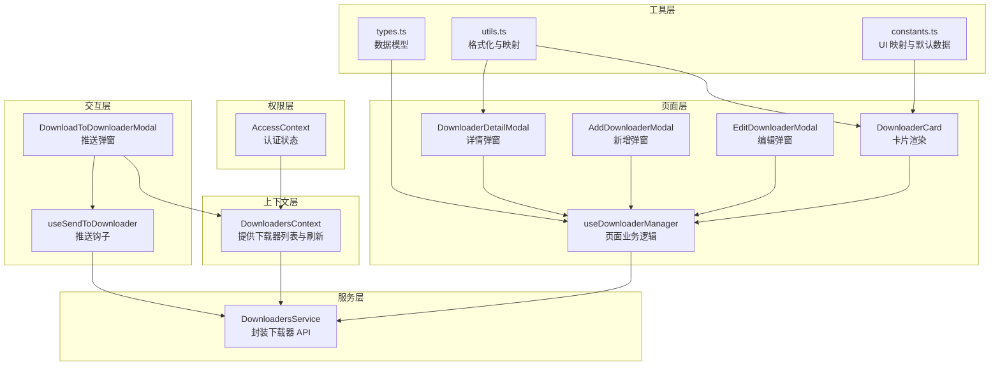
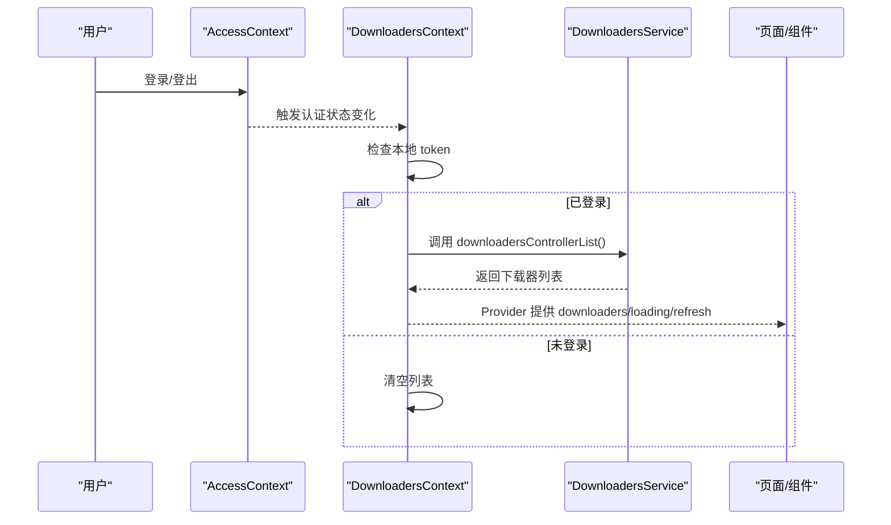
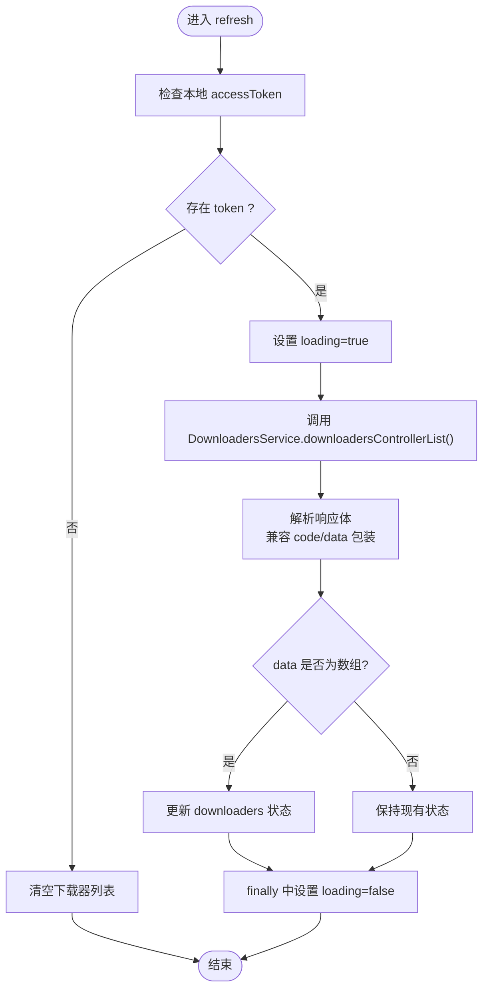
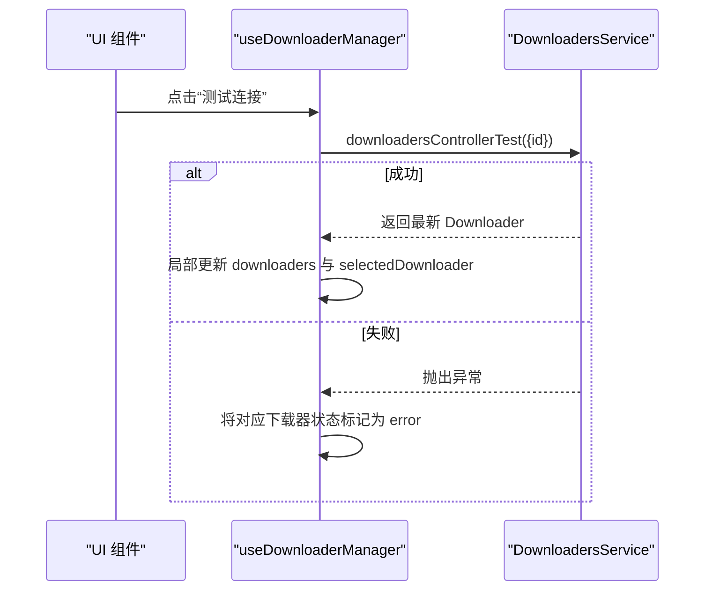
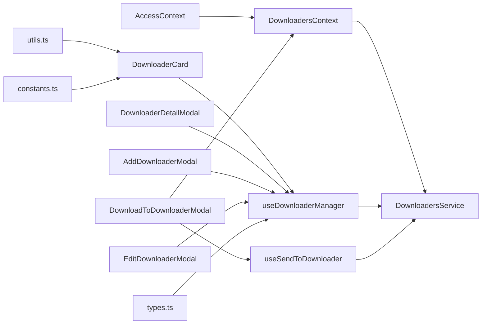

# 下载器上下文

<cite>
**本文档引用的文件**
- [DownloadersContext.tsx](file://src/modules/app/context/DownloadersContext.tsx)
- [DownloadersService.ts](file://src/api/services/DownloadersService.ts)
- [Downloader.ts](file://src/api/models/Downloader.ts)
- [types.ts](file://src/modules/app/pages/Downloader/types.ts)
- [useDownloaderManager.ts](file://src/modules/app/pages/Downloader/hooks/useDownloaderManager.ts)
- [DownloaderCard.tsx](file://src/modules/app/pages/Downloader/components/DownloaderCard.tsx)
- [DownloaderDetailModal.tsx](file://src/modules/app/pages/Downloader/components/DownloaderDetailModal.tsx)
- [AddDownloaderModal.tsx](file://src/modules/app/pages/Downloader/components/AddDownloaderModal.tsx)
- [EditDownloaderModal.tsx](file://src/modules/app/pages/Downloader/components/EditDownloaderModal.tsx)
- [utils.ts](file://src/modules/app/pages/Downloader/utils.ts)
- [constants.ts](file://src/modules/app/pages/Downloader/constants.ts)
- [AccessContext.tsx](file://src/context/AccessContext.tsx)
- [DownloadToDownloaderModal.tsx](file://src/modules/app/components/DownloadToDownloaderModal.tsx)
- [useSendToDownloader.ts](file://src/modules/app/hooks/useSendToDownloader.ts)
</cite>

## 目录
1. [简介](#简介)
2. [项目结构](#项目结构)
3. [核心组件](#核心组件)
4. [架构总览](#架构总览)
5. [详细组件分析](#详细组件分析)
6. [依赖关系分析](#依赖关系分析)
7. [性能考量](#性能考量)
8. [故障排查指南](#故障排查指南)
9. [结论](#结论)
10. [附录](#附录)

## 简介
本文件围绕“下载器上下文”（DownloadersContext）进行系统化技术文档编写，目标包括：
- 解释 DownloadersContext 的设计目的、状态管理与数据流
- 说明下载器列表的状态维护、加载状态控制与刷新机制
- 解释与 DownloadersService 的集成方式、API 调用策略与错误处理
- 定义下载器数据结构、权限检查逻辑与用户认证状态处理
- 提供上下文消费者的使用示例、性能优化建议与常见问题排查方法

## 项目结构
下载器相关功能主要分布在以下模块：
- 上下文层：DownloadersContext 提供全局下载器列表状态与刷新能力
- 服务层：DownloadersService 封装对后端下载器 API 的调用
- 页面层：Downloader 页面容器与多个 UI 组件（卡片、详情、新增/编辑弹窗）
- 工具层：types、utils、constants 定义数据模型与 UI 辅助函数
- 权限层：AccessContext 提供认证状态，影响下载器列表的加载时机
- 交互层：DownloadToDownloaderModal 与 useSendToDownloader 将种子推送到下载器



**图表来源**
- [DownloadersContext.tsx](file://src/modules/app/context/DownloadersContext.tsx#L1-L72)
- [DownloadersService.ts](file://src/api/services/DownloadersService.ts#L1-L295)
- [useDownloaderManager.ts](file://src/modules/app/pages/Downloader/hooks/useDownloaderManager.ts#L1-L316)
- [DownloaderCard.tsx](file://src/modules/app/pages/Downloader/components/DownloaderCard.tsx#L1-L163)
- [DownloaderDetailModal.tsx](file://src/modules/app/pages/Downloader/components/DownloaderDetailModal.tsx#L1-L305)
- [AddDownloaderModal.tsx](file://src/modules/app/pages/Downloader/components/AddDownloaderModal.tsx#L1-L237)
- [EditDownloaderModal.tsx](file://src/modules/app/pages/Downloader/components/EditDownloaderModal.tsx#L1-L206)
- [types.ts](file://src/modules/app/pages/Downloader/types.ts#L1-L46)
- [utils.ts](file://src/modules/app/pages/Downloader/utils.ts#L1-L35)
- [constants.ts](file://src/modules/app/pages/Downloader/constants.ts#L1-L78)
- [AccessContext.tsx](file://src/context/AccessContext.tsx#L1-L181)
- [DownloadToDownloaderModal.tsx](file://src/modules/app/components/DownloadToDownloaderModal.tsx#L1-L189)
- [useSendToDownloader.ts](file://src/modules/app/hooks/useSendToDownloader.ts#L1-L57)

**章节来源**
- [DownloadersContext.tsx](file://src/modules/app/context/DownloadersContext.tsx#L1-L72)
- [AccessContext.tsx](file://src/context/AccessContext.tsx#L1-L181)

## 核心组件
- DownloadersContext：提供下载器列表、加载状态与刷新方法，并在认证状态变化时触发重新拉取
- DownloadersService：封装下载器列表、新增/编辑/删除、连接测试、推送、分类/路径获取等 API
- useDownloaderManager：页面级业务逻辑钩子，负责 CRUD、详情信息拉取与本地状态管理
- Downloaders 数据模型：Downloader、DownloaderForm、DownloadPath 等
- UI 组件：DownloaderCard、DownloaderDetailModal、AddDownloaderModal、EditDownloaderModal
- 权限上下文：AccessContext，提供认证状态，驱动 DownloadersContext 的刷新

**章节来源**
- [DownloadersContext.tsx](file://src/modules/app/context/DownloadersContext.tsx#L1-L72)
- [DownloadersService.ts](file://src/api/services/DownloadersService.ts#L1-L295)
- [useDownloaderManager.ts](file://src/modules/app/pages/Downloader/hooks/useDownloaderManager.ts#L1-L316)
- [types.ts](file://src/modules/app/pages/Downloader/types.ts#L1-L46)
- [DownloaderCard.tsx](file://src/modules/app/pages/Downloader/components/DownloaderCard.tsx#L1-L163)
- [DownloaderDetailModal.tsx](file://src/modules/app/pages/Downloader/components/DownloaderDetailModal.tsx#L1-L305)
- [AddDownloaderModal.tsx](file://src/modules/app/pages/Downloader/components/AddDownloaderModal.tsx#L1-L237)
- [EditDownloaderModal.tsx](file://src/modules/app/pages/Downloader/components/EditDownloaderModal.tsx#L1-L206)
- [AccessContext.tsx](file://src/context/AccessContext.tsx#L1-L181)

## 架构总览
DownloadersContext 作为全局状态源，结合 AccessContext 的认证状态，确保只有在用户已认证的情况下才拉取下载器列表。DownloadersService 作为单一数据源，被 useDownloaderManager 与 DownloadToDownloaderModal 共同消费。



**图表来源**
- [DownloadersContext.tsx](file://src/modules/app/context/DownloadersContext.tsx#L36-L61)
- [AccessContext.tsx](file://src/context/AccessContext.tsx#L157-L165)
- [DownloadersService.ts](file://src/api/services/DownloadersService.ts#L20-L119)

## 详细组件分析

### DownloadersContext 设计与实现
- 设计目的
  - 为下载器相关页面与组件提供统一的全局状态，避免重复请求与状态分散
  - 与认证状态联动，确保仅在用户已登录时拉取数据
- 状态管理
  - downloaders：下载器列表数组
  - loading：是否处于加载中
  - refresh：刷新方法，内部处理 token 校验与异常捕获
- 刷新机制
  - 依赖 AccessContext 的 access.username 作为依赖项，当用户名变化时触发重新拉取
  - 通过 localStorage 中的 accessToken 判断是否已登录，未登录则清空列表
- 错误处理
  - 捕获请求异常并记录日志，保持加载状态最终释放
- 与 DownloadersService 的集成
  - 调用 downloadersControllerList 获取列表
  - 对后端响应进行兼容处理（区分 code/data 包装与直接 data）



**图表来源**
- [DownloadersContext.tsx](file://src/modules/app/context/DownloadersContext.tsx#L36-L56)
- [DownloadersService.ts](file://src/api/services/DownloadersService.ts#L20-L119)

**章节来源**
- [DownloadersContext.tsx](file://src/modules/app/context/DownloadersContext.tsx#L1-L72)

### DownloadersService API 调用策略与错误处理
- 列表获取：downloadersControllerList
- 新增/编辑/删除：downloadersControllerCreate/update/delete
- 连接测试：downloadersControllerTest
- 推送下载：downloadersControllerDownload
- 分类/路径：downloadersControllerCategories、downloadersControllerPaths
- 删除分类/路径：downloadersControllerDeleteCategory、downloadersControllerDeletePath
- 错误处理策略
  - 统一通过 CancelablePromise 抛出 ApiError
  - 前端对 401/403/404/500 等状态进行提示与降级处理
  - 对响应体进行兼容处理（code/data 包装）

**章节来源**
- [DownloadersService.ts](file://src/api/services/DownloadersService.ts#L1-L295)

### useDownloaderManager 业务逻辑
- 状态与事件
  - downloaders、loading：列表与加载状态
  - 弹窗控制：showAddModal/showEditModal/showDetailModal
  - 表单与辅助：formData、showPassword
  - 详情展开与拉取：expandedTags/expandedPaths/fetchingTags/fetchingPaths
- 关键流程
  - 初始加载：fetchDownloaders
  - 新增/编辑/删除：handleAddDownloader/handleEditDownloader/handleDeleteDownloader
  - 连接测试：handleTestConnection（成功则局部更新，失败则标记 error）
  - 详情信息：handleFetchInfo 打开详情弹窗；handleFetchTags/handleFetchPaths 拉取并更新本地状态
  - 删除标签/路径：handleDeleteTag/handleDeletePath（基于索引删除，成功后本地更新）
- 乐观更新与回退
  - 删除采用乐观更新，失败时重新拉取以保持一致性



**图表来源**
- [useDownloaderManager.ts](file://src/modules/app/pages/Downloader/hooks/useDownloaderManager.ts#L117-L134)
- [DownloadersService.ts](file://src/api/services/DownloadersService.ts#L186-L208)

**章节来源**
- [useDownloaderManager.ts](file://src/modules/app/pages/Downloader/hooks/useDownloaderManager.ts#L1-L316)

### 下载器数据结构定义
- Downloader：下载器核心结构，包含 id、name、type、host、port、username、ssl、status、version、速度、种子统计、freeSpace、tags、downloadPaths 等
- DownloaderForm：表单专用结构，用于新增/编辑时的数据收集
- DownloadPath：下载路径结构，包含 name/path/freeSpace
- 类型与映射
  - DownloaderType：'qBittorrent' | 'Transmission' | 'Deluge' | 'rTorrent'
  - UI 映射：TYPE_COLOR_MAP、STATUS_BADGE_CLASS_MAP、STATUS_TEXT_MAP

```mermaid
classDiagram
class Downloader {
+string id
+string name
+DownloaderType type
+string host
+number port
+string username
+string password
+boolean ssl
+string status
+string version
+number uploadSpeed
+number downloadSpeed
+number activeTorrents
+number totalTorrents
+number freeSpace
+string[] tags
+DownloadPath[] downloadPaths
}
class DownloaderForm {
+string name
+DownloaderType type
+string host
+number port
+string username
+string password
+boolean ssl
}
class DownloadPath {
+string name
+string path
+number freeSpace
}
class DownloaderType {
<<enumeration>>
"qBittorrent"
"Transmission"
"Deluge"
"rTorrent"
}
```

**图表来源**
- [types.ts](file://src/modules/app/pages/Downloader/types.ts#L14-L44)

**章节来源**
- [types.ts](file://src/modules/app/pages/Downloader/types.ts#L1-L46)
- [constants.ts](file://src/modules/app/pages/Downloader/constants.ts#L6-L27)

### 权限检查逻辑与用户认证状态处理
- AccessContext
  - 从 localStorage 读取 accessToken，解析用户名并聚合权限
  - 提供 access、loading、error、reload
  - 监听自定义 authChange 事件，自动重新加载
- DownloadersContext
  - 依赖 access.username，当用户名变化时触发 refresh
  - 通过 localStorage accessToken 判断是否已登录，未登录则清空列表

**章节来源**
- [AccessContext.tsx](file://src/context/AccessContext.tsx#L1-L181)
- [DownloadersContext.tsx](file://src/modules/app/context/DownloadersContext.tsx#L34-L61)

### 上下文消费者的使用示例
- 在页面容器中使用 DownloadersProvider 包裹子树
- 在组件中通过 useDownloaders 获取 downloaders、loading、refresh
- 在 DownloadToDownloaderModal 中使用 useDownloaders 获取下载器列表，结合 useSendToDownloader 推送下载
- 在 DownloaderCard 中调用 onTestConnection/onFetchInfo 等回调，委托给 useDownloaderManager

**章节来源**
- [DownloadersContext.tsx](file://src/modules/app/context/DownloadersContext.tsx#L28-L72)
- [DownloadToDownloaderModal.tsx](file://src/modules/app/components/DownloadToDownloaderModal.tsx#L29-L78)
- [DownloaderCard.tsx](file://src/modules/app/pages/Downloader/components/DownloaderCard.tsx#L26-L40)

## 依赖关系分析
- DownloadersContext 依赖 AccessContext 的认证状态与 DownloadersService 的 API
- useDownloaderManager 依赖 DownloadersService 与 types 定义
- UI 组件依赖 useDownloaderManager 与 utils/constants
- DownloadToDownloaderModal 依赖 DownloadersContext 与 useSendToDownloader



**图表来源**
- [AccessContext.tsx](file://src/context/AccessContext.tsx#L1-L181)
- [DownloadersContext.tsx](file://src/modules/app/context/DownloadersContext.tsx#L1-L72)
- [DownloadersService.ts](file://src/api/services/DownloadersService.ts#L1-L295)
- [useDownloaderManager.ts](file://src/modules/app/pages/Downloader/hooks/useDownloaderManager.ts#L1-L316)
- [DownloaderCard.tsx](file://src/modules/app/pages/Downloader/components/DownloaderCard.tsx#L1-L163)
- [DownloaderDetailModal.tsx](file://src/modules/app/pages/Downloader/components/DownloaderDetailModal.tsx#L1-L305)
- [AddDownloaderModal.tsx](file://src/modules/app/pages/Downloader/components/AddDownloaderModal.tsx#L1-L237)
- [EditDownloaderModal.tsx](file://src/modules/app/pages/Downloader/components/EditDownloaderModal.tsx#L1-L206)
- [DownloadToDownloaderModal.tsx](file://src/modules/app/components/DownloadToDownloaderModal.tsx#L1-L189)
- [useSendToDownloader.ts](file://src/modules/app/hooks/useSendToDownloader.ts#L1-L57)
- [types.ts](file://src/modules/app/pages/Downloader/types.ts#L1-L46)
- [utils.ts](file://src/modules/app/pages/Downloader/utils.ts#L1-L35)
- [constants.ts](file://src/modules/app/pages/Downloader/constants.ts#L1-L78)

**章节来源**
- [DownloadersContext.tsx](file://src/modules/app/context/DownloadersContext.tsx#L1-L72)
- [DownloadersService.ts](file://src/api/services/DownloadersService.ts#L1-L295)
- [useDownloaderManager.ts](file://src/modules/app/pages/Downloader/hooks/useDownloaderManager.ts#L1-L316)
- [DownloadToDownloaderModal.tsx](file://src/modules/app/components/DownloadToDownloaderModal.tsx#L1-L189)

## 性能考量
- 避免重复请求
  - DownloadersContext 内部已做加载状态控制，避免并发重复请求
  - useDownloaderManager 在 fetchDownloaders 中使用 useCallback，减少不必要的重渲染
- 本地状态优化
  - 测试连接与详情信息采用局部更新，减少整体重渲染
  - 删除操作采用乐观更新，失败时再回退拉取
- UI 渲染优化
  - DownloaderCard 与 utils 中的格式化函数为纯函数，便于跨组件复用与测试
- 网络与错误处理
  - DownloadersService 对 401/403/404/500 等状态进行明确处理，避免阻塞 UI

[本节为通用性能建议，不直接分析具体文件]

## 故障排查指南
- 无法加载下载器列表
  - 检查 AccessContext 是否正确解析 accessToken 与用户名
  - 确认 DownloadersContext 的 refresh 是否因未登录而清空列表
  - 查看网络请求是否返回 401/403，必要时引导用户重新登录
- 连接测试失败
  - useDownloaderManager 会在失败时将对应下载器状态标记为 error，可在 UI 中提示
  - 检查主机地址、端口、SSL 配置与网络连通性
- 推送下载失败
  - useSendToDownloader 会先获取一次性下载链接，再调用 downloadersControllerDownload
  - 若失败，会通过 toast 提示并保持状态为 idle
  - 检查下载器状态、路径选择与权限配置

**章节来源**
- [DownloadersContext.tsx](file://src/modules/app/context/DownloadersContext.tsx#L36-L56)
- [useDownloaderManager.ts](file://src/modules/app/pages/Downloader/hooks/useDownloaderManager.ts#L117-L134)
- [useSendToDownloader.ts](file://src/modules/app/hooks/useSendToDownloader.ts#L19-L53)

## 结论
DownloadersContext 通过与 AccessContext 的认证状态联动，实现了在用户登录状态下自动拉取并维护下载器列表的能力。配合 DownloadersService 的统一 API 封装与 useDownloaderManager 的页面级业务逻辑，形成了清晰的“状态-服务-视图”三层架构。UI 组件专注于渲染与交互，业务逻辑集中在 Hook 中，提升了可维护性与可测试性。通过合理的错误处理与本地状态更新策略，系统在弱网与异常场景下仍能保持较好的用户体验。

[本节为总结性内容，不直接分析具体文件]

## 附录
- 相关文件路径与职责
  - DownloadersContext.tsx：全局下载器状态与刷新
  - DownloadersService.ts：下载器 API 封装
  - useDownloaderManager.ts：页面业务逻辑
  - types.ts/constants.ts/utils.ts：数据模型与 UI 辅助
  - AccessContext.tsx：认证状态
  - DownloadToDownloaderModal.tsx/useSendToDownloader.ts：推送下载流程

[本节为概览性内容，不直接分析具体文件]