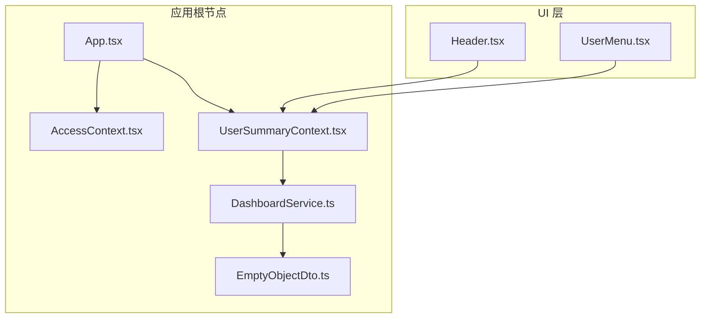
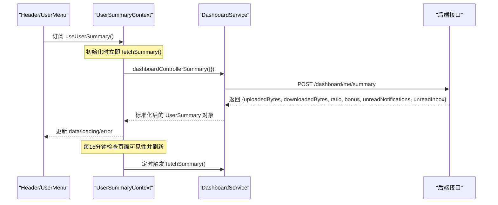
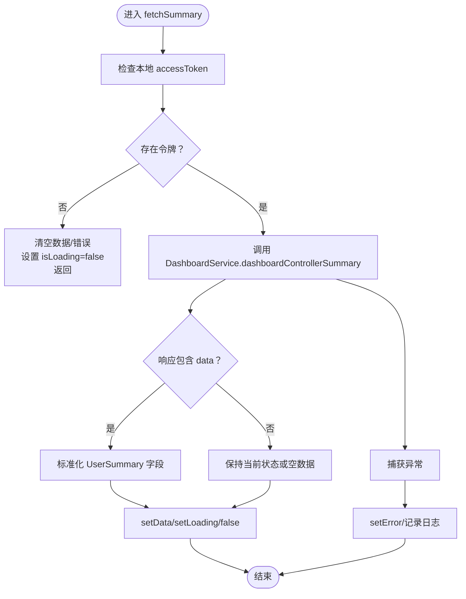
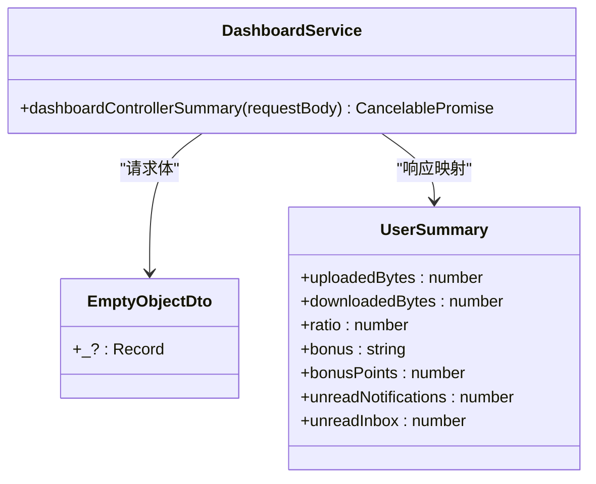
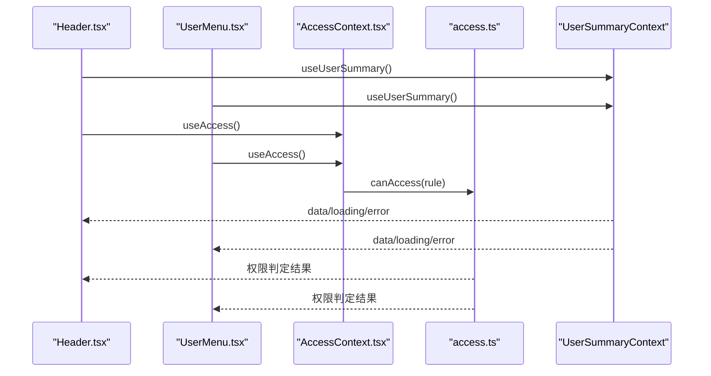
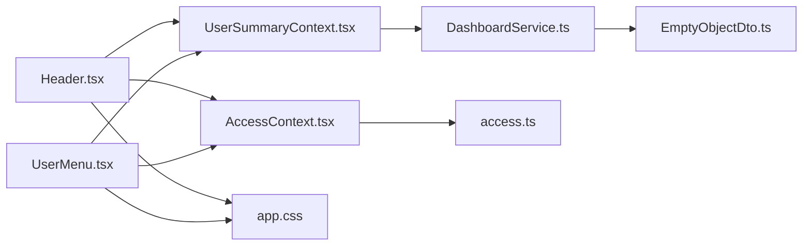

# 用户摘要上下文

<cite>
**本文档引用的文件**
- [UserSummaryContext.tsx](file://src/modules/app/context/UserSummaryContext.tsx)
- [DashboardService.ts](file://src/api/services/DashboardService.ts)
- [EmptyObjectDto.ts](file://src/api/models/EmptyObjectDto.ts)
- [App.tsx](file://src/App.tsx)
- [Header.tsx](file://src/modules/app/layouts/Header.tsx)
- [UserMenu.tsx](file://src/modules/app/layouts/header/components/UserMenu.tsx)
- [AccessContext.tsx](file://src/context/AccessContext.tsx)
- [access.ts](file://src/utils/access.ts)
- [app.css](file://src/modules/app/app.css)
</cite>

## 目录
1. [简介](#简介)
2. [项目结构](#项目结构)
3. [核心组件](#核心组件)
4. [架构总览](#架构总览)
5. [详细组件分析](#详细组件分析)
6. [依赖关系分析](#依赖关系分析)
7. [性能考虑](#性能考虑)
8. [故障排除指南](#故障排除指南)
9. [结论](#结论)
10. [附录](#附录)

## 简介
本文件面向开发者与技术文档读者，系统性阐述用户摘要上下文（UserSummaryContext）的设计原理、用户信息聚合与状态管理机制。重点覆盖以下方面：
- 用户统计数据的获取流程与数据聚合逻辑
- 缓存策略与实时更新机制（定时刷新与页面可见性感知）
- 与 UsersService 的集成方式（通过 DashboardService）
- 数据结构定义、权限控制与响应式更新
- 上下文使用示例、数据订阅模式与调试技巧

## 项目结构
UserSummaryContext 位于应用模块的上下文目录中，作为全局状态的一部分被注入到应用根节点，供头部导航与用户菜单等组件订阅使用。

**图表来源**
- [App.tsx](file://src/App.tsx#L33-L49)
- [UserSummaryContext.tsx](file://src/modules/app/context/UserSummaryContext.tsx#L28-L103)
- [DashboardService.ts](file://src/api/services/DashboardService.ts#L9-L46)
- [EmptyObjectDto.ts](file://src/api/models/EmptyObjectDto.ts#L5-L10)
- [Header.tsx](file://src/modules/app/layouts/Header.tsx#L35-L151)
- [UserMenu.tsx](file://src/modules/app/layouts/header/components/UserMenu.tsx#L27-L186)

**章节来源**
- [App.tsx](file://src/App.tsx#L33-L49)
- [UserSummaryContext.tsx](file://src/modules/app/context/UserSummaryContext.tsx#L28-L103)

## 核心组件
- UserSummaryContext：提供用户统计信息的全局状态与刷新能力，封装数据获取、错误处理与定时刷新逻辑。
- DashboardService：封装对后端“用户概要”接口的调用，负责网络请求与错误映射。
- AccessContext：提供用户认证与权限信息，为 UI 层的权限控制提供基础。
- Header 与 UserMenu：订阅 UserSummaryContext，展示上传/下载/分享率/魔力值/未读消息等信息，并根据权限控制入口显隐。

**章节来源**
- [UserSummaryContext.tsx](file://src/modules/app/context/UserSummaryContext.tsx#L4-L12)
- [DashboardService.ts](file://src/api/services/DashboardService.ts#L10-L46)
- [AccessContext.tsx](file://src/context/AccessContext.tsx#L30-L49)
- [Header.tsx](file://src/modules/app/layouts/Header.tsx#L35-L151)
- [UserMenu.tsx](file://src/modules/app/layouts/header/components/UserMenu.tsx#L27-L186)

## 架构总览
UserSummaryContext 采用 React Context + 自定义 Hook 的模式，结合定时任务与页面可见性监听，实现轻量级的“近实时”数据更新。数据来源为 DashboardService 的用户概要接口，返回的数据在前端进行结构化与类型安全处理。

**图表来源**
- [UserSummaryContext.tsx](file://src/modules/app/context/UserSummaryContext.tsx#L34-L96)
- [DashboardService.ts](file://src/api/services/DashboardService.ts#L16-L45)
- [Header.tsx](file://src/modules/app/layouts/Header.tsx#L39-L123)
- [UserMenu.tsx](file://src/modules/app/layouts/header/components/UserMenu.tsx#L30-L112)

## 详细组件分析

### UserSummaryContext 设计与实现
- 数据结构：UserSummary 定义了用户关键指标，包括上传/下载字节数、分享率、魔力值文本与数值、未读通知与未读私信数量。
- 状态管理：内部维护 data、isLoading、error 三类状态，并暴露 refresh 方法供手动刷新。
- 数据获取：fetchSummary 通过 DashboardService 调用后端接口；若本地不存在访问令牌，则主动清空数据并停止加载。
- 实时更新：组件挂载后立即拉取一次数据；随后每 15 分钟检查页面可见性（document.visibilityState），仅在页面可见时刷新；同时监听 visibilitychange 事件，页面从不可见到可见时即时刷新。
- 错误处理：捕获异常并设置错误状态，最终统一将 isLoading 置为 false。

**图表来源**
- [UserSummaryContext.tsx](file://src/modules/app/context/UserSummaryContext.tsx#L34-L96)

**章节来源**
- [UserSummaryContext.tsx](file://src/modules/app/context/UserSummaryContext.tsx#L4-L12)
- [UserSummaryContext.tsx](file://src/modules/app/context/UserSummaryContext.tsx#L28-L103)

### DashboardService 集成与数据聚合
- 接口契约：dashboardControllerSummary 接受 EmptyObjectDto 作为请求体，返回包含用户概要数据的对象。
- 错误映射：服务层对常见 HTTP 状态码进行了错误映射（如 400/401/403/404/500），便于上层统一处理。
- 数据聚合：UserSummaryContext 在收到响应后，将后端字段映射为 UserSummary 类型，确保前端消费时的类型安全与默认值处理。

**图表来源**
- [DashboardService.ts](file://src/api/services/DashboardService.ts#L9-L46)
- [EmptyObjectDto.ts](file://src/api/models/EmptyObjectDto.ts#L5-L10)
- [UserSummaryContext.tsx](file://src/modules/app/context/UserSummaryContext.tsx#L4-L12)

**章节来源**
- [DashboardService.ts](file://src/api/services/DashboardService.ts#L10-L46)
- [EmptyObjectDto.ts](file://src/api/models/EmptyObjectDto.ts#L5-L10)
- [UserSummaryContext.tsx](file://src/modules/app/context/UserSummaryContext.tsx#L47-L56)

### UI 订阅与权限控制
- Header 与 UserMenu 通过 useUserSummary 订阅上下文，展示上传/下载/分享率/魔力值/未读消息等信息。
- 权限控制：结合 AccessContext 与工具函数 canAccess，决定是否显示特定入口（如魔力管理、种子记录、邀请管理、控制面板等）。
- 响应式更新：当上下文数据更新时，订阅组件自动重新渲染，实现近实时的信息展示。

**图表来源**
- [Header.tsx](file://src/modules/app/layouts/Header.tsx#L35-L151)
- [UserMenu.tsx](file://src/modules/app/layouts/header/components/UserMenu.tsx#L27-L186)
- [AccessContext.tsx](file://src/context/AccessContext.tsx#L64-L180)
- [access.ts](file://src/utils/access.ts#L16-L63)

**章节来源**
- [Header.tsx](file://src/modules/app/layouts/Header.tsx#L35-L151)
- [UserMenu.tsx](file://src/modules/app/layouts/header/components/UserMenu.tsx#L27-L186)
- [AccessContext.tsx](file://src/context/AccessContext.tsx#L64-L180)
- [access.ts](file://src/utils/access.ts#L16-L63)

### 数据结构与字段说明
- uploadedBytes：累计上传字节数（数字）
- downloadedBytes：累计下载字节数（数字）
- ratio：分享率（数字）
- bonus：魔力值文本表示（字符串）
- bonusPoints：魔力值数值表示（数字）
- unreadNotifications：未读系统通知数量（数字）
- unreadInbox：未读私信数量（数字）

上述字段均在 UserSummaryContext 中进行标准化处理，确保前端消费时的健壮性与一致性。

**章节来源**
- [UserSummaryContext.tsx](file://src/modules/app/context/UserSummaryContext.tsx#L4-L12)
- [UserSummaryContext.tsx](file://src/modules/app/context/UserSummaryContext.tsx#L47-L56)

## 依赖关系分析
- 组件耦合：Header 与 UserMenu 通过 useUserSummary 间接依赖 UserSummaryContext；二者不直接关心数据来源，降低耦合度。
- 服务依赖：UserSummaryContext 依赖 DashboardService；DashboardService 依赖 EmptyObjectDto 与底层请求库。
- 权限依赖：Header 与 UserMenu 通过 AccessContext 与 canAccess 进行权限控制，避免在 UI 中分散权限逻辑。
- 样式依赖：应用主题与 UI 样式由 app.css 提供，保证视觉一致性。

**图表来源**
- [Header.tsx](file://src/modules/app/layouts/Header.tsx#L35-L151)
- [UserMenu.tsx](file://src/modules/app/layouts/header/components/UserMenu.tsx#L27-L186)
- [UserSummaryContext.tsx](file://src/modules/app/context/UserSummaryContext.tsx#L28-L103)
- [DashboardService.ts](file://src/api/services/DashboardService.ts#L9-L46)
- [EmptyObjectDto.ts](file://src/api/models/EmptyObjectDto.ts#L5-L10)
- [AccessContext.tsx](file://src/context/AccessContext.tsx#L64-L180)
- [access.ts](file://src/utils/access.ts#L16-L63)
- [app.css](file://src/modules/app/app.css#L1-L278)

**章节来源**
- [Header.tsx](file://src/modules/app/layouts/Header.tsx#L35-L151)
- [UserMenu.tsx](file://src/modules/app/layouts/header/components/UserMenu.tsx#L27-L186)
- [UserSummaryContext.tsx](file://src/modules/app/context/UserSummaryContext.tsx#L28-L103)
- [DashboardService.ts](file://src/api/services/DashboardService.ts#L9-L46)
- [EmptyObjectDto.ts](file://src/api/models/EmptyObjectDto.ts#L5-L10)
- [AccessContext.tsx](file://src/context/AccessContext.tsx#L64-L180)
- [access.ts](file://src/utils/access.ts#L16-L63)
- [app.css](file://src/modules/app/app.css#L1-L278)

## 性能考虑
- 定时刷新策略：每 15 分钟刷新一次，且仅在页面可见时执行，减少不必要的网络请求与计算开销。
- 页面可见性感知：利用 document.visibilityState 与 visibilitychange 事件，在页面恢复可见时立即刷新，兼顾实时性与性能。
- 空令牌保护：若本地不存在访问令牌，立即清空数据并停止加载，避免无效请求。
- 并行加载：应用根节点同时加载字典与偏好分类，提升整体初始化体验（与用户摘要上下文同属应用初始化阶段）。

**章节来源**
- [UserSummaryContext.tsx](file://src/modules/app/context/UserSummaryContext.tsx#L66-L96)
- [App.tsx](file://src/App.tsx#L25-L31)

## 故障排除指南
- 无访问令牌：当本地不存在 accessToken 时，上下文不会发起请求，data 为空，isLoading 为 false。请确认登录状态与令牌存储。
- 网络请求失败：fetchSummary 捕获异常并设置错误状态，同时在控制台输出错误日志。建议检查网络连通性与后端接口状态。
- 数据为空：若后端响应不包含 data 字段，上下文将保持当前状态或空数据。请核对后端接口返回结构。
- 权限入口不显示：Header 与 UserMenu 的入口显隐依赖 AccessContext 与 canAccess 的权限判定。请检查用户角色与权限集合是否正确加载。
- UI 不更新：确认组件已正确使用 useUserSummary 订阅上下文，且未在父组件中阻止子组件渲染。

**章节来源**
- [UserSummaryContext.tsx](file://src/modules/app/context/UserSummaryContext.tsx#L34-L64)
- [Header.tsx](file://src/modules/app/layouts/Header.tsx#L44-L59)
- [UserMenu.tsx](file://src/modules/app/layouts/header/components/UserMenu.tsx#L56-L59)
- [AccessContext.tsx](file://src/context/AccessContext.tsx#L83-L155)

## 结论
UserSummaryContext 通过简洁的上下文设计与合理的缓存/刷新策略，实现了用户关键指标的近实时展示。其与 DashboardService 的解耦、与权限系统的协作，以及与 UI 组件的松耦合订阅关系，共同构成了稳定、可维护的前端状态管理模式。建议在后续迭代中持续关注页面可见性策略与错误处理的细化，以进一步提升用户体验与系统稳定性。

## 附录

### 上下文使用示例
- 在组件中订阅：const { data, isLoading, error, refresh } = useUserSummary();
- 手动刷新：调用 refresh() 触发一次即时数据拉取。
- 条件渲染：根据 isLoading 与 error 决定加载态与错误态展示。

**章节来源**
- [UserSummaryContext.tsx](file://src/modules/app/context/UserSummaryContext.tsx#L105-L111)
- [Header.tsx](file://src/modules/app/layouts/Header.tsx#L39-L123)
- [UserMenu.tsx](file://src/modules/app/layouts/header/components/UserMenu.tsx#L30-L112)

### 数据订阅模式
- 单向数据流：数据自 UserSummaryContext 流向订阅组件，组件通过 useState/useEffect 或直接消费上下文状态。
- 响应式更新：上下文状态变更触发订阅组件重渲染，实现 UI 与数据的同步。

**章节来源**
- [UserSummaryContext.tsx](file://src/modules/app/context/UserSummaryContext.tsx#L28-L103)
- [Header.tsx](file://src/modules/app/layouts/Header.tsx#L39-L123)
- [UserMenu.tsx](file://src/modules/app/layouts/header/components/UserMenu.tsx#L30-L112)

### 调试技巧
- 在 fetchSummary 中添加日志，观察请求时机与响应结构。
- 使用浏览器开发者工具的 Network 面板监控 /dashboard/me/summary 请求频率与响应时间。
- 检查 localStorage 中的 accessToken 是否存在，确认权限入口是否按预期显示。
- 在 AccessContext 中验证权限集合是否正确加载，避免 UI 权限判定异常。

**章节来源**
- [UserSummaryContext.tsx](file://src/modules/app/context/UserSummaryContext.tsx#L34-L64)
- [AccessContext.tsx](file://src/context/AccessContext.tsx#L83-L155)