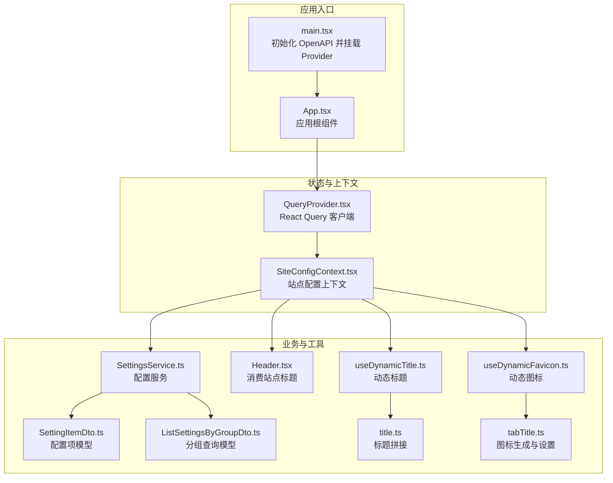
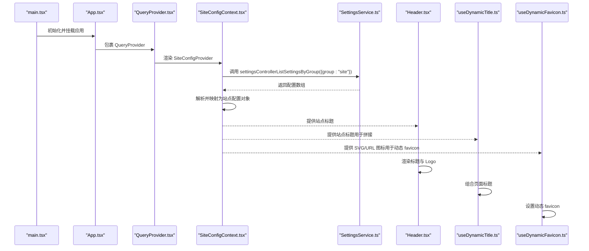
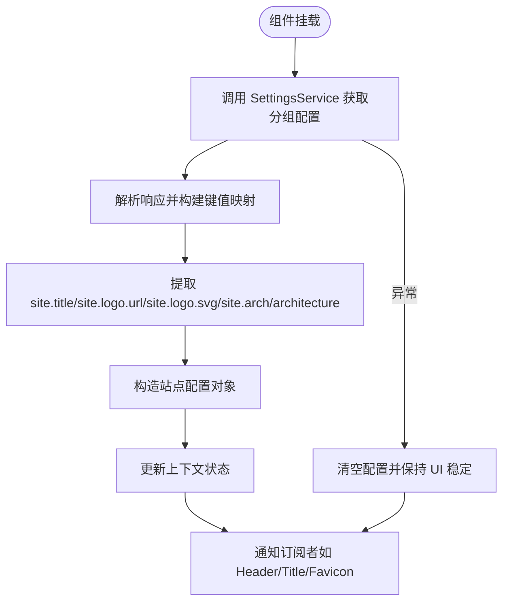
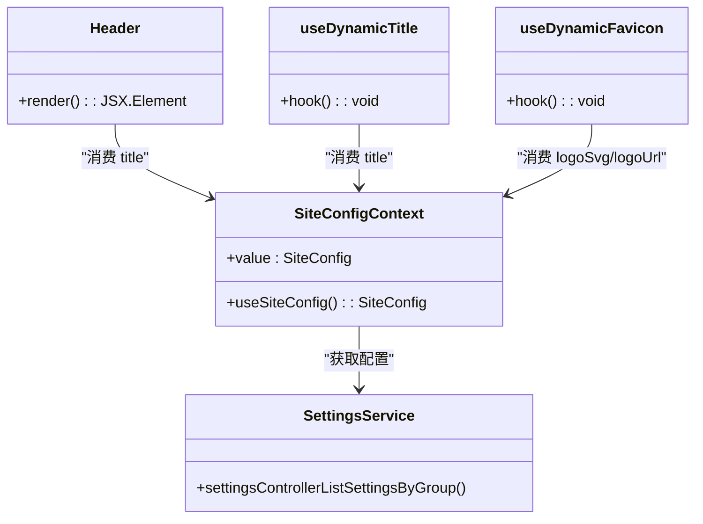
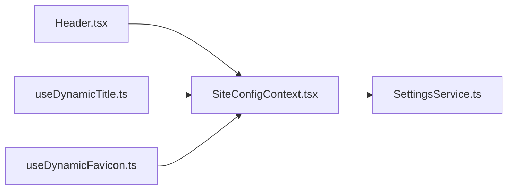

# 站点配置上下文

<cite>
**本文引用的文件**
- [SiteConfigContext.tsx](file://src/context/SiteConfigContext.tsx)
- [SettingsService.ts](file://src/api/services/SettingsService.ts)
- [SettingItemDto.ts](file://src/api/models/SettingItemDto.ts)
- [ListSettingsByGroupDto.ts](file://src/api/models/ListSettingsByGroupDto.ts)
- [Header.tsx](file://src/modules/app/layouts/Header.tsx)
- [useDynamicTitle.ts](file://src/hooks/useDynamicTitle.ts)
- [useDynamicFavicon.ts](file://src/hooks/useDynamicFavicon.ts)
- [title.ts](file://src/utils/title.ts)
- [tabTitle.ts](file://src/utils/tabTitle.ts)
- [App.tsx](file://src/App.tsx)
- [main.tsx](file://src/main.tsx)
- [QueryProvider.tsx](file://src/providers/QueryProvider.tsx)
</cite>

## 目录
1. [简介](#简介)
2. [项目结构](#项目结构)
3. [核心组件](#核心组件)
4. [架构总览](#架构总览)
5. [详细组件分析](#详细组件分析)
6. [依赖关系分析](#依赖关系分析)
7. [性能考量](#性能考量)
8. [故障排查指南](#故障排查指南)
9. [结论](#结论)
10. [附录](#附录)

## 简介
本文件围绕“站点配置上下文”（SiteConfigContext）展开，系统性阐述其设计目标、站点参数管理与配置状态维护方式，以及与 SettingsService 的集成路径。文档覆盖以下关键主题：
- 配置数据来源与分组加载（按 group: "site"）
- 配置数据结构与默认值处理
- 缓存策略与实时更新机制
- 动态配置加载与变更监听
- 使用示例与最佳实践
- 性能优化建议与常见问题排查

## 项目结构
SiteConfigContext 位于上下文层，通过 SettingsService 从后端按组拉取配置，并在应用布局与工具钩子中消费这些配置，用于标题与站点图标等动态展示。

图表来源
- [main.tsx](file://src/main.tsx#L1-L18)
- [App.tsx](file://src/App.tsx#L1-L52)
- [QueryProvider.tsx](file://src/providers/QueryProvider.tsx#L1-L30)
- [SiteConfigContext.tsx](file://src/context/SiteConfigContext.tsx#L1-L50)
- [SettingsService.ts](file://src/api/services/SettingsService.ts#L1-L219)
- [SettingItemDto.ts](file://src/api/models/SettingItemDto.ts#L1-L40)
- [ListSettingsByGroupDto.ts](file://src/api/models/ListSettingsByGroupDto.ts#L1-L12)
- [Header.tsx](file://src/modules/app/layouts/Header.tsx#L1-L152)
- [useDynamicTitle.ts](file://src/hooks/useDynamicTitle.ts#L1-L13)
- [useDynamicFavicon.ts](file://src/hooks/useDynamicFavicon.ts#L1-L21)
- [title.ts](file://src/utils/title.ts#L1-L13)
- [tabTitle.ts](file://src/utils/tabTitle.ts#L1-L66)

章节来源
- [main.tsx](file://src/main.tsx#L1-L18)
- [App.tsx](file://src/App.tsx#L1-L52)
- [QueryProvider.tsx](file://src/providers/QueryProvider.tsx#L1-L30)
- [SiteConfigContext.tsx](file://src/context/SiteConfigContext.tsx#L1-L50)

## 核心组件
- 站点配置上下文（SiteConfigContext）
  - 提供类型化的站点配置对象，包含站点标题、Logo 图片地址、SVG 标志与架构信息等字段。
  - 在首次挂载时通过 SettingsService 按组拉取配置，并将结果映射到上下文值。
  - 默认值为空字符串，保证组件渲染安全。
- 配置服务（SettingsService）
  - 提供按分组获取配置列表的能力，接口返回统一的带 data 字段的响应结构。
- 配置模型（SettingItemDto、ListSettingsByGroupDto）
  - 定义配置项的键值、类型、分组、排序等元信息，支撑前端解析与展示。

章节来源
- [SiteConfigContext.tsx](file://src/context/SiteConfigContext.tsx#L4-L11)
- [SettingsService.ts](file://src/api/services/SettingsService.ts#L48-L70)
- [SettingItemDto.ts](file://src/api/models/SettingItemDto.ts#L5-L27)
- [ListSettingsByGroupDto.ts](file://src/api/models/ListSettingsByGroupDto.ts#L5-L10)

## 架构总览
下图展示了从应用启动到站点配置生效的关键流程，包括请求发起、数据解析与消费者使用。

图表来源
- [main.tsx](file://src/main.tsx#L11-L17)
- [App.tsx](file://src/App.tsx#L33-L51)
- [QueryProvider.tsx](file://src/providers/QueryProvider.tsx#L4-L29)
- [SiteConfigContext.tsx](file://src/context/SiteConfigContext.tsx#L13-L45)
- [SettingsService.ts](file://src/api/services/SettingsService.ts#L48-L70)
- [Header.tsx](file://src/modules/app/layouts/Header.tsx#L35-L66)
- [useDynamicTitle.ts](file://src/hooks/useDynamicTitle.ts#L5-L12)
- [useDynamicFavicon.ts](file://src/hooks/useDynamicFavicon.ts#L5-L20)

## 详细组件分析

### 站点配置上下文（SiteConfigContext）
- 设计目的
  - 将“站点级配置”抽象为可跨组件消费的上下文，降低耦合度，提升可维护性。
- 配置参数管理
  - 支持的键名约定：site.title、site.logo.url、site.logo.svg、site.arch 或 site.architecture。
  - 解析逻辑：过滤有效键值，构建映射表，再提取对应字段；未命中时回退为空字符串。
- 配置状态维护
  - 初次挂载时异步获取配置，使用 mounted 标记避免卸载后状态更新。
  - 发生异常时清空配置，确保 UI 不出现脏数据。
- 与 SettingsService 集成
  - 通过 settingsControllerListSettingsByGroup(group:"site") 获取配置数组。
  - 对响应结构做兼容处理，适配不同后端返回形态。
- 与消费者集成
  - Header、动态标题与动态图标钩子均通过 useSiteConfig 访问配置。

图表来源
- [SiteConfigContext.tsx](file://src/context/SiteConfigContext.tsx#L16-L40)

章节来源
- [SiteConfigContext.tsx](file://src/context/SiteConfigContext.tsx#L1-L50)

### 配置服务（SettingsService）
- 接口职责
  - 提供按分组获取配置列表、批量更新配置、新增/删除配置、更新元数据、读取审核开关等能力。
- 与上下文的关系
  - SiteConfigContext 仅使用按分组获取配置的接口，其他接口用于管理端或后台任务。
- 错误处理
  - 统一抛出 ApiError，上层通过 try/catch 捕获并降级为空配置。

章节来源
- [SettingsService.ts](file://src/api/services/SettingsService.ts#L48-L70)

### 配置数据模型（SettingItemDto、ListSettingsByGroupDto）
- SettingItemDto
  - 关键字段：id、createdAt、updatedAt、deletedAt、key、value、comment、type、group、sort、description、mutable、jsonSchema、updatedBy、version。
  - 类型枚举：STRING、NUMBER、BOOLEAN、JSON、TIMESTAMP、RATE、PASSWORD。
- ListSettingsByGroupDto
  - 请求体仅包含 group 字段，用于筛选配置分组。

章节来源
- [SettingItemDto.ts](file://src/api/models/SettingItemDto.ts#L5-L38)
- [ListSettingsByGroupDto.ts](file://src/api/models/ListSettingsByGroupDto.ts#L5-L10)

### 消费者组件与钩子
- Header（站点标题与 Logo）
  - 从上下文读取 title，并将其与 Logo 一起渲染。
- useDynamicTitle（动态标题）
  - 基于站点标题与页面名称组合最终 document.title，具备兜底逻辑。
- useDynamicFavicon（动态图标）
  - 优先尝试 SVG，失败则回退到 URL；内部负责清理历史图标链接，避免重复。

图表来源
- [SiteConfigContext.tsx](file://src/context/SiteConfigContext.tsx#L47-L49)
- [Header.tsx](file://src/modules/app/layouts/Header.tsx#L35-L66)
- [useDynamicTitle.ts](file://src/hooks/useDynamicTitle.ts#L5-L12)
- [useDynamicFavicon.ts](file://src/hooks/useDynamicFavicon.ts#L5-L20)
- [SettingsService.ts](file://src/api/services/SettingsService.ts#L48-L70)

章节来源
- [Header.tsx](file://src/modules/app/layouts/Header.tsx#L35-L66)
- [useDynamicTitle.ts](file://src/hooks/useDynamicTitle.ts#L1-L13)
- [useDynamicFavicon.ts](file://src/hooks/useDynamicFavicon.ts#L1-L21)
- [title.ts](file://src/utils/title.ts#L5-L12)
- [tabTitle.ts](file://src/utils/tabTitle.ts#L16-L64)

## 依赖关系分析
- 组件耦合
  - Header、useDynamicTitle、useDynamicFavicon 依赖 SiteConfigContext。
  - SiteConfigContext 依赖 SettingsService。
- 外部依赖
  - React 上下文与 Hooks。
  - 后端配置接口（按 group: "site"）。
- 潜在循环依赖
  - 当前结构为单向依赖，无循环风险。

图表来源
- [Header.tsx](file://src/modules/app/layouts/Header.tsx#L8-L38)
- [useDynamicTitle.ts](file://src/hooks/useDynamicTitle.ts#L2-L11)
- [useDynamicFavicon.ts](file://src/hooks/useDynamicFavicon.ts#L2-L19)
- [SiteConfigContext.tsx](file://src/context/SiteConfigContext.tsx#L1-L50)
- [SettingsService.ts](file://src/api/services/SettingsService.ts#L1-L219)

章节来源
- [SiteConfigContext.tsx](file://src/context/SiteConfigContext.tsx#L1-L50)
- [SettingsService.ts](file://src/api/services/SettingsService.ts#L1-L219)

## 性能考量
- 缓存策略
  - 当前上下文在组件挂载时一次性拉取配置，未引入 React Query 缓存。
  - 若需全局复用与跨路由共享，建议结合 QueryClient 在更高层级缓存该请求。
- 实时更新机制
  - 当前未实现配置变更的自动监听与刷新。
  - 如需实时性，可在 SettingsService 层增加变更推送或轮询策略，并在上下文中触发状态更新。
- 渲染优化
  - 将 Header 与动态标题/图标钩子拆分为独立组件，减少不必要的重渲染。
  - 对 useDynamicFavicon 内部的 SVG Blob URL 进行引用清理，避免内存泄漏。

[本节为通用性能建议，不直接分析具体文件，故无章节来源]

## 故障排查指南
- 症状：页面标题未显示或显示为空
  - 检查后端是否正确返回 group: "site" 的配置项，特别是 site.title。
  - 确认 SettingsService 返回结构与上下文解析逻辑一致。
- 症状：favicon 未更新或报错
  - 确认 site.logo.svg 或 site.logo.url 是否存在且可访问。
  - 检查 useDynamicFavicon 的命名空间与 Blob 创建是否成功。
- 症状：切换路由后配置未生效
  - 当前上下文在组件挂载时拉取一次配置，若需路由级实时性，建议引入 QueryClient 的 refetch 策略或变更监听。
- 症状：异常导致 UI 显示异常
  - 上下文已对异常进行兜底，若仍异常，请检查 mounted 标记与状态更新时机。

章节来源
- [SiteConfigContext.tsx](file://src/context/SiteConfigContext.tsx#L16-L40)
- [useDynamicFavicon.ts](file://src/hooks/useDynamicFavicon.ts#L5-L20)
- [tabTitle.ts](file://src/utils/tabTitle.ts#L16-L64)

## 结论
SiteConfigContext 通过 SettingsService 提供了简洁、稳定的站点配置读取能力，配合 Header 与动态标题/图标钩子实现了良好的用户体验。当前实现以“一次性拉取 + 默认值兜底”为核心策略，适合静态或低频变更的站点配置场景。若未来需要更高的实时性与可维护性，建议引入 React Query 缓存与变更监听机制，并在上下文中提供配置更新的统一入口。

[本节为总结性内容，不直接分析具体文件，故无章节来源]

## 附录

### 配置数据结构与默认值
- 站点配置对象（SiteConfig）
  - 字段：title、logoUrl、logoSvg、archInfo
  - 默认值：全部为空字符串
- 配置项模型（SettingItemDto）
  - 关键字段：key、value、type、group、sort
  - 类型枚举：STRING、NUMBER、BOOLEAN、JSON、TIMESTAMP、RATE、PASSWORD
- 分组查询模型（ListSettingsByGroupDto）
  - 字段：group（固定传入 "site"）

章节来源
- [SiteConfigContext.tsx](file://src/context/SiteConfigContext.tsx#L4-L11)
- [SettingItemDto.ts](file://src/api/models/SettingItemDto.ts#L5-L38)
- [ListSettingsByGroupDto.ts](file://src/api/models/ListSettingsByGroupDto.ts#L5-L10)

### 使用示例与最佳实践
- 在布局中使用站点标题
  - 示例路径：[Header.tsx](file://src/modules/app/layouts/Header.tsx#L35-L66)
- 动态设置页面标题
  - 示例路径：[useDynamicTitle.ts](file://src/hooks/useDynamicTitle.ts#L5-L12)，标题拼接逻辑：[title.ts](file://src/utils/title.ts#L5-L12)
- 动态设置 favicon
  - 示例路径：[useDynamicFavicon.ts](file://src/hooks/useDynamicFavicon.ts#L5-L20)，图标生成逻辑：[tabTitle.ts](file://src/utils/tabTitle.ts#L16-L64)
- 在更高层级引入缓存与实时更新
  - 建议在 QueryProvider 中为按组获取配置的请求配置缓存与 refetch 策略，或在上下文中暴露更新方法以触发重新拉取。

章节来源
- [Header.tsx](file://src/modules/app/layouts/Header.tsx#L35-L66)
- [useDynamicTitle.ts](file://src/hooks/useDynamicTitle.ts#L5-L12)
- [useDynamicFavicon.ts](file://src/hooks/useDynamicFavicon.ts#L5-L20)
- [title.ts](file://src/utils/title.ts#L5-L12)
- [tabTitle.ts](file://src/utils/tabTitle.ts#L16-L64)
- [QueryProvider.tsx](file://src/providers/QueryProvider.tsx#L5-L22)