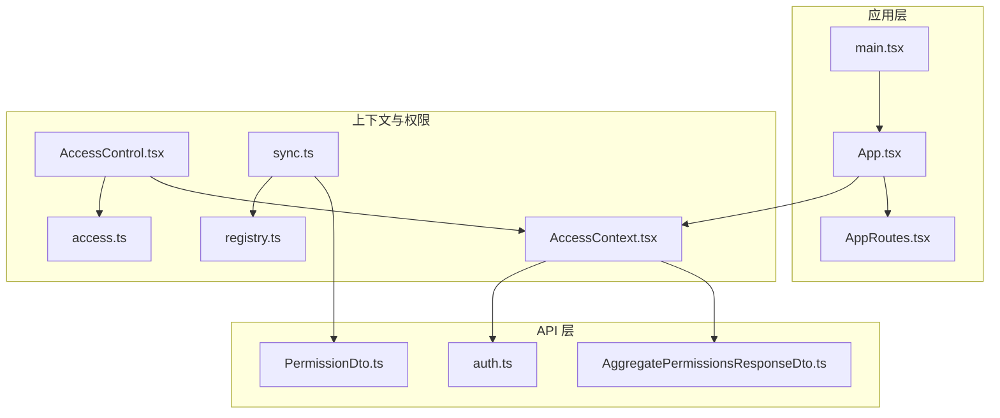
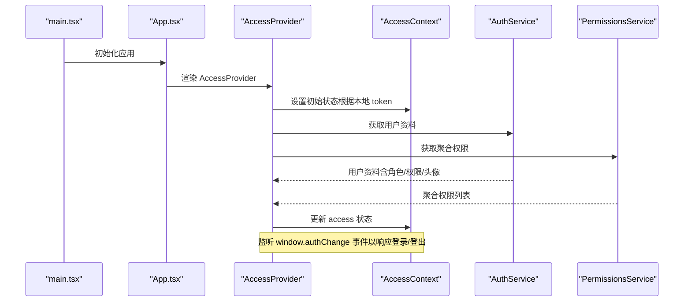
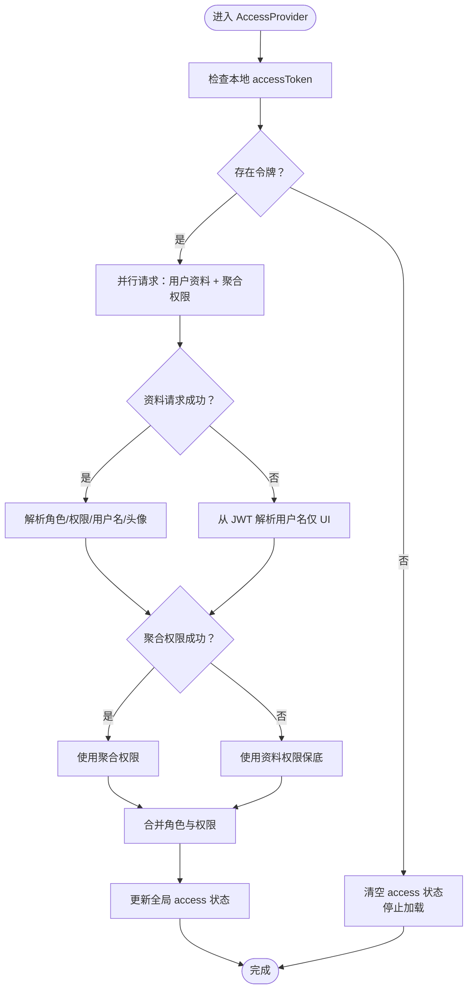
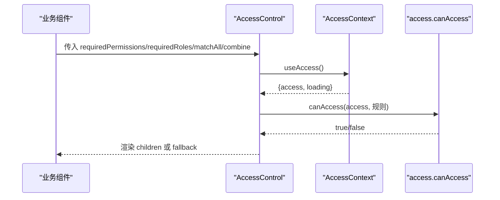
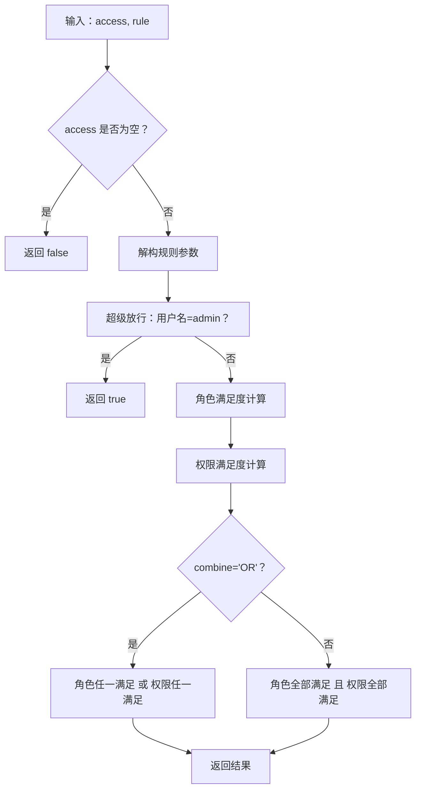
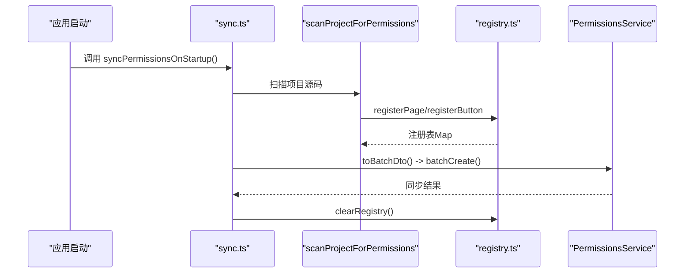
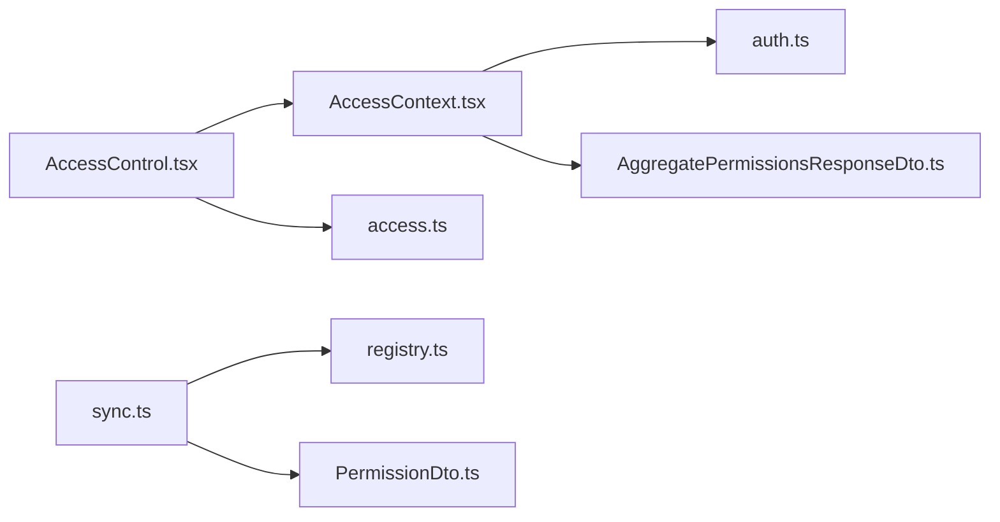

# 访问控制上下文

<cite>
**本文档引用的文件**
- [AccessContext.tsx](file://src/context/AccessContext.tsx)
- [AccessControl.tsx](file://src/permissions/AccessControl.tsx)
- [access.ts](file://src/utils/access.ts)
- [sync.ts](file://src/permissions/sync.ts)
- [registry.ts](file://src/permissions/registry.ts)
- [auth.ts](file://src/api/custom/auth.ts)
- [AggregatePermissionsResponseDto.ts](file://src/api/models/AggregatePermissionsResponseDto.ts)
- [PermissionDto.ts](file://src/api/models/PermissionDto.ts)
- [App.tsx](file://src/App.tsx)
- [main.tsx](file://src/main.tsx)
- [AppRoutes.tsx](file://src/routes/AppRoutes.tsx)
- [guards.tsx](file://src/routes/guards.tsx)
- [useApi.ts](file://src/hooks/useApi.ts)
</cite>

## 目录
1. [简介](#简介)
2. [项目结构](#项目结构)
3. [核心组件](#核心组件)
4. [架构总览](#架构总览)
5. [详细组件分析](#详细组件分析)
6. [依赖分析](#依赖分析)
7. [性能考虑](#性能考虑)
8. [故障排除指南](#故障排除指南)
9. [结论](#结论)
10. [附录](#附录)

## 简介
本文件围绕访问控制上下文（AccessContext）及其在权限系统中的核心作用展开，系统性阐述用户权限状态管理、权限变更监听机制、权限数据的获取/存储/更新策略，以及与权限控制组件的协作方式、权限验证流程与安全边界。文档同时覆盖用户认证状态、权限树结构与动态权限检查的实现，并提供使用模式、性能优化与安全最佳实践。

## 项目结构
访问控制上下文位于 context 层，配合权限控制组件与工具函数共同构成前端权限体系；权限同步脚本负责在应用启动时扫描并上报权限清单至后端；API 层提供认证与权限聚合接口；路由层结合认证事件与守卫实现动态权限检查。

图表来源
- [App.tsx](file://src/App.tsx#L21-L51)
- [main.tsx](file://src/main.tsx#L1-L18)
- [AccessContext.tsx](file://src/context/AccessContext.tsx#L64-L172)
- [AccessControl.tsx](file://src/permissions/AccessControl.tsx#L1-L43)
- [access.ts](file://src/utils/access.ts#L1-L65)
- [sync.ts](file://src/permissions/sync.ts#L1-L159)
- [registry.ts](file://src/permissions/registry.ts#L1-L129)
- [auth.ts](file://src/api/custom/auth.ts#L1-L14)
- [AggregatePermissionsResponseDto.ts](file://src/api/models/AggregatePermissionsResponseDto.ts#L1-L9)
- [PermissionDto.ts](file://src/api/models/PermissionDto.ts#L1-L85)

章节来源
- [App.tsx](file://src/App.tsx#L21-L51)
- [main.tsx](file://src/main.tsx#L1-L18)

## 核心组件
- 访问上下文（AccessContext）：全局管理用户认证状态、角色与权限，提供加载状态与错误处理，并通过自定义事件实现权限变更监听与自动刷新。
- 权限控制组件（AccessControl）：基于用户权限与角色规则进行条件渲染，支持多种匹配策略与组合关系。
- 权限工具（access.ts）：统一的权限判断逻辑，支持角色与权限的“全部满足/任一满足”以及“角色组与权限组”的组合策略。
- 权限同步（sync.ts 与 registry.ts）：启动时扫描前端源码，收集页面与按钮权限键，生成批量创建 DTO 并上报后端，支持未登录时的事件驱动同步。
- 认证与权限 API（auth.ts 与聚合模型）：提供用户资料与聚合权限接口，支撑上下文的数据来源。

章节来源
- [AccessContext.tsx](file://src/context/AccessContext.tsx#L64-L172)
- [AccessControl.tsx](file://src/permissions/AccessControl.tsx#L1-L43)
- [access.ts](file://src/utils/access.ts#L1-L65)
- [sync.ts](file://src/permissions/sync.ts#L1-L159)
- [registry.ts](file://src/permissions/registry.ts#L1-L129)
- [auth.ts](file://src/api/custom/auth.ts#L1-L14)
- [AggregatePermissionsResponseDto.ts](file://src/api/models/AggregatePermissionsResponseDto.ts#L1-L9)
- [PermissionDto.ts](file://src/api/models/PermissionDto.ts#L1-L85)

## 架构总览
访问控制上下文贯穿应用启动、认证流程与运行期权限检查，形成“数据获取—状态管理—UI 控制—后端同步”的闭环。

图表来源
- [main.tsx](file://src/main.tsx#L11-L17)
- [App.tsx](file://src/App.tsx#L33-L48)
- [AccessContext.tsx](file://src/context/AccessContext.tsx#L83-L155)
- [auth.ts](file://src/api/custom/auth.ts#L3-L13)

## 详细组件分析

### 访问上下文（AccessContext）
- 职责与设计
  - 管理用户角色与权限列表、用户名与头像等访问信息。
  - 提供加载状态与错误状态，避免未加载完成时的界面闪烁或误判。
  - 通过懒加载服务模块减少初始包体积并避免循环依赖。
  - 并行请求用户资料与聚合权限，优先采用聚合接口结果，失败时回退至资料接口。
  - 监听自定义认证事件，实现登录/登出后的自动刷新。
- 数据流与状态
  - 初始状态：依据本地是否存在访问令牌决定是否标记为加载中。
  - 成功路径：合并资料与聚合结果，更新 access。
  - 失败路径：记录错误信息，保留部分可用数据（如从 token 解析的用户名）。
- 安全边界
  - 仅在存在令牌时发起敏感请求；无令牌时清空状态并停止加载。
  - 头像字段做空字符串校验，确保非空字符串才视为有效。

图表来源
- [AccessContext.tsx](file://src/context/AccessContext.tsx#L83-L155)

章节来源
- [AccessContext.tsx](file://src/context/AccessContext.tsx#L64-L172)

### 权限控制组件（AccessControl）
- 职责与设计
  - 在渲染前根据用户权限与角色规则决定是否显示子组件。
  - 支持加载中时不渲染，避免闪烁。
  - 支持自定义回退节点（fallback）。
- 验证流程
  - 从上下文获取 access 与 loading。
  - 调用统一工具函数进行权限判断。
  - 不满足时渲染 fallback，满足时渲染 children。

图表来源
- [AccessControl.tsx](file://src/permissions/AccessControl.tsx#L17-L42)
- [access.ts](file://src/utils/access.ts#L16-L63)

章节来源
- [AccessControl.tsx](file://src/permissions/AccessControl.tsx#L1-L43)
- [access.ts](file://src/utils/access.ts#L1-L65)

### 权限工具（access.ts）
- 规则模型
  - requiredPermissions/requiredRoles：所需权限与角色集合。
  - matchAll：组内匹配策略（全部满足/任一满足）。
  - combine：角色组与权限组之间的关系（AND/OR）。
- 特殊放行
  - 管理员用户名直接放行。
- 判断逻辑
  - 分别计算角色与权限满足度，再按 combine 组合。
  - 支持空集合视为满足，简化默认行为。

图表来源
- [access.ts](file://src/utils/access.ts#L16-L63)

章节来源
- [access.ts](file://src/utils/access.ts#L1-L65)

### 权限同步（sync.ts 与 registry.ts）
- 目标
  - 在应用启动时扫描前端源码，收集页面与按钮权限键，生成批量创建 DTO 并上报后端。
- 扫描策略
  - 使用 Vite 的 glob 能力以原始文本方式读取 TSX 文件。
  - 正则匹配 PermissionRoute、AccessControl 与 canAccess 的 requiredPermissions。
  - 尽量就近匹配 Route 的 path，用于页面权限的 urls 字段。
- 去重与导出
  - 使用 Map 以权限 key 为索引去重。
  - 导出为批量创建 DTO，包含 key/name/type/scope/description/urls。
- 事件驱动
  - 未登录时监听 authChange 事件，登录后再执行同步。
  - 同步完成后清理注册表，避免重复触发。

图表来源
- [sync.ts](file://src/permissions/sync.ts#L17-L64)
- [registry.ts](file://src/permissions/registry.ts#L89-L101)

章节来源
- [sync.ts](file://src/permissions/sync.ts#L1-L159)
- [registry.ts](file://src/permissions/registry.ts#L1-L129)

### 认证与权限 API
- 用户资料接口
  - 通过自定义封装的请求方法调用 /auth/profile，返回用户基础信息（含角色/权限/用户名/头像）。
- 聚合权限接口
  - 返回用户聚合后的权限字符串数组，作为上下文的主要权限来源。
- 权限模型
  - 权限 DTO 包含 key/name/type/scope/parentIds/sorts/urls 等字段，支持权限树结构与 URL 关联。

章节来源
- [auth.ts](file://src/api/custom/auth.ts#L1-L14)
- [AggregatePermissionsResponseDto.ts](file://src/api/models/AggregatePermissionsResponseDto.ts#L1-L9)
- [PermissionDto.ts](file://src/api/models/PermissionDto.ts#L1-L85)

### 与路由系统的协作
- 认证事件
  - 登录成功后通过 window.dispatchEvent(new Event("authChange")) 触发认证事件，通知 AccessProvider 与路由守卫刷新状态。
- 路由守卫
  - 结合动态路由与认证事件，实现登录态下的页面访问控制与导航。
- 404 与公开页
  - 未登录访问受保护路由时重定向至登录页；已登录则渲染 404 页面。

章节来源
- [useApi.ts](file://src/hooks/useApi.ts#L46-L47)
- [AppRoutes.tsx](file://src/routes/AppRoutes.tsx#L103-L114)

## 依赖分析
- 上下文对 API 的依赖
  - 通过懒加载获取认证与权限服务，避免循环依赖与初始包体积膨胀。
- 权限控制对上下文与工具的依赖
  - AccessControl 依赖 useAccess 获取 access，并依赖 access.canAccess 进行判断。
- 同步脚本对注册表与 API 的依赖
  - 通过正则扫描源码，向注册表写入权限项，最终导出批量 DTO 并调用后端接口。

图表来源
- [AccessContext.tsx](file://src/context/AccessContext.tsx#L96-L99)
- [AccessControl.tsx](file://src/permissions/AccessControl.tsx#L2-L3)
- [sync.ts](file://src/permissions/sync.ts#L11-L12)
- [registry.ts](file://src/permissions/registry.ts#L13-L14)

章节来源
- [AccessContext.tsx](file://src/context/AccessContext.tsx#L96-L99)
- [AccessControl.tsx](file://src/permissions/AccessControl.tsx#L1-L43)
- [sync.ts](file://src/permissions/sync.ts#L1-L159)
- [registry.ts](file://src/permissions/registry.ts#L1-L129)

## 性能考虑
- 懒加载与并行请求
  - 通过懒加载服务模块与 Promise.allSettled 并行请求用户资料与聚合权限，缩短首屏等待时间。
- 初始加载策略
  - 依据本地是否存在访问令牌决定初始加载状态，避免不必要的闪烁与错误跳转。
- 批量同步
  - 使用 Map 去重与一次性批量创建 DTO，降低网络请求次数与后端压力。
- 事件驱动刷新
  - 通过自定义事件响应登录/登出，避免轮询与频繁无效刷新。

## 故障排除指南
- Profile 接口失败
  - 现象：无法获取用户资料，但 UI 仍需显示用户名。
  - 处理：从 JWT token 解析用户名（仅用于 UI 显示），同时记录错误信息。
- 聚合权限接口失败
  - 现象：聚合接口不可用。
  - 处理：回退使用 Profile 接口中的权限列表。
- 未登录状态
  - 现象：无访问令牌。
  - 处理：清空 access 状态并停止加载；等待 authChange 事件后重试。
- 权限同步失败
  - 现象：批量创建接口调用失败或未发现权限项。
  - 处理：记录警告日志，清理注册表后重试；确认已登录后再触发同步。

章节来源
- [AccessContext.tsx](file://src/context/AccessContext.tsx#L128-L154)
- [sync.ts](file://src/permissions/sync.ts#L58-L63)

## 结论
AccessContext 作为权限系统的核心，通过懒加载、并行请求与事件驱动机制实现了高效稳定的权限状态管理；AccessControl 与 access 工具提供了灵活的权限判断能力；sync 与 registry 则保障了权限清单的自动化采集与上报。整体方案兼顾易用性与安全性，适合在复杂前端权限场景中推广使用。

## 附录
- 使用模式建议
  - 在应用根部注入 AccessProvider，确保全局可用。
  - 在需要权限控制的组件上使用 AccessControl，并合理设置 requiredPermissions/requiredRoles/matchAll/combine。
  - 在登录成功后主动触发 authChange 事件，确保上下文与路由状态同步。
- 安全最佳实践
  - 严格区分前端显示与后端真实权限，避免仅依赖前端判断。
  - 对关键操作同时在前端与后端进行权限校验。
  - 定期同步权限清单，确保权限树与实际功能一致。