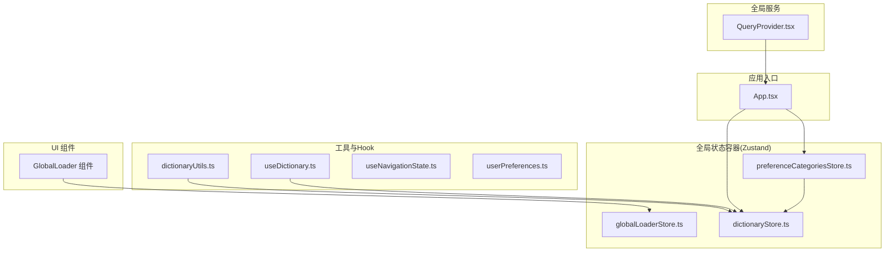
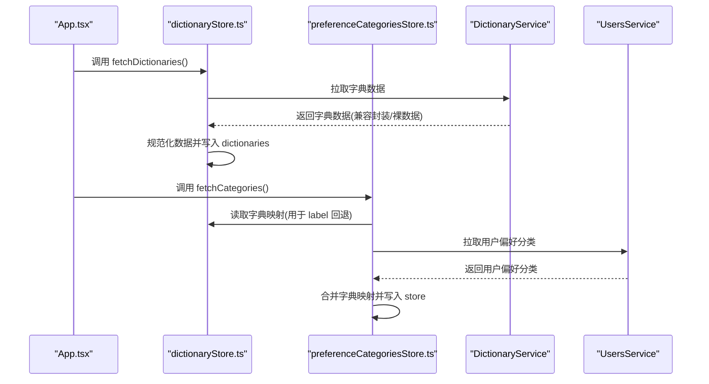
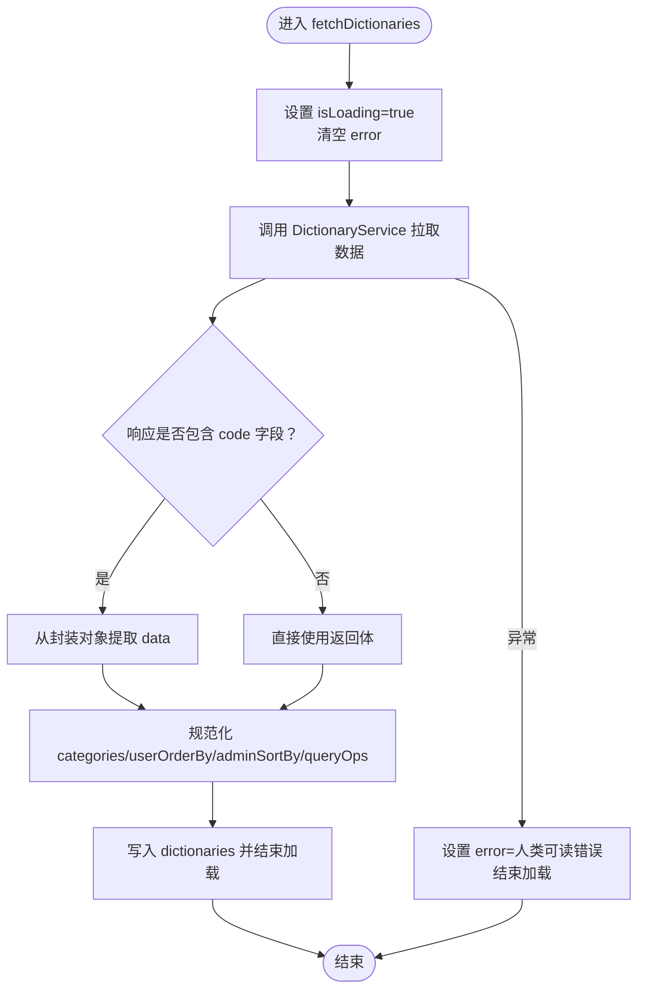
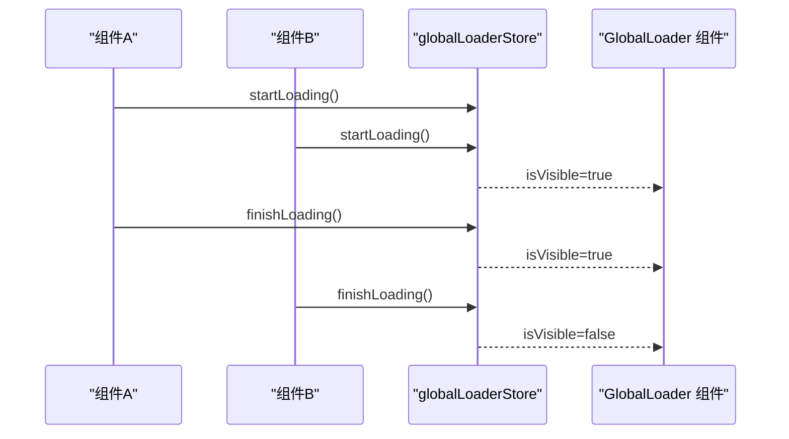
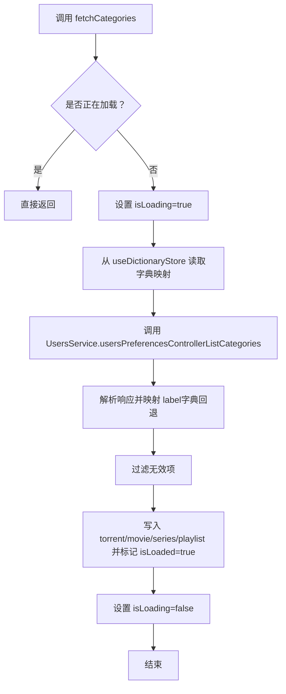
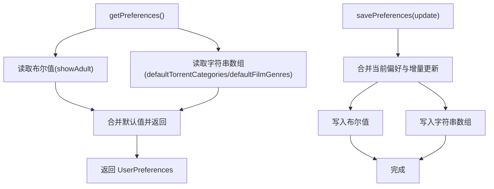
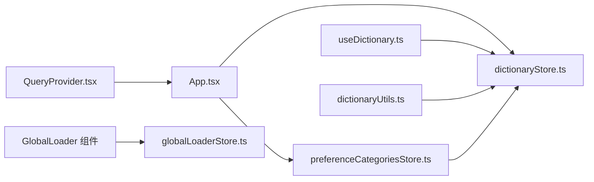

# 全局状态管理

<cite>
**本文档引用的文件**
- [dictionaryStore.ts](file://src/stores/dictionaryStore.ts)
- [globalLoaderStore.ts](file://src/stores/globalLoaderStore.ts)
- [preferenceCategoriesStore.ts](file://src/stores/preferenceCategoriesStore.ts)
- [userPreferences.ts](file://src/utils/userPreferences.ts)
- [dictionaryUtils.ts](file://src/utils/dictionaryUtils.ts)
- [useDictionary.ts](file://src/hooks/useDictionary.ts)
- [useNavigationState.ts](file://src/hooks/useNavigationState.ts)
- [App.tsx](file://src/App.tsx)
- [QueryProvider.tsx](file://src/providers/QueryProvider.tsx)
- [GlobalLoader 组件](file://src/modules/app/components/ui/GlobalLoader.tsx)
</cite>

## 目录
1. [简介](#简介)
2. [项目结构](#项目结构)
3. [核心组件](#核心组件)
4. [架构总览](#架构总览)
5. [详细组件分析](#详细组件分析)
6. [依赖关系分析](#依赖关系分析)
7. [性能考量](#性能考量)
8. [故障排查指南](#故障排查指南)
9. [结论](#结论)
10. [附录](#附录)

## 简介
本文件系统性梳理 zTorrent-site 的全局状态管理设计与实现，覆盖以下主题：
- 设计模式与状态组织：以 Zustand 为核心的状态容器，结合 React Query 的缓存策略
- 状态管理策略：加载态管理、字典数据缓存、用户偏好设置的持久化与回退
- 数据持久化机制：localStorage 与 Zustand persist 的混合使用
- 状态同步与订阅：store 状态变更驱动组件订阅更新
- 状态隔离、合并与清理：模块化 store、依赖注入与资源回收
- 最佳实践与性能优化：并发加载控制、缓存策略、错误处理与用户体验

## 项目结构
围绕全局状态管理的关键文件分布如下：
- stores：全局状态容器（Zustand）
  - dictionaryStore.ts：字典数据状态
  - globalLoaderStore.ts：全局加载器状态
  - preferenceCategoriesStore.ts：用户偏好分类状态
- utils：工具函数（localStorage 持久化、字典查询）
  - userPreferences.ts：用户偏好本地持久化
  - dictionaryUtils.ts：字典查询便捷工具
- hooks：对 store 的二次封装，便于组件消费
  - useDictionary.ts：字典查询 Hook
  - useNavigationState.ts：应用内导航状态（非 store，但与状态管理理念一致）
- providers：全局服务提供者
  - QueryProvider.tsx：React Query 客户端与默认缓存策略
- App.tsx：应用入口，负责初始化加载字典与偏好数据
- components/ui：UI 层组件
  - GlobalLoader：全局加载指示器，绑定 globalLoaderStore

图表来源
- [App.tsx](file://src/App.tsx#L21-L31)
- [dictionaryStore.ts](file://src/stores/dictionaryStore.ts#L53-L118)
- [globalLoaderStore.ts](file://src/stores/globalLoaderStore.ts#L19-L35)
- [preferenceCategoriesStore.ts](file://src/stores/preferenceCategoriesStore.ts#L44-L162)
- [dictionaryUtils.ts](file://src/utils/dictionaryUtils.ts#L1-L34)
- [useDictionary.ts](file://src/hooks/useDictionary.ts#L1-L57)
- [useNavigationState.ts](file://src/hooks/useNavigationState.ts#L87-L135)
- [QueryProvider.tsx](file://src/providers/QueryProvider.tsx#L1-L29)
- [GlobalLoader 组件](file://src/modules/app/components/ui/GlobalLoader.tsx#L1-L35)

章节来源
- [App.tsx](file://src/App.tsx#L21-L31)
- [dictionaryStore.ts](file://src/stores/dictionaryStore.ts#L53-L118)
- [globalLoaderStore.ts](file://src/stores/globalLoaderStore.ts#L19-L35)
- [preferenceCategoriesStore.ts](file://src/stores/preferenceCategoriesStore.ts#L44-L162)
- [dictionaryUtils.ts](file://src/utils/dictionaryUtils.ts#L1-L34)
- [useDictionary.ts](file://src/hooks/useDictionary.ts#L1-L57)
- [useNavigationState.ts](file://src/hooks/useNavigationState.ts#L87-L135)
- [QueryProvider.tsx](file://src/providers/QueryProvider.tsx#L1-L29)
- [GlobalLoader 组件](file://src/modules/app/components/ui/GlobalLoader.tsx#L1-L35)

## 核心组件
- 字典状态管理（dictionaryStore）
  - 职责：拉取并维护分类、排序、查询操作符等字典数据；提供按类别与 key 查询 label 的能力
  - 关键点：加载态、错误态、后端响应兼容、数据规范化
- 全局加载器（globalLoaderStore）
  - 职责：引用计数式全局加载指示器，多个组件并发加载时统一显示/隐藏
- 用户偏好分类（preferenceCategoriesStore）
  - 职责：维护用户对种子/电影/剧集/播放列表的分类显示偏好；自动从字典映射 label
- 用户偏好本地存储（userPreferences）
  - 职责：localStorage 持久化成人模式、默认种子分类、默认影片类型
- 字典查询工具（dictionaryUtils 与 useDictionary）
  - 职责：便捷获取字典 label 与批量获取字典项；提供刷新能力
- 导航状态（useNavigationState）
  - 职责：基于 history.state 的应用内导航深度管理，支持前进/后退状态判断
- React Query 提供者（QueryProvider）
  - 职责：全局缓存策略配置，提升页面切换与回访的体验

章节来源
- [dictionaryStore.ts](file://src/stores/dictionaryStore.ts#L53-L118)
- [globalLoaderStore.ts](file://src/stores/globalLoaderStore.ts#L19-L35)
- [preferenceCategoriesStore.ts](file://src/stores/preferenceCategoriesStore.ts#L44-L162)
- [userPreferences.ts](file://src/utils/userPreferences.ts#L76-L101)
- [dictionaryUtils.ts](file://src/utils/dictionaryUtils.ts#L1-L34)
- [useDictionary.ts](file://src/hooks/useDictionary.ts#L1-L57)
- [useNavigationState.ts](file://src/hooks/useNavigationState.ts#L87-L135)
- [QueryProvider.tsx](file://src/providers/QueryProvider.tsx#L4-L22)

## 架构总览
全局状态管理采用“Zustand + React Query”的组合：
- Zustand：用于应用内高频、轻量的状态（字典、加载器、用户偏好）
- React Query：用于远端数据的缓存、失效与重取策略，提升交互体验
- 组件通过 Hook 订阅 store，实现细粒度状态更新与最小化重渲染

图表来源
- [App.tsx](file://src/App.tsx#L25-L31)
- [dictionaryStore.ts](file://src/stores/dictionaryStore.ts#L58-L107)
- [preferenceCategoriesStore.ts](file://src/stores/preferenceCategoriesStore.ts#L58-L121)

## 详细组件分析

### 字典状态管理（dictionaryStore）
- 设计要点
  - 状态结构：包含 dictionaries、isLoading、error 三部分
  - 数据规范化：过滤无效 key、缺失 label 时回退 key，保证 UI 稳定
  - 后端兼容：兼容统一封装与裸数据两种响应形态
  - 查询能力：按类别与 key 快速查 label
- 性能与健壮性
  - 规范化阶段一次性处理，减少 UI 层重复逻辑
  - 错误态明确，便于 UI 提示与重试
- 使用建议
  - 组件优先使用 useDictionaryLabels 或 dictionaryUtils 获取 label
  - 首屏初始化在 App.tsx 中统一触发

图表来源
- [dictionaryStore.ts](file://src/stores/dictionaryStore.ts#L58-L107)

章节来源
- [dictionaryStore.ts](file://src/stores/dictionaryStore.ts#L53-L118)
- [useDictionary.ts](file://src/hooks/useDictionary.ts#L1-L57)
- [dictionaryUtils.ts](file://src/utils/dictionaryUtils.ts#L1-L34)

### 全局加载器（globalLoaderStore）
- 设计要点
  - 引用计数：startLoading 增加计数并强制显示；finishLoading 减少计数，归零时隐藏
  - 并发安全：多处并发调用不会导致 UI 闪烁
- 使用建议
  - 在异步请求开始时调用 startLoading，在 finally 中调用 finishLoading
  - 将 GlobalLoader 组件挂载于应用根部，确保全局可见

图表来源
- [globalLoaderStore.ts](file://src/stores/globalLoaderStore.ts#L22-L34)
- [GlobalLoader 组件](file://src/modules/app/components/ui/GlobalLoader.tsx#L10-L11)

章节来源
- [globalLoaderStore.ts](file://src/stores/globalLoaderStore.ts#L19-L35)
- [GlobalLoader 组件](file://src/modules/app/components/ui/GlobalLoader.tsx#L1-L35)

### 用户偏好分类（preferenceCategoriesStore）
- 设计要点
  - 分类维度：torrent/movie(series)/playlist（兼容 film 别名）
  - 数据来源：后端接口 + 字典映射（label 回退）
  - 可见性筛选：提供 getVisibleXxxKeys 工具方法
- 状态隔离与合并
  - 与字典 store 解耦：通过 getState 读取字典映射，避免循环依赖
  - setCategories 支持增量更新，避免覆盖其他维度
- 生命周期
  - 首次加载在 App.tsx 中触发
  - 可在设置页保存后手动 setCategories 更新

图表来源
- [preferenceCategoriesStore.ts](file://src/stores/preferenceCategoriesStore.ts#L58-L121)

章节来源
- [preferenceCategoriesStore.ts](file://src/stores/preferenceCategoriesStore.ts#L44-L162)
- [App.tsx](file://src/App.tsx#L25-L31)

### 用户偏好本地存储（userPreferences）
- 设计要点
  - 本地持久化：localStorage 存储成人模式、默认种子分类、默认影片类型
  - 安全读取：支持多种输入格式与类型校验
  - 增量保存：savePreferences 仅更新传入字段
- 适用场景
  - 后端接口未就绪时的临时方案
  - 首次进入页面时的默认值回填

图表来源
- [userPreferences.ts](file://src/utils/userPreferences.ts#L76-L101)

章节来源
- [userPreferences.ts](file://src/utils/userPreferences.ts#L1-L103)

### 字典查询工具（dictionaryUtils 与 useDictionary）
- 设计要点
  - useDictionaryLabels：对 store 的二次封装，提供按类别查询 label 与批量获取
  - dictionaryUtils：静态工具，支持字符串类别映射与便捷查询
- 使用建议
  - 组件优先使用 useDictionaryLabels，避免直接访问 store
  - 需要 label 回退时，结合字典映射与 getLabelByKey

章节来源
- [useDictionary.ts](file://src/hooks/useDictionary.ts#L1-L57)
- [dictionaryUtils.ts](file://src/utils/dictionaryUtils.ts#L1-L34)
- [dictionaryStore.ts](file://src/stores/dictionaryStore.ts#L109-L117)

### 导航状态（useNavigationState）
- 设计要点
  - 基于 history.state 的深度标记，支持应用内前进/后退状态判断
  - 通过 useSyncExternalStore 订阅状态变化
- 使用建议
  - 在布局组件中记录导航（recordNavigation），配合 goBack/goForward 使用

章节来源
- [useNavigationState.ts](file://src/hooks/useNavigationState.ts#L87-L135)

### React Query 提供者（QueryProvider）
- 设计要点
  - 默认缓存策略：staleTime=0、gcTime=10 分钟、refetchOnMount=true、retry=1
  - 目标：提升页面回访速度与静默更新体验
- 使用建议
  - 将 QueryProvider 包裹在应用根部，确保全局生效

章节来源
- [QueryProvider.tsx](file://src/providers/QueryProvider.tsx#L4-L22)

## 依赖关系分析
- 组件与状态容器
  - App.tsx 依赖 dictionaryStore 与 preferenceCategoriesStore 进行首屏初始化
  - GlobalLoader 组件依赖 globalLoaderStore 控制显示
  - useDictionaryLabels 与 dictionaryUtils 依赖 dictionaryStore
  - preferenceCategoriesStore 依赖 dictionaryStore 与 UsersService
- 服务与策略
  - QueryProvider 为全局数据缓存提供策略支撑
  - useNavigationState 与 history API 协作，实现应用内导航状态

图表来源
- [App.tsx](file://src/App.tsx#L25-L31)
- [dictionaryStore.ts](file://src/stores/dictionaryStore.ts#L53-L118)
- [preferenceCategoriesStore.ts](file://src/stores/preferenceCategoriesStore.ts#L44-L162)
- [globalLoaderStore.ts](file://src/stores/globalLoaderStore.ts#L19-L35)
- [useDictionary.ts](file://src/hooks/useDictionary.ts#L1-L57)
- [dictionaryUtils.ts](file://src/utils/dictionaryUtils.ts#L1-L34)
- [QueryProvider.tsx](file://src/providers/QueryProvider.tsx#L4-L22)
- [GlobalLoader 组件](file://src/modules/app/components/ui/GlobalLoader.tsx#L10-L11)

章节来源
- [App.tsx](file://src/App.tsx#L25-L31)
- [dictionaryStore.ts](file://src/stores/dictionaryStore.ts#L53-L118)
- [preferenceCategoriesStore.ts](file://src/stores/preferenceCategoriesStore.ts#L44-L162)
- [globalLoaderStore.ts](file://src/stores/globalLoaderStore.ts#L19-L35)
- [useDictionary.ts](file://src/hooks/useDictionary.ts#L1-L57)
- [dictionaryUtils.ts](file://src/utils/dictionaryUtils.ts#L1-L34)
- [QueryProvider.tsx](file://src/providers/QueryProvider.tsx#L4-L22)
- [GlobalLoader 组件](file://src/modules/app/components/ui/GlobalLoader.tsx#L10-L11)

## 性能考量
- 并发加载控制
  - 使用 globalLoaderStore 的引用计数，避免重复显示加载器与闪烁
- 缓存策略
  - React Query 默认策略：staleTime=0、gcTime=10 分钟、refetchOnMount=true，兼顾即时性与回访体验
- 数据规范化与回退
  - 字典规范化在 store 内完成，UI 层只做查询，降低重复计算
- 本地持久化
  - userPreferences 使用 localStorage，避免网络请求带来的延迟
- 组件订阅
  - 通过 Hook 精准订阅 store 片段，减少不必要重渲染

[本节为通用性能建议，不直接分析具体文件]

## 故障排查指南
- 字典数据为空或 label 异常
  - 检查 fetchDictionaries 是否成功执行与错误态
  - 确认后端响应形态（封装对象 vs 裸数据）已被正确兼容
  - 使用 useDictionaryLabels 或 dictionaryUtils 验证 label 回退逻辑
- 全局加载器不消失
  - 检查是否存在未调用 finishLoading 的异步流程
  - 确保每个 startLoading 都有对应的 finishLoading
- 偏好设置未生效
  - preferenceCategoriesStore 的 setCategories 是否被调用
  - 字典映射是否正确（label 回退逻辑）
- 导航状态异常
  - recordNavigation 是否在布局中正确调用
  - popstate 事件是否被意外拦截

章节来源
- [dictionaryStore.ts](file://src/stores/dictionaryStore.ts#L58-L107)
- [globalLoaderStore.ts](file://src/stores/globalLoaderStore.ts#L22-L34)
- [preferenceCategoriesStore.ts](file://src/stores/preferenceCategoriesStore.ts#L126-L133)
- [useNavigationState.ts](file://src/hooks/useNavigationState.ts#L111-L126)

## 结论
本项目采用 Zustand + React Query 的组合实现全局状态管理：
- 字典状态与用户偏好分类通过 store 管理，具备良好的隔离与可测试性
- 全局加载器与导航状态提供一致的用户体验
- 本地持久化与缓存策略共同提升性能与稳定性
- 建议持续关注状态粒度划分与订阅范围，避免过度渲染与状态膨胀

[本节为总结性内容，不直接分析具体文件]

## 附录
- 状态同步与订阅模式
  - 组件通过 useDictionaryLabels、useGlobalLoader 等 Hook 订阅 store
  - store 内部通过 set 更新状态，触发订阅者重渲染
- 状态隔离与合并
  - preferenceCategoriesStore 通过 getState 读取字典映射，避免直接导入 store
  - setCategories 支持增量更新，避免覆盖其他维度
- 状态清理策略
  - React Query 的 gcTime 控制缓存生命周期
  - 全局加载器通过计数归零自动隐藏

[本节为概念性说明，不直接分析具体文件]