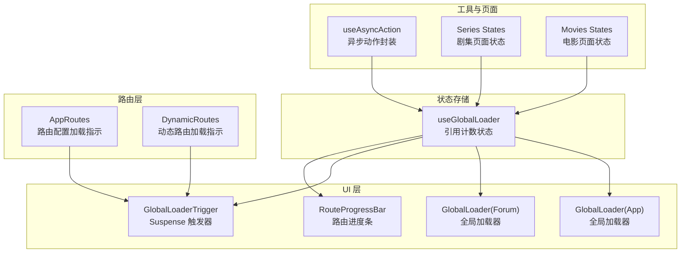
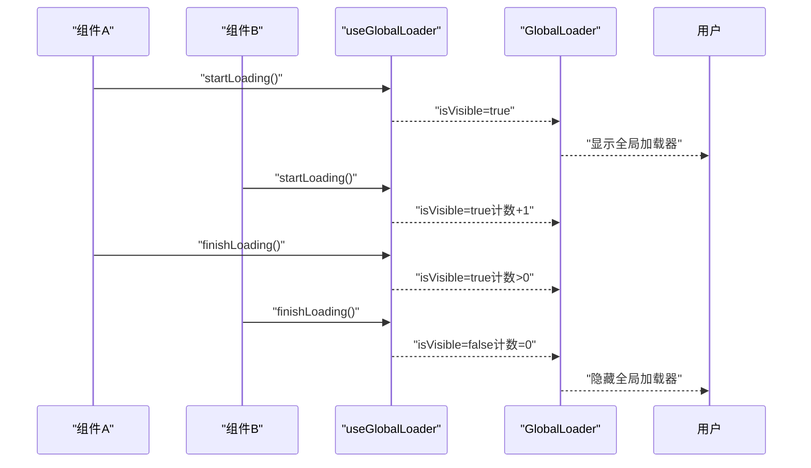
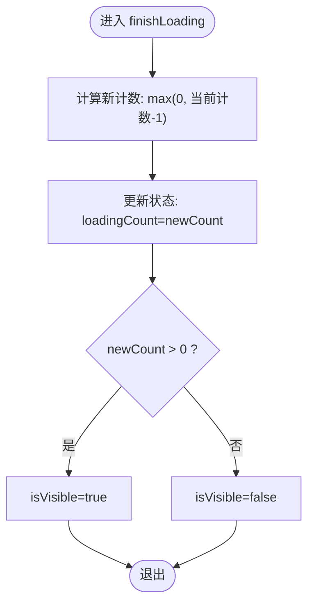
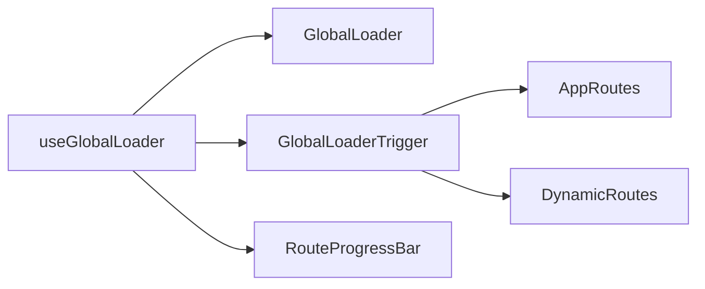

# 加载状态管理

<cite>
**本文档引用的文件**
- [globalLoaderStore.ts](file://src/stores/globalLoaderStore.ts)
- [GlobalLoader.tsx（App模块）](file://src/modules/app/components/ui/GlobalLoader.tsx)
- [GlobalLoader.tsx（论坛模块）](file://src/modules/forum/components/ui/GlobalLoader.tsx)
- [AppRoutes.tsx](file://src/routes/AppRoutes.tsx)
- [DynamicRoutes.tsx](file://src/routes/DynamicRoutes.tsx)
- [useAsyncAction.ts](file://src/hooks/useAsyncAction.ts)
- [RouteProgressBar.tsx](file://src/modules/app/components/ui/RouteProgressBar.tsx)
- [States.ts（剧集页面）](file://src/modules/app/pages/Series/components/States.tsx)
- [States.ts（电影页面）](file://src/modules/app/pages/Movies/components/States.tsx)
</cite>

## 目录
1. [简介](#简介)
2. [项目结构](#项目结构)
3. [核心组件](#核心组件)
4. [架构总览](#架构总览)
5. [详细组件分析](#详细组件分析)
6. [依赖关系分析](#依赖关系分析)
7. [性能考量](#性能考量)
8. [故障排查指南](#故障排查指南)
9. [结论](#结论)
10. [附录](#附录)

## 简介
本文件系统性阐述项目的“全局加载状态管理”方案，重点围绕引用计数模式的实现与使用，解释 startLoading() 与 finishLoading() 的工作机制、并发加载任务的处理策略、加载状态的可见性控制逻辑，以及在不同组件中的使用范式（含错误处理与超时机制建议）。文档同时提供性能优化建议与最佳实践，帮助开发者在多组件并发场景下稳定地管理加载状态。

## 项目结构
全局加载状态管理由以下关键部分组成：
- 状态存储：基于 Zustand 的全局加载器状态（引用计数 + 可见性）
- UI 组件：全局加载器与加载触发器（用于 Suspense fallback）
- 路由层：在动态路由配置与懒加载过程中启用/关闭加载状态
- 工具 Hook：异步动作封装（含错误提示），可与加载状态协同使用
- 进度条组件：与数据请求 fetch 状态联动的路由级进度条

图表来源
- [globalLoaderStore.ts](file://src/stores/globalLoaderStore.ts#L1-L36)
- [GlobalLoader.tsx（App模块）](file://src/modules/app/components/ui/GlobalLoader.tsx#L1-L107)
- [GlobalLoader.tsx（论坛模块）](file://src/modules/forum/components/ui/GlobalLoader.tsx#L1-L107)
- [AppRoutes.tsx](file://src/routes/AppRoutes.tsx#L55-L98)
- [DynamicRoutes.tsx](file://src/routes/DynamicRoutes.tsx#L265-L292)
- [RouteProgressBar.tsx](file://src/modules/app/components/ui/RouteProgressBar.tsx#L82-L101)
- [useAsyncAction.ts](file://src/hooks/useAsyncAction.ts#L1-L46)
- [States.ts（剧集页面）](file://src/modules/app/pages/Series/components/States.tsx#L1-L28)
- [States.ts（电影页面）](file://src/modules/app/pages/Movies/components/States.tsx#L1-L34)

章节来源
- [globalLoaderStore.ts](file://src/stores/globalLoaderStore.ts#L1-L36)
- [GlobalLoader.tsx（App模块）](file://src/modules/app/components/ui/GlobalLoader.tsx#L1-L107)
- [GlobalLoader.tsx（论坛模块）](file://src/modules/forum/components/ui/GlobalLoader.tsx#L1-L107)
- [AppRoutes.tsx](file://src/routes/AppRoutes.tsx#L55-L98)
- [DynamicRoutes.tsx](file://src/routes/DynamicRoutes.tsx#L265-L292)
- [RouteProgressBar.tsx](file://src/modules/app/components/ui/RouteProgressBar.tsx#L82-L101)
- [useAsyncAction.ts](file://src/hooks/useAsyncAction.ts#L1-L46)
- [States.ts（剧集页面）](file://src/modules/app/pages/Series/components/States.tsx#L1-L28)
- [States.ts（电影页面）](file://src/modules/app/pages/Movies/components/States.tsx#L1-L34)

## 核心组件
- 全局加载器状态（引用计数）
  - 字段：loadingCount（当前加载任务计数）、isVisible（是否显示加载器）
  - 方法：startLoading（计数+1，强制显示）、finishLoading（计数-1，计数>0则继续显示）
- 全局加载器组件
  - 单例组件，订阅 isVisible 并渲染动画加载界面
- 加载器触发器
  - 在 Suspense fallback 场景中自动开始/结束加载
- 路由加载指示
  - 在动态路由配置或懒加载期间通过 startLoading/finishLoading 控制加载状态
- 路由进度条
  - 结合 React Query 的 isFetching 状态，仅在后台请求活跃时显示进度条
- 异步动作 Hook
  - 封装异步执行流程，统一处理 loading、成功/失败提示与回调

章节来源
- [globalLoaderStore.ts](file://src/stores/globalLoaderStore.ts#L3-L12)
- [globalLoaderStore.ts](file://src/stores/globalLoaderStore.ts#L19-L35)
- [GlobalLoader.tsx（App模块）](file://src/modules/app/components/ui/GlobalLoader.tsx#L10-L11)
- [GlobalLoader.tsx（App模块）](file://src/modules/app/components/ui/GlobalLoader.tsx#L97-L106)
- [AppRoutes.tsx](file://src/routes/AppRoutes.tsx#L61-L68)
- [DynamicRoutes.tsx](file://src/routes/DynamicRoutes.tsx#L271-L280)
- [RouteProgressBar.tsx](file://src/modules/app/components/ui/RouteProgressBar.tsx#L82-L101)
- [useAsyncAction.ts](file://src/hooks/useAsyncAction.ts#L11-L44)

## 架构总览
全局加载状态管理采用“引用计数 + 单例 UI”的架构设计，确保多组件并发触发加载时的一致性与正确性。

图表来源
- [globalLoaderStore.ts](file://src/stores/globalLoaderStore.ts#L22-L34)
- [GlobalLoader.tsx（App模块）](file://src/modules/app/components/ui/GlobalLoader.tsx#L10-L11)

## 详细组件分析

### 全局加载器状态（引用计数）
- 设计要点
  - 通过引用计数避免“局部加载”导致的闪烁或误隐藏
  - startLoading 总是将 isVisible 置为 true；finishLoading 仅在计数归零时隐藏
  - 使用 Math.max(0, ...) 防止计数回退到负值
- 并发处理
  - 多个组件可同时调用 startLoading()，计数累加
  - finishLoading() 与 startLoading() 成对出现，保证计数平衡
- 可见性控制
  - isVisible 由 loadingCount 决定：计数>0 显示，计数=0 隐藏
  - 与 Suspense、路由懒加载、后台查询等场景结合使用

图表来源
- [globalLoaderStore.ts](file://src/stores/globalLoaderStore.ts#L27-L34)

章节来源
- [globalLoaderStore.ts](file://src/stores/globalLoaderStore.ts#L3-L12)
- [globalLoaderStore.ts](file://src/stores/globalLoaderStore.ts#L19-L35)

### 全局加载器组件（单例）
- 组件职责
  - 订阅 useGlobalLoader 的 isVisible 状态
  - 在可见时渲染带动画的全局加载界面
- 使用位置
  - App 与 Forum 模块均提供相同实现的 GlobalLoader 组件
  - 建议在应用根部仅挂载一个实例，避免重复渲染

章节来源
- [GlobalLoader.tsx（App模块）](file://src/modules/app/components/ui/GlobalLoader.tsx#L10-L11)
- [GlobalLoader.tsx（App模块）](file://src/modules/app/components/ui/GlobalLoader.tsx#L13-L91)
- [GlobalLoader.tsx（论坛模块）](file://src/modules/forum/components/ui/GlobalLoader.tsx#L10-L11)
- [GlobalLoader.tsx（论坛模块）](file://src/modules/forum/components/ui/GlobalLoader.tsx#L13-L91)

### 加载器触发器（Suspense Fallback）
- 作用
  - 在 Suspense fallback 渲染期间自动开始加载，组件卸载时自动结束
- 使用方式
  - 在路由层或懒加载组件中包裹 <Suspense fallback={<GlobalLoaderTrigger />}>
  - 触发器内部调用 useGlobalLoader().startLoading() 与 useEffect cleanup 中的 finishLoading()

章节来源
- [GlobalLoader.tsx（App模块）](file://src/modules/app/components/ui/GlobalLoader.tsx#L97-L106)
- [GlobalLoader.tsx（论坛模块）](file://src/modules/forum/components/ui/GlobalLoader.tsx#L97-L106)

### 路由加载指示（动态路由与懒加载）
- AppRoutes
  - 在动态路由配置加载期间，通过 RouteConfigLoader 使用 GlobalLoaderTrigger
- DynamicRoutes
  - 监听 isLoading 状态，当为 true 时开始加载，否则结束
- 与 Suspense 协同
  - 懒加载页面配合 <Suspense fallback={<FullScreenLoader />}> 使用

章节来源
- [AppRoutes.tsx](file://src/routes/AppRoutes.tsx#L61-L68)
- [AppRoutes.tsx](file://src/routes/AppRoutes.tsx#L76-L79)
- [DynamicRoutes.tsx](file://src/routes/DynamicRoutes.tsx#L271-L280)
- [DynamicRoutes.tsx](file://src/routes/DynamicRoutes.tsx#L282-L291)

### 路由进度条（React Query 集成）
- 逻辑
  - 监听 isFetching > 0 时触发 start，完成后触发 done
  - 与全局加载器互不冲突，可叠加使用
- 注意
  - 仅在后台查询活跃时显示，避免与用户主动触发的加载状态混淆

章节来源
- [RouteProgressBar.tsx](file://src/modules/app/components/ui/RouteProgressBar.tsx#L82-L101)

### 异步动作封装（错误处理与提示）
- 能力
  - 统一封装异步执行流程，自动处理 loading 状态
  - 支持自定义 loading 提示、成功/失败提示与回调
  - 自动捕获错误并进行消息降级（优先使用响应体 message）
- 与加载状态协作
  - 可与全局加载器配合，在复杂业务中同时展示“全局加载器”与“局部提示”
  - 建议在长耗时操作中谨慎使用，避免与全局加载器产生视觉冲突

章节来源
- [useAsyncAction.ts](file://src/hooks/useAsyncAction.ts#L11-L44)

### 页面级加载与错误状态（示例）
- 剧集页面与电影页面均提供 LoadingState 与 ErrorState
- 与全局加载器的关系
  - 全局加载器关注“页面切换/路由懒加载”等场景
  - 页面级状态关注“列表/详情”等局部加载与错误处理

章节来源
- [States.ts（剧集页面）](file://src/modules/app/pages/Series/components/States.tsx#L3-L28)
- [States.ts（电影页面）](file://src/modules/app/pages/Movies/components/States.tsx#L3-L34)

## 依赖关系分析
- 组件耦合
  - GlobalLoader 与 GlobalLoaderTrigger 依赖 useGlobalLoader
  - 路由层组件（AppRoutes、DynamicRoutes）依赖 GlobalLoaderTrigger
  - RouteProgressBar 与 React Query 状态联动，独立于全局加载器
- 状态一致性
  - 所有并发 startLoading/finishLoading 调用最终汇聚到 useGlobalLoader 的引用计数
  - 通过计数归零决定 isVisible 的最终状态

图表来源
- [globalLoaderStore.ts](file://src/stores/globalLoaderStore.ts#L19-L35)
- [GlobalLoader.tsx（App模块）](file://src/modules/app/components/ui/GlobalLoader.tsx#L10-L11)
- [GlobalLoader.tsx（App模块）](file://src/modules/app/components/ui/GlobalLoader.tsx#L97-L106)
- [AppRoutes.tsx](file://src/routes/AppRoutes.tsx#L61-L68)
- [DynamicRoutes.tsx](file://src/routes/DynamicRoutes.tsx#L271-L280)
- [RouteProgressBar.tsx](file://src/modules/app/components/ui/RouteProgressBar.tsx#L82-L101)

章节来源
- [globalLoaderStore.ts](file://src/stores/globalLoaderStore.ts#L1-L36)
- [GlobalLoader.tsx（App模块）](file://src/modules/app/components/ui/GlobalLoader.tsx#L1-L107)
- [AppRoutes.tsx](file://src/routes/AppRoutes.tsx#L55-L98)
- [DynamicRoutes.tsx](file://src/routes/DynamicRoutes.tsx#L265-L292)
- [RouteProgressBar.tsx](file://src/modules/app/components/ui/RouteProgressBar.tsx#L82-L101)

## 性能考量
- 引用计数的优势
  - 避免“局部加载”导致的闪烁与误隐藏，提升用户体验
  - 多组件并发时无需额外协调，天然具备线程安全的计数一致性
- 渲染优化
  - GlobalLoader 使用 AnimatePresence 与 Framer Motion，仅在可见性变化时触发动画
  - 进度条与动画使用 will-change 与 GPU 加速属性，减少主线程压力
- 状态更新
  - Zustand 的 set 函数按需更新，避免不必要的重渲染
- 建议
  - 在高频并发场景中，尽量成对调用 startLoading/finishLoading，避免计数泄漏
  - 对于短时、瞬态的 UI 切换，优先使用页面级 LoadingState，而非全局加载器

## 故障排查指南
- 常见问题
  - 加载器无法隐藏：检查是否存在未调用 finishLoading 的组件或副作用未清理
  - 加载器反复闪烁：确认多个组件是否同时触发 startLoading，且在正确时机调用 finishLoading
  - 与 Suspense 冲突：确保 GlobalLoaderTrigger 仅在 Suspense fallback 场景使用
  - 与后台查询冲突：RouteProgressBar 与全局加载器可叠加，但需明确各自职责
- 排查步骤
  - 在 useGlobalLoader 上添加日志，观察 loadingCount 的变化轨迹
  - 检查路由层是否正确使用 GlobalLoaderTrigger
  - 确认页面级 LoadingState 与全局加载器的职责划分

章节来源
- [globalLoaderStore.ts](file://src/stores/globalLoaderStore.ts#L27-L34)
- [GlobalLoader.tsx（App模块）](file://src/modules/app/components/ui/GlobalLoader.tsx#L97-L106)
- [AppRoutes.tsx](file://src/routes/AppRoutes.tsx#L61-L68)
- [DynamicRoutes.tsx](file://src/routes/DynamicRoutes.tsx#L271-L280)
- [RouteProgressBar.tsx](file://src/modules/app/components/ui/RouteProgressBar.tsx#L82-L101)

## 结论
本方案以引用计数为核心，结合单例 UI 与路由层集成，实现了稳定、可靠的全局加载状态管理。通过 startLoading/finishLoading 的成对使用与并发安全设计，确保在多组件、多场景下的状态一致性。配合页面级状态与异步动作封装，可在复杂业务中提供一致且友好的加载体验。

## 附录
- 使用建议
  - 在路由懒加载与动态配置阶段使用 GlobalLoaderTrigger
  - 在后台查询活跃时使用 RouteProgressBar，避免与全局加载器混淆
  - 在长耗时操作中谨慎使用 useAsyncAction 的 loading 提示，避免视觉冲突
- 最佳实践
  - 成对调用 startLoading/finishLoading，确保计数平衡
  - 将全局加载器用于“页面级/路由级”的整体加载，页面内细节使用局部 LoadingState
  - 对于超时场景，建议在业务层增加超时控制并在超时后显式 finishLoading，防止计数泄漏