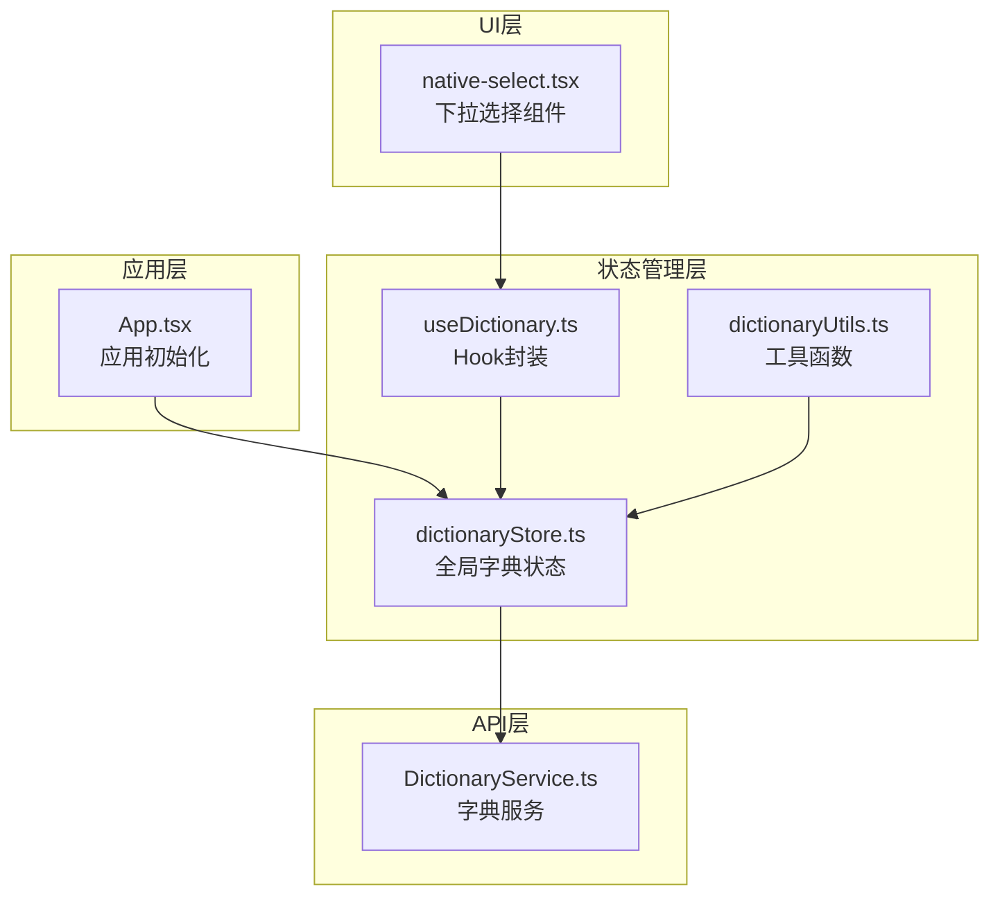
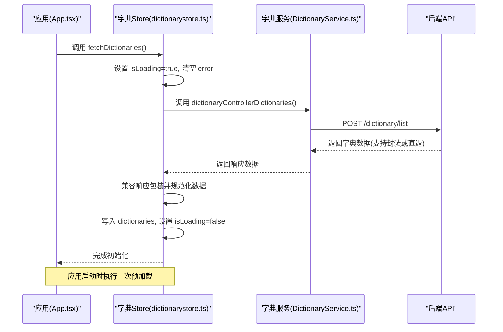
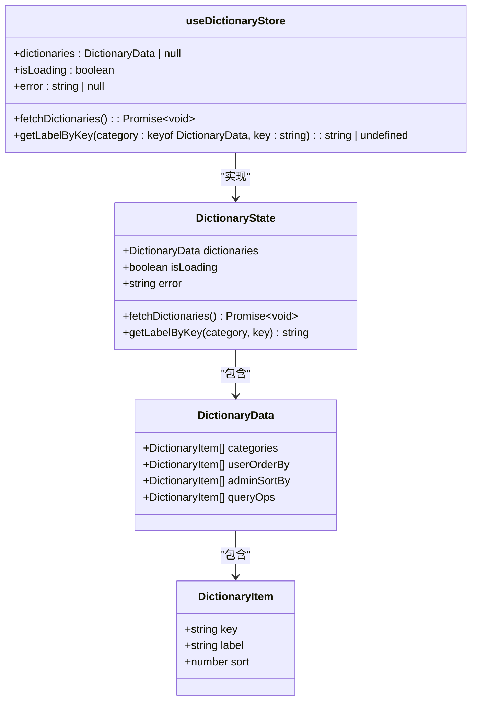
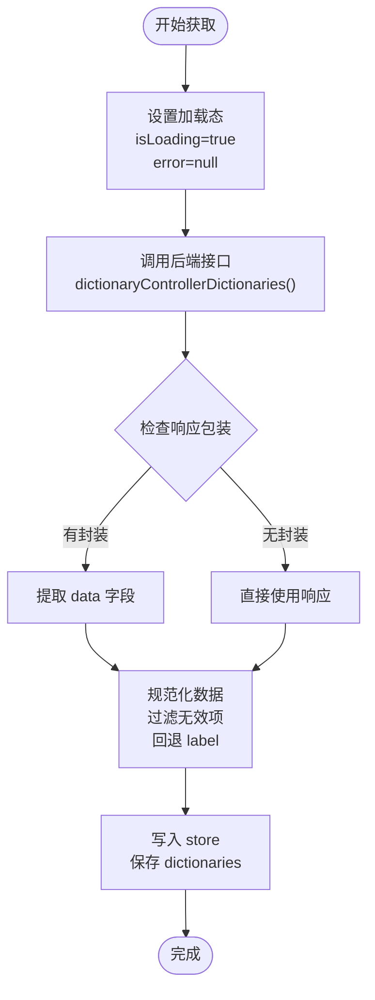
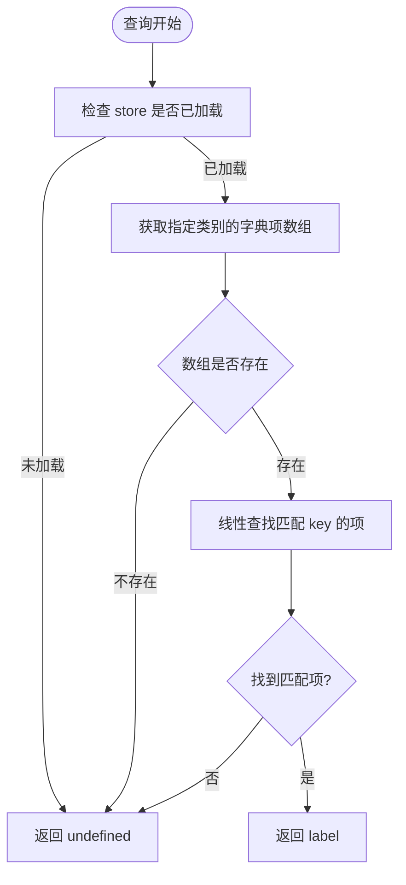
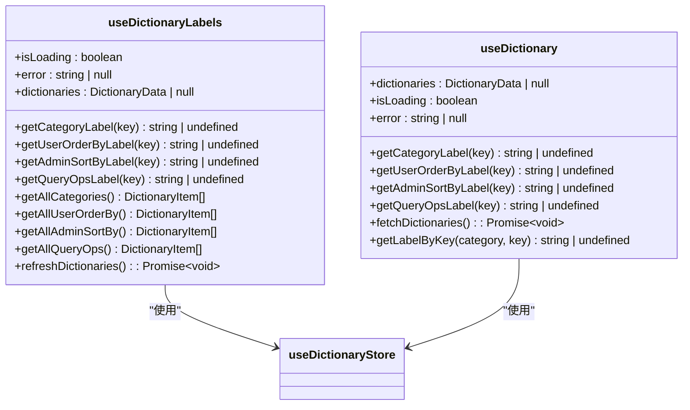
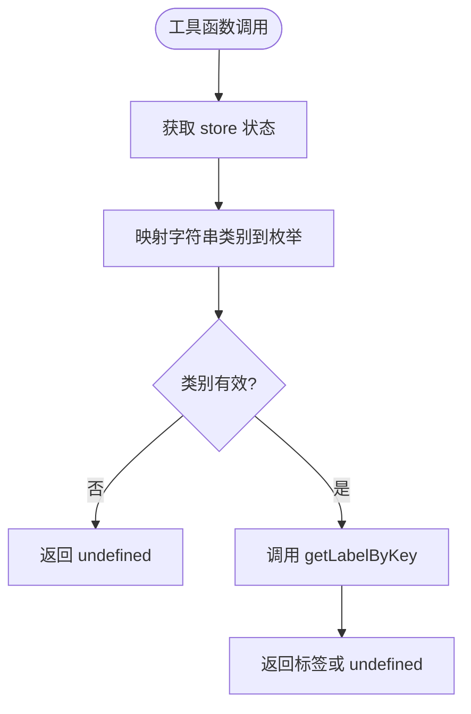
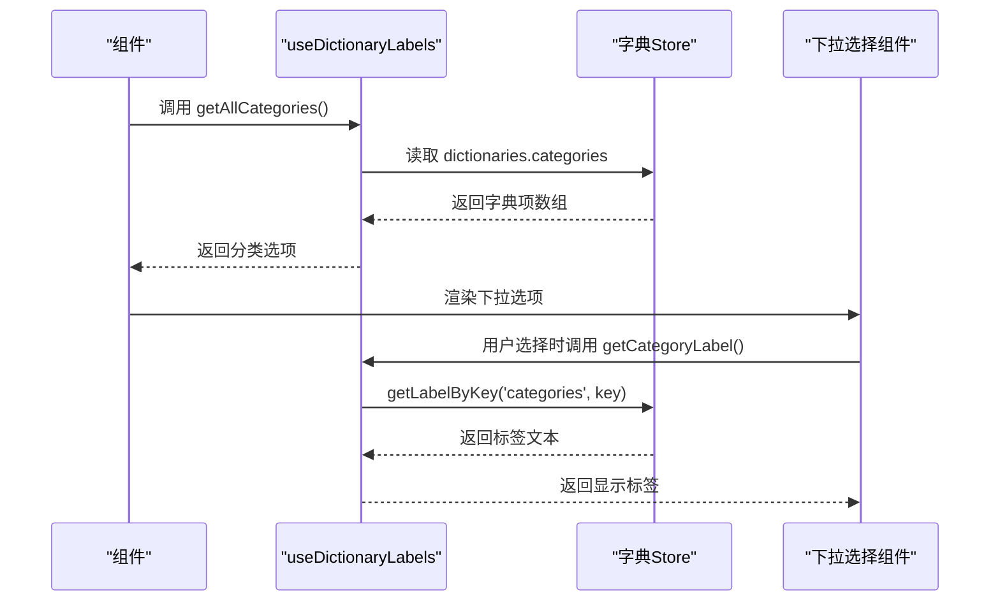
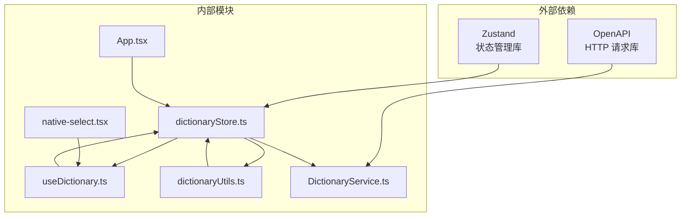

# 字典数据缓存

<cite>
**本文档引用的文件**
- [dictionaryStore.ts](file://src/stores/dictionaryStore.ts)
- [useDictionary.ts](file://src/hooks/useDictionary.ts)
- [dictionaryUtils.ts](file://src/utils/dictionaryUtils.ts)
- [DictionaryService.ts](file://src/api/services/DictionaryService.ts)
- [App.tsx](file://src/App.tsx)
- [native-select.tsx](file://src/modules/app/components/ui/native-select.tsx)
</cite>

## 目录
1. [简介](#简介)
2. [项目结构](#项目结构)
3. [核心组件](#核心组件)
4. [架构概览](#架构概览)
5. [详细组件分析](#详细组件分析)
6. [依赖关系分析](#依赖关系分析)
7. [性能考虑](#性能考虑)
8. [故障排除指南](#故障排除指南)
9. [结论](#结论)

## 简介
本文件为字典数据缓存的详细技术文档，深入解释了系统中字典数据的缓存策略、数据结构设计、预加载机制、缓存失效与更新流程，以及与其他模块的集成方式。文档还提供了字典数据在表单组件、下拉菜单和搜索功能中的使用示例，并包含缓存性能优化、内存管理和数据清理策略。

## 项目结构
字典数据缓存相关的核心文件组织如下：
- 状态管理：src/stores/dictionaryStore.ts
- Hook 封装：src/hooks/useDictionary.ts
- 工具函数：src/utils/dictionaryUtils.ts
- API 服务：src/api/services/DictionaryService.ts
- 应用入口初始化：src/App.tsx
- UI 组件集成示例：src/modules/app/components/ui/native-select.tsx

**图表来源**
- [dictionaryStore.ts](file://src/stores/dictionaryStore.ts#L1-L119)
- [useDictionary.ts](file://src/hooks/useDictionary.ts#L1-L57)
- [dictionaryUtils.ts](file://src/utils/dictionaryUtils.ts#L1-L34)
- [DictionaryService.ts](file://src/api/services/DictionaryService.ts#L1-L51)
- [App.tsx](file://src/App.tsx#L21-L31)
- [native-select.tsx](file://src/modules/app/components/ui/native-select.tsx#L123-L166)

**章节来源**
- [dictionaryStore.ts](file://src/stores/dictionaryStore.ts#L1-L119)
- [useDictionary.ts](file://src/hooks/useDictionary.ts#L1-L57)
- [dictionaryUtils.ts](file://src/utils/dictionaryUtils.ts#L1-L34)
- [DictionaryService.ts](file://src/api/services/DictionaryService.ts#L1-L51)
- [App.tsx](file://src/App.tsx#L21-L31)
- [native-select.tsx](file://src/modules/app/components/ui/native-select.tsx#L123-L166)

## 核心组件
本节详细介绍字典数据缓存的核心组件及其职责。

- 全局字典状态（dictionaryStore.ts）
  - 负责从后端拉取并维护字典数据，包括分类、用户排序选项、后台排序选项、查询操作符等
  - 提供按类别与 key 查询对应 label 的能力
  - 生命周期：在应用启动时由 App.tsx 的 useEffect 调用 fetchDictionaries() 完成首次加载
  - 状态约定：isLoading 表示拉取过程中的加载态，error 存储最近一次拉取的错误信息

- Hook 封装（useDictionary.ts）
  - 提供便捷的标签获取函数，包括按类别获取单个标签和批量获取全部标签
  - 暴露 store 的状态和刷新方法，便于组件使用

- 工具函数（dictionaryUtils.ts）
  - 提供通用的字典标签获取函数，支持通过字符串类别名获取标签
  - 暴露 useDictionary hook，便于在非组件上下文中使用

- API 服务（DictionaryService.ts）
  - 定义字典列表接口，返回统一格式的数据结构
  - 支持 OpenAPI 响应包装和直接数据返回两种模式

**章节来源**
- [dictionaryStore.ts](file://src/stores/dictionaryStore.ts#L1-L119)
- [useDictionary.ts](file://src/hooks/useDictionary.ts#L1-L57)
- [dictionaryUtils.ts](file://src/utils/dictionaryUtils.ts#L1-L34)
- [DictionaryService.ts](file://src/api/services/DictionaryService.ts#L1-L51)

## 架构概览
字典数据缓存采用分层架构设计，确保数据的一致性和高效访问。

**图表来源**
- [App.tsx](file://src/App.tsx#L25-L30)
- [dictionaryStore.ts](file://src/stores/dictionaryStore.ts#L58-L107)
- [DictionaryService.ts](file://src/api/services/DictionaryService.ts#L14-L49)

## 详细组件分析

### 字典状态管理器
字典状态管理器是整个缓存系统的核心，负责数据的获取、规范化和查询。

**图表来源**
- [dictionaryStore.ts](file://src/stores/dictionaryStore.ts#L15-L51)

#### 数据获取流程
字典数据的获取流程包含以下关键步骤：

1. **初始化阶段**：应用启动时调用 fetchDictionaries() 方法
2. **加载状态管理**：设置 isLoading 为 true，清空之前的错误信息
3. **API 调用**：通过 DictionaryService.dictionaryControllerDictionaries() 获取数据
4. **响应兼容处理**：支持 OpenAPI 统一响应包装和直接数据返回两种模式
5. **数据规范化**：过滤无效数据，确保 key 为字符串，label 缺失时回退使用 key
6. **状态更新**：将规范化后的数据写入 dictionaries，结束加载态

**图表来源**
- [dictionaryStore.ts](file://src/stores/dictionaryStore.ts#L58-L107)

#### 数据查询机制
字典数据的查询采用 O(n) 线性查找算法，其中 n 为指定类别下的字典项数量。

**图表来源**
- [dictionaryStore.ts](file://src/stores/dictionaryStore.ts#L109-L117)

**章节来源**
- [dictionaryStore.ts](file://src/stores/dictionaryStore.ts#L58-L117)

### Hook 封装组件
Hook 封装提供了更便捷的使用方式，简化了组件中的状态管理。

**图表来源**
- [useDictionary.ts](file://src/hooks/useDictionary.ts#L3-L56)

**章节来源**
- [useDictionary.ts](file://src/hooks/useDictionary.ts#L1-L57)

### 工具函数组件
工具函数提供了在非组件上下文中的使用方式，支持通过字符串类别名获取标签。

**图表来源**
- [dictionaryUtils.ts](file://src/utils/dictionaryUtils.ts#L3-L18)

**章节来源**
- [dictionaryUtils.ts](file://src/utils/dictionaryUtils.ts#L1-L34)

### UI 组件集成示例
下拉选择组件展示了字典数据在实际 UI 中的应用方式。

**图表来源**
- [useDictionary.ts](file://src/hooks/useDictionary.ts#L22-L24)
- [useDictionary.ts](file://src/hooks/useDictionary.ts#L6-L8)
- [native-select.tsx](file://src/modules/app/components/ui/native-select.tsx#L147-L161)

**章节来源**
- [native-select.tsx](file://src/modules/app/components/ui/native-select.tsx#L123-L166)

## 依赖关系分析
字典数据缓存系统的依赖关系清晰，层次分明。

**图表来源**
- [dictionaryStore.ts](file://src/stores/dictionaryStore.ts#L12-L13)
- [DictionaryService.ts](file://src/api/services/DictionaryService.ts#L5-L7)
- [App.tsx](file://src/App.tsx#L8-L9)

**章节来源**
- [dictionaryStore.ts](file://src/stores/dictionaryStore.ts#L12-L13)
- [DictionaryService.ts](file://src/api/services/DictionaryService.ts#L5-L7)
- [App.tsx](file://src/App.tsx#L8-L9)

## 性能考虑
基于当前实现，以下是性能相关的分析和优化建议：

### 时间复杂度分析
- 数据获取：O(1)，单次 API 调用
- 数据规范化：O(m)，m 为字典项总数
- 查询操作：O(n)，n 为指定类别下的字典项数量
- 内存占用：O(m)，存储所有字典项

### 优化策略
1. **查询性能优化**
   - 对常用查询建立索引映射，将 O(n) 查找优化为 O(1)
   - 实现 LRU 缓存机制，缓存热点查询结果

2. **内存管理优化**
   - 实现字典数据的懒加载，按需加载特定类别
   - 添加内存使用监控，超过阈值时自动清理旧数据

3. **网络请求优化**
   - 实现请求去重，避免重复的 API 调用
   - 添加请求超时和重试机制

4. **UI 渲染优化**
   - 使用 React.memo 包装高频使用的组件
   - 实现虚拟滚动，优化大量选项的渲染性能

### 缓存策略
- **预加载策略**：应用启动时一次性加载所有字典数据
- **失效策略**：当前实现未包含主动失效机制，建议添加定时刷新或手动刷新
- **更新策略**：支持重新拉取数据，但未实现增量更新

## 故障排除指南
针对字典数据缓存可能出现的问题，提供以下排查和解决方案：

### 常见问题及解决方案

1. **数据加载失败**
   - 检查网络连接和 API 可用性
   - 查看 error 状态获取具体错误信息
   - 确认后端接口返回格式符合预期

2. **标签显示异常**
   - 检查字典项的 key 和 label 字段
   - 确认数据规范化过程是否正确处理缺失值
   - 验证类别映射是否正确

3. **查询结果为空**
   - 确认字典数据是否已成功加载
   - 检查 key 值是否与字典项匹配
   - 验证类别参数是否正确

4. **内存使用过高**
   - 检查是否有不必要的组件订阅 store
   - 实现数据清理机制
   - 优化查询频率

**章节来源**
- [dictionaryStore.ts](file://src/stores/dictionaryStore.ts#L100-L106)
- [dictionaryStore.ts](file://src/stores/dictionaryStore.ts#L110-L116)

## 结论
字典数据缓存系统采用简洁高效的架构设计，通过 Zustand 实现状态管理，通过 Hook 封装提供便捷的使用方式。系统具备完整的数据获取、规范化和查询能力，能够满足大多数应用场景的需求。

### 主要优势
- **简单易用**：清晰的状态管理模式和 API 设计
- **类型安全**：完整的 TypeScript 类型定义
- **扩展性强**：易于添加新的字典类别和查询功能
- **性能稳定**：合理的数据结构和查询算法

### 改进建议
1. 实现主动缓存失效和增量更新机制
2. 添加查询结果缓存和索引优化
3. 增强错误处理和重试机制
4. 实现内存使用监控和自动清理
5. 添加单元测试和集成测试覆盖

该系统为后续的功能扩展和性能优化奠定了良好的基础，能够支持更复杂的业务场景需求。