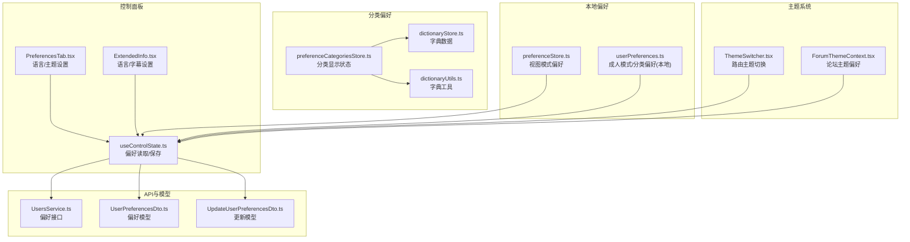
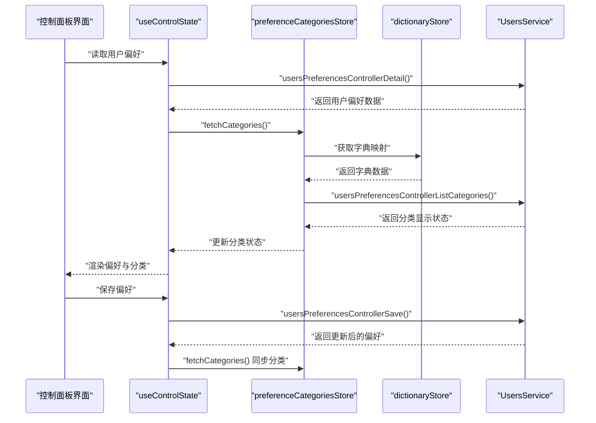
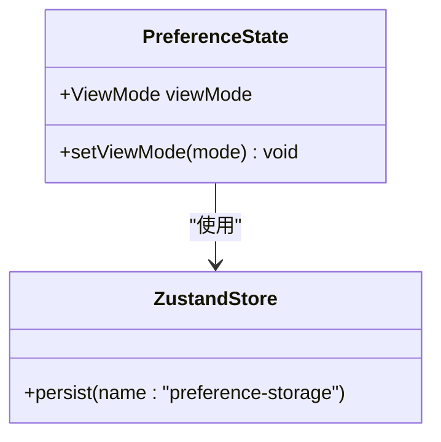
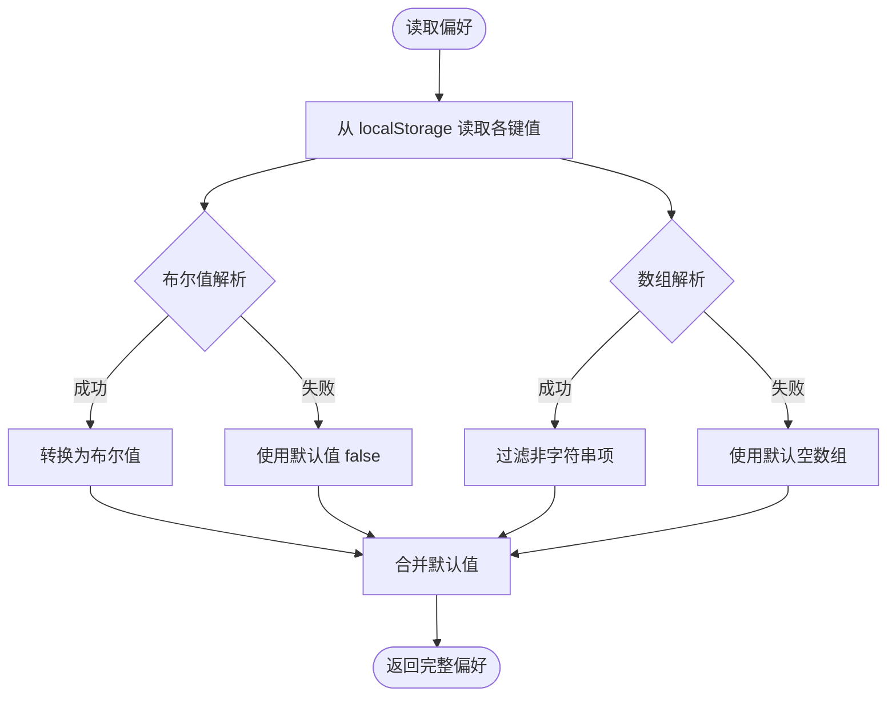
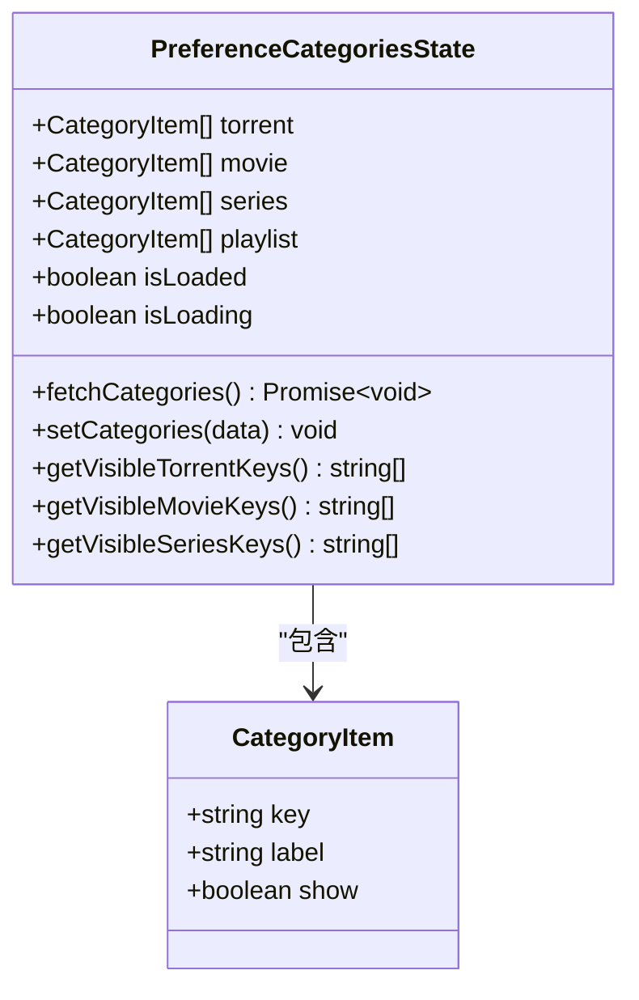
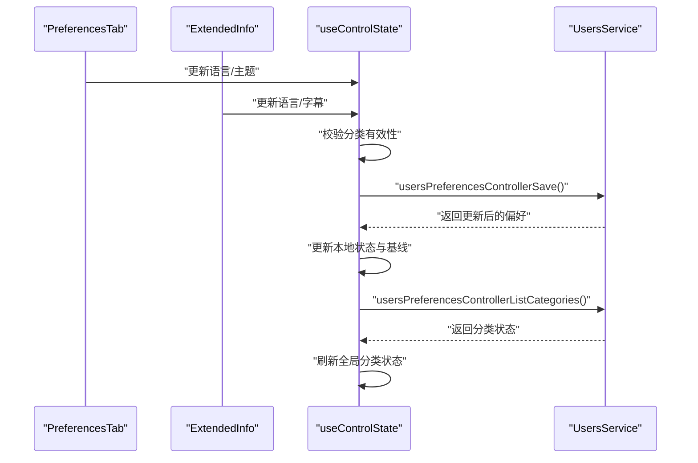
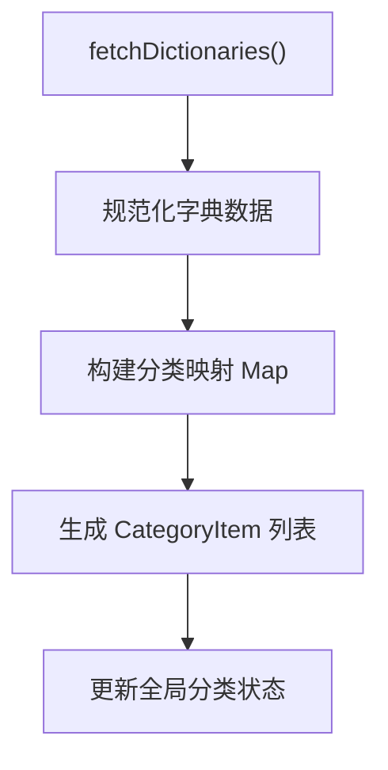
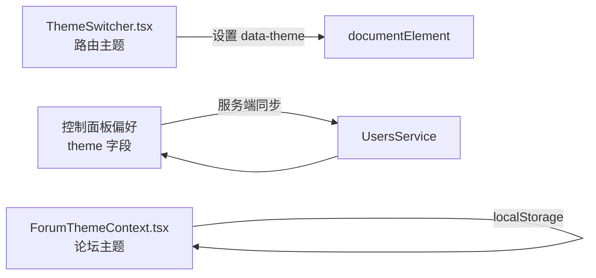
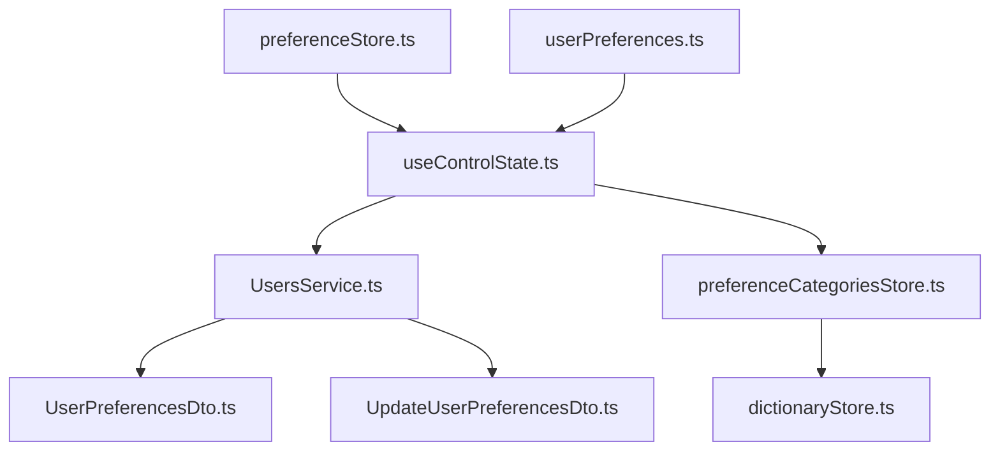

# 用户偏好设置存储

<cite>
**本文档引用的文件**
- [preferenceStore.ts](file://src/modules/app/stores/preferenceStore.ts)
- [preferenceCategoriesStore.ts](file://src/stores/preferenceCategoriesStore.ts)
- [userPreferences.ts](file://src/utils/userPreferences.ts)
- [useControlState.ts](file://src/modules/app/pages/Control/hooks/useControlState.ts)
- [PreferencesTab.tsx](file://src/modules/app/pages/Control/components/tabs/PreferencesTab.tsx)
- [ExtendedInfo.tsx](file://src/modules/app/pages/UploadTorrent/components/ExtendedInfo.tsx)
- [dictionaryStore.ts](file://src/stores/dictionaryStore.ts)
- [dictionaryUtils.ts](file://src/utils/dictionaryUtils.ts)
- [UsersService.ts](file://src/api/services/UsersService.ts)
- [UserPreferencesDto.ts](file://src/api/models/UserPreferencesDto.ts)
- [UpdateUserPreferencesDto.ts](file://src/api/models/UpdateUserPreferencesDto.ts)
- [ThemeSwitcher.tsx](file://src/components/ThemeSwitcher.tsx)
- [ForumThemeContext.tsx](file://src/modules/forum/context/ForumThemeContext.tsx)
</cite>

## 目录
1. [简介](#简介)
2. [项目结构](#项目结构)
3. [核心组件](#核心组件)
4. [架构概览](#架构概览)
5. [详细组件分析](#详细组件分析)
6. [依赖关系分析](#依赖关系分析)
7. [性能考量](#性能考量)
8. [故障排除指南](#故障排除指南)
9. [结论](#结论)
10. [附录](#附录)

## 简介
本技术文档围绕用户偏好设置存储系统进行全面解析，涵盖数据结构设计、分类管理、默认值策略、持久化机制以及本地与服务器的同步流程。文档还详细说明了偏好设置在不同页面与组件中的应用方式（主题切换、语言设置、功能开关），并提供迁移与升级策略及隐私保护与数据安全建议。

## 项目结构
用户偏好设置相关代码主要分布在以下模块：
- 本地状态与持久化：preferenceStore.ts、userPreferences.ts
- 分类偏好与全局状态：preferenceCategoriesStore.ts、dictionaryStore.ts、dictionaryUtils.ts
- 控制面板与页面集成：useControlState.ts、PreferencesTab.tsx、ExtendedInfo.tsx
- API 接口与数据模型：UsersService.ts、UserPreferencesDto.ts、UpdateUserPreferencesDto.ts
- 主题系统：ThemeSwitcher.tsx、ForumThemeContext.tsx

**图表来源**
- [preferenceStore.ts](file://src/modules/app/stores/preferenceStore.ts#L1-L22)
- [userPreferences.ts](file://src/utils/userPreferences.ts#L1-L103)
- [preferenceCategoriesStore.ts](file://src/stores/preferenceCategoriesStore.ts#L1-L163)
- [dictionaryStore.ts](file://src/stores/dictionaryStore.ts#L1-L119)
- [dictionaryUtils.ts](file://src/utils/dictionaryUtils.ts#L1-L34)
- [useControlState.ts](file://src/modules/app/pages/Control/hooks/useControlState.ts#L316-L456)
- [PreferencesTab.tsx](file://src/modules/app/pages/Control/components/tabs/PreferencesTab.tsx#L69-L108)
- [ExtendedInfo.tsx](file://src/modules/app/pages/UploadTorrent/components/ExtendedInfo.tsx#L152-L201)
- [UsersService.ts](file://src/api/services/UsersService.ts#L238-L282)
- [UserPreferencesDto.ts](file://src/api/models/UserPreferencesDto.ts#L1-L45)
- [UpdateUserPreferencesDto.ts](file://src/api/models/UpdateUserPreferencesDto.ts#L1-L47)
- [ThemeSwitcher.tsx](file://src/components/ThemeSwitcher.tsx#L1-L22)
- [ForumThemeContext.tsx](file://src/modules/forum/context/ForumThemeContext.tsx#L1-L67)

**章节来源**
- [preferenceStore.ts](file://src/modules/app/stores/preferenceStore.ts#L1-L22)
- [userPreferences.ts](file://src/utils/userPreferences.ts#L1-L103)
- [preferenceCategoriesStore.ts](file://src/stores/preferenceCategoriesStore.ts#L1-L163)
- [dictionaryStore.ts](file://src/stores/dictionaryStore.ts#L1-L119)
- [dictionaryUtils.ts](file://src/utils/dictionaryUtils.ts#L1-L34)
- [useControlState.ts](file://src/modules/app/pages/Control/hooks/useControlState.ts#L316-L456)
- [PreferencesTab.tsx](file://src/modules/app/pages/Control/components/tabs/PreferencesTab.tsx#L69-L108)
- [ExtendedInfo.tsx](file://src/modules/app/pages/UploadTorrent/components/ExtendedInfo.tsx#L152-L201)
- [UsersService.ts](file://src/api/services/UsersService.ts#L238-L282)
- [UserPreferencesDto.ts](file://src/api/models/UserPreferencesDto.ts#L1-L45)
- [UpdateUserPreferencesDto.ts](file://src/api/models/UpdateUserPreferencesDto.ts#L1-L47)
- [ThemeSwitcher.tsx](file://src/components/ThemeSwitcher.tsx#L1-L22)
- [ForumThemeContext.tsx](file://src/modules/forum/context/ForumThemeContext.tsx#L1-L67)

## 核心组件
- 本地视图偏好：通过 zustand + persist 实现视图模式(grid/list)的本地持久化。
- 本地用户偏好：通过 localStorage 实现成人模式开关与默认分类的本地持久化，支持增量保存与默认值合并。
- 分类偏好全局状态：从服务端获取分类显示状态，结合字典数据生成可展示标签，提供可见分类键集合查询。
- 控制面板集成：在控制面板页面中读取/保存用户偏好，调用服务端接口并同步全局分类状态。
- 主题系统：路由级主题切换与论坛主题偏好独立存储，互不干扰。

**章节来源**
- [preferenceStore.ts](file://src/modules/app/stores/preferenceStore.ts#L1-L22)
- [userPreferences.ts](file://src/utils/userPreferences.ts#L1-L103)
- [preferenceCategoriesStore.ts](file://src/stores/preferenceCategoriesStore.ts#L1-L163)
- [useControlState.ts](file://src/modules/app/pages/Control/hooks/useControlState.ts#L316-L456)

## 架构概览
用户偏好设置采用“本地持久化 + 服务器同步”的双轨策略：
- 本地持久化：视图模式与部分本地偏好通过 zustand/persist 与 localStorage 存储，保证离线可用与快速读取。
- 服务器同步：用户语言、主题、默认视图、分类偏好等通过 UsersService 接口与后端同步，实现跨设备一致性。
- 分类显示：分类偏好与字典数据解耦，先从字典获取标签，再以服务端返回的 show 状态决定显示与否。

**图表来源**
- [useControlState.ts](file://src/modules/app/pages/Control/hooks/useControlState.ts#L316-L456)
- [preferenceCategoriesStore.ts](file://src/stores/preferenceCategoriesStore.ts#L58-L121)
- [dictionaryStore.ts](file://src/stores/dictionaryStore.ts#L58-L107)
- [UsersService.ts](file://src/api/services/UsersService.ts#L238-L282)

## 详细组件分析

### 本地视图偏好（preferenceStore.ts）
- 数据结构：视图模式枚举（grid/list），默认 grid。
- 持久化策略：zustand + persist 中间件，存储键名为 'preference-storage'。
- 更新流程：setViewMode 动作修改状态并自动持久化。

**图表来源**
- [preferenceStore.ts](file://src/modules/app/stores/preferenceStore.ts#L6-L21)

**章节来源**
- [preferenceStore.ts](file://src/modules/app/stores/preferenceStore.ts#L1-L22)

### 本地用户偏好（userPreferences.ts）
- 数据结构：成人模式开关、默认种子分类数组、默认影片类型数组。
- 默认值策略：所有字段提供默认值，读取时进行类型安全合并。
- 持久化介质：localStorage，键名区分成人模式、种子分类、影片类型。
- 增量保存：savePreferences 仅更新传入字段，未传入字段保持不变。
- 容错处理：读取/写入异常时回退到默认值，保证稳定性。

**图表来源**
- [userPreferences.ts](file://src/utils/userPreferences.ts#L27-L53)

**章节来源**
- [userPreferences.ts](file://src/utils/userPreferences.ts#L1-L103)

### 分类偏好全局状态（preferenceCategoriesStore.ts）
- 数据结构：按类型分组的 CategoryItem 数组（种子、电影、剧集、播放列表），并提供向后兼容的 film 别名。
- 加载流程：fetchCategories 从字典 store 获取映射，再调用服务端接口获取 show 状态，最终更新 store。
- 可见分类：提供 getVisible*Keys 方法，基于 show=true 过滤出可展示的分类键集合。
- 错误处理：捕获异常并恢复加载状态，避免阻塞 UI。

**图表来源**
- [preferenceCategoriesStore.ts](file://src/stores/preferenceCategoriesStore.ts#L8-L42)

**章节来源**
- [preferenceCategoriesStore.ts](file://src/stores/preferenceCategoriesStore.ts#L1-L163)

### 控制面板集成（useControlState.ts、PreferencesTab.tsx、ExtendedInfo.tsx）
- 偏好读取：首次加载时调用服务端 detail 接口，合并默认值后设置基线状态。
- 偏好保存：校验所选分类的有效性，构造 UpdateUserPreferencesDto 请求体，调用服务端 update 接口，成功后刷新全局分类状态。
- UI 组件：语言与主题选择在 PreferencesTab 中完成；语言/字幕选择在 ExtendedInfo 中完成，二者均与控制面板偏好联动。

**图表来源**
- [useControlState.ts](file://src/modules/app/pages/Control/hooks/useControlState.ts#L416-L456)
- [PreferencesTab.tsx](file://src/modules/app/pages/Control/components/tabs/PreferencesTab.tsx#L78-L108)
- [ExtendedInfo.tsx](file://src/modules/app/pages/UploadTorrent/components/ExtendedInfo.tsx#L159-L201)
- [UsersService.ts](file://src/api/services/UsersService.ts#L254-L276)

**章节来源**
- [useControlState.ts](file://src/modules/app/pages/Control/hooks/useControlState.ts#L316-L456)
- [PreferencesTab.tsx](file://src/modules/app/pages/Control/components/tabs/PreferencesTab.tsx#L69-L108)
- [ExtendedInfo.tsx](file://src/modules/app/pages/UploadTorrent/components/ExtendedInfo.tsx#L152-L201)

### 字典系统与分类标签（dictionaryStore.ts、dictionaryUtils.ts）
- 字典拉取：在应用启动时从后端获取 categories、userOrderBy、adminSortBy、queryOps 等字典数据。
- 标签映射：当后端未提供 label 时，回退使用 key；仅保留有效 key 的条目。
- 分类标签：preferenceCategoriesStore 使用字典映射填充 CategoryItem.label，确保 UI 展示稳定。

**图表来源**
- [dictionaryStore.ts](file://src/stores/dictionaryStore.ts#L58-L107)
- [preferenceCategoriesStore.ts](file://src/stores/preferenceCategoriesStore.ts#L65-L116)

**章节来源**
- [dictionaryStore.ts](file://src/stores/dictionaryStore.ts#L1-L119)
- [dictionaryUtils.ts](file://src/utils/dictionaryUtils.ts#L1-L34)
- [preferenceCategoriesStore.ts](file://src/stores/preferenceCategoriesStore.ts#L1-L163)

### 主题系统（ThemeSwitcher.tsx、ForumThemeContext.tsx）
- 路由主题：ThemeSwitcher 根据路径前缀动态设置 data-theme，实现 app/admin/forum 三套主题。
- 论坛主题：ForumThemeContext 提供独立的 localStorage 存储与系统配色检测，支持强制主题覆盖。
- 与偏好设置的关系：控制面板中的 theme 设置与路由/论坛主题相互独立，分别影响不同区域的外观。

**图表来源**
- [ThemeSwitcher.tsx](file://src/components/ThemeSwitcher.tsx#L4-L19)
- [ForumThemeContext.tsx](file://src/modules/forum/context/ForumThemeContext.tsx#L14-L50)
- [useControlState.ts](file://src/modules/app/pages/Control/hooks/useControlState.ts#L416-L456)
- [UsersService.ts](file://src/api/services/UsersService.ts#L254-L276)

**章节来源**
- [ThemeSwitcher.tsx](file://src/components/ThemeSwitcher.tsx#L1-L22)
- [ForumThemeContext.tsx](file://src/modules/forum/context/ForumThemeContext.tsx#L1-L67)
- [useControlState.ts](file://src/modules/app/pages/Control/hooks/useControlState.ts#L416-L456)

## 依赖关系分析
- 控制面板依赖 UsersService 进行偏好读取与保存，并在保存成功后触发分类状态刷新。
- 分类偏好依赖字典系统提供标签映射，确保即使后端未提供 label 也能回退展示。
- 本地偏好与服务器偏好解耦：本地仅存储视图模式与部分本地开关，用户级偏好通过服务端统一管理。

**图表来源**
- [useControlState.ts](file://src/modules/app/pages/Control/hooks/useControlState.ts#L316-L456)
- [UsersService.ts](file://src/api/services/UsersService.ts#L238-L282)
- [UserPreferencesDto.ts](file://src/api/models/UserPreferencesDto.ts#L1-L45)
- [UpdateUserPreferencesDto.ts](file://src/api/models/UpdateUserPreferencesDto.ts#L1-L47)
- [preferenceCategoriesStore.ts](file://src/stores/preferenceCategoriesStore.ts#L1-L163)
- [dictionaryStore.ts](file://src/stores/dictionaryStore.ts#L1-L119)
- [preferenceStore.ts](file://src/modules/app/stores/preferenceStore.ts#L1-L22)
- [userPreferences.ts](file://src/utils/userPreferences.ts#L1-L103)

**章节来源**
- [useControlState.ts](file://src/modules/app/pages/Control/hooks/useControlState.ts#L316-L456)
- [UsersService.ts](file://src/api/services/UsersService.ts#L238-L282)
- [UserPreferencesDto.ts](file://src/api/models/UserPreferencesDto.ts#L1-L45)
- [UpdateUserPreferencesDto.ts](file://src/api/models/UpdateUserPreferencesDto.ts#L1-L47)
- [preferenceCategoriesStore.ts](file://src/stores/preferenceCategoriesStore.ts#L1-L163)
- [dictionaryStore.ts](file://src/stores/dictionaryStore.ts#L1-L119)
- [preferenceStore.ts](file://src/modules/app/stores/preferenceStore.ts#L1-L22)
- [userPreferences.ts](file://src/utils/userPreferences.ts#L1-L103)

## 性能考量
- 本地读取优化：zustand/persist 与 localStorage 读写开销极低，适合频繁访问的视图模式偏好。
- 分类状态缓存：preferenceCategoriesStore 维护 isLoaded/isLoading 状态，避免重复请求；字典数据一次性拉取后复用。
- 异步加载：分类与字典采用异步加载，不影响首屏渲染；错误时及时恢复状态，防止 UI 卡死。
- 类型安全：模型与 DTO 明确字段与枚举，减少运行时类型转换成本。

[本节为通用性能建议，无需特定文件引用]

## 故障排除指南
- 本地存储异常
  - 现象：偏好设置无法读取或丢失
  - 排查：检查浏览器 localStorage 是否可用；确认键名与默认值逻辑是否正确
  - 参考文件：[userPreferences.ts](file://src/utils/userPreferences.ts#L27-L53)
- 服务器同步失败
  - 现象：保存偏好后未生效或报错
  - 排查：确认 UsersService 接口返回结构与 DTO 匹配；检查网络请求与鉴权状态
  - 参考文件：[UsersService.ts](file://src/api/services/UsersService.ts#L254-L276)、[UpdateUserPreferencesDto.ts](file://src/api/models/UpdateUserPreferencesDto.ts#L1-L47)
- 分类标签缺失
  - 现象：分类显示为空或 key 代替 label
  - 排查：确认字典拉取是否成功；检查后端 categories 返回结构
  - 参考文件：[dictionaryStore.ts](file://src/stores/dictionaryStore.ts#L58-L107)、[preferenceCategoriesStore.ts](file://src/stores/preferenceCategoriesStore.ts#L65-L116)
- 分类可见性不更新
  - 现象：保存偏好后分类显示未变化
  - 排查：确认保存成功后是否调用 fetchCategories 刷新全局状态
  - 参考文件：[useControlState.ts](file://src/modules/app/pages/Control/hooks/useControlState.ts#L332-L334)

**章节来源**
- [userPreferences.ts](file://src/utils/userPreferences.ts#L27-L53)
- [UsersService.ts](file://src/api/services/UsersService.ts#L254-L276)
- [UpdateUserPreferencesDto.ts](file://src/api/models/UpdateUserPreferencesDto.ts#L1-L47)
- [dictionaryStore.ts](file://src/stores/dictionaryStore.ts#L58-L107)
- [preferenceCategoriesStore.ts](file://src/stores/preferenceCategoriesStore.ts#L65-L116)
- [useControlState.ts](file://src/modules/app/pages/Control/hooks/useControlState.ts#L332-L334)

## 结论
该用户偏好设置系统通过本地与服务器双轨策略实现了高效、稳定的用户体验：本地持久化保障快速读写与离线可用，服务器同步确保跨设备一致性。分类偏好与字典系统解耦设计提升了可维护性与扩展性。未来可在以下方面持续优化：完善偏好迁移策略、增强隐私保护与数据安全、引入更细粒度的缓存与失效机制。

[本节为总结性内容，无需特定文件引用]

## 附录

### 数据模型与 API 对照
- 用户偏好模型：包含语言、主题、默认视图、成人模式开关、各类默认分类列表等字段。
- 更新模型：支持可选字段的增量更新，便于局部变更。
- 服务端接口：detail 用于读取，update 用于保存，listCategories 用于获取分类显示状态。

**章节来源**
- [UserPreferencesDto.ts](file://src/api/models/UserPreferencesDto.ts#L1-L45)
- [UpdateUserPreferencesDto.ts](file://src/api/models/UpdateUserPreferencesDto.ts#L1-L47)
- [UsersService.ts](file://src/api/services/UsersService.ts#L238-L282)

### 迁移与升级策略
- 向后兼容
  - 分类字段兼容：movie 优先，若不存在则回退到 film（已提供向后兼容别名与读取逻辑）。
  - 字典回退：当后端未提供 label 时，前端回退使用 key，确保 UI 稳定。
- 版本升级
  - 新增字段：在 DTO 中添加新字段并提供默认值；客户端读取时进行安全合并。
  - 废弃字段：保留读取逻辑一段时间，逐步迁移至新字段。
- 数据迁移
  - 本地存储迁移：提供 resetPreferences 或批量迁移函数，将旧键值映射到新键。
  - 服务器迁移：在服务端对历史数据进行清洗与补全，保证前端读取一致性。

**章节来源**
- [preferenceCategoriesStore.ts](file://src/stores/preferenceCategoriesStore.ts#L85-L94)
- [dictionaryStore.ts](file://src/stores/dictionaryStore.ts#L82-L87)
- [userPreferences.ts](file://src/utils/userPreferences.ts#L99-L101)

### 隐私保护与数据安全
- 本地存储
  - localStorage 不应存放敏感信息；当前本地偏好为公开设置，注意不要与用户凭证混用。
- 服务器传输
  - 使用 HTTPS 与鉴权机制；对敏感字段进行最小化暴露。
- 数据最小化
  - 仅保存必要的偏好项；定期清理无效或过期数据。
- 用户控制
  - 提供偏好重置与导出功能，尊重用户对其数据的控制权。

[本节为通用安全建议，无需特定文件引用]