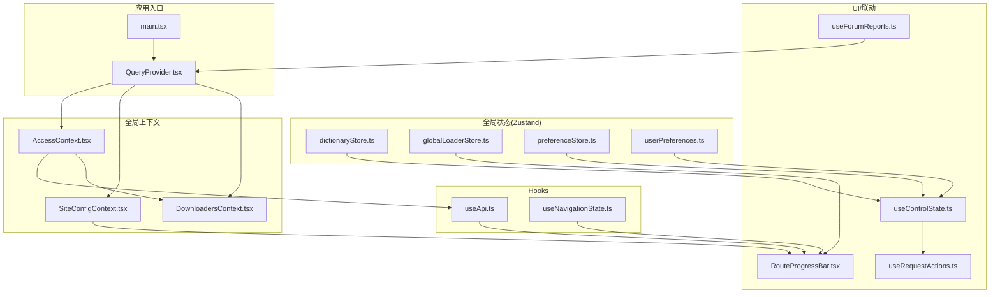
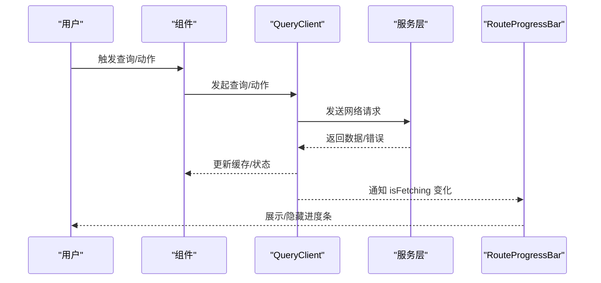
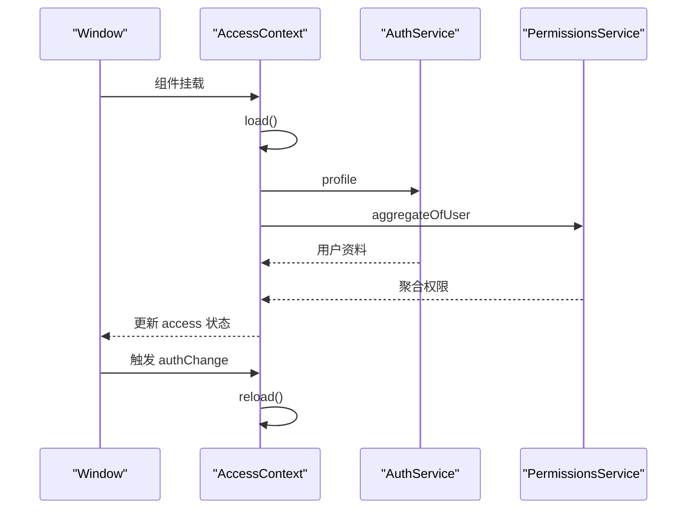
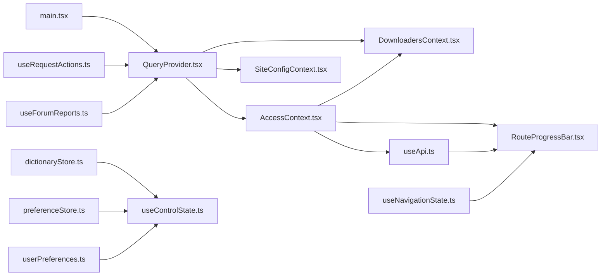

# 状态管理

<cite>
**本文档引用的文件**
- [src/main.tsx](file://src/main.tsx)
- [src/providers/QueryProvider.tsx](file://src/providers/QueryProvider.tsx)
- [src/context/AccessContext.tsx](file://src/context/AccessContext.tsx)
- [src/context/SiteConfigContext.tsx](file://src/context/SiteConfigContext.tsx)
- [src/modules/app/context/DownloadersContext.tsx](file://src/modules/app/context/DownloadersContext.tsx)
- [src/stores/dictionaryStore.ts](file://src/stores/dictionaryStore.ts)
- [src/stores/globalLoaderStore.ts](file://src/stores/globalLoaderStore.ts)
- [src/stores/preferenceStore.ts](file://src/stores/preferenceStore.ts)
- [src/utils/userPreferences.ts](file://src/utils/userPreferences.ts)
- [src/hooks/useApi.ts](file://src/hooks/useApi.ts)
- [src/hooks/useNavigationState.ts](file://src/hooks/useNavigationState.ts)
- [src/modules/app/components/ui/RouteProgressBar.tsx](file://src/modules/app/components/ui/RouteProgressBar.tsx)
- [src/modules/app/pages/Control/hooks/useControlState.ts](file://src/modules/app/pages/Control/hooks/useControlState.ts)
- [src/modules/app/pages/Requests/hooks/useRequestActions.ts](file://src/modules/app/pages/Requests/hooks/useRequestActions.ts)
- [src/modules/forum/pages/Admin/ForumAuditCenter/hooks/useForumReports.ts](file://src/modules/forum/pages/Admin/ForumAuditCenter/hooks/useForumReports.ts)
- [src/modules/admin/layouts/GlobalErrorBoundary/index.tsx](file://src/modules/admin/layouts/GlobalErrorBoundary/index.tsx)
</cite>

## 目录
1. [简介](#简介)
2. [项目结构](#项目结构)
3. [核心组件](#核心组件)
4. [架构总览](#架构总览)
5. [详细组件分析](#详细组件分析)
6. [依赖关系分析](#依赖关系分析)
7. [性能考量](#性能考量)
8. [故障排查指南](#故障排查指南)
9. [结论](#结论)
10. [附录](#附录)

## 简介
本文件系统性梳理本项目的全局状态管理方案，覆盖以下方面：
- React Query 的配置与使用：默认缓存策略、失效与重取、错误处理与重试
- 全局状态管理策略与上下文机制：Access、站点配置、下载器、导航状态等
- 数据缓存策略：staleTime、gcTime、refetch 行为与“秒开”体验
- 查询配置与错误处理流程：统一错误提取、重试次数、失败提示
- 用户状态、偏好设置、下载器状态等不同类型的全局状态管理方式
- 状态同步机制、性能优化技巧与调试方法
- 最佳实践与常见问题解决方案

## 项目结构
围绕状态管理的关键文件分布如下：
- 应用入口与 Provider 注入：main.tsx、QueryProvider.tsx
- 权限与用户状态：AccessContext.tsx
- 站点配置：SiteConfigContext.tsx
- 下载器状态：DownloadersContext.tsx
- 字典与偏好：dictionaryStore.ts、preferenceStore.ts、userPreferences.ts
- 全局加载器：globalLoaderStore.ts
- API 与查询 Hook：useApi.ts、useNavigationState.ts
- 进度条联动：RouteProgressBar.tsx
- 控制台偏好与保存：useControlState.ts
- 请求动作与缓存失效：useRequestActions.ts
- 列表刷新与重试：useForumReports.ts
- 全局错误边界：GlobalErrorBoundary/index.tsx

图表来源
- [src/main.tsx](file://src/main.tsx#L1-L17)
- [src/providers/QueryProvider.tsx](file://src/providers/QueryProvider.tsx#L1-L29)
- [src/context/AccessContext.tsx](file://src/context/AccessContext.tsx#L1-L181)
- [src/context/SiteConfigContext.tsx](file://src/context/SiteConfigContext.tsx#L1-L50)
- [src/modules/app/context/DownloadersContext.tsx](file://src/modules/app/context/DownloadersContext.tsx#L1-L73)
- [src/stores/dictionaryStore.ts](file://src/stores/dictionaryStore.ts#L1-L119)
- [src/stores/globalLoaderStore.ts](file://src/stores/globalLoaderStore.ts#L1-L36)
- [src/stores/preferenceStore.ts](file://src/stores/preferenceStore.ts#L1-L21)
- [src/utils/userPreferences.ts](file://src/utils/userPreferences.ts#L1-L103)
- [src/hooks/useApi.ts](file://src/hooks/useApi.ts#L1-L312)
- [src/hooks/useNavigationState.ts](file://src/hooks/useNavigationState.ts#L1-L137)
- [src/modules/app/components/ui/RouteProgressBar.tsx](file://src/modules/app/components/ui/RouteProgressBar.tsx#L82-L101)
- [src/modules/app/pages/Control/hooks/useControlState.ts](file://src/modules/app/pages/Control/hooks/useControlState.ts#L1-L519)
- [src/modules/app/pages/Requests/hooks/useRequestActions.ts](file://src/modules/app/pages/Requests/hooks/useRequestActions.ts#L1-L35)
- [src/modules/forum/pages/Admin/ForumAuditCenter/hooks/useForumReports.ts](file://src/modules/forum/pages/Admin/ForumAuditCenter/hooks/useForumReports.ts#L48-L61)

章节来源
- [src/main.tsx](file://src/main.tsx#L1-L17)
- [src/providers/QueryProvider.tsx](file://src/providers/QueryProvider.tsx#L1-L29)

## 核心组件
- React Query Provider：统一配置默认查询行为，包括 staleTime、gcTime、refetchOnMount、refetchOnWindowFocus、retry 等，确保“秒开”体验与后台静默更新。
- 访问上下文 AccessContext：集中管理用户角色、权限、头像、加载与错误状态，支持登录/登出事件驱动的自动刷新。
- 站点配置上下文 SiteConfigContext：从后端拉取站点标题、Logo、架构信息等，提供给 UI 使用。
- 下载器上下文 DownloadersContext：基于 Access 上下文与本地 token，按用户变化触发刷新，维护下载器列表与加载状态。
- 字典状态 dictionaryStore：拉取并规范化分类、排序、查询操作符等字典数据，提供按类别与 key 查询 label 的能力。
- 全局加载器 globalLoaderStore：引用计数模式的全局加载指示器，避免并发加载相互影响。
- 偏好状态 preferenceStore 与 userPreferences：前者为 UI 视图模式等状态持久化，后者为用户偏好（成人模式、默认分类等）的本地持久化工具。
- API 与查询 Hook：useApi 提供认证、种子、用户资料等操作；useNavigationState 提供应用内导航深度与前进/后退状态。
- 进度条联动 RouteProgressBar：监听 React Query 的 isFetching 状态与全局加载器，统一展示加载进度。
- 控制台偏好 useControlState：聚合用户偏好、通知、隐私等设置的读取与保存逻辑，结合字典与服务端接口。
- 请求动作 useRequestActions：统一封装求种相关动作，成功后失效相关列表与个人视图缓存。
- 列表刷新 useForumReports：提供分页列表的 refetch 与错误抑制。
- 全局错误边界：捕获渲染异常，提供恢复与刷新按钮。

章节来源
- [src/providers/QueryProvider.tsx](file://src/providers/QueryProvider.tsx#L1-L29)
- [src/context/AccessContext.tsx](file://src/context/AccessContext.tsx#L1-L181)
- [src/context/SiteConfigContext.tsx](file://src/context/SiteConfigContext.tsx#L1-L50)
- [src/modules/app/context/DownloadersContext.tsx](file://src/modules/app/context/DownloadersContext.tsx#L1-L73)
- [src/stores/dictionaryStore.ts](file://src/stores/dictionaryStore.ts#L1-L119)
- [src/stores/globalLoaderStore.ts](file://src/stores/globalLoaderStore.ts#L1-L36)
- [src/stores/preferenceStore.ts](file://src/stores/preferenceStore.ts#L1-L21)
- [src/utils/userPreferences.ts](file://src/utils/userPreferences.ts#L1-L103)
- [src/hooks/useApi.ts](file://src/hooks/useApi.ts#L1-L312)
- [src/hooks/useNavigationState.ts](file://src/hooks/useNavigationState.ts#L1-L137)
- [src/modules/app/components/ui/RouteProgressBar.tsx](file://src/modules/app/components/ui/RouteProgressBar.tsx#L82-L101)
- [src/modules/app/pages/Control/hooks/useControlState.ts](file://src/modules/app/pages/Control/hooks/useControlState.ts#L1-L519)
- [src/modules/app/pages/Requests/hooks/useRequestActions.ts](file://src/modules/app/pages/Requests/hooks/useRequestActions.ts#L1-L35)
- [src/modules/forum/pages/Admin/ForumAuditCenter/hooks/useForumReports.ts](file://src/modules/forum/pages/Admin/ForumAuditCenter/hooks/useForumReports.ts#L48-L61)
- [src/modules/admin/layouts/GlobalErrorBoundary/index.tsx](file://src/modules/admin/layouts/GlobalErrorBoundary/index.tsx#L37-L56)

## 架构总览
React Query 作为数据获取与缓存核心，贯穿页面查询、列表刷新与动作成功后的缓存失效。全局上下文与 Zustand 状态共同承载用户、站点配置、字典与 UI 状态。API Hook 负责具体业务调用与错误处理，RouteProgressBar 与全局加载器提供统一的加载反馈。

图表来源
- [src/providers/QueryProvider.tsx](file://src/providers/QueryProvider.tsx#L1-L29)
- [src/modules/app/components/ui/RouteProgressBar.tsx](file://src/modules/app/components/ui/RouteProgressBar.tsx#L82-L101)

## 详细组件分析

### React Query Provider 配置与使用
- 默认查询行为
  - staleTime: 0，确保数据在窗口聚焦或组件挂载时后台静默更新
  - gcTime: 10 分钟，提升“秒开”体验
  - refetchOnMount: true，组件重新挂载时检查更新
  - refetchOnWindowFocus: false，避免频繁标签页切换导致的重复请求
  - retry: 1，失败重试 1 次
- 在应用入口注入 Provider，保证全局生效
- 与 UI 进度条联动：通过 isFetching 监听后台请求状态

章节来源
- [src/providers/QueryProvider.tsx](file://src/providers/QueryProvider.tsx#L1-L29)
- [src/main.tsx](file://src/main.tsx#L1-L17)
- [src/modules/app/components/ui/RouteProgressBar.tsx](file://src/modules/app/components/ui/RouteProgressBar.tsx#L82-L101)

### 访问上下文 AccessContext：用户状态与权限
- 功能要点
  - 从 localStorage 读取 accessToken，决定初始加载状态
  - 并行请求用户资料与聚合权限，兼容不同响应结构
  - 解析 JWT token 中的用户名作为降级显示
  - 监听自定义 authChange 事件，自动重新加载
  - 提供 access、loading、error、reload 方法
- 与下载器上下文协同：下载器刷新依赖 access.username

图表来源
- [src/context/AccessContext.tsx](file://src/context/AccessContext.tsx#L83-L155)

章节来源
- [src/context/AccessContext.tsx](file://src/context/AccessContext.tsx#L1-L181)

### 站点配置上下文 SiteConfigContext：全局站点信息
- 从 SettingsService 拉取分组为 site 的设置项
- 将 key-value 映射为标题、Logo、架构信息
- 提供只读配置给 UI 使用

章节来源
- [src/context/SiteConfigContext.tsx](file://src/context/SiteConfigContext.tsx#L1-L50)

### 下载器上下文 DownloadersContext：下载器状态
- 依赖 AccessContext 与本地 token
- 用户变化时触发刷新
- 成功后写入 downloaders，失败时可选择保留旧数据

章节来源
- [src/modules/app/context/DownloadersContext.tsx](file://src/modules/app/context/DownloadersContext.tsx#L1-L73)

### 字典状态 dictionaryStore：分类与标签映射
- 首次加载：fetchDictionaries 拉取并规范化 categories、userOrderBy、adminSortBy、queryOps
- 提供 getLabelByKey 按类别与 key 查找 label
- 错误处理：记录人类可读错误信息

章节来源
- [src/stores/dictionaryStore.ts](file://src/stores/dictionaryStore.ts#L1-L119)

### 全局加载器 globalLoaderStore：引用计数加载指示器
- startLoading：计数 +1，显示加载器
- finishLoading：计数 -1，计数归零时隐藏
- 与 RouteProgressBar 协同，避免并发加载相互干扰

章节来源
- [src/stores/globalLoaderStore.ts](file://src/stores/globalLoaderStore.ts#L1-L36)

### 偏好状态 preferenceStore 与 userPreferences：用户偏好
- preferenceStore：UI 视图模式等状态持久化（Zustand + persist）
- userPreferences：成人模式、默认种子分类、默认影片类型等本地持久化工具
- 控制台 useControlState：读取/保存偏好，结合字典与服务端接口

章节来源
- [src/stores/preferenceStore.ts](file://src/stores/preferenceStore.ts#L1-L21)
- [src/utils/userPreferences.ts](file://src/utils/userPreferences.ts#L1-L103)
- [src/modules/app/pages/Control/hooks/useControlState.ts](file://src/modules/app/pages/Control/hooks/useControlState.ts#L1-L519)

### API 与查询 Hook：useApi 与 useNavigationState
- useApi
  - 认证：login/register/sendVerificationCode/logout，成功后触发路由配置与导航菜单失效
  - 种子：fetchTorrents/getTorrentById
  - 用户资料：updateProfile/setAvatar/uploadAvatar
  - 统一错误提取与错误抛出
- useNavigationState：应用内导航深度与前进/后退状态，支持 popstate 与自定义按钮导航

章节来源
- [src/hooks/useApi.ts](file://src/hooks/useApi.ts#L1-L312)
- [src/hooks/useNavigationState.ts](file://src/hooks/useNavigationState.ts#L1-L137)

### 进度条联动 RouteProgressBar：统一加载反馈
- 监听 location 变化与 isFetching 变化
- 当后台请求开始时显示进度条，结束时隐藏

章节来源
- [src/modules/app/components/ui/RouteProgressBar.tsx](file://src/modules/app/components/ui/RouteProgressBar.tsx#L82-L101)

### 控制台偏好 useControlState：聚合设置读取与保存
- 读取用户资料、偏好、通知、隐私等
- 保存时按增量比较，仅提交变更字段
- 成功后重新获取分类与全局状态

章节来源
- [src/modules/app/pages/Control/hooks/useControlState.ts](file://src/modules/app/pages/Control/hooks/useControlState.ts#L1-L519)

### 请求动作 useRequestActions：统一动作与缓存失效
- 封装认领/放弃/提交/重提/验收/追加悬赏/发布/取消/重新发布/保存草稿/更新等
- 成功后统一失效请求列表、我的请求、我的回应、争议列表等缓存

章节来源
- [src/modules/app/pages/Requests/hooks/useRequestActions.ts](file://src/modules/app/pages/Requests/hooks/useRequestActions.ts#L1-L35)

### 列表刷新 useForumReports：分页列表的 refetch 与错误抑制
- 提供 load 方法，内部调用 query.refetch 并抑制 throwOnError

章节来源
- [src/modules/forum/pages/Admin/ForumAuditCenter/hooks/useForumReports.ts](file://src/modules/forum/pages/Admin/ForumAuditCenter/hooks/useForumReports.ts#L48-L61)

### 全局错误边界：异常恢复与刷新
- 捕获渲染异常，显示错误信息与恢复/刷新按钮

章节来源
- [src/modules/admin/layouts/GlobalErrorBoundary/index.tsx](file://src/modules/admin/layouts/GlobalErrorBoundary/index.tsx#L37-L56)

## 依赖关系分析
- Provider 注入顺序：main.tsx -> QueryProvider -> App
- AccessContext 为多个上下文与 Hook 的上游依赖（下载器、API Hook 等）
- RouteProgressBar 依赖 QueryClient 的 isFetching 与全局加载器
- 控制台偏好 useControlState 依赖字典 store 与用户服务
- 请求动作 useRequestActions 依赖 QueryClient 进行缓存失效

图表来源
- [src/main.tsx](file://src/main.tsx#L1-L17)
- [src/providers/QueryProvider.tsx](file://src/providers/QueryProvider.tsx#L1-L29)
- [src/context/AccessContext.tsx](file://src/context/AccessContext.tsx#L1-L181)
- [src/context/SiteConfigContext.tsx](file://src/context/SiteConfigContext.tsx#L1-L50)
- [src/modules/app/context/DownloadersContext.tsx](file://src/modules/app/context/DownloadersContext.tsx#L1-L73)
- [src/stores/dictionaryStore.ts](file://src/stores/dictionaryStore.ts#L1-L119)
- [src/stores/preferenceStore.ts](file://src/stores/preferenceStore.ts#L1-L21)
- [src/utils/userPreferences.ts](file://src/utils/userPreferences.ts#L1-L103)
- [src/hooks/useApi.ts](file://src/hooks/useApi.ts#L1-L312)
- [src/hooks/useNavigationState.ts](file://src/hooks/useNavigationState.ts#L1-L137)
- [src/modules/app/components/ui/RouteProgressBar.tsx](file://src/modules/app/components/ui/RouteProgressBar.tsx#L82-L101)
- [src/modules/app/pages/Control/hooks/useControlState.ts](file://src/modules/app/pages/Control/hooks/useControlState.ts#L1-L519)
- [src/modules/app/pages/Requests/hooks/useRequestActions.ts](file://src/modules/app/pages/Requests/hooks/useRequestActions.ts#L1-L35)
- [src/modules/forum/pages/Admin/ForumAuditCenter/hooks/useForumReports.ts](file://src/modules/forum/pages/Admin/ForumAuditCenter/hooks/useForumReports.ts#L48-L61)

## 性能考量
- 缓存策略
  - staleTime=0：即时过期，保证数据新鲜度
  - gcTime=10 分钟：延长缓存生命周期，减少“白屏”时间
  - refetchOnMount=true：组件重新挂载时快速回显缓存并后台更新
  - refetchOnWindowFocus=false：避免频繁切换标签页导致的重复请求
- 并发与引用计数
  - 全局加载器采用引用计数，避免并发加载相互影响
- UI 体验
  - RouteProgressBar 与 isFetching 协同，精准反映后台请求
- 本地持久化
  - preferenceStore 与 userPreferences 降低服务端依赖，提升首开速度

[本节为通用性能建议，不直接分析具体文件]

## 故障排查指南
- 认证失败
  - 检查 useApi.login 的错误提取与抛出，确认 token 写入与 authChange 事件触发
  - 关注 AccessContext 的错误状态与警告日志
- 列表刷新无效
  - 确认 useRequestActions 的缓存失效键是否正确
  - 检查 useForumReports 的 refetch 调用与 throwOnError 抑制
- 下载器为空或不更新
  - 检查 DownloadersContext 的 access.username 依赖与 token 存在性
- 进度条不消失
  - 检查 RouteProgressBar 的 isFetching 监听与定时器清理
- 全局错误
  - 使用 GlobalErrorBoundary 恢复或刷新页面

章节来源
- [src/hooks/useApi.ts](file://src/hooks/useApi.ts#L1-L312)
- [src/context/AccessContext.tsx](file://src/context/AccessContext.tsx#L1-L181)
- [src/modules/app/pages/Requests/hooks/useRequestActions.ts](file://src/modules/app/pages/Requests/hooks/useRequestActions.ts#L1-L35)
- [src/modules/forum/pages/Admin/ForumAuditCenter/hooks/useForumReports.ts](file://src/modules/forum/pages/Admin/ForumAuditCenter/hooks/useForumReports.ts#L48-L61)
- [src/modules/app/context/DownloadersContext.tsx](file://src/modules/app/context/DownloadersContext.tsx#L1-L73)
- [src/modules/app/components/ui/RouteProgressBar.tsx](file://src/modules/app/components/ui/RouteProgressBar.tsx#L82-L101)
- [src/modules/admin/layouts/GlobalErrorBoundary/index.tsx](file://src/modules/admin/layouts/GlobalErrorBoundary/index.tsx#L37-L56)

## 结论
本项目采用“React Query + 上下文 + Zustand”的混合状态管理方案：
- React Query 负责数据获取与缓存，提供统一的 stale/gc/refetch 行为
- 上下文承载用户、站点配置、下载器等跨组件共享状态
- Zustand 承担 UI 状态与本地偏好，配合持久化中间件
- API Hook 与 UI 进度条形成闭环，保障用户体验与可观测性
- 通过统一的动作 Hook 与缓存失效策略，确保状态一致性与性能

[本节为总结性内容，不直接分析具体文件]

## 附录
- 最佳实践
  - 为关键列表设置合理的 staleTime 与 gcTime
  - 使用 QueryClient.invalidateQueries 精准失效相关缓存
  - 在动作成功回调中优先更新缓存，再进行 UI 提示
  - 本地持久化仅用于 UI 体验与降级场景，服务端状态为权威
- 常见问题
  - 重复请求：关闭 refetchOnWindowFocus 或在组件中使用 enabled 控制
  - 白屏：合理设置 gcTime 与 initialData
  - 并发加载冲突：使用全局加载器的引用计数模式

[本节为通用指导，不直接分析具体文件]