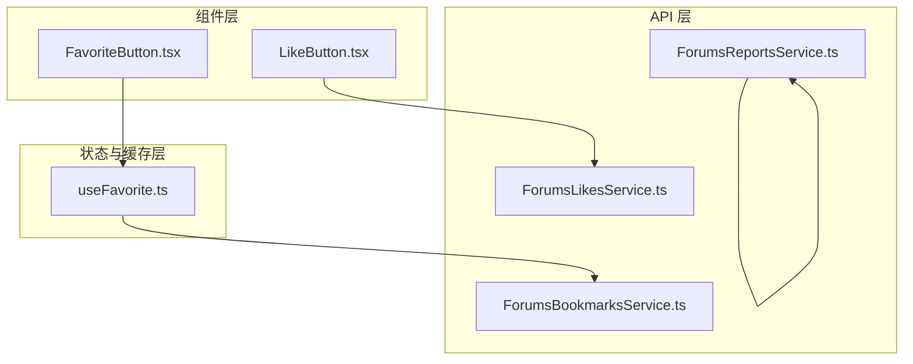
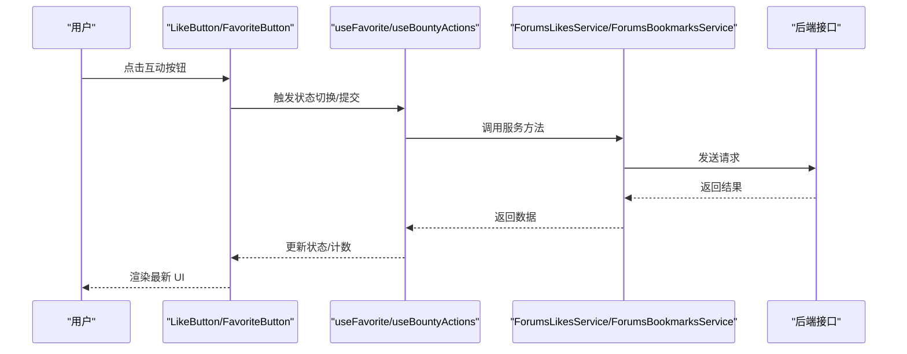
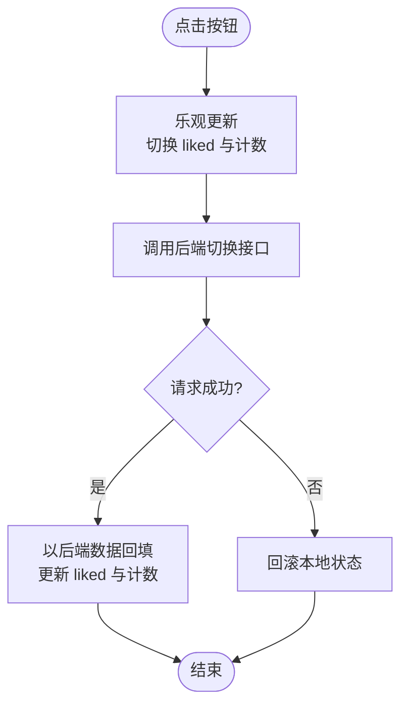
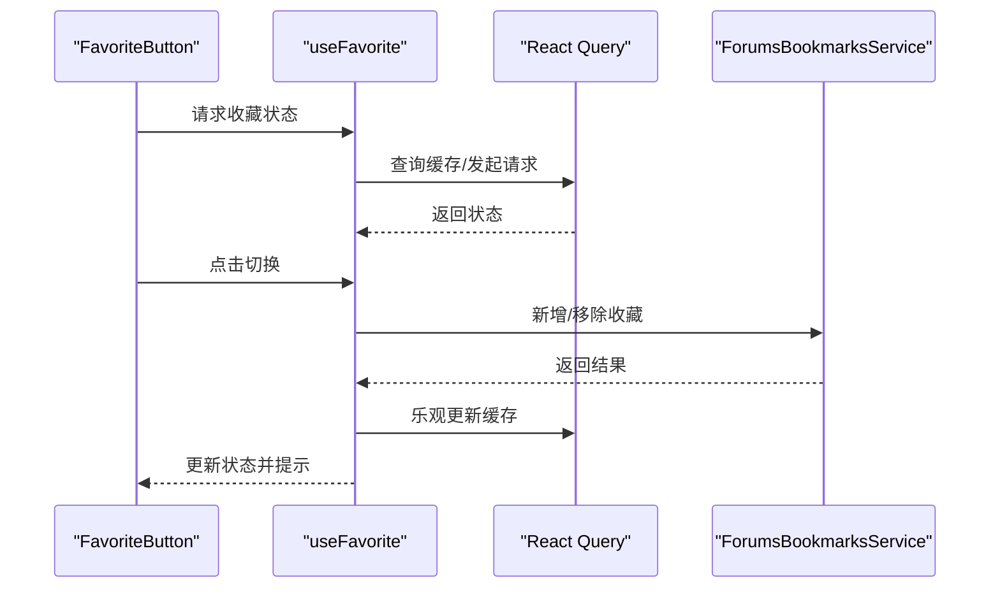
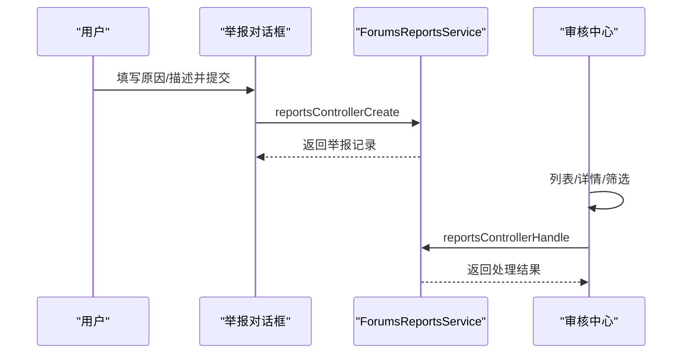
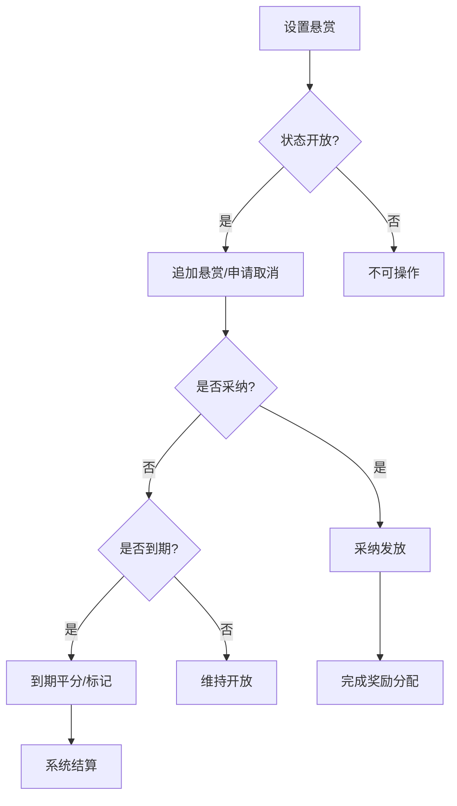
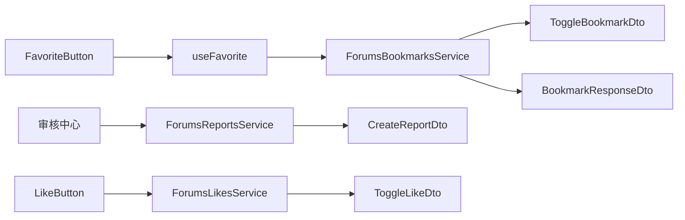

# 内容互动功能

<cite>
**本文引用的文件**
- [LikeButton.tsx](file://src/modules/forum/components/Interaction/LikeButton.tsx)
- [FavoriteButton.tsx](file://src/modules/app/components/FavoriteButton.tsx)
- [useFavorite.ts](file://src/modules/app/hooks/useFavorite.ts)
- [ForumsLikesService.ts](file://src/api/services/ForumsLikesService.ts)
- [ForumsBookmarksService.ts](file://src/api/services/ForumsBookmarksService.ts)
- [ForumsReportsService.ts](file://src/api/services/ForumsReportsService.ts)
- [ToggleLikeDto.ts](file://src/api/models/ToggleLikeDto.ts)
- [ToggleBookmarkDto.ts](file://src/api/models/ToggleBookmarkDto.ts)
- [BookmarkResponseDto.ts](file://src/api/models/BookmarkResponseDto.ts)
- [CreateReportDto.ts](file://src/api/models/CreateReportDto.ts)
- [useForumReports.ts](file://src/modules/forum/pages/Admin/ForumAuditCenter/hooks/useForumReports.ts)
- [useForumBountyCancel.ts](file://src/modules/forum/pages/Admin/ForumAuditCenter/hooks/useForumBountyCancel.ts)
- [useBountyActions.ts](file://src/modules/forum/pages/TopicDetail/hooks/useBountyActions.ts)
- [AwardTopicBountyDto.ts](file://src/api/models/AwardTopicBountyDto.ts)
- [bounty.ts](file://src/modules/forum/types/bounty.ts)
- [forum-topic-bounty.md](file://src/modules/forum/forum-topic-bounty.md)
- [TopicList/index.tsx](file://src/modules/forum/components/TopicList/index.tsx)
- [Home.tsx](file://src/modules/app/pages/Home.tsx)
</cite>

## 目录
1. [简介](#简介)
2. [项目结构](#项目结构)
3. [核心组件](#核心组件)
4. [架构总览](#架构总览)
5. [详细组件分析](#详细组件分析)
6. [依赖关系分析](#依赖关系分析)
7. [性能考量](#性能考量)
8. [故障排查指南](#故障排查指南)
9. [结论](#结论)
10. [附录](#附录)

## 简介
本文件系统化梳理内容互动功能的实现，覆盖用户对帖子的三大核心互动：收藏、点赞、举报；并扩展至赏金系统（话题悬赏）的设计理念、话题悬赏机制与奖励分配规则。文档从架构、组件、数据流、处理逻辑、集成点、错误处理与性能优化等维度展开，并提供状态钩子使用、API 调用模式与错误处理策略的具体示例路径，帮助开发者快速理解与维护。

## 项目结构
围绕内容互动功能的关键模块分布如下：
- 互动组件层：点赞按钮、收藏按钮、举报对话框等 UI 组件
- 状态与缓存层：基于 TanStack Query 的查询与变更钩子
- API 层：自动生成的服务封装，统一调用后端接口
- 类型与契约：模型定义与赏金系统文档规范

图表来源
- [LikeButton.tsx](file://src/modules/forum/components/Interaction/LikeButton.tsx#L1-L117)
- [FavoriteButton.tsx](file://src/modules/app/components/FavoriteButton.tsx#L1-L64)
- [useFavorite.ts](file://src/modules/app/hooks/useFavorite.ts#L1-L76)
- [ForumsLikesService.ts](file://src/api/services/ForumsLikesService.ts#L1-L71)
- [ForumsBookmarksService.ts](file://src/api/services/ForumsBookmarksService.ts#L1-L102)
- [ForumsReportsService.ts](file://src/api/services/ForumsReportsService.ts#L1-L156)

章节来源
- [LikeButton.tsx](file://src/modules/forum/components/Interaction/LikeButton.tsx#L1-L117)
- [FavoriteButton.tsx](file://src/modules/app/components/FavoriteButton.tsx#L1-L64)
- [useFavorite.ts](file://src/modules/app/hooks/useFavorite.ts#L1-L76)
- [ForumsLikesService.ts](file://src/api/services/ForumsLikesService.ts#L1-L71)
- [ForumsBookmarksService.ts](file://src/api/services/ForumsBookmarksService.ts#L1-L102)
- [ForumsReportsService.ts](file://src/api/services/ForumsReportsService.ts#L1-L156)

## 核心组件
- 点赞按钮（LikeButton）：支持话题与回复两种目标类型，内置乐观更新与动画反馈，异步调用后端切换点赞状态并回填最新计数。
- 收藏按钮（FavoriteButton）：基于 useFavorite 钩子，提供收藏状态检查与切换，使用 React Query 缓存与失效策略，确保跨页面一致体验。
- 举报服务（ForumsReportsService）：提供举报创建、管理员待处理列表、处理与统计能力，配合审核中心实现闭环。
- 赏金系统（useBountyActions、useForumBountyCancel、bounty 类型与文档）：围绕话题悬赏的设置、追加、取消申请、采纳发放与到期处理，配套状态机与 UI 交互建议。

章节来源
- [LikeButton.tsx](file://src/modules/forum/components/Interaction/LikeButton.tsx#L1-L117)
- [FavoriteButton.tsx](file://src/modules/app/components/FavoriteButton.tsx#L1-L64)
- [useFavorite.ts](file://src/modules/app/hooks/useFavorite.ts#L1-L76)
- [ForumsReportsService.ts](file://src/api/services/ForumsReportsService.ts#L1-L156)
- [useBountyActions.ts](file://src/modules/forum/pages/TopicDetail/hooks/useBountyActions.ts#L1-L39)
- [useForumBountyCancel.ts](file://src/modules/forum/pages/Admin/ForumAuditCenter/hooks/useForumBountyCancel.ts#L1-L58)
- [bounty.ts](file://src/modules/forum/types/bounty.ts#L1-L20)
- [forum-topic-bounty.md](file://src/modules/forum/forum-topic-bounty.md#L156-L351)

## 架构总览
整体采用“组件 → 钩子/服务 → API 封装 → 后端”的分层调用链路，结合 React Query 实现状态缓存、乐观更新与失效刷新，保证用户体验与一致性。

图表来源
- [LikeButton.tsx](file://src/modules/forum/components/Interaction/LikeButton.tsx#L31-L61)
- [FavoriteButton.tsx](file://src/modules/app/components/FavoriteButton.tsx#L26-L32)
- [useFavorite.ts](file://src/modules/app/hooks/useFavorite.ts#L47-L68)
- [ForumsLikesService.ts](file://src/api/services/ForumsLikesService.ts#L18-L39)
- [ForumsBookmarksService.ts](file://src/api/services/ForumsBookmarksService.ts#L20-L41)

## 详细组件分析

### 点赞功能（LikeButton）
- 状态管理：组件内部维护 liked 与 count，点击时先乐观更新，再异步请求后端校正。
- 动画与反馈：首次点赞触发动画，提升交互感知。
- 异常回滚：请求失败时还原本地状态，避免 UI 不一致。
- 计数同步：以后端返回为准，确保全局计数准确。

图表来源
- [LikeButton.tsx](file://src/modules/forum/components/Interaction/LikeButton.tsx#L31-L61)
- [ForumsLikesService.ts](file://src/api/services/ForumsLikesService.ts#L18-L39)

章节来源
- [LikeButton.tsx](file://src/modules/forum/components/Interaction/LikeButton.tsx#L1-L117)
- [ForumsLikesService.ts](file://src/api/services/ForumsLikesService.ts#L1-L71)
- [ToggleLikeDto.ts](file://src/api/models/ToggleLikeDto.ts#L1-L16)

### 收藏功能（FavoriteButton + useFavorite）
- 状态检查：首次渲染通过查询接口确认收藏状态，支持传入初始值以避免多余请求。
- 切换逻辑：根据当前状态决定新增或移除收藏，使用 Mutation 成功后直接更新缓存并提示。
- 列表刷新：收藏变更后失效“收藏列表”查询，确保其他页面同步。
- 加载态：合并“检查中”与“切换中”状态，避免重复提交。

图表来源
- [FavoriteButton.tsx](file://src/modules/app/components/FavoriteButton.tsx#L26-L32)
- [useFavorite.ts](file://src/modules/app/hooks/useFavorite.ts#L29-L68)
- [ForumsBookmarksService.ts](file://src/api/services/ForumsBookmarksService.ts#L20-L41)

章节来源
- [FavoriteButton.tsx](file://src/modules/app/components/FavoriteButton.tsx#L1-L64)
- [useFavorite.ts](file://src/modules/app/hooks/useFavorite.ts#L1-L76)
- [ForumsBookmarksService.ts](file://src/api/services/ForumsBookmarksService.ts#L1-L102)
- [ToggleBookmarkDto.ts](file://src/api/models/ToggleBookmarkDto.ts#L1-L11)
- [BookmarkResponseDto.ts](file://src/api/models/BookmarkResponseDto.ts#L1-L11)

### 举报功能（举报对话框与审核中心）
- 表单设计：支持原因枚举、描述输入、目标选择（话题/回复），管理员处理支持“通过/驳回”及附加选项（删除内容、锁定话题、处理备注）。
- 审核中心：提供待处理列表、分页与筛选，支持详情抽屉与驳回理由弹窗。
- 数据契约：CreateReportDto、HandleReportDto 等模型定义清晰，便于前后端协作。

图表来源
- [CreateReportDto.ts](file://src/api/models/CreateReportDto.ts#L1-L36)
- [ForumsReportsService.ts](file://src/api/services/ForumsReportsService.ts#L21-L100)
- [useForumReports.ts](file://src/modules/forum/pages/Admin/ForumAuditCenter/hooks/useForumReports.ts#L33-L46)

章节来源
- [CreateReportDto.ts](file://src/api/models/CreateReportDto.ts#L1-L36)
- [ForumsReportsService.ts](file://src/api/services/ForumsReportsService.ts#L1-L156)
- [useForumReports.ts](file://src/modules/forum/pages/Admin/ForumAuditCenter/hooks/useForumReports.ts#L1-L63)

### 赏金系统（话题悬赏）
- 设计理念：通过“悬赏-采纳-到期平分/取消”形成激励闭环，鼓励高质量回答与问题解决。
- 话题悬赏机制：
  - 设置悬赏：作者发起，支持按天或截止时间两种方式。
  - 追加悬赏：在开放状态下允许追加，仅预占余额。
  - 取消申请：作者提交，进入管理员审核。
  - 采纳发放：作者选定最佳回答，完成奖励发放。
  - 到期处理：到期后系统按规则平分或标记状态。
- 奖励分配规则：支持“到期平分”场景下的用户数与人均奖励字段，保障透明与可追溯。
- UI/交互建议：列表徽标、详情区块、轮询刷新策略与扳手菜单操作，详见文档。

图表来源
- [useBountyActions.ts](file://src/modules/forum/pages/TopicDetail/hooks/useBountyActions.ts#L24-L39)
- [AwardTopicBountyDto.ts](file://src/api/models/AwardTopicBountyDto.ts#L1-L15)
- [bounty.ts](file://src/modules/forum/types/bounty.ts#L1-L20)
- [forum-topic-bounty.md](file://src/modules/forum/forum-topic-bounty.md#L156-L351)

章节来源
- [useBountyActions.ts](file://src/modules/forum/pages/TopicDetail/hooks/useBountyActions.ts#L1-L39)
- [AwardTopicBountyDto.ts](file://src/api/models/AwardTopicBountyDto.ts#L1-L15)
- [bounty.ts](file://src/modules/forum/types/bounty.ts#L1-L20)
- [forum-topic-bounty.md](file://src/modules/forum/forum-topic-bounty.md#L156-L351)

## 依赖关系分析
- 组件依赖：LikeButton 直接依赖 ForumsLikesService；FavoriteButton 依赖 useFavorite；useFavorite 依赖 ForumsBookmarksService 与 React Query。
- 管理端依赖：审核中心依赖 ForumsReportsService 与 useForumReports/useForumBountyCancel。
- 类型契约：ToggleLikeDto/ToggleBookmarkDto/BookmarkResponseDto/CreateReportDto 等模型定义贯穿前后端。
- 状态一致性：通过 React Query 的缓存与失效策略，确保跨组件状态一致与最小重绘。

图表来源
- [LikeButton.tsx](file://src/modules/forum/components/Interaction/LikeButton.tsx#L1-L117)
- [FavoriteButton.tsx](file://src/modules/app/components/FavoriteButton.tsx#L1-L64)
- [useFavorite.ts](file://src/modules/app/hooks/useFavorite.ts#L1-L76)
- [ForumsLikesService.ts](file://src/api/services/ForumsLikesService.ts#L1-L71)
- [ForumsBookmarksService.ts](file://src/api/services/ForumsBookmarksService.ts#L1-L102)
- [ForumsReportsService.ts](file://src/api/services/ForumsReportsService.ts#L1-L156)
- [ToggleLikeDto.ts](file://src/api/models/ToggleLikeDto.ts#L1-L16)
- [ToggleBookmarkDto.ts](file://src/api/models/ToggleBookmarkDto.ts#L1-L11)
- [BookmarkResponseDto.ts](file://src/api/models/BookmarkResponseDto.ts#L1-L11)
- [CreateReportDto.ts](file://src/api/models/CreateReportDto.ts#L1-L36)

章节来源
- [LikeButton.tsx](file://src/modules/forum/components/Interaction/LikeButton.tsx#L1-L117)
- [FavoriteButton.tsx](file://src/modules/app/components/FavoriteButton.tsx#L1-L64)
- [useFavorite.ts](file://src/modules/app/hooks/useFavorite.ts#L1-L76)
- [ForumsLikesService.ts](file://src/api/services/ForumsLikesService.ts#L1-L71)
- [ForumsBookmarksService.ts](file://src/api/services/ForumsBookmarksService.ts#L1-L102)
- [ForumsReportsService.ts](file://src/api/services/ForumsReportsService.ts#L1-L156)
- [ToggleLikeDto.ts](file://src/api/models/ToggleLikeDto.ts#L1-L16)
- [ToggleBookmarkDto.ts](file://src/api/models/ToggleBookmarkDto.ts#L1-L11)
- [BookmarkResponseDto.ts](file://src/api/models/BookmarkResponseDto.ts#L1-L11)
- [CreateReportDto.ts](file://src/api/models/CreateReportDto.ts#L1-L36)

## 性能考量
- 乐观更新：点赞与收藏均采用乐观更新，减少等待时间，提升交互流畅度。
- 缓存策略：useFavorite 设置合理的 staleTime，降低重复请求频率；Mutation 成功后直接更新缓存，避免不必要的网络往返。
- 按需加载：举报与悬赏审核列表使用分页与筛选，避免一次性拉取大量数据。
- 轮询刷新：悬赏详情在接近到期时建议轻量轮询，缩短用户等待时间。
- 动画与渲染：点赞按钮的动画仅在首次点赞触发，避免频繁重绘影响性能。

## 故障排查指南
- 点赞失败回滚：若后端返回异常，组件会自动回滚本地状态，同时由全局拦截器统一提示。请检查网络状态与鉴权头。
- 收藏状态不同步：确认 React Query 缓存键一致，必要时手动失效“收藏列表”查询；检查初始值传入是否正确。
- 举报处理无响应：确认管理员权限与处理参数（状态、备注、删除/锁定选项）是否符合后端要求。
- 悬赏操作受限：依据错误码提示（如余额不足、状态不允许、取消审核中等）调整操作时机或联系管理员。
- UI 徽标与状态：列表卡片与详情页徽标应与 bounty 状态保持一致，若不一致，请检查状态机与轮询刷新逻辑。

章节来源
- [LikeButton.tsx](file://src/modules/forum/components/Interaction/LikeButton.tsx#L51-L56)
- [useFavorite.ts](file://src/modules/app/hooks/useFavorite.ts#L56-L68)
- [forum-topic-bounty.md](file://src/modules/forum/forum-topic-bounty.md#L288-L312)

## 结论
内容互动功能通过组件化与钩子化设计，结合 API 封装与缓存策略，实现了点赞、收藏、举报与悬赏的完整闭环。其核心在于“乐观更新 + 缓存一致性 + 明确的错误处理与 UI 提示”。遵循本文提供的实现示例与最佳实践，可在保证用户体验的同时，提升开发效率与系统稳定性。

## 附录
- 列表徽标与详情区块：参考主题卡片与列表组件中的徽标渲染逻辑，确保状态可视化一致。
- 首页悬赏展示：首页聚合展示进行中的悬赏话题，便于用户发现与参与。

章节来源
- [TopicList/index.tsx](file://src/modules/forum/components/TopicList/index.tsx#L300-L319)
- [Home.tsx](file://src/modules/app/pages/Home.tsx#L607-L634)