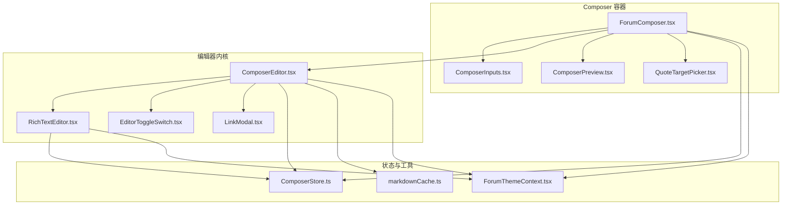
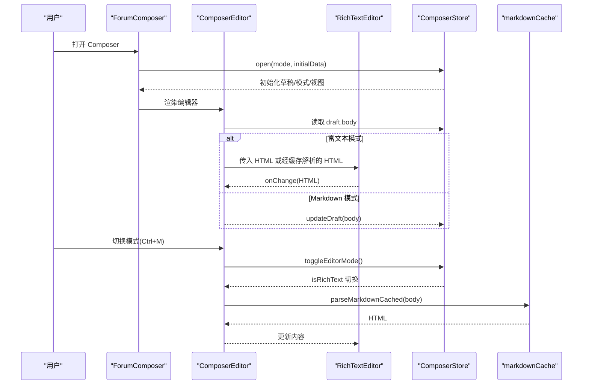
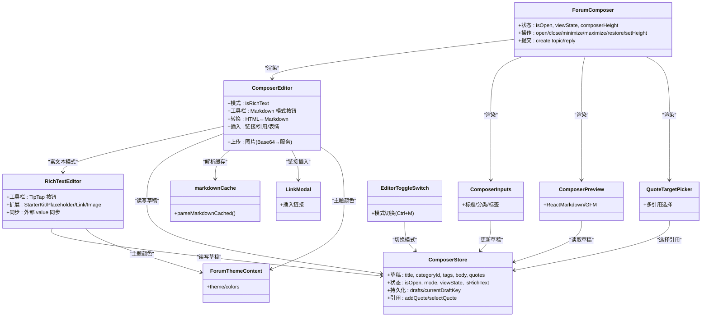

# 富文本编辑器

<cite>
**本文档引用的文件**
- [ComposerEditor.tsx](file://src/modules/forum/components/Composer/ComposerEditor.tsx)
- [RichTextEditor.tsx](file://src/modules/forum/components/Composer/RichTextEditor.tsx)
- [ComposerStore.ts](file://src/modules/forum/components/Composer/ComposerStore.ts)
- [ForumComposer.tsx](file://src/modules/forum/components/Composer/ForumComposer.tsx)
- [ComposerInputs.tsx](file://src/modules/forum/components/Composer/ComposerInputs.tsx)
- [ComposerPreview.tsx](file://src/modules/forum/components/Composer/ComposerPreview.tsx)
- [LinkModal.tsx](file://src/modules/forum/components/Composer/LinkModal.tsx)
- [QuoteTargetPicker.tsx](file://src/modules/forum/components/Composer/QuoteTargetPicker.tsx)
- [EditorToggleSwitch.tsx](file://src/modules/forum/components/Composer/EditorToggleSwitch.tsx)
- [markdownCache.ts](file://src/modules/forum/utils/markdownCache.ts)
- [ForumThemeContext.tsx](file://src/modules/forum/context/ForumThemeContext.tsx)
</cite>

## 目录
1. [简介](#简介)
2. [项目结构](#项目结构)
3. [核心组件](#核心组件)
4. [架构总览](#架构总览)
5. [组件详解](#组件详解)
6. [依赖关系分析](#依赖关系分析)
7. [性能考量](#性能考量)
8. [故障排查指南](#故障排查指南)
9. [结论](#结论)
10. [附录](#附录)

## 简介
本文件面向富文本编辑器“论坛 Composer 组件”的技术文档，系统阐述其架构设计、实现原理与扩展能力。重点覆盖以下方面：
- Markdown 语法支持与实时预览
- 链接插入与引用选择
- 编辑器状态管理与草稿持久化
- 内容序列化与反序列化机制
- 扩展性设计（插件系统、快捷键绑定、自定义工具栏）
- 完整 API 参考（实例方法、事件回调、配置项）
- 使用示例（不同场景下的集成与定制）

## 项目结构
Composer 子系统围绕“编辑器容器 + 编辑器内核 + 状态存储 + 预览与输入”四层构建，配合主题上下文与缓存工具，形成可扩展、可维护的编辑体验。

图表来源
- [ForumComposer.tsx](file://src/modules/forum/components/Composer/ForumComposer.tsx#L1-L404)
- [ComposerEditor.tsx](file://src/modules/forum/components/Composer/ComposerEditor.tsx#L1-L656)
- [RichTextEditor.tsx](file://src/modules/forum/components/Composer/RichTextEditor.tsx#L1-L574)
- [ComposerStore.ts](file://src/modules/forum/components/Composer/ComposerStore.ts#L1-L287)
- [ComposerInputs.tsx](file://src/modules/forum/components/Composer/ComposerInputs.tsx#L1-L232)
- [ComposerPreview.tsx](file://src/modules/forum/components/Composer/ComposerPreview.tsx#L1-L83)
- [LinkModal.tsx](file://src/modules/forum/components/Composer/LinkModal.tsx#L1-L84)
- [QuoteTargetPicker.tsx](file://src/modules/forum/components/Composer/QuoteTargetPicker.tsx#L1-L63)
- [EditorToggleSwitch.tsx](file://src/modules/forum/components/Composer/EditorToggleSwitch.tsx#L1-L117)
- [markdownCache.ts](file://src/modules/forum/utils/markdownCache.ts#L1-L32)
- [ForumThemeContext.tsx](file://src/modules/forum/context/ForumThemeContext.tsx#L1-L68)

章节来源
- [ForumComposer.tsx](file://src/modules/forum/components/Composer/ForumComposer.tsx#L1-L404)
- [ComposerEditor.tsx](file://src/modules/forum/components/Composer/ComposerEditor.tsx#L1-L656)
- [RichTextEditor.tsx](file://src/modules/forum/components/Composer/RichTextEditor.tsx#L1-L574)
- [ComposerStore.ts](file://src/modules/forum/components/Composer/ComposerStore.ts#L1-L287)
- [ComposerInputs.tsx](file://src/modules/forum/components/Composer/ComposerInputs.tsx#L1-L232)
- [ComposerPreview.tsx](file://src/modules/forum/components/Composer/ComposerPreview.tsx#L1-L83)
- [LinkModal.tsx](file://src/modules/forum/components/Composer/LinkModal.tsx#L1-L84)
- [QuoteTargetPicker.tsx](file://src/modules/forum/components/Composer/QuoteTargetPicker.tsx#L1-L63)
- [EditorToggleSwitch.tsx](file://src/modules/forum/components/Composer/EditorToggleSwitch.tsx#L1-L117)
- [markdownCache.ts](file://src/modules/forum/utils/markdownCache.ts#L1-L32)
- [ForumThemeContext.tsx](file://src/modules/forum/context/ForumThemeContext.tsx#L1-L68)

## 核心组件
- 编辑器容器：负责布局、尺寸控制、提交流程、预览切换与多引用目标选择。
- 编辑器内核：提供 Markdown/HTML 双模式编辑、工具栏、快捷键、图片上传、链接插入与引用处理。
- 状态存储：集中管理草稿、模式、视图状态、引用目标等，并持久化至本地存储。
- 预览与输入：Markdown 预览渲染、标题/分类/标签输入区域。
- 主题与缓存：主题上下文注入颜色体系；Markdown 解析缓存降低重复渲染成本。

章节来源
- [ForumComposer.tsx](file://src/modules/forum/components/Composer/ForumComposer.tsx#L17-L404)
- [ComposerEditor.tsx](file://src/modules/forum/components/Composer/ComposerEditor.tsx#L33-L656)
- [RichTextEditor.tsx](file://src/modules/forum/components/Composer/RichTextEditor.tsx#L57-L574)
- [ComposerStore.ts](file://src/modules/forum/components/Composer/ComposerStore.ts#L26-L287)
- [ComposerInputs.tsx](file://src/modules/forum/components/Composer/ComposerInputs.tsx#L24-L232)
- [ComposerPreview.tsx](file://src/modules/forum/components/Composer/ComposerPreview.tsx#L14-L83)
- [markdownCache.ts](file://src/modules/forum/utils/markdownCache.ts#L15-L30)

## 架构总览
编辑器采用“容器-内核-状态-工具”分层架构：
- 容器层：控制布局、交互与业务流程（创建话题/回复）。
- 内核层：提供富文本（TipTap/StarterKit）与 Markdown（Textarea + Turndown）双引擎。
- 状态层：Zustand store 管理草稿、模式、视图与引用目标，持久化。
- 工具层：主题上下文、Markdown 缓存、链接模态框、引用目标选择器、模式切换开关。

图表来源
- [ForumComposer.tsx](file://src/modules/forum/components/Composer/ForumComposer.tsx#L93-L131)
- [ComposerEditor.tsx](file://src/modules/forum/components/Composer/ComposerEditor.tsx#L110-L195)
- [RichTextEditor.tsx](file://src/modules/forum/components/Composer/RichTextEditor.tsx#L72-L102)
- [ComposerStore.ts](file://src/modules/forum/components/Composer/ComposerStore.ts#L93-L207)
- [markdownCache.ts](file://src/modules/forum/utils/markdownCache.ts#L15-L30)

## 组件详解

### ComposerEditor（编辑器内核）
职责与特性：
- 提供 Markdown 与富文本双模式编辑界面。
- Markdown 模式下提供工具栏按钮（粗体、斜体、标题、链接、引用、代码、图片、列表、表情）。
- 富文本模式下基于 TipTap 提供可视化工具栏与内容渲染。
- 支持 Ctrl+M 快速切换模式；模式切换时进行 HTML/Markdown 的双向转换与引用块兼容处理。
- 图片上传：本地读取 Base64 并通过服务接口上传，随后插入 Markdown 或 HTML。
- 链接插入：弹出模态框，支持自定义显示文本与 URL。
- 引用处理：支持 Discourse 风格外链引用 [quote] 标签的识别与转换。

关键实现要点：
- HTML→Markdown 转换器：自定义 Turndown 规则，处理 fenced code block 与 external quote。
- 模式切换流程：监听 isRichText 变化，必要时调用缓存解析器与占位符替换策略。
- 标题循环切换：根据当前行已有 # 数量自动提升/降级标题级别。
- 引用智能切换：对选中文本判断是否已处于引用状态，自动执行包裹/取消包裹。
- 图片插入：Markdown 模式追加 ，富文本模式追加 。

章节来源
- [ComposerEditor.tsx](file://src/modules/forum/components/Composer/ComposerEditor.tsx#L33-L656)
- [RichTextEditor.tsx](file://src/modules/forum/components/Composer/RichTextEditor.tsx#L57-L574)
- [LinkModal.tsx](file://src/modules/forum/components/Composer/LinkModal.tsx#L20-L84)
- [markdownCache.ts](file://src/modules/forum/utils/markdownCache.ts#L15-L30)

### RichTextEditor（富文本内核）
职责与特性：
- 基于 TipTap StarterKit，禁用部分默认扩展，自定义标题层级与样式。
- Placeholder、Link、Image 扩展配置，支持链接属性与图片样式。
- 工具栏按钮：撤销/重做、粗体/斜体/删除线/行内代码、标题、列表、引用块、分隔线、表情、链接、图片。
- 引用块处理：区分外部引用（带用户名格式）与普通引用块，支持嵌套引用的创建与取消。
- 内容同步：当外部 value 变化时，避免焦点丢失地同步编辑器内容。
- 链接插入：弹出模态框，支持选区文本作为默认显示文本。

章节来源
- [RichTextEditor.tsx](file://src/modules/forum/components/Composer/RichTextEditor.tsx#L57-L574)

### ComposerStore（状态存储）
职责与特性：
- 管理 Composer 的打开/最小化/全屏/关闭、高度、模式（Markdown/富文本）、草稿集合与当前草稿键。
- 草稿结构：标题、分类、标签、正文、回复目标（帖子/话题）、引用列表与当前选中引用索引。
- 持久化：使用 Zustand middleware 将 drafts、当前状态与视图状态持久化到本地存储。
- 草稿键规则：按模式与话题 ID 生成唯一键，支持恢复与共享。
- 引用目标选择：支持多引用场景下的目标选择与自动同步。

章节来源
- [ComposerStore.ts](file://src/modules/forum/components/Composer/ComposerStore.ts#L26-L287)

### ForumComposer（编辑器容器）
职责与特性：
- 控制 Composer 的布局、尺寸拖拽、预览显示/隐藏、最小化/最大化/恢复、关闭与提交。
- 提交流程：校验必填字段，调用 API 创建话题或回复，成功后清理草稿并导航到目标页。
- 预览控制：富文本模式或用户手动隐藏时隐藏预览；Markdown 模式下可切换显示。
- 多引用目标选择：当存在多个引用时显示选择器，便于精确回复目标。

章节来源
- [ForumComposer.tsx](file://src/modules/forum/components/Composer/ForumComposer.tsx#L17-L404)

### ComposerInputs（输入区域）
职责与特性：
- 标题输入：全宽输入框，支持粘贴链接自动提取标题。
- 分类选择：下拉选择，动态着色与边框样式。
- 标签选择：按分类限制可选标签，支持多标签选择与移除。
- 与草稿联动：实时更新 draft.title、draft.categoryId、draft.tags。

章节来源
- [ComposerInputs.tsx](file://src/modules/forum/components/Composer/ComposerInputs.tsx#L24-L232)

### ComposerPreview（实时预览）
职责与特性：
- 使用 ReactMarkdown + remark-gfm 渲染 Markdown。
- 自定义代码块高亮：按语言高亮，支持暗/亮主题。
- 性能优化：memo 化 body，避免不必要的重渲染。

章节来源
- [ComposerPreview.tsx](file://src/modules/forum/components/Composer/ComposerPreview.tsx#L14-L83)

### LinkModal（链接模态框）
职责与特性：
- 弹窗输入链接文字与 URL，确认后回调插入链接。
- 支持初始选区文本作为默认显示文本。

章节来源
- [LinkModal.tsx](file://src/modules/forum/components/Composer/LinkModal.tsx#L20-L84)

### QuoteTargetPicker（引用目标选择器）
职责与特性：
- 当存在多个引用时显示下拉菜单，选择具体回复目标（楼层、用户名、内容片段）。
- 与 ComposerStore 的 selectQuote 联动。

章节来源
- [QuoteTargetPicker.tsx](file://src/modules/forum/components/Composer/QuoteTargetPicker.tsx#L9-L63)

### EditorToggleSwitch（模式切换开关）
职责与特性：
- 提供富文本/Markdown 模式切换 UI，支持键盘快捷键 Ctrl+M。
- 样式模拟 Discourse 切换开关，左右分别代表 Markdown 与富文本。

章节来源
- [EditorToggleSwitch.tsx](file://src/modules/forum/components/Composer/EditorToggleSwitch.tsx#L25-L117)

### 主题上下文与缓存工具
- 主题上下文：提供主题切换、颜色变量注入，影响编辑器与工具栏样式。
- Markdown 缓存：LRU 简易实现，减少重复解析开销。

章节来源
- [ForumThemeContext.tsx](file://src/modules/forum/context/ForumThemeContext.tsx#L14-L68)
- [markdownCache.ts](file://src/modules/forum/utils/markdownCache.ts#L15-L30)

## 依赖关系分析

图表来源
- [ForumComposer.tsx](file://src/modules/forum/components/Composer/ForumComposer.tsx#L17-L404)
- [ComposerEditor.tsx](file://src/modules/forum/components/Composer/ComposerEditor.tsx#L33-L656)
- [RichTextEditor.tsx](file://src/modules/forum/components/Composer/RichTextEditor.tsx#L57-L574)
- [ComposerStore.ts](file://src/modules/forum/components/Composer/ComposerStore.ts#L26-L287)
- [ComposerInputs.tsx](file://src/modules/forum/components/Composer/ComposerInputs.tsx#L24-L232)
- [ComposerPreview.tsx](file://src/modules/forum/components/Composer/ComposerPreview.tsx#L14-L83)
- [LinkModal.tsx](file://src/modules/forum/components/Composer/LinkModal.tsx#L20-L84)
- [QuoteTargetPicker.tsx](file://src/modules/forum/components/Composer/QuoteTargetPicker.tsx#L9-L63)
- [EditorToggleSwitch.tsx](file://src/modules/forum/components/Composer/EditorToggleSwitch.tsx#L25-L117)
- [markdownCache.ts](file://src/modules/forum/utils/markdownCache.ts#L15-L30)
- [ForumThemeContext.tsx](file://src/modules/forum/context/ForumThemeContext.tsx#L14-L68)

## 性能考量
- Markdown 解析缓存：使用 Map 维护最近解析结果，超过阈值时淘汰最旧条目，显著降低长文本重复渲染成本。
- 预览渲染优化：ComposerPreview 对 body 进行 memo 化，避免无关变更导致的重渲染。
- 富文本同步策略：RichTextEditor 在编辑器未聚焦时才同步外部 value，避免焦点丢失与光标跳动。
- 图片上传：Base64 本地读取后异步上传，避免阻塞 UI；上传状态禁用图片按钮，防止重复上传。
- 拖拽尺寸：直接操作 DOM 高度，禁用过渡以减少卡顿，结束后再恢复过渡。

章节来源
- [markdownCache.ts](file://src/modules/forum/utils/markdownCache.ts#L15-L30)
- [ComposerPreview.tsx](file://src/modules/forum/components/Composer/ComposerPreview.tsx#L17-L18)
- [RichTextEditor.tsx](file://src/modules/forum/components/Composer/RichTextEditor.tsx#L157-L176)
- [ComposerEditor.tsx](file://src/modules/forum/components/Composer/ComposerEditor.tsx#L310-L358)
- [ForumComposer.tsx](file://src/modules/forum/components/Composer/ForumComposer.tsx#L44-L101)

## 故障排查指南
- 模式切换异常
  - 现象：切换模式后内容错乱或引用块丢失。
  - 排查：检查占位符替换逻辑与正则匹配，确认 [quote] 标签解析与 HTML 注释占位符一致性。
  - 参考：模式切换与引用转换逻辑。
- 富文本光标丢失
  - 现象：点击工具栏按钮后光标跳动或选区丢失。
  - 排查：确认外部 value 同步条件（编辑器未聚焦时才同步），避免 emitUpdate 导致的焦点问题。
  - 参考：富文本内容同步策略。
- 链接插入无效
  - 现象：点击链接按钮无反应或插入错误。
  - 排查：确认 LinkModal 的初始文本与回调参数传递，以及 TipTap 链式命令的执行顺序。
  - 参考：链接插入流程。
- 图片上传失败
  - 现象：选择文件后无响应或报错。
  - 排查：检查 ImagesService 接口返回、Base64 读取与文件名处理；确认上传状态禁用按钮。
  - 参考：图片上传流程。
- 多引用目标未生效
  - 现象：多引用场景下未显示选择器或无法切换目标。
  - 排查：确认 ComposerStore 中 quotes 与 selectedQuoteIndex 的更新，以及 QuoteTargetPicker 的渲染条件。
  - 参考：引用目标选择器。

章节来源
- [ComposerEditor.tsx](file://src/modules/forum/components/Composer/ComposerEditor.tsx#L123-L195)
- [RichTextEditor.tsx](file://src/modules/forum/components/Composer/RichTextEditor.tsx#L157-L176)
- [LinkModal.tsx](file://src/modules/forum/components/Composer/LinkModal.tsx#L36-L42)
- [ComposerEditor.tsx](file://src/modules/forum/components/Composer/ComposerEditor.tsx#L310-L358)
- [QuoteTargetPicker.tsx](file://src/modules/forum/components/Composer/QuoteTargetPicker.tsx#L9-L63)

## 结论
该编辑器通过“容器-内核-状态-工具”的清晰分层，实现了 Markdown 与富文本双模式、实时预览、链接与图片插入、引用选择与多引用目标管理，并以缓存与同步策略保障性能与稳定性。其模块化设计便于扩展插件系统、快捷键绑定与自定义工具栏，满足论坛场景下的多样化需求。

## 附录

### API 参考

- ComposerEditor（编辑器内核）
  - 属性
    - className?: string
  - 方法
    - insertText(before: string, after?: string): void
    - applyHeading(): void
    - handleImageUpload(e: React.ChangeEvent): Promise<void>
    - triggerFileUpload(): void
    - handleLinkClick(): void
    - onLinkConfirm(url: string, text: string): void
  - 事件
    - 模式切换：Ctrl+M
    - 图片上传：触发文件选择并上传
    - 链接插入：打开模态框并回调插入

- RichTextEditor（富文本内核）
  - 属性
    - value: string
    - onChange: (value: string) => void
    - placeholder?: string
    - disabled?: boolean
    - className?: string
    - toolbarPrefix?: React.ReactNode
    - onImageUploadClick?: () => void
    - isUploading?: boolean
  - 工具栏按钮
    - 撤销/重做、粗体/斜体/删除线/行内代码、标题、列表、引用块、分隔线、表情、链接、图片

- ComposerStore（状态存储）
  - 状态
    - isOpen: boolean
    - mode: "CREATE_TOPIC" | "REPLY" | "EDIT"
    - viewState: "NORMAL" | "MINIMIZED" | "FULLSCREEN"
    - composerHeight: number
    - draft: ComposerDraft
    - drafts: Record<string, ComposerDraft>
    - currentDraftKey: string | null
    - isRichText: boolean
    - quotes: QuoteInfo[]
    - selectedQuoteIndex: number
  - 方法
    - open(mode: ComposerMode, initialData?: Partial<ComposerDraft>): void
    - close(): void
    - minimize(): void
    - maximize(): void
    - restore(): void
    - setHeight(height: number): void
    - updateDraft(data: Partial<ComposerDraft>): void
    - discardDraft(): void
    - reset(): void
    - toggleEditorMode(): void
    - appendContent(content: string): void
    - addQuote(quote: QuoteInfo): void
    - selectQuote(index: number): void

- ForumComposer（编辑器容器）
  - 属性
    - 无（通过 store 注入）
  - 方法
    - handleSubmit(): Promise<void>
    - resize handlers（拖拽高度）
  - 事件
    - 提交话题/回复
    - 预览显示/隐藏
    - 最小化/恢复/全屏/关闭

- ComposerInputs（输入区域）
  - 属性
    - 无（通过 store 注入）
  - 方法
    - 标题/分类/标签输入与更新

- ComposerPreview（实时预览）
  - 属性
    - className?: string
  - 方法
    - 渲染 Markdown（GFM + 代码高亮）

- LinkModal（链接模态框）
  - 属性
    - isOpen: boolean
    - onClose: () => void
    - onConfirm: (url: string, text: string) => void
    - initialText?: string

- QuoteTargetPicker（引用目标选择器）
  - 属性
    - 无（通过 store 注入）
  - 方法
    - selectQuote(index: number): void

- EditorToggleSwitch（模式切换开关）
  - 属性
    - isRichText: boolean
    - onToggle: () => void
    - disabled?: boolean
    - className?: string

- markdownCache（Markdown 缓存）
  - 方法
    - parseMarkdownCached(markdown: string): string

- ForumThemeContext（主题上下文）
  - 方法
    - useForumTheme(): { theme, toggleTheme, colors }

章节来源
- [ComposerEditor.tsx](file://src/modules/forum/components/Composer/ComposerEditor.tsx#L29-L656)
- [RichTextEditor.tsx](file://src/modules/forum/components/Composer/RichTextEditor.tsx#L38-L574)
- [ComposerStore.ts](file://src/modules/forum/components/Composer/ComposerStore.ts#L26-L287)
- [ForumComposer.tsx](file://src/modules/forum/components/Composer/ForumComposer.tsx#L17-L404)
- [ComposerInputs.tsx](file://src/modules/forum/components/Composer/ComposerInputs.tsx#L24-L232)
- [ComposerPreview.tsx](file://src/modules/forum/components/Composer/ComposerPreview.tsx#L14-L83)
- [LinkModal.tsx](file://src/modules/forum/components/Composer/LinkModal.tsx#L13-L84)
- [QuoteTargetPicker.tsx](file://src/modules/forum/components/Composer/QuoteTargetPicker.tsx#L9-L63)
- [EditorToggleSwitch.tsx](file://src/modules/forum/components/Composer/EditorToggleSwitch.tsx#L25-L117)
- [markdownCache.ts](file://src/modules/forum/utils/markdownCache.ts#L15-L30)
- [ForumThemeContext.tsx](file://src/modules/forum/context/ForumThemeContext.tsx#L4-L68)

### 使用示例

- 在话题详情页中以“回复”模式打开 Composer
  - 场景：用户点击“回复”按钮，自动填充 replyToTopicId 与 replyToTitle。
  - 步骤：调用 store.open("REPLY", { replyToTopicId, replyToTitle })，Composer 自动恢复草稿并进入最小化状态，拖拽调整高度后点击“发布回复”。

- 在首页创建新话题
  - 场景：用户点击“新建话题”，填写标题、选择分类与标签。
  - 步骤：store.open("CREATE_TOPIC")，填写 ComposerInputs，切换到富文本模式编写正文，点击“发布话题”。

- 插入链接
  - 场景：在 Markdown 模式下选中文本，点击“链接”按钮，弹出模态框输入 URL 与显示文本，确认后插入。

- 多引用场景
  - 场景：引用多个帖子，需要选择具体回复目标。
  - 步骤：ComposerStore.addQuote(...) 添加引用，Composer 自动显示 QuoteTargetPicker，选择目标后回复内容将携带目标信息。

- 自定义工具栏与快捷键
  - 扩展点：在 ComposerEditor/RichTextEditor 中新增按钮与 TipTap 命令；在 ComposerEditor 中注册键盘事件（如 Ctrl+Shift+X）。
  - 注意：富文本模式下需通过 editor.chain().focus().command().run() 保证焦点与选区稳定。

章节来源
- [ForumComposer.tsx](file://src/modules/forum/components/Composer/ForumComposer.tsx#L105-L209)
- [ComposerInputs.tsx](file://src/modules/forum/components/Composer/ComposerInputs.tsx#L98-L111)
- [ComposerEditor.tsx](file://src/modules/forum/components/Composer/ComposerEditor.tsx#L364-L394)
- [ComposerStore.ts](file://src/modules/forum/components/Composer/ComposerStore.ts#L224-L266)