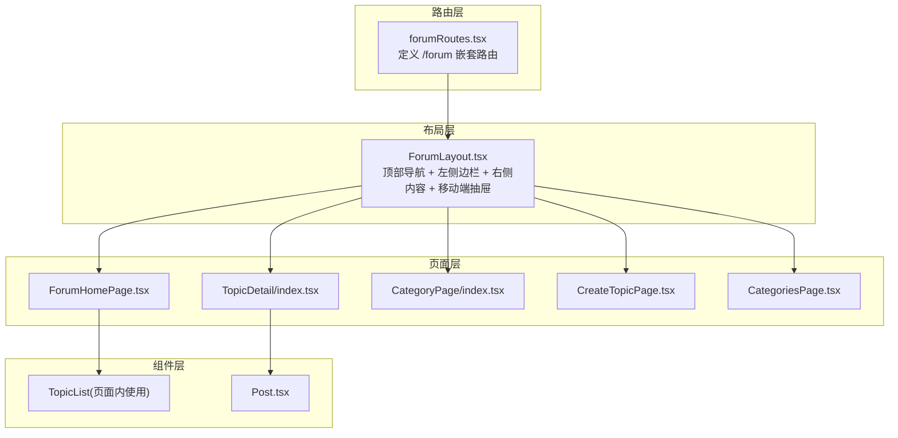
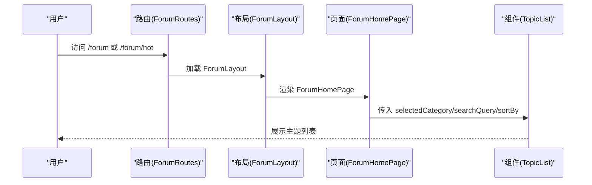
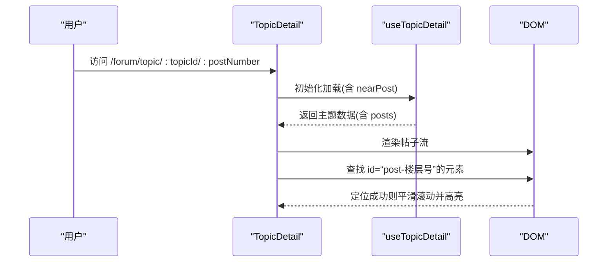
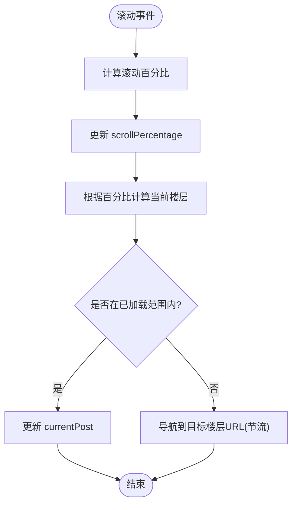
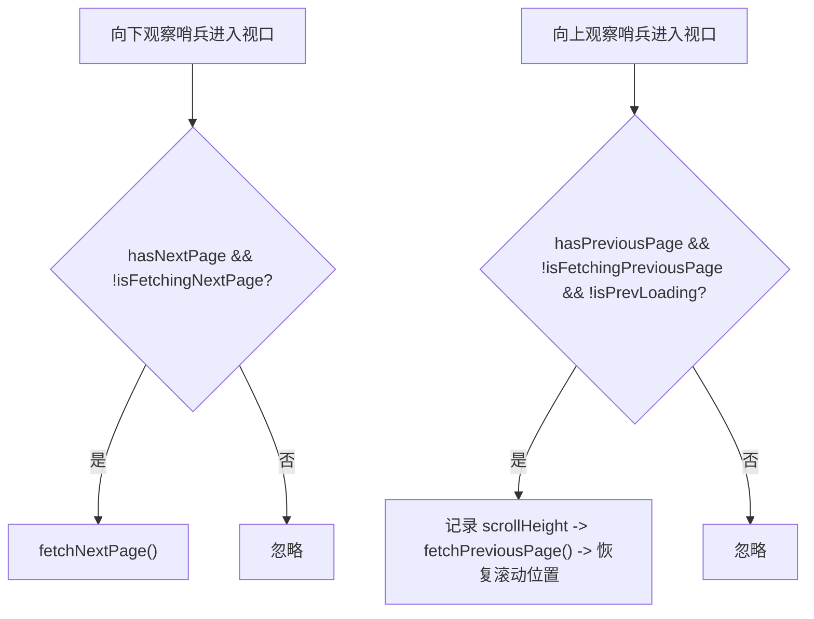
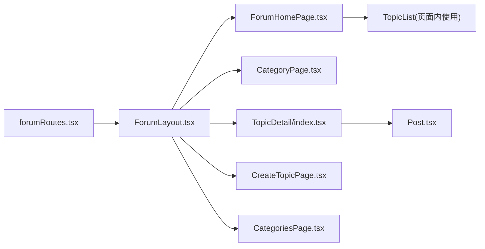

# 讨论区核心功能

<cite>
**本文引用的文件**
- [src/routes/forumRoutes.tsx](file://src/routes/forumRoutes.tsx)
- [src/modules/forum/index.tsx](file://src/modules/forum/index.tsx)
- [src/modules/forum/layouts/ForumLayout.tsx](file://src/modules/forum/layouts/ForumLayout.tsx)
- [src/modules/forum/pages/ForumHomePage.tsx](file://src/modules/forum/pages/ForumHomePage.tsx)
- [src/modules/forum/pages/TopicDetail/index.tsx](file://src/modules/forum/pages/TopicDetail/index.tsx)
- [src/modules/forum/pages/TopicDetail/components/Post.tsx](file://src/modules/forum/pages/TopicDetail/components/Post.tsx)
- [src/modules/forum/pages/CategoryPage/index.tsx](file://src/modules/forum/pages/CategoryPage/index.tsx)
- [src/modules/forum/pages/CategoriesPage.tsx](file://src/modules/forum/pages/CategoriesPage.tsx)
- [src/modules/forum/pages/CreateTopicPage.tsx](file://src/modules/forum/pages/CreateTopicPage.tsx)
- [src/api/models/ForumTopic.ts](file://src/api/models/ForumTopic.ts)
- [src/api/models/ForumCategory.ts](file://src/api/models/ForumCategory.ts)
</cite>

## 目录
1. [简介](#简介)
2. [项目结构](#项目结构)
3. [核心组件](#核心组件)
4. [架构总览](#架构总览)
5. [详细组件分析](#详细组件分析)
6. [依赖关系分析](#依赖关系分析)
7. [性能考量](#性能考量)
8. [故障排查指南](#故障排查指南)
9. [结论](#结论)
10. [附录](#附录)

## 简介
本文件面向讨论区核心功能，系统性阐述论坛首页、主题详情、分类管理等核心页面的实现原理；详解主题创建、编辑、删除的完整流程（含表单校验、富文本编辑器集成与文件附件处理思路）；解释分类系统的层级结构、权限控制与显示逻辑；覆盖主题列表的分页加载、排序筛选与搜索功能；并提供具体代码示例路径，帮助读者快速定位关键组件的使用方法，包括主题卡片、分类导航与侧边栏组件。

## 项目结构
讨论区模块采用独立布局与嵌套路由体系：
- 路由层：定义 /forum 下的多页面路由，统一由 ForumLayout 包裹，支持首页、热门/最新、主题详情、分类、标签、新建话题、类别管理、书签等页面。
- 布局层：ForumLayout 提供顶部导航、左侧固定侧栏、右侧内容区域与移动端抽屉菜单；通过上下文传递选中分类与搜索关键词。
- 页面层：各页面组件按职责拆分，如 ForumHomePage、TopicDetail、CategoryPage、CreateTopicPage、CategoriesPage 等。
- 组件层：共享组件 TopicList、Post 等在页面间复用；主题详情页内再细分子组件（如 Post、Timeline、TopicHeader 等）。

图表来源
- [src/routes/forumRoutes.tsx](file://src/routes/forumRoutes.tsx#L57-L105)
- [src/modules/forum/layouts/ForumLayout.tsx](file://src/modules/forum/layouts/ForumLayout.tsx#L38-L83)
- [src/modules/forum/pages/ForumHomePage.tsx](file://src/modules/forum/pages/ForumHomePage.tsx#L9-L26)
- [src/modules/forum/pages/TopicDetail/index.tsx](file://src/modules/forum/pages/TopicDetail/index.tsx#L389-L500)
- [src/modules/forum/pages/CategoryPage/index.tsx](file://src/modules/forum/pages/CategoryPage/index.tsx#L85-L102)
- [src/modules/forum/pages/CreateTopicPage.tsx](file://src/modules/forum/pages/CreateTopicPage.tsx#L220-L369)
- [src/modules/forum/pages/CategoriesPage.tsx](file://src/modules/forum/pages/CategoriesPage.tsx#L61-L246)

章节来源
- [src/routes/forumRoutes.tsx](file://src/routes/forumRoutes.tsx#L1-L106)
- [src/modules/forum/index.tsx](file://src/modules/forum/index.tsx#L1-L45)
- [src/modules/forum/layouts/ForumLayout.tsx](file://src/modules/forum/layouts/ForumLayout.tsx#L1-L109)

## 核心组件
- 论坛布局 ForumLayout：集中管理选中分类、搜索词、移动端菜单开关；为子路由提供上下文。
- 论坛首页 ForumHomePage：根据路径判断热门/最新，透传到 TopicList。
- 主题详情 TopicDetail：加载主题与帖子流，支持 Discourse 风格楼层跳转、滚动百分比联动、无限滚动加载前后页。
- 分类页面 CategoryPage：按分类 Key 查询分类详情，解析排序参数，渲染 TopicList。
- 新建话题 CreateTopicPage：富文本工具栏、Markdown 预览、标签输入、表单校验与提交。
- 分类概览 CategoriesPage：展示分类列表、统计占位、权限控制、删除与新增弹窗。
- 共享组件：TopicList（页面内使用）、Post（主题详情内使用）。

章节来源
- [src/modules/forum/layouts/ForumLayout.tsx](file://src/modules/forum/layouts/ForumLayout.tsx#L24-L83)
- [src/modules/forum/pages/ForumHomePage.tsx](file://src/modules/forum/pages/ForumHomePage.tsx#L9-L26)
- [src/modules/forum/pages/TopicDetail/index.tsx](file://src/modules/forum/pages/TopicDetail/index.tsx#L20-L500)
- [src/modules/forum/pages/CategoryPage/index.tsx](file://src/modules/forum/pages/CategoryPage/index.tsx#L18-L102)
- [src/modules/forum/pages/CreateTopicPage.tsx](file://src/modules/forum/pages/CreateTopicPage.tsx#L123-L369)
- [src/modules/forum/pages/CategoriesPage.tsx](file://src/modules/forum/pages/CategoriesPage.tsx#L18-L246)
- [src/modules/forum/pages/TopicDetail/components/Post.tsx](file://src/modules/forum/pages/TopicDetail/components/Post.tsx#L17-L184)

## 架构总览
讨论区采用“路由 -> 布局 -> 页面 -> 组件”的分层架构，数据流主要通过 React Query 与自定义 Hook 实现，UI 主题通过上下文注入。

图表来源
- [src/routes/forumRoutes.tsx](file://src/routes/forumRoutes.tsx#L57-L105)
- [src/modules/forum/layouts/ForumLayout.tsx](file://src/modules/forum/layouts/ForumLayout.tsx#L38-L83)
- [src/modules/forum/pages/ForumHomePage.tsx](file://src/modules/forum/pages/ForumHomePage.tsx#L9-L26)

## 详细组件分析

### 论坛首页：ForumHomePage
- 功能要点
  - 通过路径判断热门/最新排序策略。
  - 从布局上下文读取选中分类与搜索词，透传给 TopicList。
  - 点击主题项跳转至主题详情页。
- 关键行为
  - 路径末尾为 “/hot” 时设置排序为热门；否则为最新。
  - 使用 useOutletContext 获取 selectedCategory 与 searchQuery。
- 示例路径
  - [ForumHomePage 渲染与参数传递](file://src/modules/forum/pages/ForumHomePage.tsx#L9-L26)

章节来源
- [src/modules/forum/pages/ForumHomePage.tsx](file://src/modules/forum/pages/ForumHomePage.tsx#L9-L26)

### 主题详情：TopicDetail
- 功能要点
  - 通过 useParams 获取 topicId 与目标楼层号 postNumber，支持 Discourse 风格楼层跳转。
  - 使用自定义 Hook useTopicDetail 获取主题数据、分页加载状态与更新函数。
  - 滚动监听计算当前楼层，支持百分比滚动与自动导航。
  - 无限滚动：向上/向下分别观察哨兵元素，触发前后页加载。
  - 编辑：作者可打开编辑模态框修改标题、分类、标签与首楼内容。
- 关键流程（Discourse 风格楼层跳转）

图表来源
- [src/modules/forum/pages/TopicDetail/index.tsx](file://src/modules/forum/pages/TopicDetail/index.tsx#L24-L117)

- 关键流程（滚动百分比联动）

图表来源
- [src/modules/forum/pages/TopicDetail/index.tsx](file://src/modules/forum/pages/TopicDetail/index.tsx#L134-L186)

- 关键流程（无限滚动加载）

图表来源
- [src/modules/forum/pages/TopicDetail/index.tsx](file://src/modules/forum/pages/TopicDetail/index.tsx#L276-L352)

- 示例路径
  - [主题详情主组件与编辑模态框](file://src/modules/forum/pages/TopicDetail/index.tsx#L20-L500)
  - [帖子组件 Post（渲染与交互）](file://src/modules/forum/pages/TopicDetail/components/Post.tsx#L32-L184)

章节来源
- [src/modules/forum/pages/TopicDetail/index.tsx](file://src/modules/forum/pages/TopicDetail/index.tsx#L20-L500)
- [src/modules/forum/pages/TopicDetail/components/Post.tsx](file://src/modules/forum/pages/TopicDetail/components/Post.tsx#L17-L184)

### 分类页面：CategoryPage
- 功能要点
  - 通过分类 Key 查询分类详情，提取内部 ID 用于筛选主题列表。
  - 解析排序参数（默认最新，支持热门）。
  - 渲染 CategoryHeader 与 TopicList，并处理分类不存在的友好提示。
- 示例路径
  - [分类页面查询与渲染](file://src/modules/forum/pages/CategoryPage/index.tsx#L18-L102)

章节来源
- [src/modules/forum/pages/CategoryPage/index.tsx](file://src/modules/forum/pages/CategoryPage/index.tsx#L18-L102)

### 分类概览：CategoriesPage
- 功能要点
  - 展示分类列表，桌面端显示统计占位，移动端显示简要统计。
  - 权限控制：仅管理员或具备删除权限的用户显示编辑/删除按钮。
  - 删除确认对话框：调用后端删除接口并失效缓存。
  - 新增类别弹窗：触发 CategoryCreateModal。
- 示例路径
  - [分类列表与权限控制](file://src/modules/forum/pages/CategoriesPage.tsx#L18-L246)

章节来源
- [src/modules/forum/pages/CategoriesPage.tsx](file://src/modules/forum/pages/CategoriesPage.tsx#L18-L246)

### 新建话题：CreateTopicPage
- 功能要点
  - 富文本工具栏：模拟 Discourse 风格，支持加粗、斜体、链接、引用、代码块、列表、图片插入。
  - Markdown 预览：简单渲染器用于实时预览。
  - 标签输入：支持回车与逗号分隔添加，支持退格删除最后一个。
  - 表单校验：标题、分类、内容必填。
  - 提交流程：模拟 API 调用，成功后跳转回论坛首页。
- 示例路径
  - [富文本工具栏与预览](file://src/modules/forum/pages/CreateTopicPage.tsx#L21-L121)
  - [表单校验与提交](file://src/modules/forum/pages/CreateTopicPage.tsx#L135-L172)
  - [标签输入与删除](file://src/modules/forum/pages/CreateTopicPage.tsx#L203-L218)

章节来源
- [src/modules/forum/pages/CreateTopicPage.tsx](file://src/modules/forum/pages/CreateTopicPage.tsx#L123-L369)

### 分类系统与权限控制
- 分类模型
  - 字段包含名称、Key、描述、图标、颜色、排序权重、激活状态、允许公共标签、锁定状态等。
- 权限控制
  - 分类概览页对管理操作进行权限判定，支持管理员与特定权限角色。
- 示例路径
  - [分类模型定义](file://src/api/models/ForumCategory.ts#L5-L42)
  - [分类概览权限控制](file://src/modules/forum/pages/CategoriesPage.tsx#L24-L30)

章节来源
- [src/api/models/ForumCategory.ts](file://src/api/models/ForumCategory.ts#L5-L42)
- [src/modules/forum/pages/CategoriesPage.tsx](file://src/modules/forum/pages/CategoriesPage.tsx#L24-L30)

### 主题列表：分页加载、排序筛选与搜索
- 分页加载
  - TopicDetail 使用 React Query 与自定义 Hook，通过 hasNextPage/hasPreviousPage 控制无限滚动。
- 排序筛选
  - ForumHomePage 根据路径决定热门/最新；CategoryPage 解析 sortBy 参数。
- 搜索
  - ForumLayout 通过 Header 接收搜索词并写入上下文，页面组件读取后参与筛选。
- 示例路径
  - [主题详情分页与排序](file://src/modules/forum/pages/TopicDetail/index.tsx#L43-L56)
  - [首页排序策略](file://src/modules/forum/pages/ForumHomePage.tsx#L14-L14)
  - [分类页面排序解析](file://src/modules/forum/pages/CategoryPage/index.tsx#L80-L83)
  - [布局上下文传递](file://src/modules/forum/layouts/ForumLayout.tsx#L24-L28)

章节来源
- [src/modules/forum/pages/TopicDetail/index.tsx](file://src/modules/forum/pages/TopicDetail/index.tsx#L43-L56)
- [src/modules/forum/pages/ForumHomePage.tsx](file://src/modules/forum/pages/ForumHomePage.tsx#L14-L14)
- [src/modules/forum/pages/CategoryPage/index.tsx](file://src/modules/forum/pages/CategoryPage/index.tsx#L80-L83)
- [src/modules/forum/layouts/ForumLayout.tsx](file://src/modules/forum/layouts/ForumLayout.tsx#L24-L28)

### 主题创建、编辑、删除流程（含表单验证、富文本与附件）
- 创建流程
  - 表单验证：标题、分类、内容必填。
  - 富文本：工具栏插入 Markdown 片段；预览渲染。
  - 提交：模拟 API 调用，成功后跳转首页。
- 编辑流程
  - 作者可打开编辑模态框修改标题、分类、标签与首楼内容；编辑完成后刷新主题数据。
- 删除流程
  - 分类概览页支持删除类别，删除前确认，调用后端接口并失效缓存。
- 附件处理
  - 当前页面未直接展示附件上传组件；建议在 ComposerStore 或独立上传组件中实现文件上传与绑定。
- 示例路径
  - [创建表单与校验](file://src/modules/forum/pages/CreateTopicPage.tsx#L135-L172)
  - [富文本工具栏](file://src/modules/forum/pages/CreateTopicPage.tsx#L21-L51)
  - [主题编辑模态框](file://src/modules/forum/pages/TopicDetail/index.tsx#L486-L497)
  - [分类删除与缓存失效](file://src/modules/forum/pages/CategoriesPage.tsx#L227-L235)

章节来源
- [src/modules/forum/pages/CreateTopicPage.tsx](file://src/modules/forum/pages/CreateTopicPage.tsx#L123-L369)
- [src/modules/forum/pages/TopicDetail/index.tsx](file://src/modules/forum/pages/TopicDetail/index.tsx#L486-L497)
- [src/modules/forum/pages/CategoriesPage.tsx](file://src/modules/forum/pages/CategoriesPage.tsx#L227-L235)

### 主题卡片、分类导航与侧边栏组件
- 主题卡片
  - TopicList 在页面内使用，负责渲染主题列表项与交互（点击跳转详情）。
- 分类导航
  - ForumLayout 内部包含 Sidebar，负责分类选择与移动端抽屉菜单。
- 侧边栏
  - 固定定位，独立滚动，响应式布局。
- 示例路径
  - [主题卡片使用（页面内）](file://src/modules/forum/pages/ForumHomePage.tsx#L17-L24)
  - [分类导航与侧边栏](file://src/modules/forum/layouts/ForumLayout.tsx#L64-L69)
  - [移动端抽屉菜单](file://src/modules/forum/layouts/ForumLayout.tsx#L52-L57)

章节来源
- [src/modules/forum/pages/ForumHomePage.tsx](file://src/modules/forum/pages/ForumHomePage.tsx#L17-L24)
- [src/modules/forum/layouts/ForumLayout.tsx](file://src/modules/forum/layouts/ForumLayout.tsx#L52-L69)

## 依赖关系分析
- 路由依赖：forumRoutes.tsx 定义 /forum 嵌套路由，依赖 ForumLayout 与各页面组件。
- 布局依赖：ForumLayout 依赖 Header、Sidebar、MobileSidebarDrawer、ForumComposer、主题上下文。
- 页面依赖：ForumHomePage、CategoryPage、TopicDetail、CreateTopicPage、CategoriesPage 依赖共享组件与 API 服务。
- 组件依赖：TopicDetail 内部组件（Post、Timeline、TopicHeader 等）依赖主题上下文与访问上下文。

图表来源
- [src/routes/forumRoutes.tsx](file://src/routes/forumRoutes.tsx#L57-L105)
- [src/modules/forum/layouts/ForumLayout.tsx](file://src/modules/forum/layouts/ForumLayout.tsx#L38-L83)
- [src/modules/forum/pages/ForumHomePage.tsx](file://src/modules/forum/pages/ForumHomePage.tsx#L9-L26)
- [src/modules/forum/pages/CategoryPage/index.tsx](file://src/modules/forum/pages/CategoryPage/index.tsx#L85-L102)
- [src/modules/forum/pages/TopicDetail/index.tsx](file://src/modules/forum/pages/TopicDetail/index.tsx#L389-L500)
- [src/modules/forum/pages/CreateTopicPage.tsx](file://src/modules/forum/pages/CreateTopicPage.tsx#L220-L369)
- [src/modules/forum/pages/CategoriesPage.tsx](file://src/modules/forum/pages/CategoriesPage.tsx#L61-L246)

章节来源
- [src/routes/forumRoutes.tsx](file://src/routes/forumRoutes.tsx#L57-L105)
- [src/modules/forum/layouts/ForumLayout.tsx](file://src/modules/forum/layouts/ForumLayout.tsx#L38-L83)

## 性能考量
- 无限滚动优化
  - 向上/向下分别使用 IntersectionObserver，阈值与 margin 调整减少过度触发。
  - 向上加载时记录并恢复滚动高度，避免滚动位置抖动。
- 滚动百分比联动
  - 基于容器滚动高度计算百分比，结合目标楼层导航，降低 DOM 查询成本。
- 懒加载与骨架屏
  - 路由与布局使用 Suspense 与进度条，提升感知性能。
- 缓存与失效
  - 删除分类后主动失效相关查询缓存，保证界面一致性。

## 故障排查指南
- 主题详情无法跳转到指定楼层
  - 检查目标楼层元素是否存在；确认 Discourse 风格跳转逻辑与尝试次数。
  - 参考路径：[楼层跳转与高亮](file://src/modules/forum/pages/TopicDetail/index.tsx#L83-L117)
- 滚动百分比不准确
  - 确认滚动容器 ID 与滚动高度计算；检查 isProgrammaticScroll 标志避免递归触发。
  - 参考路径：[百分比滚动处理](file://src/modules/forum/pages/TopicDetail/index.tsx#L134-L186)
- 无限滚动未触发
  - 检查哨兵元素是否在视口内、hasNextPage/hasPreviousPage 状态与 isFetching 标志。
  - 参考路径：[向下/向上观察器](file://src/modules/forum/pages/TopicDetail/index.tsx#L276-L352)
- 分类删除后列表未更新
  - 确认删除后是否调用 queryClient.invalidateQueries 使缓存失效。
  - 参考路径：[删除与缓存失效](file://src/modules/forum/pages/CategoriesPage.tsx#L227-L235)
- 新建话题提交失败
  - 检查表单校验逻辑与模拟 API 调用错误处理。
  - 参考路径：[表单校验与提交](file://src/modules/forum/pages/CreateTopicPage.tsx#L135-L172)

章节来源
- [src/modules/forum/pages/TopicDetail/index.tsx](file://src/modules/forum/pages/TopicDetail/index.tsx#L83-L117)
- [src/modules/forum/pages/TopicDetail/index.tsx](file://src/modules/forum/pages/TopicDetail/index.tsx#L134-L186)
- [src/modules/forum/pages/TopicDetail/index.tsx](file://src/modules/forum/pages/TopicDetail/index.tsx#L276-L352)
- [src/modules/forum/pages/CategoriesPage.tsx](file://src/modules/forum/pages/CategoriesPage.tsx#L227-L235)
- [src/modules/forum/pages/CreateTopicPage.tsx](file://src/modules/forum/pages/CreateTopicPage.tsx#L135-L172)

## 结论
讨论区核心功能围绕“路由 -> 布局 -> 页面 -> 组件”的清晰分层展开，配合 React Query 实现高效的数据加载与缓存管理；主题详情页实现了接近 Discourse 的交互体验（楼层跳转、滚动百分比联动、无限滚动）；分类系统具备权限控制与友好的管理界面；新建话题页面集成富文本工具栏与标签输入，满足基础创作需求。后续可在编辑与删除流程中接入真实 API，并完善附件上传与绑定机制。

## 附录
- 模型参考
  - [主题模型 ForumTopic](file://src/api/models/ForumTopic.ts#L5-L58)
  - [分类模型 ForumCategory](file://src/api/models/ForumCategory.ts#L5-L42)
- 模块入口
  - [论坛模块导出清单](file://src/modules/forum/index.tsx#L29-L45)