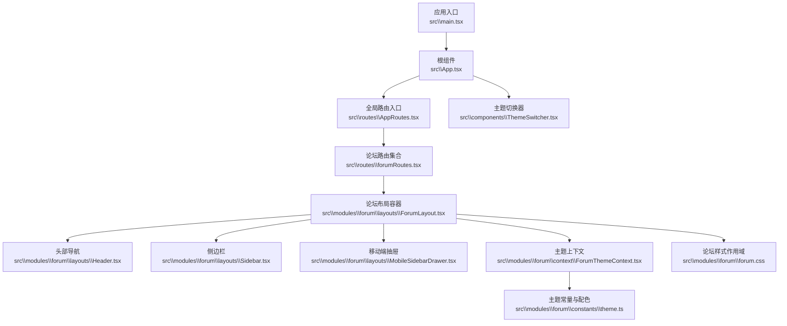
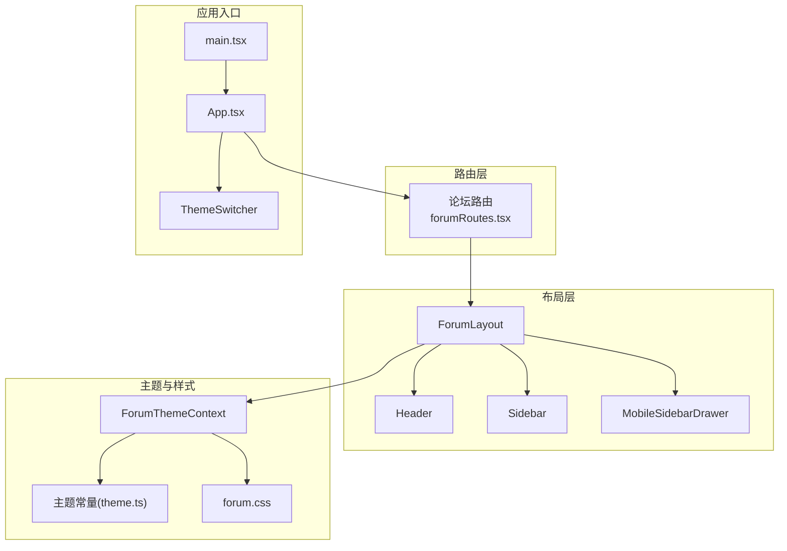
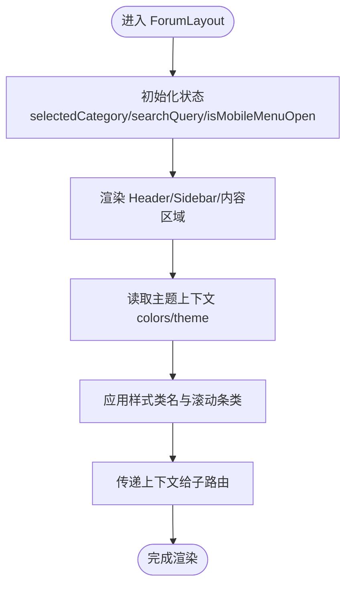
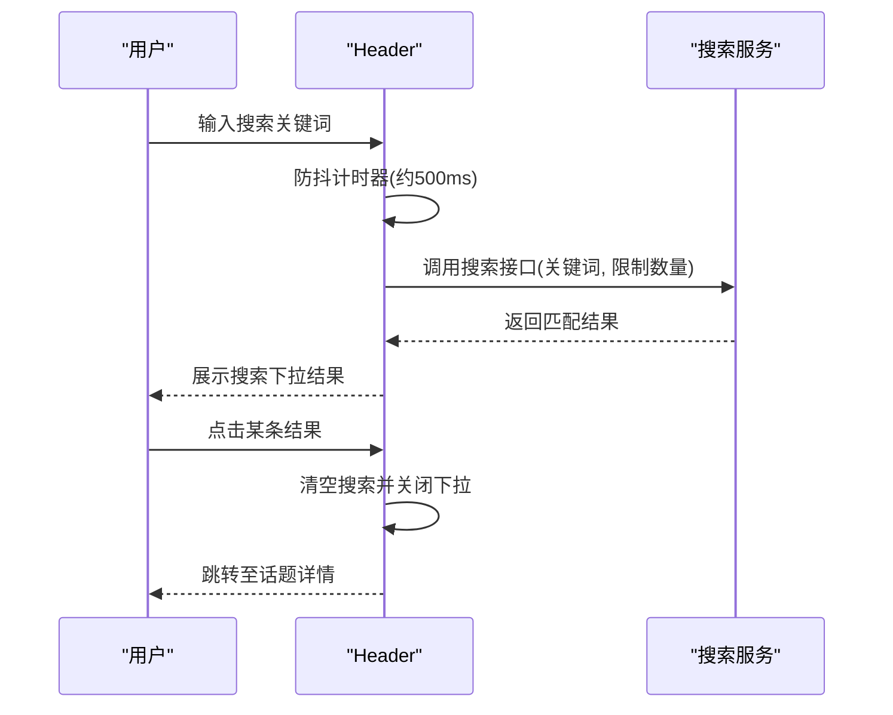
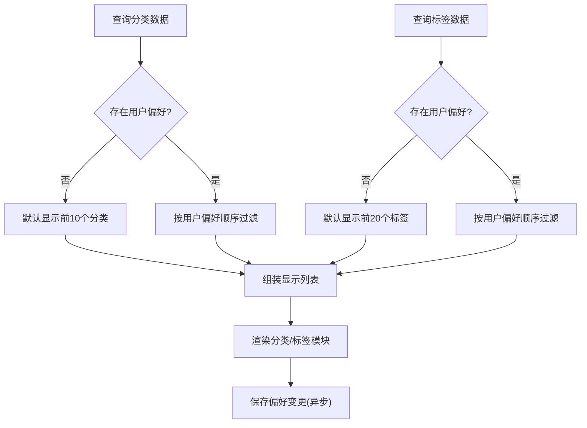
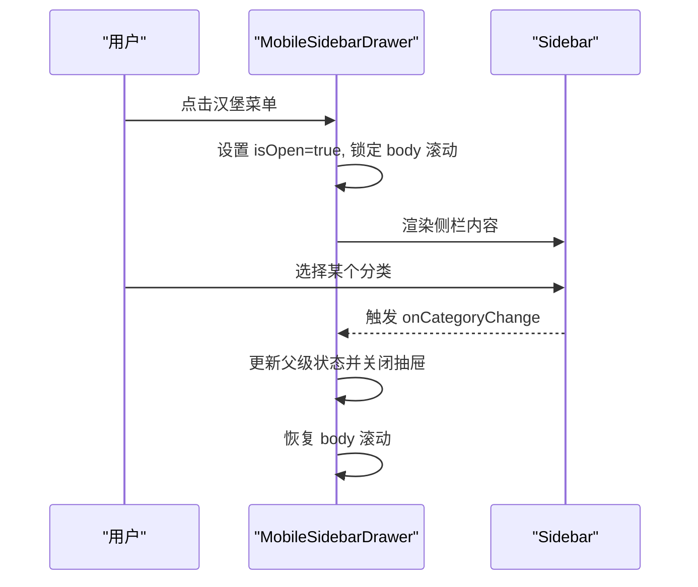
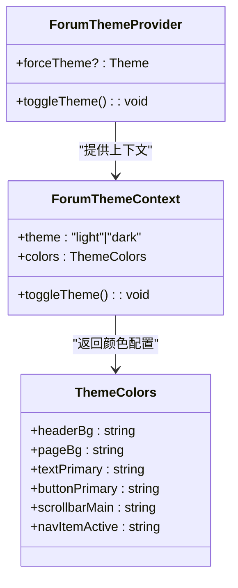
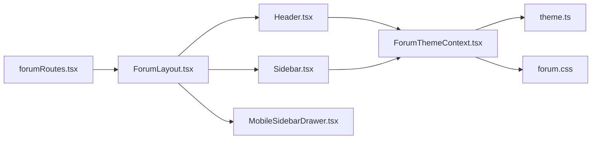

# 论坛布局与导航

<cite>
**本文引用的文件**
- [src\App.tsx](file://src\App.tsx)
- [src\main.tsx](file://src\main.tsx)
- [src\routes\AppRoutes.tsx](file://src\routes\AppRoutes.tsx)
- [src\routes\forumRoutes.tsx](file://src\routes\forumRoutes.tsx)
- [src\modules\forum\index.tsx](file://src\modules\forum\index.tsx)
- [src\modules\forum\layouts\ForumLayout.tsx](file://src\modules\forum\layouts\ForumLayout.tsx)
- [src\modules\forum\layouts\Header.tsx](file://src\modules\forum\layouts\Header.tsx)
- [src\modules\forum\layouts\Sidebar.tsx](file://src\modules\forum\layouts\Sidebar.tsx)
- [src\modules\forum\layouts\MobileSidebarDrawer.tsx](file://src\modules\forum\layouts\MobileSidebarDrawer.tsx)
- [src\modules\forum\context\ForumThemeContext.tsx](file://src\modules\forum\context\ForumThemeContext.tsx)
- [src\modules\forum\constants\theme.ts](file://src\modules\forum\constants\theme.ts)
- [src\modules\forum\forum.css](file://src\modules\forum\forum.css)
- [src\components\ThemeSwitcher.tsx](file://src\components\ThemeSwitcher.tsx)
</cite>

## 目录
1. [引言](#引言)
2. [项目结构](#项目结构)
3. [核心组件](#核心组件)
4. [架构总览](#架构总览)
5. [组件详解](#组件详解)
6. [依赖关系分析](#依赖关系分析)
7. [性能考量](#性能考量)
8. [故障排查指南](#故障排查指南)
9. [结论](#结论)
10. [附录](#附录)

## 引言
本文件面向论坛布局与导航系统，系统性阐述整体布局架构的设计理念、响应式适配策略、侧边栏功能模块、头部导航设计元素、主题切换机制与颜色方案配置、个性化设置、组件组合与样式定制方法以及性能优化建议。文档同时提供可直接定位到源码的路径指引，便于快速查阅与扩展。

## 项目结构
论坛模块采用“独立布局 + 嵌套路由”的组织方式：
- 应用入口负责全局 Provider、主题切换与错误边界挂载
- 路由系统将论坛页面置于独立的 ForumLayout 布局之下
- 布局由 Header（头部导航）、Sidebar（侧边栏）、MobileSidebarDrawer（移动端抽屉）与内容区域组成
- 主题系统通过上下文与 CSS 变量协同工作，支持明/暗两套配色与滚动条定制

图表来源
- [src\main.tsx](file://src\main.tsx#L1-L18)
- [src\App.tsx](file://src\App.tsx#L1-L52)
- [src\routes\AppRoutes.tsx](file://src\routes\AppRoutes.tsx#L1-L115)
- [src\routes\forumRoutes.tsx](file://src\routes\forumRoutes.tsx#L1-L106)
- [src\modules\forum\layouts\ForumLayout.tsx](file://src\modules\forum\layouts\ForumLayout.tsx#L1-L108)
- [src\modules\forum\layouts\Header.tsx](file://src\modules\forum\layouts\Header.tsx#L1-L199)
- [src\modules\forum\layouts\Sidebar.tsx](file://src\modules\forum\layouts\Sidebar.tsx#L1-L200)
- [src\modules\forum\layouts\MobileSidebarDrawer.tsx](file://src\modules\forum\layouts\MobileSidebarDrawer.tsx#L1-L96)
- [src\modules\forum\context\ForumThemeContext.tsx](file://src\modules\forum\context\ForumThemeContext.tsx#L1-L67)
- [src\modules\forum\constants\theme.ts](file://src\modules\forum\constants\theme.ts#L1-L126)
- [src\modules\forum\forum.css](file://src\modules\forum\forum.css#L1-L195)
- [src\components\ThemeSwitcher.tsx](file://src\components\ThemeSwitcher.tsx#L1-L23)

章节来源
- [src\main.tsx](file://src\main.tsx#L1-L18)
- [src\App.tsx](file://src\App.tsx#L1-L52)
- [src\routes\AppRoutes.tsx](file://src\routes\AppRoutes.tsx#L1-L115)
- [src\routes\forumRoutes.tsx](file://src\routes\forumRoutes.tsx#L1-L106)
- [src\modules\forum\index.tsx](file://src\modules\forum\index.tsx#L1-L45)

## 核心组件
- 布局容器：ForumLayout 负责组织 Header、Sidebar、内容区域与移动端抽屉，统一注入站点配置、标题注入、动态 favicon、主题上下文与全局编辑器
- 头部导航：集成搜索、主题切换、通知与用户菜单；支持桌面端与移动端差异化交互
- 侧边栏：聚合导航、分类、标签与统计数据模块，支持用户个性化显示偏好与持久化
- 移动端抽屉：Discourse 风格从左侧滑入的导航抽屉，支持遮罩与 ESC 关闭
- 主题系统：基于上下文的主题切换与本地存储偏好，配合 CSS 变量与暗色模式类名

章节来源
- [src\modules\forum\layouts\ForumLayout.tsx](file://src\modules\forum\layouts\ForumLayout.tsx#L1-L108)
- [src\modules\forum\layouts\Header.tsx](file://src\modules\forum\layouts\Header.tsx#L1-L199)
- [src\modules\forum\layouts\Sidebar.tsx](file://src\modules\forum\layouts\Sidebar.tsx#L1-L200)
- [src\modules\forum\layouts\MobileSidebarDrawer.tsx](file://src\modules\forum\layouts\MobileSidebarDrawer.tsx#L1-L96)
- [src\modules\forum\context\ForumThemeContext.tsx](file://src\modules\forum\context\ForumThemeContext.tsx#L1-L67)

## 架构总览
论坛布局采用“布局容器 + 子模块”的分层设计，路由层将论坛页面包裹在 ForumLayout 中，布局层再拆分为 Header、Sidebar、MobileSidebarDrawer 与内容区域。主题系统贯穿布局与样式层，确保明/暗模式与配色一致性。

图表来源
- [src\routes\forumRoutes.tsx](file://src\routes\forumRoutes.tsx#L1-L106)
- [src\modules\forum\layouts\ForumLayout.tsx](file://src\modules\forum\layouts\ForumLayout.tsx#L1-L108)
- [src\modules\forum\layouts\Header.tsx](file://src\modules\forum\layouts\Header.tsx#L1-L199)
- [src\modules\forum\layouts\Sidebar.tsx](file://src\modules\forum\layouts\Sidebar.tsx#L1-L200)
- [src\modules\forum\layouts\MobileSidebarDrawer.tsx](file://src\modules\forum\layouts\MobileSidebarDrawer.tsx#L1-L96)
- [src\modules\forum\context\ForumThemeContext.tsx](file://src\modules\forum\context\ForumThemeContext.tsx#L1-L67)
- [src\modules\forum\constants\theme.ts](file://src\modules\forum\constants\theme.ts#L1-L126)
- [src\modules\forum\forum.css](file://src\modules\forum\forum.css#L1-L195)
- [src\main.tsx](file://src\main.tsx#L1-L18)
- [src\App.tsx](file://src\App.tsx#L1-L52)
- [src\components\ThemeSwitcher.tsx](file://src\components\ThemeSwitcher.tsx#L1-L23)

## 组件详解

### 布局容器：ForumLayout
- 职责
  - 注入站点配置、标题注入、动态 favicon
  - 提供 ForumTheme 上下文与主题切换能力
  - 组织 Header、Sidebar、内容区域与移动端抽屉
  - 统一滚动条样式类名，分别应用于主内容与侧栏
- 关键点
  - 侧栏固定定位，独立滚动，内容区域根据侧栏宽度进行左外边距调整
  - 使用 Outlet 上下文传递 selectedCategory 与 searchQuery
  - 全局编辑器在布局底部提供快捷创作入口

图表来源
- [src\modules\forum\layouts\ForumLayout.tsx](file://src\modules\forum\layouts\ForumLayout.tsx#L24-L84)

章节来源
- [src\modules\forum\layouts\ForumLayout.tsx](file://src\modules\forum\layouts\ForumLayout.tsx#L1-L108)

### 头部导航：Header
- 设计元素
  - Logo 与站点名称、汉堡菜单（移动端）
  - 桌面端搜索输入框与结果下拉、移动端搜索输入框
  - 新话题按钮、主题切换按钮、通知徽标、用户菜单
- 搜索流程
  - 输入防抖（约 500ms），调用服务端搜索接口，展示前 N 条结果
  - 支持聚焦/失焦延迟隐藏，点击结果后清空搜索并关闭下拉
- 主题切换
  - 通过 useForumTheme 切换明/暗模式，写入本地存储并同步 HTML 类名

图表来源
- [src\modules\forum\layouts\Header.tsx](file://src\modules\forum\layouts\Header.tsx#L23-L55)
- [src\modules\forum\layouts\Header.tsx](file://src\modules\forum\layouts\Header.tsx#L143-L154)

章节来源
- [src\modules\forum\layouts\Header.tsx](file://src\modules\forum\layouts\Header.tsx#L1-L199)

### 侧边栏系统：Sidebar
- 功能模块
  - 导航模块：提供快捷入口与操作
  - 分类导航：支持用户自定义显示顺序与数量
  - 标签云：支持用户自定义显示顺序与数量
  - 统计数据：展示站点统计信息
- 个性化设置
  - 通过用户偏好接口获取/保存 forumSidebarCategories 与 forumSidebarTags
  - 支持重置为默认（前 10 个分类、前 20 个标签）
- 数据流
  - 查询分类与标签数据
  - 计算最终显示列表（优先用户偏好，否则默认）
  - 保存偏好变更并失效缓存

图表来源
- [src\modules\forum\layouts\Sidebar.tsx](file://src\modules\forum\layouts\Sidebar.tsx#L44-L104)
- [src\modules\forum\layouts\Sidebar.tsx](file://src\modules\forum\layouts\Sidebar.tsx#L108-L132)

章节来源
- [src\modules\forum\layouts\Sidebar.tsx](file://src\modules\forum\layouts\Sidebar.tsx#L1-L200)

### 移动端抽屉：MobileSidebarDrawer
- 特性
  - 从左侧滑入的抽屉，复用 Sidebar 组件
  - 点击遮罩或按 ESC 关闭
  - 打开时锁定 body 滚动，关闭时恢复
  - 分类选择后自动关闭抽屉

图表来源
- [src\modules\forum\layouts\MobileSidebarDrawer.tsx](file://src\modules\forum\layouts\MobileSidebarDrawer.tsx#L26-L53)
- [src\modules\forum\layouts\Sidebar.tsx](file://src\modules\forum\layouts\Sidebar.tsx#L141-L158)

章节来源
- [src\modules\forum\layouts\MobileSidebarDrawer.tsx](file://src\modules\forum\layouts\MobileSidebarDrawer.tsx#L1-L96)

### 主题切换机制与颜色方案
- 主题上下文
  - ForumThemeProvider 管理主题状态（light/dark），支持强制主题与本地存储偏好
  - 自动同步 HTML 的 dark 类名，配合 Tailwind 的 dark: 前缀实现暗色模式
- 颜色方案
  - FORUM_THEME 定义了 headerBg、pageBg、text、input、button、菜单项、强调色等
  - 提供滚动条样式类名与导航激活/非激活态样式
- 样式作用域
  - forum.css 在 :root[data-theme="forum"] 下定义圆角、语义色与滚动条样式
  - 深色模式分支覆盖关键变量，保证一致性

图表来源
- [src\modules\forum\context\ForumThemeContext.tsx](file://src\modules\forum\context\ForumThemeContext.tsx#L1-L67)
- [src\modules\forum\constants\theme.ts](file://src\modules\forum\constants\theme.ts#L3-L56)
- [src\modules\forum\constants\theme.ts](file://src\modules\forum\constants\theme.ts#L63-L119)
- [src\modules\forum\forum.css](file://src\modules\forum\forum.css#L13-L73)

章节来源
- [src\modules\forum\context\ForumThemeContext.tsx](file://src\modules\forum\context\ForumThemeContext.tsx#L1-L67)
- [src\modules\forum\constants\theme.ts](file://src\modules\forum\constants\theme.ts#L1-L126)
- [src\modules\forum\forum.css](file://src\modules\forum\forum.css#L1-L195)

### 响应式布局适配策略
- 断点与布局
  - 侧栏在 lg 及以上断点固定显示，lg 以下使用 MobileSidebarDrawer
  - 内容区域根据侧栏宽度设置左外边距，避免重叠
- 搜索与菜单
  - 桌面端：搜索框与菜单并列；移动端：汉堡菜单切换搜索框显隐
- 滚动条
  - 主内容与侧栏分别应用不同的滚动条类，提升阅读体验
- 主题适配
  - 通过 data-theme 与 dark 类名，CSS 变量与 Tailwind dark: 前缀实现跨组件一致的明/暗模式

章节来源
- [src\modules\forum\layouts\ForumLayout.tsx](file://src\modules\forum\layouts\ForumLayout.tsx#L64-L76)
- [src\modules\forum\layouts\Header.tsx](file://src\modules\forum\layouts\Header.tsx#L180-L194)
- [src\modules\forum\layouts\MobileSidebarDrawer.tsx](file://src\modules\forum\layouts\MobileSidebarDrawer.tsx#L67-L91)
- [src\modules\forum\forum.css](file://src\modules\forum\forum.css#L78-L141)

### 个性化设置与偏好持久化
- 用户偏好字段
  - forumSidebarCategories：侧栏分类 ID 列表（按顺序）
  - forumSidebarTags：侧栏标签 ID 列表（按顺序）
- 获取与保存
  - 通过用户偏好接口获取/保存，保存成功后失效查询缓存
  - 支持重置为默认值（前 10 个分类、前 20 个标签）

章节来源
- [src\modules\forum\layouts\Sidebar.tsx](file://src\modules\forum\layouts\Sidebar.tsx#L52-L76)
- [src\modules\forum\layouts\Sidebar.tsx](file://src\modules\forum\layouts\Sidebar.tsx#L108-L132)

### 组合使用方法与样式定制指南
- 组合使用
  - 在路由中使用 ForumLayout 作为论坛模块的布局容器
  - 在需要的地方引入 Header、Sidebar、MobileSidebarDrawer 并按需组合
  - 通过 Outlet 上下文传递 selectedCategory 与 searchQuery
- 样式定制
  - 通过修改 forum.css 中的作用域变量与滚动条样式类
  - 使用主题常量 theme.ts 中的颜色映射，统一替换组件样式类
  - 通过 data-theme 与 dark 类名实现全局主题切换

章节来源
- [src\modules\forum\index.tsx](file://src\modules\forum\index.tsx#L29-L44)
- [src\modules\forum\layouts\ForumLayout.tsx](file://src\modules\forum\layouts\ForumLayout.tsx#L90-L100)
- [src\modules\forum\forum.css](file://src\modules\forum\forum.css#L1-L195)
- [src\modules\forum\constants\theme.ts](file://src\modules\forum\constants\theme.ts#L63-L119)

## 依赖关系分析
- 路由到布局
  - forumRoutes.tsx 将 ForumLayout 作为论坛模块的布局容器
  - AppRoutes.tsx 负责公开页面与动态路由加载
- 布局到模块
  - ForumLayout 组织 Header、Sidebar、MobileSidebarDrawer 与内容区域
  - Header 依赖主题上下文与搜索服务
  - Sidebar 依赖分类与标签查询、用户偏好接口
- 主题与样式
  - ForumThemeContext 提供主题状态与颜色映射
  - forum.css 与 theme.ts 协同定义作用域变量与滚动条样式

图表来源
- [src\routes\forumRoutes.tsx](file://src\routes\forumRoutes.tsx#L57-L104)
- [src\modules\forum\layouts\ForumLayout.tsx](file://src\modules\forum\layouts\ForumLayout.tsx#L12-L17)
- [src\modules\forum\layouts\Header.tsx](file://src\modules\forum\layouts\Header.tsx#L1-L14)
- [src\modules\forum\layouts\Sidebar.tsx](file://src\modules\forum\layouts\Sidebar.tsx#L1-L16)
- [src\modules\forum\layouts\MobileSidebarDrawer.tsx](file://src\modules\forum\layouts\MobileSidebarDrawer.tsx#L1-L5)
- [src\modules\forum\context\ForumThemeContext.tsx](file://src\modules\forum\context\ForumThemeContext.tsx#L1-L8)
- [src\modules\forum\constants\theme.ts](file://src\modules\forum\constants\theme.ts#L1-L10)
- [src\modules\forum\forum.css](file://src\modules\forum\forum.css#L1-L10)

章节来源
- [src\routes\forumRoutes.tsx](file://src\routes\forumRoutes.tsx#L1-L106)
- [src\modules\forum\layouts\ForumLayout.tsx](file://src\modules\forum\layouts\ForumLayout.tsx#L1-L108)
- [src\modules\forum\context\ForumThemeContext.tsx](file://src\modules\forum\context\ForumThemeContext.tsx#L1-L67)

## 性能考量
- 路由懒加载与骨架屏
  - 公共页面与论坛页面均采用动态导入与 Suspense，减少首屏体积
  - 提供全屏加载器与进度条，改善感知性能
- 搜索防抖
  - 搜索输入使用 500ms 防抖，避免频繁请求与竞态
- 查询缓存与失效
  - 用户偏好查询设置较长缓存时间，保存成功后主动失效
- 滚动条优化
  - 侧栏与主内容分别应用不同滚动条样式类，降低滚动条绘制开销
- 主题切换
  - 通过 data-theme 与 dark 类名切换，避免运行时样式重排

章节来源
- [src\routes\AppRoutes.tsx](file://src\routes\AppRoutes.tsx#L73-L98)
- [src\modules\forum\layouts\Header.tsx](file://src\modules\forum\layouts\Header.tsx#L23-L55)
- [src\modules\forum\layouts\Sidebar.tsx](file://src\modules\forum\layouts\Sidebar.tsx#L52-L76)
- [src\modules\forum\forum.css](file://src\modules\forum\forum.css#L78-L141)
- [src\components\ThemeSwitcher.tsx](file://src\components\ThemeSwitcher.tsx#L7-L19)

## 故障排查指南
- 主题不生效
  - 检查 data-theme 是否正确设置（由 ThemeSwitcher 根据路径设置）
  - 确认 HTML 根元素是否包含 dark 类名（由 ForumThemeContext 同步）
- 搜索无结果或闪烁
  - 检查防抖逻辑与请求取消标志，确认 effect 清理是否执行
  - 核对搜索接口参数与返回结构
- 侧栏显示异常
  - 检查用户偏好接口返回格式与字段名
  - 确认保存偏好后是否触发查询失效
- 移动端抽屉无法关闭
  - 检查遮罩点击事件与 ESC 键监听
  - 确认打开/关闭时 body 滚动锁定与恢复逻辑

章节来源
- [src\components\ThemeSwitcher.tsx](file://src\components\ThemeSwitcher.tsx#L7-L19)
- [src\modules\forum\context\ForumThemeContext.tsx](file://src\modules\forum\context\ForumThemeContext.tsx#L38-L50)
- [src\modules\forum\layouts\Header.tsx](file://src\modules\forum\layouts\Header.tsx#L23-L55)
- [src\modules\forum\layouts\Sidebar.tsx](file://src\modules\forum\layouts\Sidebar.tsx#L52-L76)
- [src\modules\forum\layouts\MobileSidebarDrawer.tsx](file://src\modules\forum\layouts\MobileSidebarDrawer.tsx#L26-L53)

## 结论
该论坛布局与导航系统通过独立布局容器、清晰的模块划分与主题上下文，实现了桌面端与移动端的一致体验。侧边栏的个性化设置与搜索防抖提升了可用性，主题系统与样式作用域保障了视觉一致性与可维护性。建议在扩展时遵循现有模块边界与主题约定，确保新增功能与既有组件无缝衔接。

## 附录
- 代码示例路径（不展示具体代码内容）
  - 布局容器：[src\modules\forum\layouts\ForumLayout.tsx](file://src\modules\forum\layouts\ForumLayout.tsx#L24-L84)
  - 头部导航：[src\modules\forum\layouts\Header.tsx](file://src\modules\forum\layouts\Header.tsx#L16-L199)
  - 侧边栏：[src\modules\forum\layouts\Sidebar.tsx](file://src\modules\forum\layouts\Sidebar.tsx#L33-L200)
  - 移动端抽屉：[src\modules\forum\layouts\MobileSidebarDrawer.tsx](file://src\modules\forum\layouts\MobileSidebarDrawer.tsx#L17-L96)
  - 主题上下文：[src\modules\forum\context\ForumThemeContext.tsx](file://src\modules\forum\context\ForumThemeContext.tsx#L14-L67)
  - 主题常量：[src\modules\forum\constants\theme.ts](file://src\modules\forum\constants\theme.ts#L63-L119)
  - 论坛样式：[src\modules\forum\forum.css](file://src\modules\forum\forum.css#L13-L73)
  - 应用入口与主题切换：[src\main.tsx](file://src\main.tsx#L1-L18)，[src\App.tsx](file://src\App.tsx#L21-L51)，[src\components\ThemeSwitcher.tsx](file://src\components\ThemeSwitcher.tsx#L4-L22)