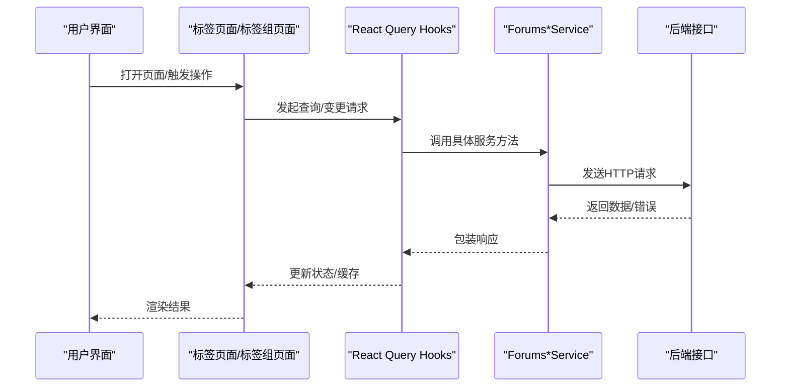
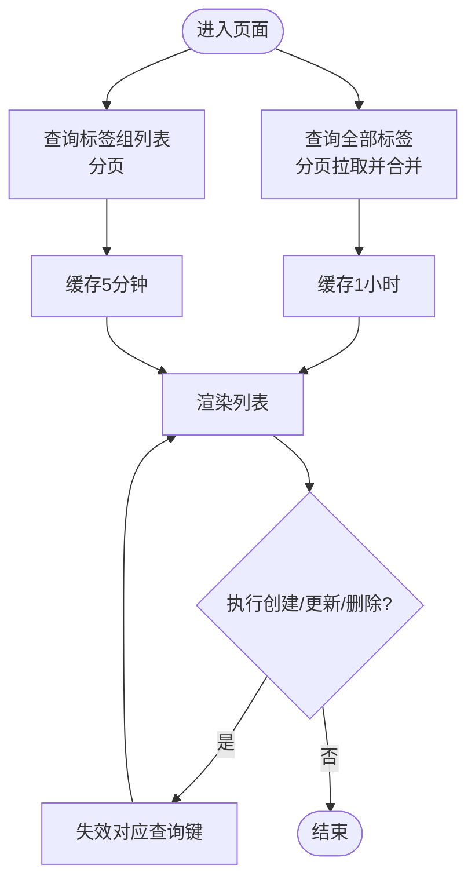
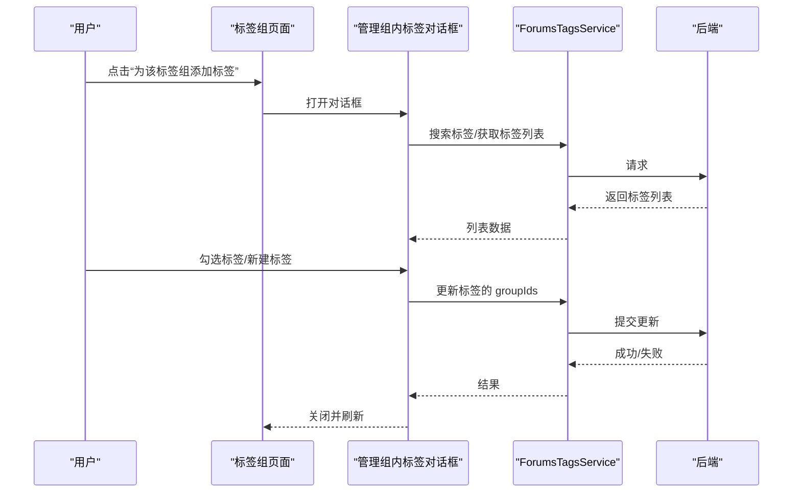
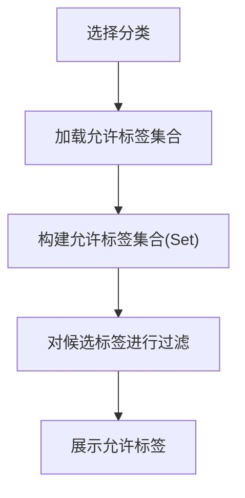
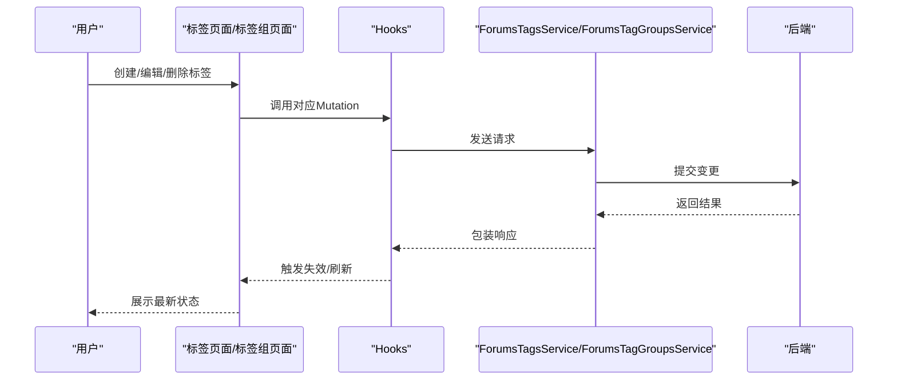
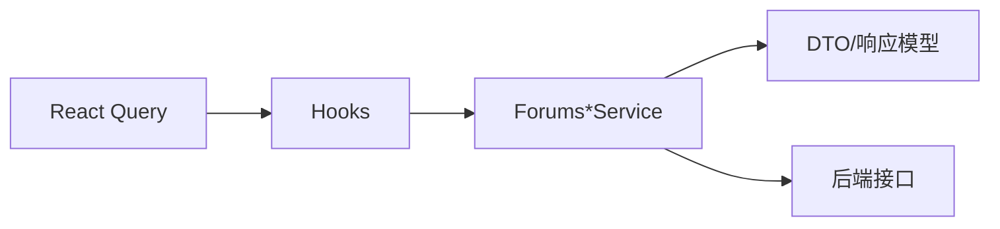

# 论坛数据管理

<cite>
**本文引用的文件**
- [src/modules/forum/hooks/useTagGroups.ts](file://src/modules/forum/hooks/useTagGroups.ts)
- [src/modules/forum/hooks/useForumsTagsQuery.ts](file://src/modules/forum/hooks/useForumsTagsQuery.ts)
- [src/modules/forum/hooks/useAllowedTagsForCategory.ts](file://src/modules/forum/hooks/useAllowedTagsForCategory.ts)
- [src/modules/forum/pages/TagsPage.tsx](file://src/modules/forum/pages/TagsPage.tsx)
- [src/modules/forum/pages/TagGroupsPage.tsx](file://src/modules/forum/pages/TagGroupsPage.tsx)
- [src/modules/forum/components/TagGroups/ManageGroupTagsDialog.tsx](file://src/modules/forum/components/TagGroups/ManageGroupTagsDialog.tsx)
- [src/modules/forum/components/EditTagModal.tsx](file://src/modules/forum/components/EditTagModal.tsx)
- [src/modules/forum/utils/markdownCache.ts](file://src/modules/forum/utils/markdownCache.ts)
- [src/api/services/ForumsTagsService.ts](file://src/api/services/ForumsTagsService.ts)
- [src/api/services/ForumsTagGroupsService.ts](file://src/api/services/ForumsTagGroupsService.ts)
- [src/api/models/ForumTag.ts](file://src/api/models/ForumTag.ts)
- [src/api/models/ForumTagGroup.ts](file://src/api/models/ForumTagGroup.ts)
- [src/api/models/CategoryTagsGroupedResponseDto.ts](file://src/api/models/CategoryTagsGroupedResponseDto.ts)
- [src/api/models/TagDetailResponseDto.ts](file://src/api/models/TagDetailResponseDto.ts)
- [src/api/models/TagPaginatedResponseDto.ts](file://src/api/models/TagPaginatedResponseDto.ts)
- [src/api/models/TagGroupPaginatedResponseDto.ts](file://src/api/models/TagGroupPaginatedResponseDto.ts)
- [src/api/models/SearchTagDto.ts](file://src/api/models/SearchTagDto.ts)
- [src/api/models/UpdateTagDto.ts](file://src/api/models/UpdateTagDto.ts)
- [src/api/models/UpdateTagGroupDto.ts](file://src/api/models/UpdateTagGroupDto.ts)
- [src/api/models/CreateTagDto.ts](file://src/api/models/CreateTagDto.ts)
- [src/api/models/CreateTagGroupDto.ts](file://src/api/models/CreateTagGroupDto.ts)
- [src/api/models/MergeTagDto.ts](file://src/api/models/MergeTagDto.ts)
- [src/modules/forum/2026-01-19-forum-category-slug-to-key.md](file://src/modules/forum/2026-01-19-forum-category-slug-to-key.md)
</cite>

## 目录
1. [引言](#引言)
2. [项目结构](#项目结构)
3. [核心组件](#核心组件)
4. [架构总览](#架构总览)
5. [详细组件分析](#详细组件分析)
6. [依赖分析](#依赖分析)
7. [性能考虑](#性能考虑)
8. [故障排查指南](#故障排查指南)
9. [结论](#结论)
10. [附录](#附录)

## 引言
本文件围绕论坛数据管理中的“标签系统”进行系统化文档化，重点覆盖标签分组、权限控制、显示逻辑、查询机制、缓存策略与性能优化、以及标签创建/编辑/删除的完整流程与数据一致性保障。同时，结合标签与分类的关联关系、权限继承与访问控制策略，给出接口模型与使用示例，并讨论扩展性与未来规划。

## 项目结构
标签系统主要由前端页面与 Hooks、标签与标签组的管理对话框、以及后端 API 服务与模型构成。前端通过 React Query 管理状态与缓存，后端通过 OpenAPI 生成的服务封装接口。

```mermaid
graph TB
subgraph "前端"
TP["标签页面<br/>TagsPage.tsx"]
TGP["标签组页面<br/>TagGroupsPage.tsx"]
UTG["标签组查询Hook<br/>useTagGroups.ts"]
UFT["标签查询Hook<br/>useForumsTagsQuery.ts"]
UAT["分类允许标签Hook<br/>useAllowedTagsForCategory.ts"]
MGT["管理组内标签对话框<br/>ManageGroupTagsDialog.tsx"]
ETM["编辑标签弹窗<br/>EditTagModal.tsx"]
MC["Markdown缓存工具<br/>markdownCache.ts"]
end
subgraph "后端API"
FTS["ForumsTagsService.ts"]
FTGS["ForumsTagGroupsService.ts"]
DTO1["ForumTag.ts"]
DTO2["ForumTagGroup.ts"]
DTO3["CategoryTagsGroupedResponseDto.ts"]
DTO4["TagDetailResponseDto.ts"]
DTO5["TagPaginatedResponseDto.ts"]
DTO6["TagGroupPaginatedResponseDto.ts"]
DTO7["SearchTagDto.ts"]
DTO8["UpdateTagDto.ts"]
DTO9["UpdateTagGroupDto.ts"]
DTO10["CreateTagDto.ts"]
DTO11["CreateTagGroupDto.ts"]
DTO12["MergeTagDto.ts"]
end
TP --> UFT
TGP --> UTG
MGT --> FTS
ETM --> FTS
UAT --> FTS
UAT --> FTGS
FTS --> DTO1
FTS --> DTO4
FTS --> DTO5
FTS --> DTO7
FTS --> DTO8
FTS --> DTO10
FTS --> DTO12
FTGS --> DTO2
FTGS --> DTO6
FTGS --> DTO9
FTGS --> DTO11
```

图表来源
- [src/modules/forum/pages/TagsPage.tsx](file://src/modules/forum/pages/TagsPage.tsx#L1-L98)
- [src/modules/forum/pages/TagGroupsPage.tsx](file://src/modules/forum/pages/TagGroupsPage.tsx#L1-L467)
- [src/modules/forum/hooks/useTagGroups.ts](file://src/modules/forum/hooks/useTagGroups.ts#L1-L117)
- [src/modules/forum/hooks/useForumsTagsQuery.ts](file://src/modules/forum/hooks/useForumsTagsQuery.ts#L1-L27)
- [src/modules/forum/hooks/useAllowedTagsForCategory.ts](file://src/modules/forum/hooks/useAllowedTagsForCategory.ts#L1-L49)
- [src/modules/forum/components/TagGroups/ManageGroupTagsDialog.tsx](file://src/modules/forum/components/TagGroups/ManageGroupTagsDialog.tsx#L1-L256)
- [src/modules/forum/components/EditTagModal.tsx](file://src/modules/forum/components/EditTagModal.tsx#L1-L120)
- [src/modules/forum/utils/markdownCache.ts](file://src/modules/forum/utils/markdownCache.ts#L1-L30)
- [src/api/services/ForumsTagsService.ts](file://src/api/services/ForumsTagsService.ts#L1-L165)
- [src/api/services/ForumsTagGroupsService.ts](file://src/api/services/ForumsTagGroupsService.ts#L1-L34)
- [src/api/models/ForumTag.ts](file://src/api/models/ForumTag.ts#L1-L16)
- [src/api/models/ForumTagGroup.ts](file://src/api/models/ForumTagGroup.ts#L1-L20)
- [src/api/models/CategoryTagsGroupedResponseDto.ts](file://src/api/models/CategoryTagsGroupedResponseDto.ts#L1-L21)
- [src/api/models/TagDetailResponseDto.ts](file://src/api/models/TagDetailResponseDto.ts#L1-L200)
- [src/api/models/TagPaginatedResponseDto.ts](file://src/api/models/TagPaginatedResponseDto.ts#L1-L200)
- [src/api/models/TagGroupPaginatedResponseDto.ts](file://src/api/models/TagGroupPaginatedResponseDto.ts#L1-L200)
- [src/api/models/SearchTagDto.ts](file://src/api/models/SearchTagDto.ts#L1-L200)
- [src/api/models/UpdateTagDto.ts](file://src/api/models/UpdateTagDto.ts#L1-L200)
- [src/api/models/UpdateTagGroupDto.ts](file://src/api/models/UpdateTagGroupDto.ts#L1-L200)
- [src/api/models/CreateTagDto.ts](file://src/api/models/CreateTagDto.ts#L1-L200)
- [src/api/models/CreateTagGroupDto.ts](file://src/api/models/CreateTagGroupDto.ts#L1-L200)
- [src/api/models/MergeTagDto.ts](file://src/api/models/MergeTagDto.ts#L1-L200)

章节来源
- [src/modules/forum/pages/TagsPage.tsx](file://src/modules/forum/pages/TagsPage.tsx#L1-L98)
- [src/modules/forum/pages/TagGroupsPage.tsx](file://src/modules/forum/pages/TagGroupsPage.tsx#L1-L467)
- [src/modules/forum/hooks/useTagGroups.ts](file://src/modules/forum/hooks/useTagGroups.ts#L1-L117)
- [src/modules/forum/hooks/useForumsTagsQuery.ts](file://src/modules/forum/hooks/useForumsTagsQuery.ts#L1-L27)
- [src/modules/forum/hooks/useAllowedTagsForCategory.ts](file://src/modules/forum/hooks/useAllowedTagsForCategory.ts#L1-L49)
- [src/modules/forum/components/TagGroups/ManageGroupTagsDialog.tsx](file://src/modules/forum/components/TagGroups/ManageGroupTagsDialog.tsx#L1-L256)
- [src/modules/forum/components/EditTagModal.tsx](file://src/modules/forum/components/EditTagModal.tsx#L1-L120)
- [src/modules/forum/utils/markdownCache.ts](file://src/modules/forum/utils/markdownCache.ts#L1-L30)
- [src/api/services/ForumsTagsService.ts](file://src/api/services/ForumsTagsService.ts#L1-L165)
- [src/api/services/ForumsTagGroupsService.ts](file://src/api/services/ForumsTagGroupsService.ts#L1-L34)

## 核心组件
- 标签与标签组的前端查询与变更：通过 React Query 的查询键与失效策略，统一管理列表、详情、分页与缓存。
- 标签页面与标签组页面：提供标签与标签组的浏览、搜索、创建、编辑、删除与批量管理能力。
- 管理组内标签对话框：支持搜索现有标签、创建新标签并加入指定组，逐条更新标签的组归属。
- 允许标签过滤 Hook：基于分类维度限制可用标签集合，实现权限继承与访问控制。
- Markdown 缓存工具：对重复内容进行解析结果缓存，降低重复渲染的 CPU 开销。

章节来源
- [src/modules/forum/hooks/useTagGroups.ts](file://src/modules/forum/hooks/useTagGroups.ts#L1-L117)
- [src/modules/forum/hooks/useForumsTagsQuery.ts](file://src/modules/forum/hooks/useForumsTagsQuery.ts#L1-L27)
- [src/modules/forum/hooks/useAllowedTagsForCategory.ts](file://src/modules/forum/hooks/useAllowedTagsForCategory.ts#L1-L49)
- [src/modules/forum/pages/TagsPage.tsx](file://src/modules/forum/pages/TagsPage.tsx#L1-L98)
- [src/modules/forum/pages/TagGroupsPage.tsx](file://src/modules/forum/pages/TagGroupsPage.tsx#L1-L467)
- [src/modules/forum/components/TagGroups/ManageGroupTagsDialog.tsx](file://src/modules/forum/components/TagGroups/ManageGroupTagsDialog.tsx#L1-L256)
- [src/modules/forum/utils/markdownCache.ts](file://src/modules/forum/utils/markdownCache.ts#L1-L30)

## 架构总览
前端通过 OpenAPI 生成的服务调用后端接口，标签与标签组的数据通过查询键进行缓存与失效；分类维度的标签权限通过“允许标签集合”进行过滤；Markdown 内容解析采用简易 LRU 缓存提升渲染性能。

图表来源
- [src/modules/forum/pages/TagsPage.tsx](file://src/modules/forum/pages/TagsPage.tsx#L1-L98)
- [src/modules/forum/pages/TagGroupsPage.tsx](file://src/modules/forum/pages/TagGroupsPage.tsx#L1-L467)
- [src/modules/forum/hooks/useTagGroups.ts](file://src/modules/forum/hooks/useTagGroups.ts#L1-L117)
- [src/modules/forum/hooks/useForumsTagsQuery.ts](file://src/modules/forum/hooks/useForumsTagsQuery.ts#L1-L27)
- [src/api/services/ForumsTagsService.ts](file://src/api/services/ForumsTagsService.ts#L1-L165)
- [src/api/services/ForumsTagGroupsService.ts](file://src/api/services/ForumsTagGroupsService.ts#L1-L34)

## 详细组件分析

### 标签与标签组查询与缓存
- 查询键设计：列表、分页、详情均使用稳定查询键，便于精确失效与复用。
- 列表加载策略：标签全量列表通过分页拉取并拼接，设置较长缓存时间以减少请求。
- 标签组列表：分页查询，设置较短缓存时间，保证后台变更能较快反映。
- 失效策略：创建/更新/删除后主动失效相关查询键，确保 UI 与服务端一致。

图表来源
- [src/modules/forum/hooks/useForumsTagsQuery.ts](file://src/modules/forum/hooks/useForumsTagsQuery.ts#L1-L27)
- [src/modules/forum/hooks/useTagGroups.ts](file://src/modules/forum/hooks/useTagGroups.ts#L1-L117)

章节来源
- [src/modules/forum/hooks/useForumsTagsQuery.ts](file://src/modules/forum/hooks/useForumsTagsQuery.ts#L1-L27)
- [src/modules/forum/hooks/useTagGroups.ts](file://src/modules/forum/hooks/useTagGroups.ts#L1-L117)

### 标签与标签组管理页面
- 标签页面：支持搜索、跳转详情、打开编辑弹窗；使用本地过滤与后端分页相结合。
- 标签组页面：表格展示、新建/编辑/删除对话框、刷新按钮；支持颜色与排序权重配置。
- 管理组内标签对话框：支持搜索现有标签、创建新标签并加入组、逐条更新组归属，避免覆盖原有分组。

图表来源
- [src/modules/forum/pages/TagGroupsPage.tsx](file://src/modules/forum/pages/TagGroupsPage.tsx#L1-L467)
- [src/modules/forum/components/TagGroups/ManageGroupTagsDialog.tsx](file://src/modules/forum/components/TagGroups/ManageGroupTagsDialog.tsx#L1-L256)
- [src/api/services/ForumsTagsService.ts](file://src/api/services/ForumsTagsService.ts#L1-L165)

章节来源
- [src/modules/forum/pages/TagsPage.tsx](file://src/modules/forum/pages/TagsPage.tsx#L1-L98)
- [src/modules/forum/pages/TagGroupsPage.tsx](file://src/modules/forum/pages/TagGroupsPage.tsx#L1-L467)
- [src/modules/forum/components/TagGroups/ManageGroupTagsDialog.tsx](file://src/modules/forum/components/TagGroups/ManageGroupTagsDialog.tsx#L1-L256)

### 权限控制与访问策略
- 分类维度的标签限制：通过“允许标签集合”Hook 将分类可选标签扁平化为集合，后续筛选器仅保留允许集合内的标签，实现权限继承与访问控制。
- 分类键迁移提示：分类实体字段从 slug 迁移到 key，需确保数据库具备唯一性约束与列存在性，避免运行时报错。

图表来源
- [src/modules/forum/hooks/useAllowedTagsForCategory.ts](file://src/modules/forum/hooks/useAllowedTagsForCategory.ts#L1-L49)
- [src/modules/forum/2026-01-19-forum-category-slug-to-key.md](file://src/modules/forum/2026-01-19-forum-category-slug-to-key.md#L69-L93)

章节来源
- [src/modules/forum/hooks/useAllowedTagsForCategory.ts](file://src/modules/forum/hooks/useAllowedTagsForCategory.ts#L1-L49)
- [src/modules/forum/2026-01-19-forum-category-slug-to-key.md](file://src/modules/forum/2026-01-19-forum-category-slug-to-key.md#L69-L93)

### 显示逻辑与交互
- 标签卡片：展示名称、使用计数、颜色占位；点击卡片跳转详情。
- 标签组卡片：展示颜色、名称、排序权重；支持添加标签、编辑、删除。
- 编辑弹窗：读取标签详情，基于 groups 字段计算默认选中组，避免兼容旧字段。
- 搜索与本地过滤：搜索框触发服务端搜索，同时进行本地二次过滤增强体验。

章节来源
- [src/modules/forum/pages/TagsPage.tsx](file://src/modules/forum/pages/TagsPage.tsx#L1-L98)
- [src/modules/forum/pages/TagGroupsPage.tsx](file://src/modules/forum/pages/TagGroupsPage.tsx#L1-L467)
- [src/modules/forum/components/EditTagModal.tsx](file://src/modules/forum/components/EditTagModal.tsx#L1-L120)
- [src/modules/forum/components/TagGroups/ManageGroupTagsDialog.tsx](file://src/modules/forum/components/TagGroups/ManageGroupTagsDialog.tsx#L1-L256)

### 标签创建、编辑、删除流程与一致性
- 创建标签：先创建再更新 groupIds，避免遗漏组归属；失败时提示映射主键生成问题。
- 编辑标签：读取详情，基于 groups 字段回填表单，提交时保持其他字段不变。
- 删除标签：通过删除 Mutation 触发失效，确保列表与详情不再显示。
- 一致性保障：每次变更后失效相关查询键，配合后端幂等接口，保证 UI 与服务端状态一致。

图表来源
- [src/modules/forum/hooks/useTagGroups.ts](file://src/modules/forum/hooks/useTagGroups.ts#L1-L117)
- [src/modules/forum/hooks/useForumsTagsQuery.ts](file://src/modules/forum/hooks/useForumsTagsQuery.ts#L1-L27)
- [src/modules/forum/components/EditTagModal.tsx](file://src/modules/forum/components/EditTagModal.tsx#L1-L120)
- [src/modules/forum/components/TagGroups/ManageGroupTagsDialog.tsx](file://src/modules/forum/components/TagGroups/ManageGroupTagsDialog.tsx#L1-L256)
- [src/api/services/ForumsTagsService.ts](file://src/api/services/ForumsTagsService.ts#L1-L165)
- [src/api/services/ForumsTagGroupsService.ts](file://src/api/services/ForumsTagGroupsService.ts#L1-L34)

章节来源
- [src/modules/forum/components/EditTagModal.tsx](file://src/modules/forum/components/EditTagModal.tsx#L1-L120)
- [src/modules/forum/components/TagGroups/ManageGroupTagsDialog.tsx](file://src/modules/forum/components/TagGroups/ManageGroupTagsDialog.tsx#L1-L256)
- [src/modules/forum/hooks/useTagGroups.ts](file://src/modules/forum/hooks/useTagGroups.ts#L1-L117)
- [src/modules/forum/hooks/useForumsTagsQuery.ts](file://src/modules/forum/hooks/useForumsTagsQuery.ts#L1-L27)

### 查询机制、缓存策略与性能优化
- 标签全量列表：分页拉取并合并，缓存 1 小时，减少请求频次。
- 标签组列表：分页查询，缓存 5 分钟，保证后台变更及时可见。
- React Query 失效：创建/更新/删除后失效对应查询键，避免脏数据。
- Markdown 缓存：对重复内容进行解析结果缓存，使用 Map 维护插入顺序，超过阈值时删除最旧项，实现近似 LRU 淘汰。

章节来源
- [src/modules/forum/hooks/useForumsTagsQuery.ts](file://src/modules/forum/hooks/useForumsTagsQuery.ts#L1-L27)
- [src/modules/forum/hooks/useTagGroups.ts](file://src/modules/forum/hooks/useTagGroups.ts#L1-L117)
- [src/modules/forum/utils/markdownCache.ts](file://src/modules/forum/utils/markdownCache.ts#L1-L30)

### API 接口与数据模型
- 标签相关
  - 搜索标签：POST /forums/tags/search
  - 获取标签详情：POST /forums/tags/detail
  - 创建标签：POST /forums/tags/create
  - 更新标签：POST /forums/tags/update
  - 合并标签：POST /forums/tags/merge
- 标签组相关
  - 获取标签组列表：POST /forums/tag-groups/list
  - 获取标签组详情：POST /forums/tag-groups/{id}
  - 创建标签组：POST /forums/tag-groups/create
  - 更新标签组：POST /forums/tag-groups/update
  - 删除标签组：POST /forums/tag-groups/remove
- 数据模型要点
  - ForumTag：name、usageCount
  - ForumTagGroup：name、color、sortOrder
  - CategoryTagsGroupedResponseDto：groups、ungroupedTags、pagination
  - TagDetailResponseDto、TagPaginatedResponseDto、TagGroupPaginatedResponseDto、SearchTagDto、UpdateTagDto、UpdateTagGroupDto、CreateTagDto、CreateTagGroupDto、MergeTagDto

章节来源
- [src/api/services/ForumsTagsService.ts](file://src/api/services/ForumsTagsService.ts#L1-L165)
- [src/api/services/ForumsTagGroupsService.ts](file://src/api/services/ForumsTagGroupsService.ts#L1-L34)
- [src/api/models/ForumTag.ts](file://src/api/models/ForumTag.ts#L1-L16)
- [src/api/models/ForumTagGroup.ts](file://src/api/models/ForumTagGroup.ts#L1-L20)
- [src/api/models/CategoryTagsGroupedResponseDto.ts](file://src/api/models/CategoryTagsGroupedResponseDto.ts#L1-L21)
- [src/api/models/TagDetailResponseDto.ts](file://src/api/models/TagDetailResponseDto.ts#L1-L200)
- [src/api/models/TagPaginatedResponseDto.ts](file://src/api/models/TagPaginatedResponseDto.ts#L1-L200)
- [src/api/models/TagGroupPaginatedResponseDto.ts](file://src/api/models/TagGroupPaginatedResponseDto.ts#L1-L200)
- [src/api/models/SearchTagDto.ts](file://src/api/models/SearchTagDto.ts#L1-L200)
- [src/api/models/UpdateTagDto.ts](file://src/api/models/UpdateTagDto.ts#L1-L200)
- [src/api/models/UpdateTagGroupDto.ts](file://src/api/models/UpdateTagGroupDto.ts#L1-L200)
- [src/api/models/CreateTagDto.ts](file://src/api/models/CreateTagDto.ts#L1-L200)
- [src/api/models/CreateTagGroupDto.ts](file://src/api/models/CreateTagGroupDto.ts#L1-L200)
- [src/api/models/MergeTagDto.ts](file://src/api/models/MergeTagDto.ts#L1-L200)

### 标签与分类的关联关系与权限继承
- 分类允许标签：通过 categoriesControllerFindCategoryTags(grouped=true) 获取分组后的标签集合，扁平化为允许集合，用于筛选。
- 权限继承：若分类设置了允许标签集合，则仅展示允许集合内的标签，实现基于分类的权限继承与访问控制。
- 分类键迁移：分类实体字段从 slug 切换为 key，需确保数据库具备唯一性约束与列存在性。

章节来源
- [src/modules/forum/hooks/useAllowedTagsForCategory.ts](file://src/modules/forum/hooks/useAllowedTagsForCategory.ts#L1-L49)
- [src/modules/forum/2026-01-19-forum-category-slug-to-key.md](file://src/modules/forum/2026-01-19-forum-category-slug-to-key.md#L69-L93)

### Markdown 缓存系统
- 目标：减少重复内容的解析开销，缓解长帖/多次渲染的 CPU 压力。
- 策略：以内容为键缓存解析结果，超过最大条目数时删除最旧项，实现近似 LRU 淘汰。
- 适用场景：帖子正文、评论等内容的渲染加速。

章节来源
- [src/modules/forum/utils/markdownCache.ts](file://src/modules/forum/utils/markdownCache.ts#L1-L30)

## 依赖分析
- 前端依赖
  - React Query：统一状态管理与缓存失效。
  - OpenAPI 生成的服务：封装后端接口，提供类型安全的调用。
  - UI 组件库：对话框、输入框、按钮等基础组件。
- 后端依赖
  - DTO 与响应模型：定义接口契约与数据结构。
  - 分类与标签关联：通过分组响应模型实现标签与分类的解耦展示。

图表来源
- [src/modules/forum/hooks/useTagGroups.ts](file://src/modules/forum/hooks/useTagGroups.ts#L1-L117)
- [src/modules/forum/hooks/useForumsTagsQuery.ts](file://src/modules/forum/hooks/useForumsTagsQuery.ts#L1-L27)
- [src/api/services/ForumsTagsService.ts](file://src/api/services/ForumsTagsService.ts#L1-L165)
- [src/api/services/ForumsTagGroupsService.ts](file://src/api/services/ForumsTagGroupsService.ts#L1-L34)
- [src/api/models/CategoryTagsGroupedResponseDto.ts](file://src/api/models/CategoryTagsGroupedResponseDto.ts#L1-L21)

章节来源
- [src/modules/forum/hooks/useTagGroups.ts](file://src/modules/forum/hooks/useTagGroups.ts#L1-L117)
- [src/modules/forum/hooks/useForumsTagsQuery.ts](file://src/modules/forum/hooks/useForumsTagsQuery.ts#L1-L27)
- [src/api/services/ForumsTagsService.ts](file://src/api/services/ForumsTagsService.ts#L1-L165)
- [src/api/services/ForumsTagGroupsService.ts](file://src/api/services/ForumsTagGroupsService.ts#L1-L34)
- [src/api/models/CategoryTagsGroupedResponseDto.ts](file://src/api/models/CategoryTagsGroupedResponseDto.ts#L1-L21)

## 性能考虑
- 列表分页与合并：全量标签列表采用分页拉取并合并，减少单次请求负载。
- 缓存策略：标签列表缓存 1 小时，标签组列表缓存 5 分钟，平衡新鲜度与性能。
- React Query 失效：变更后精准失效，避免全局刷新。
- Markdown 缓存：对重复内容进行解析结果缓存，降低 CPU 占用。
- 本地过滤：在服务端搜索基础上进行本地二次过滤，提升交互响应速度。

## 故障排查指南
- 标签组创建后未显示：检查是否调用失效逻辑，确认查询键是否正确。
- 标签加入组失败：关注提示信息，可能为映射表主键生成问题，建议重试或联系管理员。
- 分类下看不到标签：确认分类允许标签集合是否为空，检查分类键迁移是否完成。
- Markdown 渲染卡顿：确认缓存是否生效，避免重复解析相同内容。

章节来源
- [src/modules/forum/components/TagGroups/ManageGroupTagsDialog.tsx](file://src/modules/forum/components/TagGroups/ManageGroupTagsDialog.tsx#L126-L159)
- [src/modules/forum/hooks/useTagGroups.ts](file://src/modules/forum/hooks/useTagGroups.ts#L68-L73)
- [src/modules/forum/hooks/useAllowedTagsForCategory.ts](file://src/modules/forum/hooks/useAllowedTagsForCategory.ts#L1-L49)
- [src/modules/forum/utils/markdownCache.ts](file://src/modules/forum/utils/markdownCache.ts#L1-L30)

## 结论
标签系统通过清晰的前端查询键与缓存策略、完善的 CRUD 流程与一致性保障、以及基于分类的权限继承机制，实现了高效、可控、可扩展的标签管理能力。Markdown 缓存进一步提升了渲染性能。未来可在标签合并、批量操作、更细粒度的权限控制等方面持续演进。

## 附录
- 使用示例（路径）
  - 搜索标签：POST /forums/tags/search
  - 获取标签详情：POST /forums/tags/detail
  - 创建标签：POST /forums/tags/create
  - 更新标签：POST /forums/tags/update
  - 合并标签：POST /forums/tags/merge
  - 获取标签组列表：POST /forums/tag-groups/list
  - 获取标签组详情：POST /forums/tag-groups/{id}
  - 创建标签组：POST /forums/tag-groups/create
  - 更新标签组：POST /forums/tag-groups/update
  - 删除标签组：POST /forums/tag-groups/remove
- 数据模型参考
  - ForumTag、ForumTagGroup、CategoryTagsGroupedResponseDto、TagDetailResponseDto、TagPaginatedResponseDto、TagGroupPaginatedResponseDto、SearchTagDto、UpdateTagDto、UpdateTagGroupDto、CreateTagDto、CreateTagGroupDto、MergeTagDto