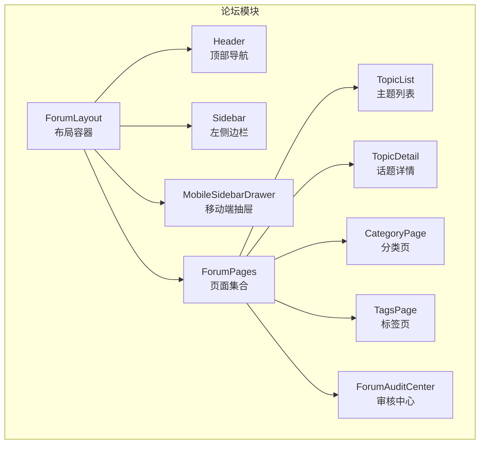
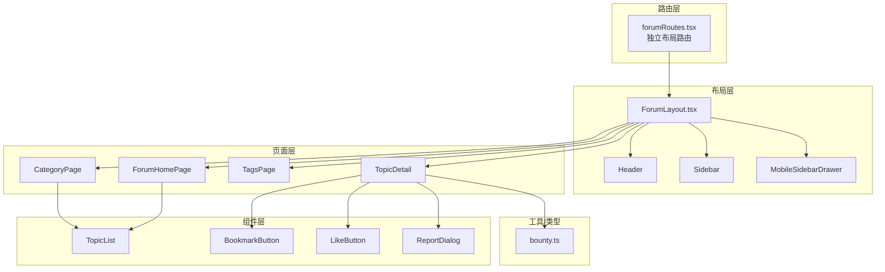
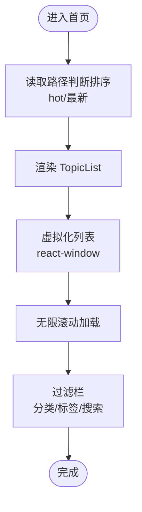
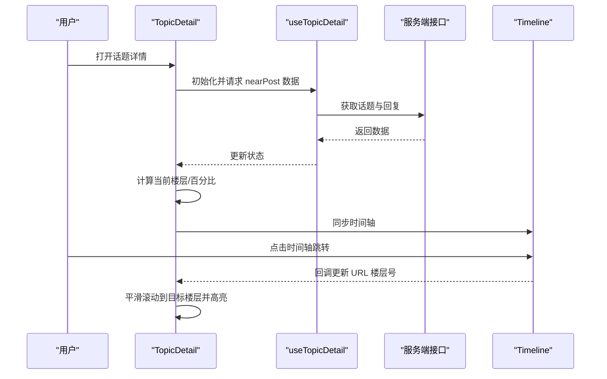
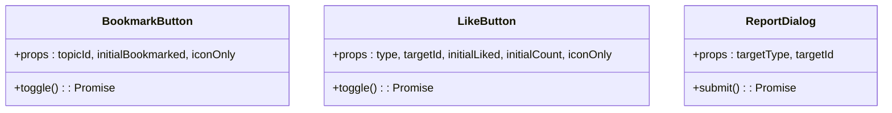
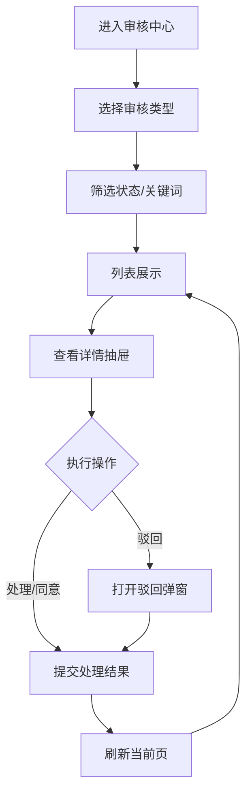
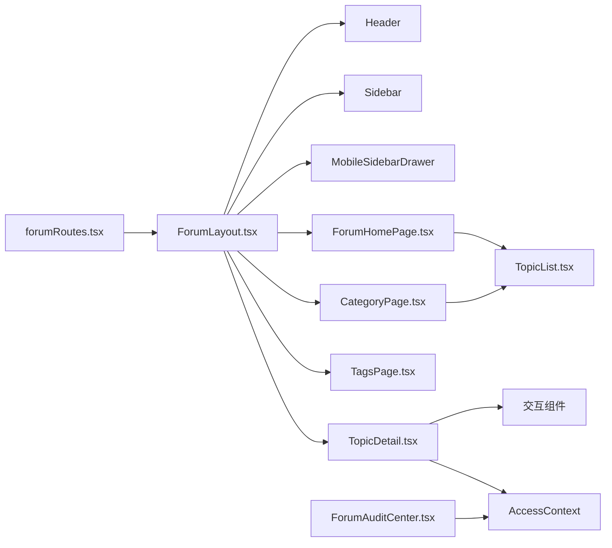

# 论坛模块

<cite>
**本文引用的文件**
- [src/modules/forum/index.tsx](file://src/modules/forum/index.tsx)
- [src/routes/forumRoutes.tsx](file://src/routes/forumRoutes.tsx)
- [src/modules/forum/layouts/ForumLayout.tsx](file://src/modules/forum/layouts/ForumLayout.tsx)
- [src/modules/forum/pages/ForumHomePage.tsx](file://src/modules/forum/pages/ForumHomePage.tsx)
- [src/modules/forum/components/TopicList/index.tsx](file://src/modules/forum/components/TopicList/index.tsx)
- [src/modules/forum/pages/TopicDetail/index.tsx](file://src/modules/forum/pages/TopicDetail/index.tsx)
- [src/modules/forum/pages/CategoryPage/index.tsx](file://src/modules/forum/pages/CategoryPage/index.tsx)
- [src/modules/forum/pages/TagsPage.tsx](file://src/modules/forum/pages/TagsPage.tsx)
- [src/modules/forum/components/Interaction/BookmarkButton.tsx](file://src/modules/forum/components/Interaction/BookmarkButton.tsx)
- [src/modules/forum/components/Interaction/LikeButton.tsx](file://src/modules/forum/components/Interaction/LikeButton.tsx)
- [src/modules/forum/components/Interaction/ReportDialog.tsx](file://src/modules/forum/components/Interaction/ReportDialog.tsx)
- [src/modules/forum/pages/Admin/ForumAuditCenter/index.tsx](file://src/modules/forum/pages/Admin/ForumAuditCenter/index.tsx)
- [src/modules/forum/types/bounty.ts](file://src/modules/forum/types/bounty.ts)
</cite>

## 目录
1. [简介](#简介)
2. [项目结构](#项目结构)
3. [核心组件](#核心组件)
4. [架构总览](#架构总览)
5. [详细组件分析](#详细组件分析)
6. [依赖关系分析](#依赖关系分析)
7. [性能考量](#性能考量)
8. [故障排查指南](#故障排查指南)
9. [结论](#结论)
10. [附录](#附录)

## 简介
本文件为论坛模块的全面技术文档，覆盖讨论区功能、主题创建、回复管理、标签系统、内容审核与举报处理、违规管理策略、用户互动（关注、点赞、收藏）、论坛布局与导航、用户权限控制，以及运营与内容管理最佳实践。文档面向开发者与运营人员，既提供架构与实现细节，也给出可操作的运维建议。

## 项目结构
论坛模块采用“独立布局 + 嵌套路由”的组织方式，入口导出布局、页面与共享组件，并通过路由配置挂载至主应用。核心目录包括：
- 布局与导航：ForumLayout、Header、Sidebar、MobileSidebarDrawer
- 页面：首页、分类页、标签页、话题详情、新建话题、书签页、管理员审核中心等
- 组件：TopicList、Composer、交互按钮（收藏、点赞、举报）、UI 组件库封装
- 类型与工具：悬赏类型定义、Markdown 缓存、主题上下文等

图表来源
- [src/modules/forum/layouts/ForumLayout.tsx](file://src/modules/forum/layouts/ForumLayout.tsx#L1-L109)
- [src/modules/forum/pages/ForumHomePage.tsx](file://src/modules/forum/pages/ForumHomePage.tsx#L1-L27)
- [src/modules/forum/components/TopicList/index.tsx](file://src/modules/forum/components/TopicList/index.tsx#L1-L438)
- [src/modules/forum/pages/TopicDetail/index.tsx](file://src/modules/forum/pages/TopicDetail/index.tsx#L1-L501)
- [src/modules/forum/pages/CategoryPage/index.tsx](file://src/modules/forum/pages/CategoryPage/index.tsx#L1-L103)
- [src/modules/forum/pages/TagsPage.tsx](file://src/modules/forum/pages/TagsPage.tsx#L1-L98)
- [src/modules/forum/pages/Admin/ForumAuditCenter/index.tsx](file://src/modules/forum/pages/Admin/ForumAuditCenter/index.tsx#L1-L408)

章节来源
- [src/modules/forum/index.tsx](file://src/modules/forum/index.tsx#L1-L45)
- [src/routes/forumRoutes.tsx](file://src/routes/forumRoutes.tsx#L1-L106)

## 核心组件
- 布局与导航
  - ForumLayout：提供顶部导航、固定侧栏、移动端抽屉、全局编辑器与主题上下文包装
  - Header：搜索、移动端菜单开关
  - Sidebar：分类与标签导航
  - MobileSidebarDrawer：移动端汉堡菜单风格抽屉
- 页面
  - ForumHomePage：根据路径决定热门/最新排序，传递上下文给 TopicList
  - CategoryPage：按分类键查询分类并渲染主题列表
  - TagsPage：标签列表与管理入口
  - TopicDetail：话题详情流与时间轴联动、楼层跳转、无限滚动、悬赏状态轮询
- 组件
  - TopicList：虚拟化列表、过滤栏、加载/错误/空状态、无限滚动
  - 交互按钮：收藏、点赞、举报对话框
- 审核中心
  - ForumAuditCenter：举报审核与悬赏取消审核的统一界面，支持筛选、分页、详情抽屉与驳回弹窗

章节来源
- [src/modules/forum/layouts/ForumLayout.tsx](file://src/modules/forum/layouts/ForumLayout.tsx#L1-L109)
- [src/modules/forum/pages/ForumHomePage.tsx](file://src/modules/forum/pages/ForumHomePage.tsx#L1-L27)
- [src/modules/forum/pages/CategoryPage/index.tsx](file://src/modules/forum/pages/CategoryPage/index.tsx#L1-L103)
- [src/modules/forum/pages/TagsPage.tsx](file://src/modules/forum/pages/TagsPage.tsx#L1-L98)
- [src/modules/forum/components/TopicList/index.tsx](file://src/modules/forum/components/TopicList/index.tsx#L1-L438)
- [src/modules/forum/pages/TopicDetail/index.tsx](file://src/modules/forum/pages/TopicDetail/index.tsx#L1-L501)
- [src/modules/forum/components/Interaction/BookmarkButton.tsx](file://src/modules/forum/components/Interaction/BookmarkButton.tsx#L1-L96)
- [src/modules/forum/components/Interaction/LikeButton.tsx](file://src/modules/forum/components/Interaction/LikeButton.tsx#L1-L117)
- [src/modules/forum/components/Interaction/ReportDialog.tsx](file://src/modules/forum/components/Interaction/ReportDialog.tsx#L1-L132)
- [src/modules/forum/pages/Admin/ForumAuditCenter/index.tsx](file://src/modules/forum/pages/Admin/ForumAuditCenter/index.tsx#L1-L408)

## 架构总览
论坛模块采用“布局 + 页面 + 组件 + 类型/工具”的分层设计，路由系统独立挂载，页面间通过 Outlet 上下文传递状态（分类、搜索）。数据层通过 Hooks 查询与分页加载，交互层使用乐观更新与全局通知提升体验。

图表来源
- [src/routes/forumRoutes.tsx](file://src/routes/forumRoutes.tsx#L1-L106)
- [src/modules/forum/layouts/ForumLayout.tsx](file://src/modules/forum/layouts/ForumLayout.tsx#L1-L109)
- [src/modules/forum/pages/ForumHomePage.tsx](file://src/modules/forum/pages/ForumHomePage.tsx#L1-L27)
- [src/modules/forum/pages/CategoryPage/index.tsx](file://src/modules/forum/pages/CategoryPage/index.tsx#L1-L103)
- [src/modules/forum/pages/TagsPage.tsx](file://src/modules/forum/pages/TagsPage.tsx#L1-L98)
- [src/modules/forum/pages/TopicDetail/index.tsx](file://src/modules/forum/pages/TopicDetail/index.tsx#L1-L501)
- [src/modules/forum/components/TopicList/index.tsx](file://src/modules/forum/components/TopicList/index.tsx#L1-L438)
- [src/modules/forum/components/Interaction/BookmarkButton.tsx](file://src/modules/forum/components/Interaction/BookmarkButton.tsx#L1-L96)
- [src/modules/forum/components/Interaction/LikeButton.tsx](file://src/modules/forum/components/Interaction/LikeButton.tsx#L1-L117)
- [src/modules/forum/components/Interaction/ReportDialog.tsx](file://src/modules/forum/components/Interaction/ReportDialog.tsx#L1-L132)
- [src/modules/forum/types/bounty.ts](file://src/modules/forum/types/bounty.ts#L1-L22)

## 详细组件分析

### 论坛布局与导航
- 职责：提供顶部导航、固定侧栏、移动端抽屉、全局编辑器与主题上下文
- 关键点：
  - 侧栏固定定位，独立滚动，适配大屏
  - 移动端使用抽屉式导航，支持分类切换
  - 全局编辑器在布局底部常驻，便于快速发帖

章节来源
- [src/modules/forum/layouts/ForumLayout.tsx](file://src/modules/forum/layouts/ForumLayout.tsx#L1-L109)

### 论坛首页与主题列表
- 职责：根据路径判断热门/最新排序，渲染主题列表
- 关键点：
  - 使用虚拟化列表优化长列表性能
  - 支持无限滚动加载更多
  - 展示分类徽标、标签、作者头像、回复数、浏览数、最后回复时间、悬赏状态等
  - 支持搜索与分类筛选

图表来源
- [src/modules/forum/pages/ForumHomePage.tsx](file://src/modules/forum/pages/ForumHomePage.tsx#L1-L27)
- [src/modules/forum/components/TopicList/index.tsx](file://src/modules/forum/components/TopicList/index.tsx#L1-L438)

章节来源
- [src/modules/forum/pages/ForumHomePage.tsx](file://src/modules/forum/pages/ForumHomePage.tsx#L1-L27)
- [src/modules/forum/components/TopicList/index.tsx](file://src/modules/forum/components/TopicList/index.tsx#L1-L438)

### 话题详情与回复管理
- 职责：展示话题正文与回复流，支持楼层跳转、时间轴联动、无限滚动、悬赏状态轮询
- 关键点：
  - Discourse 风格楼层跳转：根据 URL 楼层号平滑滚动并高亮
  - 百分比滚动：基于滚动容器高度计算当前楼层，支持拖拽跳转
  - 向上/向下无限滚动：使用 IntersectionObserver 触发分页加载
  - 悬赏到期轮询：对开放悬赏定时刷新话题状态
  - 权限控制：仅作者可编辑首楼

图表来源
- [src/modules/forum/pages/TopicDetail/index.tsx](file://src/modules/forum/pages/TopicDetail/index.tsx#L1-L501)

章节来源
- [src/modules/forum/pages/TopicDetail/index.tsx](file://src/modules/forum/pages/TopicDetail/index.tsx#L1-L501)

### 分类与标签系统
- 分类页面：通过分类键查询分类详情，再以分类 ID 渲染主题列表
- 标签页面：支持标签列表、搜索、创建/编辑标签、标签组管理入口
- 标签组管理：管理员入口，用于标签分组与可见性控制

章节来源
- [src/modules/forum/pages/CategoryPage/index.tsx](file://src/modules/forum/pages/CategoryPage/index.tsx#L1-L103)
- [src/modules/forum/pages/TagsPage.tsx](file://src/modules/forum/pages/TagsPage.tsx#L1-L98)

### 用户互动功能
- 收藏：支持纯图标与标准两种模式，使用乐观更新与全局提示
- 点赞：支持话题/帖子两种类型，动画反馈与计数同步
- 举报：弹窗选择原因，支持补充说明，提交后关闭并清空状态

图表来源
- [src/modules/forum/components/Interaction/BookmarkButton.tsx](file://src/modules/forum/components/Interaction/BookmarkButton.tsx#L1-L96)
- [src/modules/forum/components/Interaction/LikeButton.tsx](file://src/modules/forum/components/Interaction/LikeButton.tsx#L1-L117)
- [src/modules/forum/components/Interaction/ReportDialog.tsx](file://src/modules/forum/components/Interaction/ReportDialog.tsx#L1-L132)

章节来源
- [src/modules/forum/components/Interaction/BookmarkButton.tsx](file://src/modules/forum/components/Interaction/BookmarkButton.tsx#L1-L96)
- [src/modules/forum/components/Interaction/LikeButton.tsx](file://src/modules/forum/components/Interaction/LikeButton.tsx#L1-L117)
- [src/modules/forum/components/Interaction/ReportDialog.tsx](file://src/modules/forum/components/Interaction/ReportDialog.tsx#L1-L132)

### 内容审核与举报处理
- 审核中心：统一展示举报与悬赏取消两类审核任务
- 功能：筛选（类型/状态）、分页、详情抽屉、批量处理、驳回弹窗
- 权限：仅管理员/版主可见与操作
- 流程：标记处理/同意、填写驳回理由、提交后刷新当前页

图表来源
- [src/modules/forum/pages/Admin/ForumAuditCenter/index.tsx](file://src/modules/forum/pages/Admin/ForumAuditCenter/index.tsx#L1-L408)

章节来源
- [src/modules/forum/pages/Admin/ForumAuditCenter/index.tsx](file://src/modules/forum/pages/Admin/ForumAuditCenter/index.tsx#L1-L408)

### 悬赏系统类型定义
- 定义悬赏状态与取消申请状态，支撑前端展示与轮询刷新

章节来源
- [src/modules/forum/types/bounty.ts](file://src/modules/forum/types/bounty.ts#L1-L22)

## 依赖关系分析
- 路由依赖：forumRoutes.tsx 独立挂载 ForumLayout，页面懒加载，权限守卫 AuthRoute
- 布局依赖：ForumLayout 依赖 Header、Sidebar、MobileSidebarDrawer 与主题上下文
- 页面依赖：ForumHomePage/CategoryPage/TagsPage 依赖 TopicList；TopicDetail 依赖 Post/Timeline/TopicFooter/SuggestedTopics
- 交互依赖：收藏/点赞/举报依赖 API 服务与全局通知
- 审核依赖：审核中心依赖 hooks 与权限上下文 AccessContext

图表来源
- [src/routes/forumRoutes.tsx](file://src/routes/forumRoutes.tsx#L1-L106)
- [src/modules/forum/layouts/ForumLayout.tsx](file://src/modules/forum/layouts/ForumLayout.tsx#L1-L109)
- [src/modules/forum/pages/ForumHomePage.tsx](file://src/modules/forum/pages/ForumHomePage.tsx#L1-L27)
- [src/modules/forum/pages/CategoryPage/index.tsx](file://src/modules/forum/pages/CategoryPage/index.tsx#L1-L103)
- [src/modules/forum/pages/TagsPage.tsx](file://src/modules/forum/pages/TagsPage.tsx#L1-L98)
- [src/modules/forum/pages/TopicDetail/index.tsx](file://src/modules/forum/pages/TopicDetail/index.tsx#L1-L501)
- [src/modules/forum/components/TopicList/index.tsx](file://src/modules/forum/components/TopicList/index.tsx#L1-L438)
- [src/modules/forum/pages/Admin/ForumAuditCenter/index.tsx](file://src/modules/forum/pages/Admin/ForumAuditCenter/index.tsx#L1-L408)

## 性能考量
- 虚拟化列表：TopicList 使用 react-window 与 react-virtualized-auto-sizer，按需渲染，降低 DOM 与重排成本
- 无限滚动：IntersectionObserver 观察加载哨兵，减少不必要的请求与重绘
- 乐观更新：收藏/点赞在提交前后本地切换状态，提升响应速度
- 轮询控制：悬赏到期轮询仅在开放悬赏且将到期时启动，避免无效请求
- 图片懒加载：使用自定义图片组件，结合占位与懒加载策略

## 故障排查指南
- 话题详情无法跳转楼层
  - 检查 URL 楼层号是否有效，确认目标楼层元素是否存在
  - 查看滚动百分比计算与导航逻辑，避免程序化滚动冲突
- 无限滚动不触发
  - 确认哨兵元素可见度与阈值设置
  - 检查 hasNextPage/isFetchingNextPage 状态
- 收藏/点赞异常
  - 查看乐观更新回滚逻辑与错误拦截器
  - 确认接口返回字段与 UI 状态一致
- 审核中心无数据
  - 检查筛选条件与分页参数
  - 确认权限角色（admin/moderator）

章节来源
- [src/modules/forum/pages/TopicDetail/index.tsx](file://src/modules/forum/pages/TopicDetail/index.tsx#L1-L501)
- [src/modules/forum/components/TopicList/index.tsx](file://src/modules/forum/components/TopicList/index.tsx#L1-L438)
- [src/modules/forum/components/Interaction/BookmarkButton.tsx](file://src/modules/forum/components/Interaction/BookmarkButton.tsx#L1-L96)
- [src/modules/forum/components/Interaction/LikeButton.tsx](file://src/modules/forum/components/Interaction/LikeButton.tsx#L1-L117)
- [src/modules/forum/pages/Admin/ForumAuditCenter/index.tsx](file://src/modules/forum/pages/Admin/ForumAuditCenter/index.tsx#L1-L408)

## 结论
论坛模块通过清晰的分层设计与高效的前端工程实践，实现了高性能的主题列表、流畅的回复流与楼层联动、完善的标签与分类体系、以及可扩展的内容审核与举报处理流程。配合权限控制与运营工具，能够满足社区讨论场景的多样化需求。

## 附录
- 运营与内容管理最佳实践
  - 审核时效：举报与悬赏取消应在工作日内处理，保持状态更新及时
  - 标签治理：定期清理无使用标签，维护标签组结构清晰
  - 内容策略：对违规内容采取删除、封禁与记录，形成闭环
  - 用户反馈：通过举报与建议渠道持续优化体验与规则