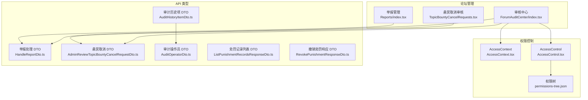
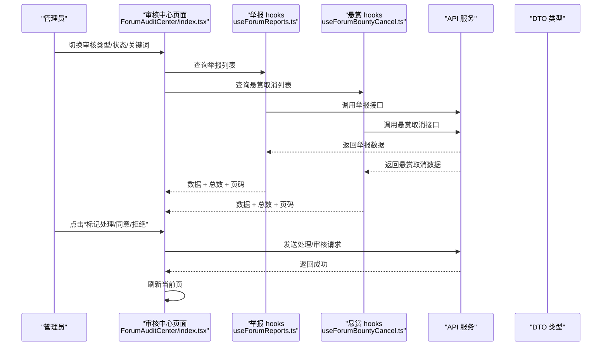
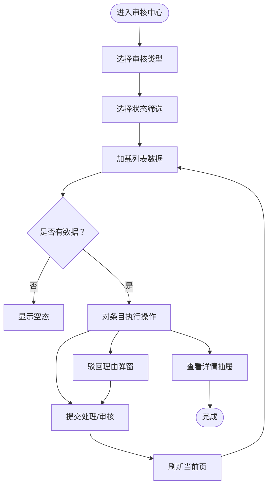
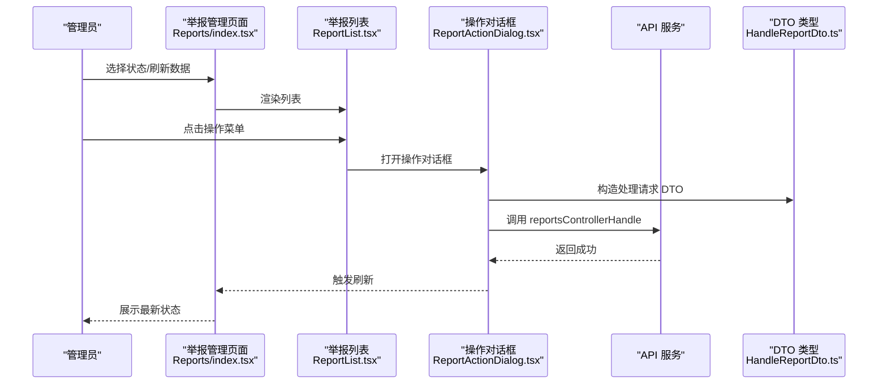
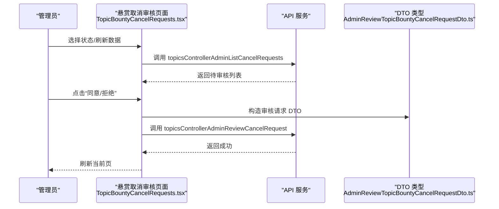
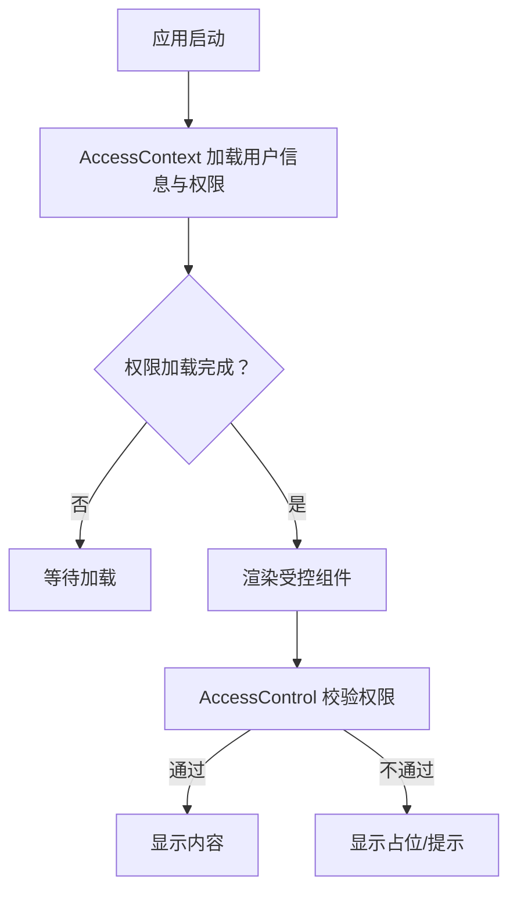
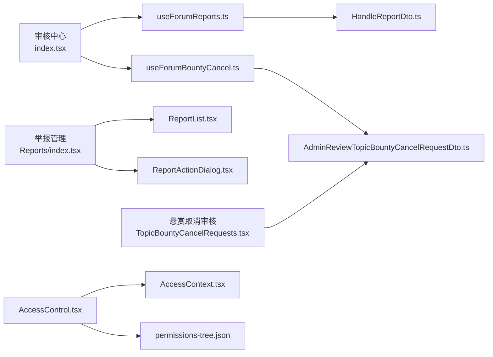

# 论坛管理功能

<cite>
**本文引用的文件**
- [ForumAuditCenter/README.md](file://src/modules/forum/pages/Admin/ForumAuditCenter/README.md)
- [ForumAuditCenter/index.tsx](file://src/modules/forum/pages/Admin/ForumAuditCenter/index.tsx)
- [ForumAuditCenter/hooks/useForumReports.ts](file://src/modules/forum/pages/Admin/ForumAuditCenter/hooks/useForumReports.ts)
- [ForumAuditCenter/hooks/useForumBountyCancel.ts](file://src/modules/forum/pages/Admin/ForumAuditCenter/hooks/useForumBountyCancel.ts)
- [TopicBountyCancelRequests.tsx](file://src/modules/forum/pages/Admin/TopicBountyCancelRequests.tsx)
- [Reports/index.tsx](file://src/modules/app/pages/Reports/index.tsx)
- [Reports/components/ReportList.tsx](file://src/modules/app/pages/Reports/components/ReportList.tsx)
- [Reports/components/ReportActionDialog.tsx](file://src/modules/app/pages/Reports/components/ReportActionDialog.tsx)
- [Reports/components/ReportStats.tsx](file://src/modules/app/pages/Reports/components/ReportStats.tsx)
- [HandleReportDto.ts](file://src/api/models/HandleReportDto.ts)
- [AdminReviewTopicBountyCancelRequestDto.ts](file://src/api/models/AdminReviewTopicBountyCancelRequestDto.ts)
- [AccessContext.tsx](file://src/context/AccessContext.tsx)
- [AccessControl.tsx](file://src/permissions/AccessControl.tsx)
- [permissions-tree.json](file://scripts/out/permissions-tree.json)
- [AuditHistoryItemDto.ts](file://src/api/models/AuditHistoryItemDto.ts)
- [AuditOperatorDto.ts](file://src/api/models/AuditOperatorDto.ts)
- [ListPunishmentRecordsResponseDto.ts](file://src/api/models/ListPunishmentRecordsResponseDto.ts)
- [RevokePunishmentResponseDto.ts](file://src/api/models/RevokePunishmentResponseDto.ts)
</cite>

## 目录
1. [简介](#简介)
2. [项目结构](#项目结构)
3. [核心组件](#核心组件)
4. [架构总览](#架构总览)
5. [详细组件分析](#详细组件分析)
6. [依赖关系分析](#依赖关系分析)
7. [性能考量](#性能考量)
8. [故障排查指南](#故障排查指南)
9. [结论](#结论)
10. [附录](#附录)

## 简介
本文件系统化梳理论坛管理功能，重点覆盖“审核中心”的设计与实现，包括内容审核、举报处理、违规管理、话题悬赏取消请求的审核机制，以及统一的界面设计、数据展示与批量操作能力。同时补充管理员权限控制、操作日志与统计分析的实现要点，并提供管理操作指南与最佳实践。

## 项目结构
论坛管理功能主要分布在以下模块与页面：
- 审核中心（统一入口）：集中承载“举报审核”和“悬赏取消审核”，提供统一筛选、表格与详情抽屉。
- 举报管理（独立页面）：提供举报列表、统计卡片、操作对话框与分页。
- 悬赏取消审核（独立页面）：提供状态筛选、列表与审批按钮。
- 权限与访问控制：基于 AccessContext 与 AccessControl 的权限体系。
- API 类型与服务：通过 OpenAPI 生成的模型与服务调用。

图表来源
- [ForumAuditCenter/index.tsx](file://src/modules/forum/pages/Admin/ForumAuditCenter/index.tsx#L1-L408)
- [Reports/index.tsx](file://src/modules/app/pages/Reports/index.tsx#L1-L124)
- [TopicBountyCancelRequests.tsx](file://src/modules/forum/pages/Admin/TopicBountyCancelRequests.tsx#L1-L163)
- [AccessContext.tsx](file://src/context/AccessContext.tsx#L1-L181)
- [AccessControl.tsx](file://src/permissions/AccessControl.tsx#L1-L43)
- [permissions-tree.json](file://scripts/out/permissions-tree.json#L1-L28)
- [HandleReportDto.ts](file://src/api/models/HandleReportDto.ts#L1-L36)
- [AdminReviewTopicBountyCancelRequestDto.ts](file://src/api/models/AdminReviewTopicBountyCancelRequestDto.ts#L1-L28)
- [AuditHistoryItemDto.ts](file://src/api/models/AuditHistoryItemDto.ts#L1-L49)
- [AuditOperatorDto.ts](file://src/api/models/AuditOperatorDto.ts#L1-L19)
- [ListPunishmentRecordsResponseDto.ts](file://src/api/models/ListPunishmentRecordsResponseDto.ts#L1-L12)
- [RevokePunishmentResponseDto.ts](file://src/api/models/RevokePunishmentResponseDto.ts#L1-L8)

章节来源
- [ForumAuditCenter/README.md](file://src/modules/forum/pages/Admin/ForumAuditCenter/README.md#L1-L42)
- [ForumAuditCenter/index.tsx](file://src/modules/forum/pages/Admin/ForumAuditCenter/index.tsx#L1-L408)
- [Reports/index.tsx](file://src/modules/app/pages/Reports/index.tsx#L1-L124)
- [TopicBountyCancelRequests.tsx](file://src/modules/forum/pages/Admin/TopicBountyCancelRequests.tsx#L1-L163)
- [AccessContext.tsx](file://src/context/AccessContext.tsx#L1-L181)
- [AccessControl.tsx](file://src/permissions/AccessControl.tsx#L1-L43)
- [permissions-tree.json](file://scripts/out/permissions-tree.json#L1-L28)

## 核心组件
- 审核中心（统一入口）
  - 支持“举报审核”和“悬赏取消审核”双通道切换，统一筛选与表格展示。
  - 提供详情抽屉、驳回理由弹窗、分页与加载态。
  - 通过 hooks 抽离数据与交互逻辑，便于扩展新审核类型。
- 举报管理（独立页面）
  - 提供举报统计卡片、列表、操作对话框与分页。
  - 支持“标记已解决”、“删除内容”、“驳回/忽略”、“封禁用户”等操作。
- 悬赏取消审核（独立页面）
  - 提供状态筛选、列表与“同意/拒绝”审批按钮。
  - 与审核中心共享相同的审核模型与服务调用。
- 权限控制
  - AccessContext 负责加载用户角色与权限，AccessControl 基于规则进行渲染控制。
  - 权限树脚本输出页面级权限配置，支撑菜单与按钮级权限。

章节来源
- [ForumAuditCenter/index.tsx](file://src/modules/forum/pages/Admin/ForumAuditCenter/index.tsx#L38-L128)
- [Reports/index.tsx](file://src/modules/app/pages/Reports/index.tsx#L18-L43)
- [TopicBountyCancelRequests.tsx](file://src/modules/forum/pages/Admin/TopicBountyCancelRequests.tsx#L26-L86)
- [AccessContext.tsx](file://src/context/AccessContext.tsx#L64-L172)
- [AccessControl.tsx](file://src/permissions/AccessControl.tsx#L17-L42)
- [permissions-tree.json](file://scripts/out/permissions-tree.json#L1-L28)

## 架构总览
审核中心采用“页面容器 + hooks + UI 组件 + API 类型”的分层设计：
- 页面容器负责状态管理、筛选与路由参数同步。
- hooks 将数据获取、分页与操作封装为可复用逻辑。
- UI 组件遵循论坛主题与样式规范，保证一致性。
- API 类型确保前后端契约清晰，减少联调成本。

图表来源
- [ForumAuditCenter/index.tsx](file://src/modules/forum/pages/Admin/ForumAuditCenter/index.tsx#L44-L99)
- [ForumAuditCenter/hooks/useForumReports.ts](file://src/modules/forum/pages/Admin/ForumAuditCenter/hooks/useForumReports.ts)
- [ForumAuditCenter/hooks/useForumBountyCancel.ts](file://src/modules/forum/pages/Admin/ForumAuditCenter/hooks/useForumBountyCancel.ts)
- [HandleReportDto.ts](file://src/api/models/HandleReportDto.ts#L1-L36)
- [AdminReviewTopicBountyCancelRequestDto.ts](file://src/api/models/AdminReviewTopicBountyCancelRequestDto.ts#L1-L28)

## 详细组件分析

### 审核中心（统一入口）
- 设计目标
  - 在论坛模块内统一承载“举报审核”和“悬赏取消申请审核”，保持 UI 一致与交互高效。
  - 通过统一筛选、队列表格与详情抽屉提升审核效率；支持后续扩展更多论坛域审核类型。
- 关键特性
  - 审核类型切换：举报审核 / 悬赏取消审核。
  - 状态筛选：待处理/已处理/已驳回 或 待审核/已同意/已拒绝/全部。
  - 详情抽屉：展示目标、原因、状态与说明等上下文信息。
  - 驳回理由弹窗：统一收集驳回原因，保障可追溯性。
  - 分页与加载：支持上一页/下一页与加载态提示。
- 权限要求
  - 需管理员或版主角色：admin / moderator。
  - 前端在无权限时显示提示，接口权限由后端控制。

图表来源
- [ForumAuditCenter/index.tsx](file://src/modules/forum/pages/Admin/ForumAuditCenter/index.tsx#L44-L99)
- [ForumAuditCenter/README.md](file://src/modules/forum/pages/Admin/ForumAuditCenter/README.md#L34-L42)

章节来源
- [ForumAuditCenter/README.md](file://src/modules/forum/pages/Admin/ForumAuditCenter/README.md#L1-L42)
- [ForumAuditCenter/index.tsx](file://src/modules/forum/pages/Admin/ForumAuditCenter/index.tsx#L38-L128)

### 举报处理工作流
- 列表与统计
  - 举报管理页面提供统计卡片（待处理、已处理、已驳回、总举报）与列表。
  - 列表支持状态徽章、原因标签、对象标识、举报人与时间等信息。
- 操作流程
  - “标记已解决”：直接更新状态为已处理。
  - “删除内容”：删除被举报内容并自动标记为已解决。
  - “驳回/忽略”：更新状态为已驳回。
  - “封禁用户”：在备注中标注封禁信息（后端增强中）。
- 数据与接口映射
  - 列表查询：reportsControllerFindAll（含分页与状态/关键词过滤）。
  - 处理动作：reportsControllerHandle（含状态、备注、删除内容等字段）。

图表来源
- [Reports/index.tsx](file://src/modules/app/pages/Reports/index.tsx#L18-L43)
- [Reports/components/ReportList.tsx](file://src/modules/app/pages/Reports/components/ReportList.tsx#L29-L176)
- [Reports/components/ReportActionDialog.tsx](file://src/modules/app/pages/Reports/components/ReportActionDialog.tsx#L23-L100)
- [HandleReportDto.ts](file://src/api/models/HandleReportDto.ts#L1-L36)

章节来源
- [Reports/index.tsx](file://src/modules/app/pages/Reports/index.tsx#L18-L43)
- [Reports/components/ReportList.tsx](file://src/modules/app/pages/Reports/components/ReportList.tsx#L29-L176)
- [Reports/components/ReportActionDialog.tsx](file://src/modules/app/pages/Reports/components/ReportActionDialog.tsx#L23-L100)
- [HandleReportDto.ts](file://src/api/models/HandleReportDto.ts#L1-L36)

### 话题悬赏取消请求审核机制
- 列表与筛选
  - 支持状态筛选（待审核/已同意/已拒绝/全部）与分页。
  - 展示话题标题、金额、理由与状态。
- 审批流程
  - “同意”：将请求状态更新为已同意。
  - “拒绝”：将请求状态更新为已拒绝。
  - 支持在同意/拒绝时附带备注。
- 数据与接口映射
  - 列表查询：topicsControllerAdminListCancelRequests（含分页与状态过滤）。
  - 审核动作：topicsControllerAdminReviewCancelRequest（含 topicId、action、note）。

图表来源
- [TopicBountyCancelRequests.tsx](file://src/modules/forum/pages/Admin/TopicBountyCancelRequests.tsx#L26-L82)
- [AdminReviewTopicBountyCancelRequestDto.ts](file://src/api/models/AdminReviewTopicBountyCancelRequestDto.ts#L1-L28)

章节来源
- [TopicBountyCancelRequests.tsx](file://src/modules/forum/pages/Admin/TopicBountyCancelRequests.tsx#L26-L82)
- [AdminReviewTopicBountyCancelRequestDto.ts](file://src/api/models/AdminReviewTopicBountyCancelRequestDto.ts#L1-L28)

### 权限控制与访问校验
- AccessContext
  - 负责加载用户角色与权限，支持从 JWT token 解析用户名，聚合权限来源。
  - 提供 reload 方法以响应登录/登出事件。
- AccessControl
  - 基于 requiredPermissions 与 requiredRoles 进行渲染控制，支持 matchAll 与 combine 策略。
- 权限树
  - 脚本输出页面级权限配置，支撑菜单与按钮级权限。

图表来源
- [AccessContext.tsx](file://src/context/AccessContext.tsx#L64-L172)
- [AccessControl.tsx](file://src/permissions/AccessControl.tsx#L17-L42)
- [permissions-tree.json](file://scripts/out/permissions-tree.json#L1-L28)

章节来源
- [AccessContext.tsx](file://src/context/AccessContext.tsx#L64-L172)
- [AccessControl.tsx](file://src/permissions/AccessControl.tsx#L17-L42)
- [permissions-tree.json](file://scripts/out/permissions-tree.json#L1-L28)

### 操作日志与审计追踪
- 审计历史项
  - 包含操作类型（批准/拒绝）、旧状态、新状态、备注、原因代码、操作时间与操作人信息。
- 审计操作员
  - 包含用户ID、用户名与头像URL。
- 应用场景
  - 用于违规管理与审核追溯，支持复核与责任认定。

章节来源
- [AuditHistoryItemDto.ts](file://src/api/models/AuditHistoryItemDto.ts#L1-L49)
- [AuditOperatorDto.ts](file://src/api/models/AuditOperatorDto.ts#L1-L19)

### 数据统计与分析
- 举报统计卡片
  - 提供待处理、已处理、已驳回、总举报数量的可视化卡片。
- 处罚记录与撤销
  - 列表响应包含 items、total、page、limit 字段。
  - 撤销处罚响应为通用对象结构，便于后续扩展。

章节来源
- [Reports/components/ReportStats.tsx](file://src/modules/app/pages/Reports/components/ReportStats.tsx#L29-L58)
- [ListPunishmentRecordsResponseDto.ts](file://src/api/models/ListPunishmentRecordsResponseDto.ts#L1-L12)
- [RevokePunishmentResponseDto.ts](file://src/api/models/RevokePunishmentResponseDto.ts#L1-L8)

## 依赖关系分析
- 组件耦合
  - 审核中心通过 hooks 与 UI 组件解耦，便于扩展新的审核类型。
  - 举报管理与悬赏取消审核页面分别依赖各自 hooks 与服务。
- 外部依赖
  - API 类型与服务由 OpenAPI 自动生成，确保前后端契约一致。
  - 权限树脚本输出页面级权限，支撑菜单与按钮级权限。

图表来源
- [ForumAuditCenter/index.tsx](file://src/modules/forum/pages/Admin/ForumAuditCenter/index.tsx#L22-L27)
- [Reports/index.tsx](file://src/modules/app/pages/Reports/index.tsx#L12-L16)
- [TopicBountyCancelRequests.tsx](file://src/modules/forum/pages/Admin/TopicBountyCancelRequests.tsx#L2-L8)
- [AccessControl.tsx](file://src/permissions/AccessControl.tsx#L1-L43)
- [AccessContext.tsx](file://src/context/AccessContext.tsx#L1-L181)
- [permissions-tree.json](file://scripts/out/permissions-tree.json#L1-L28)
- [HandleReportDto.ts](file://src/api/models/HandleReportDto.ts#L1-L36)
- [AdminReviewTopicBountyCancelRequestDto.ts](file://src/api/models/AdminReviewTopicBountyCancelRequestDto.ts#L1-L28)

章节来源
- [ForumAuditCenter/index.tsx](file://src/modules/forum/pages/Admin/ForumAuditCenter/index.tsx#L22-L27)
- [Reports/index.tsx](file://src/modules/app/pages/Reports/index.tsx#L12-L16)
- [TopicBountyCancelRequests.tsx](file://src/modules/forum/pages/Admin/TopicBountyCancelRequests.tsx#L2-L8)
- [AccessControl.tsx](file://src/permissions/AccessControl.tsx#L1-L43)
- [AccessContext.tsx](file://src/context/AccessContext.tsx#L1-L181)
- [permissions-tree.json](file://scripts/out/permissions-tree.json#L1-L28)
- [HandleReportDto.ts](file://src/api/models/HandleReportDto.ts#L1-L36)
- [AdminReviewTopicBountyCancelRequestDto.ts](file://src/api/models/AdminReviewTopicBountyCancelRequestDto.ts#L1-L28)

## 性能考量
- 列表加载优化
  - 使用 keepPreviousData 与分页策略，避免频繁重绘与重复请求。
  - 在切换状态/类型时，通过 queryKey 与 refetch 控制缓存命中。
- 渲染优化
  - 表格与抽屉按需渲染，减少不必要的 DOM 更新。
  - 使用 Badge、Select、Button 等轻量 UI 组件，降低渲染负担。
- 数据适配
  - hooks 内对后端返回字段进行统一适配，减少页面层的分支判断。

章节来源
- [ForumAuditCenter/hooks/useForumReports.ts](file://src/modules/forum/pages/Admin/ForumAuditCenter/hooks/useForumReports.ts)
- [ForumAuditCenter/hooks/useForumBountyCancel.ts](file://src/modules/forum/pages/Admin/ForumAuditCenter/hooks/useForumBountyCancel.ts#L14-L32)

## 故障排查指南
- 权限不足
  - 现象：页面显示“无权限访问此页面”。
  - 排查：确认用户角色是否包含 admin 或 moderator；检查权限树配置。
- 列表为空
  - 现象：列表显示“暂无数据”。
  - 排查：检查状态筛选与关键词过滤；确认接口返回数据结构与字段映射。
- 操作失败
  - 现象：点击“同意/拒绝/标记处理”后无响应或报错。
  - 排查：查看网络面板与控制台错误；确认 DTO 字段与服务端契约一致。
- 刷新无效
  - 现象：点击刷新按钮后数据未更新。
  - 排查：确认 refetch 调用与 queryKey 更新；检查分页参数传递。

章节来源
- [ForumAuditCenter/index.tsx](file://src/modules/forum/pages/Admin/ForumAuditCenter/index.tsx#L125-L127)
- [Reports/index.tsx](file://src/modules/app/pages/Reports/index.tsx#L40-L42)
- [AccessContext.tsx](file://src/context/AccessContext.tsx#L102-L154)

## 结论
论坛管理功能通过“审核中心”实现了举报与悬赏取消的统一治理，配合完善的权限控制、操作日志与统计分析，形成闭环的管理流程。页面采用模块化设计，具备良好的扩展性与可维护性，适合未来接入更多审核类型与高级筛选能力。

## 附录
- 管理操作指南
  - 举报处理：在举报管理页面选择“标记已解决/删除内容/驳回/封禁用户”，填写备注并确认。
  - 悬赏取消：在悬赏取消审核页面选择“同意/拒绝”，填写备注并确认。
  - 审核中心：在审核中心切换类型与状态，使用详情抽屉与驳回理由弹窗完成处理。
- 最佳实践
  - 统一使用 DTO 构造请求，确保字段与后端契约一致。
  - 对关键操作（删除内容、封禁用户）务必填写备注，便于审计。
  - 定期查看统计卡片与审计历史，评估审核质量与风险趋势。
  - 通过权限树精细化控制页面与按钮级权限，避免越权访问。