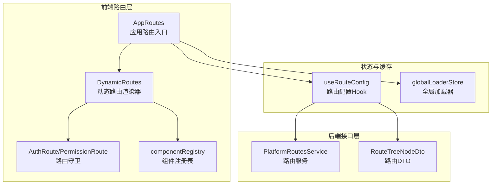
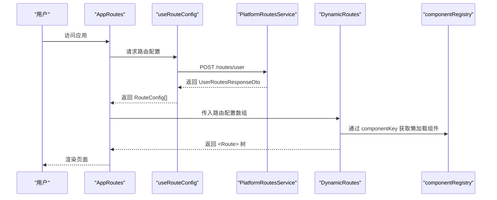
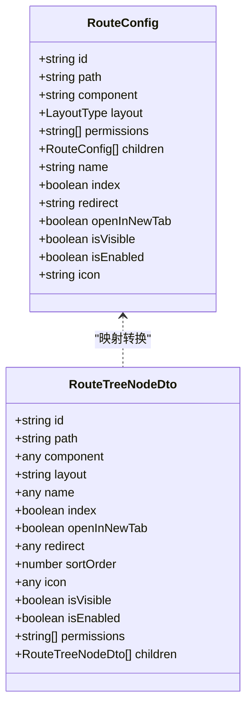
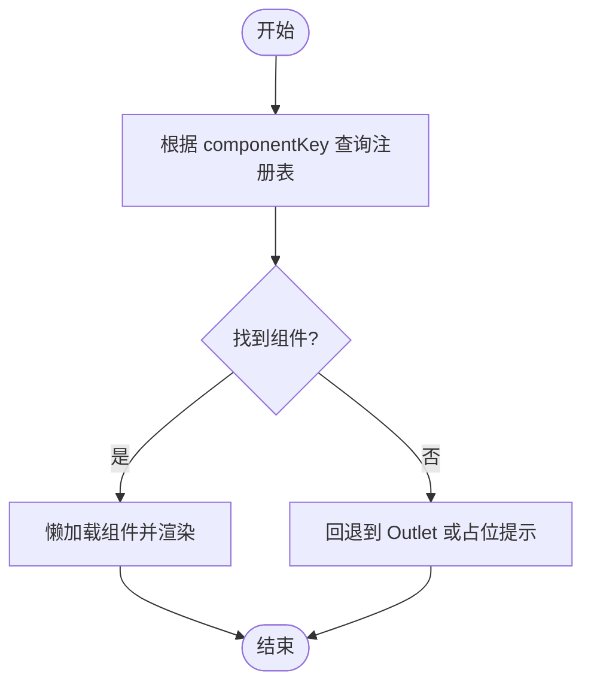
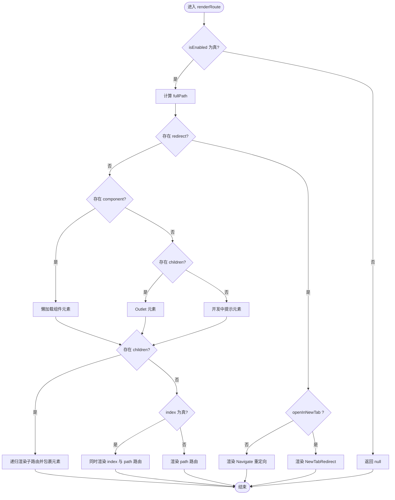
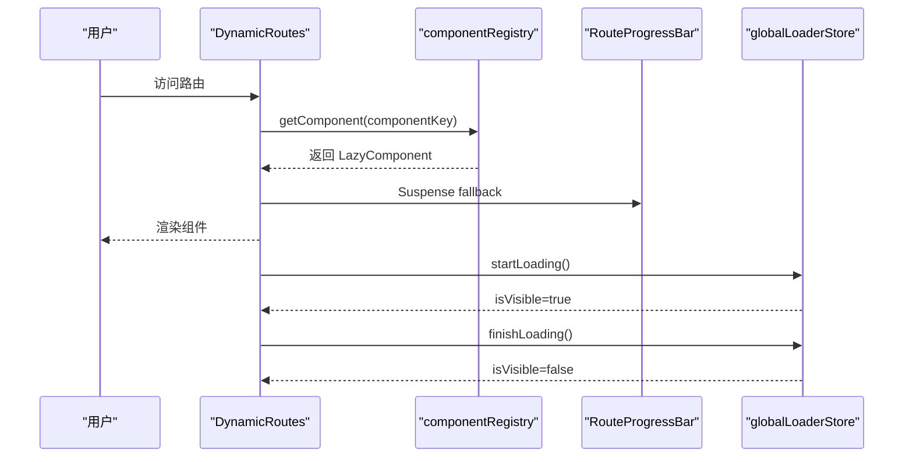
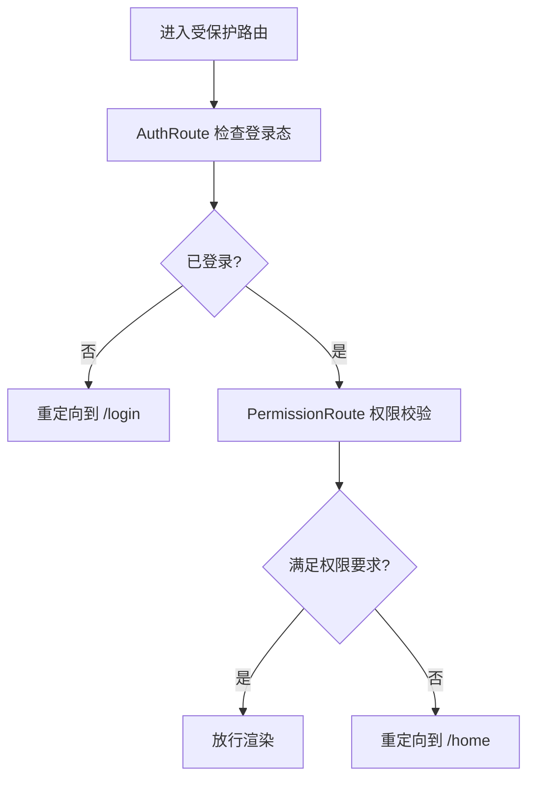
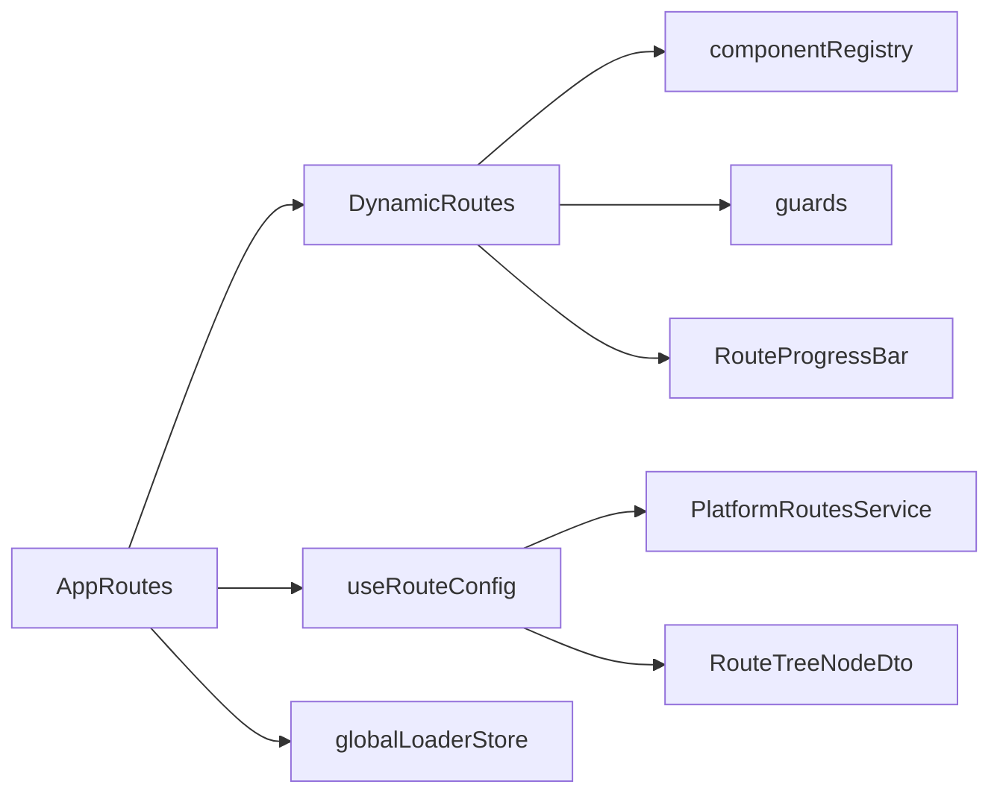

# 动态路由设计

<cite>
**本文档引用的文件**
- [DynamicRoutes.tsx](file://src/route/DynamicRoutes.tsx)
- [AppRoutes.tsx](file://src/route/AppRoutes.tsx)
- [componentRegistry.ts](file://src/route/componentRegistry.ts)
- [routeConfig.ts](file://src/types/routeConfig.ts)
- [useRouteConfig.ts](file://src/hooks/useRouteConfig.ts)
- [guards.tsx](file://src/route/guards.tsx)
- [RouteTreeNodeDto.ts](file://src/api/models/RouteTreeNodeDto.ts)
- [PlatformRoutesService.ts](file://src/api/services/PlatformRoutesService.ts)
- [RouteProgressBar.tsx](file://src/modules/app/components/ui/RouteProgressBar.tsx)
- [globalLoaderStore.ts](file://src/stores/globalLoaderStore.ts)
- [dynamic-routes-api.md](file://docs/dev/dynamic-routes-api.md)
- [check-routes-schema.mjs](file://scripts/check-routes-schema.mjs)
- [permissions-tree.json](file://scripts/out/permissions-tree.json)
</cite>

## 目录
1. [简介](#简介)
2. [项目结构](#项目结构)
3. [核心组件](#核心组件)
4. [架构总览](#架构总览)
5. [详细组件分析](#详细组件分析)
6. [依赖关系分析](#依赖关系分析)
7. [性能考量](#性能考量)
8. [故障排查指南](#故障排查指南)
9. [结论](#结论)
10. [附录](#附录)

## 简介
本文件面向动态路由系统的设计与实现，围绕以下目标展开：  
- 解释动态路由的核心理念：以“后端驱动”的路由树为基础，前端通过组件注册表与布局包装器进行渲染与权限控制。  
- 描述路由配置模型的数据结构与组件映射机制，以及路由渲染算法、懒加载策略与路由层级处理。  
- 给出路由配置的 JSON Schema 定义、组件映射规则与缓存策略，并提供最佳实践、性能优化与调试方法。  
- 说明如何扩展系统以支持新的布局类型与组件类型。

## 项目结构
动态路由系统主要由以下层次构成：
- 路由入口与容器：应用路由入口负责组织公开路由与动态路由，统一挂载全局加载器与404兜底。
- 动态路由渲染器：根据后端返回的路由树，递归生成React Router的<Route>树，并按布局类型包裹。
- 组件注册表：维护componentKey到懒加载组件的映射，支持按需加载与统一管理。
- 路由配置Hook：拉取后端路由树，进行DTO到前端配置的转换，并提供缓存与兜底逻辑。
- 路由守卫：提供登录态与权限级别的路由保护。
- API层：提供获取用户路由树、导入路由与清理缓存等接口。

图表来源
- [AppRoutes.tsx](file://src/route/AppRoutes.tsx#L73-L98)
- [DynamicRoutes.tsx](file://src/route/DynamicRoutes.tsx#L270-L292)
- [guards.tsx](file://src/route/guards.tsx#L11-L15)
- [componentRegistry.ts](file://src/route/componentRegistry.ts#L15-L250)
- [useRouteConfig.ts](file://src/hooks/useRouteConfig.ts#L38-L100)
- [PlatformRoutesService.ts](file://src/api/services/PlatformRoutesService.ts#L17-L35)
- [RouteTreeNodeDto.ts](file://src/api/models/RouteTreeNodeDto.ts#L5-L75)
- [globalLoaderStore.ts](file://src/stores/globalLoaderStore.ts#L19-L35)

章节来源
- [AppRoutes.tsx](file://src/route/AppRoutes.tsx#L1-L115)
- [DynamicRoutes.tsx](file://src/route/DynamicRoutes.tsx#L1-L308)
- [componentRegistry.ts](file://src/route/componentRegistry.ts#L1-L259)
- [useRouteConfig.ts](file://src/hooks/useRouteConfig.ts#L1-L109)
- [guards.tsx](file://src/route/guards.tsx#L1-L103)
- [PlatformRoutesService.ts](file://src/api/services/PlatformRoutesService.ts#L1-L90)
- [RouteTreeNodeDto.ts](file://src/api/models/RouteTreeNodeDto.ts#L1-L75)
- [globalLoaderStore.ts](file://src/stores/globalLoaderStore.ts#L1-L36)

## 核心组件
- 动态路由渲染器：负责将RouteConfig树渲染为React Router的<Route>树，支持索引路由、重定向、新标签页打开、布局包裹与子路由递归。
- 组件注册表：集中管理componentKey到懒加载组件的映射，提供查询与存在性检查。
- 路由配置Hook：从后端获取用户可访问的路由树，进行DTO到前端配置的转换，提供缓存、兜底与响应式刷新。
- 路由守卫：提供基础登录态守卫与基于权限字符串的高级守卫。
- 应用路由入口：组织公开路由、动态路由与404兜底，统一加载全局加载器。

章节来源
- [DynamicRoutes.tsx](file://src/route/DynamicRoutes.tsx#L56-L125)
- [componentRegistry.ts](file://src/route/componentRegistry.ts#L248-L258)
- [useRouteConfig.ts](file://src/hooks/useRouteConfig.ts#L15-L32)
- [guards.tsx](file://src/route/guards.tsx#L11-L102)
- [AppRoutes.tsx](file://src/route/AppRoutes.tsx#L73-L98)

## 架构总览
动态路由系统采用“后端驱动 + 前端渲染 + 组件注册表 + 路由守卫”的分层架构。后端提供路由树DTO，前端通过Hook转换为前端配置，再由渲染器递归生成路由树；组件通过注册表按需懒加载；守卫在进入路由前进行鉴权。

图表来源
- [AppRoutes.tsx](file://src/route/AppRoutes.tsx#L73-L98)
- [useRouteConfig.ts](file://src/hooks/useRouteConfig.ts#L63-L100)
- [PlatformRoutesService.ts](file://src/api/services/PlatformRoutesService.ts#L17-L35)
- [DynamicRoutes.tsx](file://src/route/DynamicRoutes.tsx#L255-L264)
- [componentRegistry.ts](file://src/route/componentRegistry.ts#L248-L250)

## 详细组件分析

### 路由配置模型与JSON Schema
- 前端配置模型：RouteConfig定义了路由的唯一标识、路径、组件键、布局类型、权限、子路由、索引路由、重定向、可见性、启用状态与图标等字段。
- 后端DTO模型：RouteTreeNodeDto定义了与后端交互的路由节点结构，包含id、path、component、layout、name、index、openInNewTab、redirect、sortOrder、icon、isVisible、isEnabled、permissions、children等。
- 转换流程：useRouteConfig将RouteTreeNodeDto映射为RouteConfig，强制组件键为字符串，默认布局为none，启用状态默认true，支持children递归映射。

图表来源
- [RouteTreeNodeDto.ts](file://src/api/models/RouteTreeNodeDto.ts#L5-L75)
- [routeConfig.ts](file://src/types/routeConfig.ts#L14-L48)
- [useRouteConfig.ts](file://src/hooks/useRouteConfig.ts#L15-L32)

章节来源
- [routeConfig.ts](file://src/types/routeConfig.ts#L1-L49)
- [RouteTreeNodeDto.ts](file://src/api/models/RouteTreeNodeDto.ts#L1-L75)
- [useRouteConfig.ts](file://src/hooks/useRouteConfig.ts#L15-L32)

### 组件注册机制与映射规则
- 组件注册表：componentRegistry以componentKey为索引，存储懒加载组件，便于动态路由按需加载。
- 组件映射规则：后端返回的component字段需与注册表中的key一致；若未找到，渲染器会回退到Outlet或提示“页面开发中”。
- 新增组件：在componentRegistry中新增key与对应懒加载组件即可接入动态路由。

图表来源
- [componentRegistry.ts](file://src/route/componentRegistry.ts#L15-L250)
- [DynamicRoutes.tsx](file://src/route/DynamicRoutes.tsx#L77-L86)

章节来源
- [componentRegistry.ts](file://src/route/componentRegistry.ts#L1-L259)
- [DynamicRoutes.tsx](file://src/route/DynamicRoutes.tsx#L77-L86)

### 路由渲染算法与层级处理
- 父子路由：renderRoute递归处理children，过滤未启用子路由；支持index路由与普通路径路由并存。
- 布局包裹：renderLayoutRoutes根据layout类型选择AppLayout、AdminLayout或Forum布局，并在必要时添加局部404。
- 重定向与新标签页：优先处理redirect；openInNewTab为true时，渲染NewTabRedirect组件执行window.open。
- 索引路由：当index为true时，同时渲染index路由与path路由，解决/admin/users/list访问不到的问题。

图表来源
- [DynamicRoutes.tsx](file://src/route/DynamicRoutes.tsx#L56-L125)
- [DynamicRoutes.tsx](file://src/route/DynamicRoutes.tsx#L130-L249)

章节来源
- [DynamicRoutes.tsx](file://src/route/DynamicRoutes.tsx#L56-L125)
- [DynamicRoutes.tsx](file://src/route/DynamicRoutes.tsx#L130-L249)

### 懒加载机制与进度反馈
- 组件懒加载：通过React.lazy与Suspense实现按需加载，提升首屏性能。
- 进度反馈：RouteProgressBar监听路由切换与React Query请求状态，提供细粒度的加载进度提示。
- 全局加载器：globalLoaderStore采用引用计数模式，多个并发加载任务叠加，全部完成后隐藏。

图表来源
- [DynamicRoutes.tsx](file://src/route/DynamicRoutes.tsx#L77-L86)
- [RouteProgressBar.tsx](file://src/modules/app/components/ui/RouteProgressBar.tsx#L82-L101)
- [globalLoaderStore.ts](file://src/stores/globalLoaderStore.ts#L19-L35)

章节来源
- [DynamicRoutes.tsx](file://src/route/DynamicRoutes.tsx#L77-L86)
- [RouteProgressBar.tsx](file://src/modules/app/components/ui/RouteProgressBar.tsx#L82-L101)
- [globalLoaderStore.ts](file://src/stores/globalLoaderStore.ts#L1-L36)

### 路由守卫与权限控制
- 登录态守卫：AuthRoute检查localStorage中的accessToken，未登录则重定向至登录页。
- 权限守卫：PermissionRoute结合用户角色与权限字符串进行校验，支持AND/OR组合与matchAll策略；admin用户直接放行。
- 集成方式：动态路由在需要保护的布局中嵌套AuthRoute，复杂场景可使用PermissionRoute。

图表来源
- [guards.tsx](file://src/route/guards.tsx#L11-L15)
- [guards.tsx](file://src/route/guards.tsx#L20-L102)

章节来源
- [guards.tsx](file://src/route/guards.tsx#L1-L103)

### 路由配置的JSON Schema定义
- 根对象包含routes数组，每个元素为路由节点。
- 路由节点字段（必填/可选）：
  - id: string（必填）
  - path: string（必填）
  - component: string（可选）
  - layout: "app"|"admin"|"forum"|"none"（可选）
  - name: string（可选）
  - index: boolean（可选）
  - openInNewTab: boolean（可选）
  - redirect: string（可选）
  - sortOrder: number（可选）
  - icon: string（可选）
  - isVisible: boolean（可选）
  - isEnabled: boolean（可选）
  - permissions: string[]（可选）
  - children: RouteNode[]（可选）

章节来源
- [RouteTreeNodeDto.ts](file://src/api/models/RouteTreeNodeDto.ts#L5-L75)
- [dynamic-routes-api.md](file://docs/dev/dynamic-routes-api.md#L80-L96)

### 路由缓存策略
- useRouteConfig使用React Query缓存，staleTime为5分钟，retry为1次，确保登录态变化时能响应式刷新。
- 后端提供清理缓存接口，可用于开发调试与热更新场景。
- 数据库层面：routes表包含id、path、component、layout、name、index、openInNewTab、redirect、sortOrder、icon、isVisible、isEnabled、permissions、children等字段，可通过脚本查看表结构与示例数据。

章节来源
- [useRouteConfig.ts](file://src/hooks/useRouteConfig.ts#L96-L100)
- [PlatformRoutesService.ts](file://src/api/services/PlatformRoutesService.ts#L66-L88)
- [check-routes-schema.mjs](file://scripts/check-routes-schema.mjs#L17-L38)

### 最佳实践
- 组件命名规范：componentKey与实际组件文件保持一致，避免拼写错误导致懒加载失败。
- 布局选择：根据业务域选择app/admin/forum/none，确保导航与权限体系一致。
- 子路由组织：合理使用children与index，保证路径与默认路由的正确性。
- 权限配置：为敏感路由配置permissions，避免越权访问。
- 兜底策略：后端缺失Admin节点时，前端会注入兜底节点，确保/admin路径可匹配。

章节来源
- [dynamic-routes-api.md](file://docs/dev/dynamic-routes-api.md#L99-L121)
- [useRouteConfig.ts](file://src/hooks/useRouteConfig.ts#L77-L92)

### 调试方法
- 路由配置调试：通过POST /routes/clear-cache清理缓存，确保获取最新配置；使用POST /routes/import导入全量JSON覆盖配置。
- 权限树检查：参考scripts/out/permissions-tree.json，核对页面权限与按钮权限映射。
- 控制台日志：useRouteConfig与PermissionRoute均输出详细日志，便于定位问题。

章节来源
- [PlatformRoutesService.ts](file://src/api/services/PlatformRoutesService.ts#L66-L88)
- [permissions-tree.json](file://scripts/out/permissions-tree.json#L1-L28)
- [guards.tsx](file://src/route/guards.tsx#L79-L102)

## 依赖关系分析
- AppRoutes依赖DynamicRoutes与useRouteConfig，负责组织公开路由与动态路由。
- DynamicRoutes依赖componentRegistry、guards与UI组件，负责渲染与懒加载。
- useRouteConfig依赖PlatformRoutesService与RouteTreeNodeDto，负责数据获取与转换。
- guards依赖AccessContext与localStorage，负责鉴权。
- globalLoaderStore与RouteProgressBar共同提供加载体验。

图表来源
- [AppRoutes.tsx](file://src/route/AppRoutes.tsx#L73-L98)
- [DynamicRoutes.tsx](file://src/route/DynamicRoutes.tsx#L255-L264)
- [useRouteConfig.ts](file://src/hooks/useRouteConfig.ts#L38-L100)
- [PlatformRoutesService.ts](file://src/api/services/PlatformRoutesService.ts#L17-L35)
- [RouteTreeNodeDto.ts](file://src/api/models/RouteTreeNodeDto.ts#L5-L75)
- [guards.tsx](file://src/route/guards.tsx#L11-L15)
- [globalLoaderStore.ts](file://src/stores/globalLoaderStore.ts#L19-L35)
- [RouteProgressBar.tsx](file://src/modules/app/components/ui/RouteProgressBar.tsx#L82-L101)

章节来源
- [AppRoutes.tsx](file://src/route/AppRoutes.tsx#L1-L115)
- [DynamicRoutes.tsx](file://src/route/DynamicRoutes.tsx#L1-L308)
- [useRouteConfig.ts](file://src/hooks/useRouteConfig.ts#L1-L109)
- [PlatformRoutesService.ts](file://src/api/services/PlatformRoutesService.ts#L1-L90)
- [RouteTreeNodeDto.ts](file://src/api/models/RouteTreeNodeDto.ts#L1-L75)
- [guards.tsx](file://src/route/guards.tsx#L1-L103)
- [globalLoaderStore.ts](file://src/stores/globalLoaderStore.ts#L1-L36)
- [RouteProgressBar.tsx](file://src/modules/app/components/ui/RouteProgressBar.tsx#L82-L101)

## 性能考量
- 懒加载与Suspense：按需加载组件，减少初始包体积，提升首屏速度。
- 引用计数加载器：多任务并发加载时避免重复显示加载器，降低闪烁。
- 缓存策略：5分钟staleTime与有限retry，平衡实时性与性能。
- 子路由过滤：未启用子路由直接过滤，避免无效渲染。
- 404局部化：在特定布局下提供局部404，避免整站重定向带来的性能损耗。

[本节为通用性能建议，不直接分析具体文件]

## 故障排查指南
- 组件未找到：检查componentKey是否存在于componentRegistry，确认懒加载路径正确。
- 路由不生效：确认isEnabled为true，检查path与parentPath拼接是否正确。
- 权限不足：查看PermissionRoute日志，确认用户角色与权限字符串匹配。
- 登录态异常：监听authChange与storage事件，确保useRouteConfig在登录态变化时刷新。
- 缓存问题：调用POST /routes/clear-cache清理缓存，或使用POST /routes/import导入最新配置。

章节来源
- [componentRegistry.ts](file://src/route/componentRegistry.ts#L248-L258)
- [DynamicRoutes.tsx](file://src/route/DynamicRoutes.tsx#L64-L75)
- [guards.tsx](file://src/route/guards.tsx#L79-L102)
- [useRouteConfig.ts](file://src/hooks/useRouteConfig.ts#L46-L61)
- [PlatformRoutesService.ts](file://src/api/services/PlatformRoutesService.ts#L66-L88)

## 结论
动态路由系统通过“后端驱动 + 前端渲染 + 组件注册表 + 路由守卫”的架构，实现了灵活、可扩展、可维护的路由体系。借助懒加载、进度反馈与缓存策略，系统在性能与体验之间取得良好平衡。通过清晰的配置模型与严格的权限控制，开发者可以快速扩展新的布局类型与组件类型，同时保持一致的用户体验。

[本节为总结性内容，不直接分析具体文件]

## 附录
- 扩展新布局类型：在getLayoutWrapper中新增case分支，并在componentRegistry中补充布局组件的懒加载映射。
- 扩展新组件类型：在componentRegistry中新增componentKey与对应懒加载组件，确保后端component字段与之匹配。
- 数据库结构：routes表字段与示例数据可通过脚本查看，便于核对与迁移。

章节来源
- [DynamicRoutes.tsx](file://src/route/DynamicRoutes.tsx#L39-L51)
- [componentRegistry.ts](file://src/route/componentRegistry.ts#L15-L250)
- [check-routes-schema.mjs](file://scripts/check-routes-schema.mjs#L17-L38)