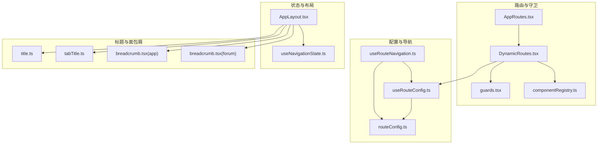
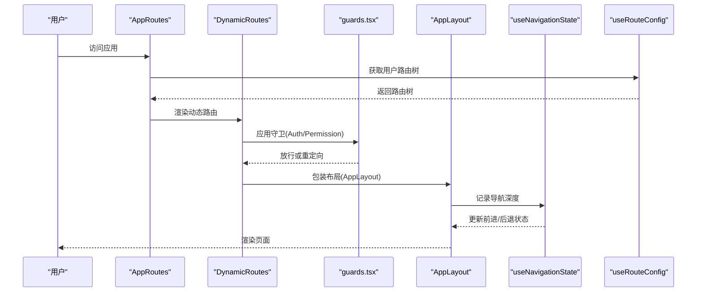
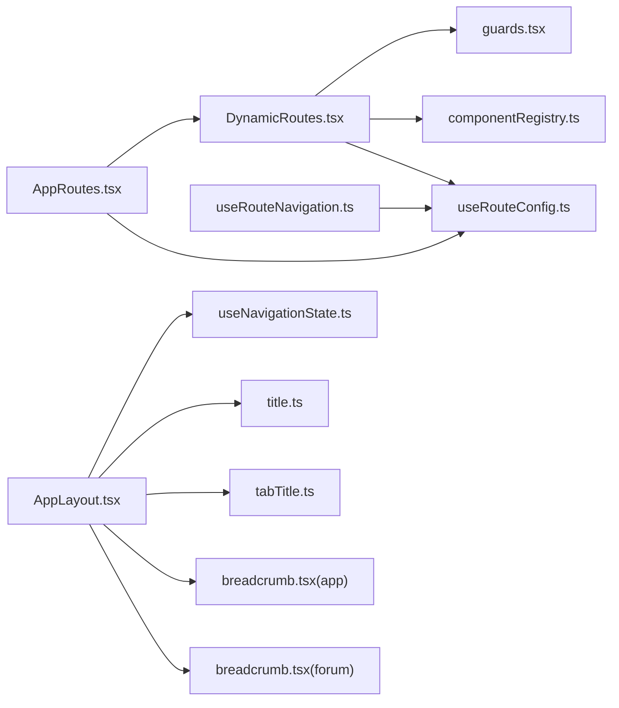

# 导航系统

<cite>
**本文档引用的文件**
- [AppRoutes.tsx](file://src/routes/AppRoutes.tsx)
- [DynamicRoutes.tsx](file://src/routes/DynamicRoutes.tsx)
- [guards.tsx](file://src/routes/guards.tsx)
- [componentRegistry.ts](file://src/routes/componentRegistry.ts)
- [useRouteConfig.ts](file://src/hooks/useRouteConfig.ts)
- [useRouteNavigation.ts](file://src/hooks/useRouteNavigation.ts)
- [useNavigationState.ts](file://src/hooks/useNavigationState.ts)
- [routeConfig.ts](file://src/types/routeConfig.ts)
- [AppLayout.tsx](file://src/modules/app/layouts/AppLayout.tsx)
- [breadcrumb.tsx（app）](file://src/modules/app/components/ui/breadcrumb.tsx)
- [breadcrumb.tsx（forum）](file://src/modules/forum/components/ui/breadcrumb.tsx)
- [title.ts](file://src/utils/title.ts)
- [tabTitle.ts](file://src/utils/tabTitle.ts)
- [dynamic-routes-api.md](file://docs/dev/dynamic-routes-api.md)
- [README.md](file://README.md)
</cite>

## 目录
1. [简介](#简介)
2. [项目结构](#项目结构)
3. [核心组件](#核心组件)
4. [架构总览](#架构总览)
5. [详细组件分析](#详细组件分析)
6. [依赖关系分析](#依赖关系分析)
7. [性能考量](#性能考量)
8. [故障排查指南](#故障排查指南)
9. [结论](#结论)
10. [附录](#附录)

## 简介
本导航系统基于 React Router v6 与动态路由配置，实现了“后端驱动”的路由与导航能力。系统通过后端提供的用户可访问路由树，动态生成页面路由、布局包装、权限守卫与导航菜单，并提供应用内前进/后退状态管理、标题与站点图标注入、以及面包屑组件等配套能力。本文档将深入解析路由导航实现机制、导航状态管理、路由跳转流程、导航钩子与守卫、参数与查询处理、标题与面包屑管理、历史维护策略，以及性能优化与最佳实践。

## 项目结构
导航系统主要分布在以下模块与文件：
- 路由入口与公共页面：AppRoutes.tsx
- 动态路由渲染与布局包装：DynamicRoutes.tsx、componentRegistry.ts
- 路由守卫：guards.tsx
- 路由配置与权限：useRouteConfig.ts、routeConfig.ts
- 导航数据与菜单生成：useRouteNavigation.ts
- 导航历史与前进/后退状态：useNavigationState.ts、AppLayout.tsx
- 标题与图标：title.ts、tabTitle.ts
- 面包屑：modules/app/components/ui/breadcrumb.tsx、modules/forum/components/ui/breadcrumb.tsx
- 文档与接口规范：docs/dev/dynamic-routes-api.md

图表来源
- [AppRoutes.tsx](file://src/routes/AppRoutes.tsx#L73-L98)
- [DynamicRoutes.tsx](file://src/routes/DynamicRoutes.tsx#L255-L264)
- [guards.tsx](file://src/routes/guards.tsx#L11-L15)
- [componentRegistry.ts](file://src/routes/componentRegistry.ts#L1-L259)
- [useRouteConfig.ts](file://src/hooks/useRouteConfig.ts#L38-L108)
- [routeConfig.ts](file://src/types/routeConfig.ts#L14-L48)
- [useRouteNavigation.ts](file://src/hooks/useRouteNavigation.ts#L105-L141)
- [useNavigationState.ts](file://src/hooks/useNavigationState.ts#L87-L135)
- [AppLayout.tsx](file://src/modules/app/layouts/AppLayout.tsx#L40-L82)
- [title.ts](file://src/utils/title.ts#L5-L12)
- [tabTitle.ts](file://src/utils/tabTitle.ts#L16-L46)
- [breadcrumb.tsx（app）](file://src/modules/app/components/ui/breadcrumb.tsx#L1-L55)
- [breadcrumb.tsx（forum）](file://src/modules/forum/components/ui/breadcrumb.tsx#L1-L55)

章节来源
- [AppRoutes.tsx](file://src/routes/AppRoutes.tsx#L1-L115)
- [DynamicRoutes.tsx](file://src/routes/DynamicRoutes.tsx#L1-L308)
- [guards.tsx](file://src/routes/guards.tsx#L1-L103)
- [componentRegistry.ts](file://src/routes/componentRegistry.ts#L1-L259)
- [useRouteConfig.ts](file://src/hooks/useRouteConfig.ts#L1-L109)
- [routeConfig.ts](file://src/types/routeConfig.ts#L1-L49)
- [useRouteNavigation.ts](file://src/hooks/useRouteNavigation.ts#L1-L142)
- [useNavigationState.ts](file://src/hooks/useNavigationState.ts#L1-L138)
- [AppLayout.tsx](file://src/modules/app/layouts/AppLayout.tsx#L1-L83)
- [breadcrumb.tsx（app）](file://src/modules/app/components/ui/breadcrumb.tsx#L1-L55)
- [breadcrumb.tsx（forum）](file://src/modules/forum/components/ui/breadcrumb.tsx#L1-L55)
- [title.ts](file://src/utils/title.ts#L1-L13)
- [tabTitle.ts](file://src/utils/tabTitle.ts#L1-L66)
- [dynamic-routes-api.md](file://docs/dev/dynamic-routes-api.md#L1-L127)
- [README.md](file://README.md#L1-L11)

## 核心组件
- 路由入口与公共页面：AppRoutes.tsx 负责公开路由（登录/注册/忘记密码）、根重定向与 404 回退；在动态路由加载完成前显示加载指示器。
- 动态路由渲染：DynamicRoutes.tsx 根据后端路由树生成路由与布局包装，支持重定向、索引路由、新标签页打开、布局切换与局部 404。
- 路由守卫：guards.tsx 提供基础登录态守卫与基于权限/角色的高级守卫，支持 OR/AND 组合与管理员豁免。
- 组件注册表：componentRegistry.ts 建立 componentKey 与懒加载组件的映射，支撑动态路由按需加载。
- 路由配置 Hook：useRouteConfig.ts 从后端获取用户可访问路由树，处理认证状态变化、本地兜底与缓存策略。
- 导航 Hook：useRouteNavigation.ts 将路由配置转换为导航项，按平台过滤并进行权限过滤。
- 导航状态 Hook：useNavigationState.ts 管理应用内前进/后退状态，基于 history.state 深度标记实现。
- 标题与图标：title.ts 与 tabTitle.ts 提供标题组合与动态 favicon 注入能力。
- 面包屑：两套 breadcrumb 组件分别服务于 app 与 forum 布局。

章节来源
- [AppRoutes.tsx](file://src/routes/AppRoutes.tsx#L73-L115)
- [DynamicRoutes.tsx](file://src/routes/DynamicRoutes.tsx#L56-L249)
- [guards.tsx](file://src/routes/guards.tsx#L11-L102)
- [componentRegistry.ts](file://src/routes/componentRegistry.ts#L15-L259)
- [useRouteConfig.ts](file://src/hooks/useRouteConfig.ts#L38-L108)
- [useRouteNavigation.ts](file://src/hooks/useRouteNavigation.ts#L105-L141)
- [useNavigationState.ts](file://src/hooks/useNavigationState.ts#L87-L135)
- [title.ts](file://src/utils/title.ts#L5-L12)
- [tabTitle.ts](file://src/utils/tabTitle.ts#L16-L46)
- [breadcrumb.tsx（app）](file://src/modules/app/components/ui/breadcrumb.tsx#L1-L55)
- [breadcrumb.tsx（forum）](file://src/modules/forum/components/ui/breadcrumb.tsx#L1-L55)

## 架构总览
系统采用“后端驱动”的动态路由架构：前端通过 useRouteConfig 从后端拉取用户可访问的路由树，DynamicRoutes 根据树渲染路由与布局，guards.tsx 在进入页面前进行权限校验，AppLayout 注入标题、图标与导航状态记录，useRouteNavigation 将路由树转换为导航菜单，useNavigationState 提供应用内前进/后退能力。

图表来源
- [AppRoutes.tsx](file://src/routes/AppRoutes.tsx#L73-L98)
- [DynamicRoutes.tsx](file://src/routes/DynamicRoutes.tsx#L255-L264)
- [guards.tsx](file://src/routes/guards.tsx#L11-L102)
- [AppLayout.tsx](file://src/modules/app/layouts/AppLayout.tsx#L23-L38)
- [useNavigationState.ts](file://src/hooks/useNavigationState.ts#L110-L126)
- [useRouteConfig.ts](file://src/hooks/useRouteConfig.ts#L63-L100)

## 详细组件分析

### 路由入口与公共页面（AppRoutes）
- 公开路由：登录、注册、忘记密码，均使用懒加载与包装器处理跳转与登录态判断。
- 根重定向：/ 重定向至 /app/home。
- 动态路由：通过 useDynamicRouteElements 渲染后端路由树。
- 404 回退：未登录时重定向到登录页并携带 from 参数；已登录显示 404 页面。

章节来源
- [AppRoutes.tsx](file://src/routes/AppRoutes.tsx#L11-L115)

### 动态路由渲染与布局包装（DynamicRoutes）
- 组件映射：根据 componentKey 从注册表懒加载组件。
- 布局包装：根据 layout 类型选择 AppLayout/AdminLayout/ForumLayout 或无布局。
- 重定向：支持当前页重定向与新标签页打开两种模式。
- 索引路由：支持 index 与 path 同时存在，解决深层路径访问问题。
- 局部 404：Admin/Forum 分支提供局部 404 页面。

章节来源
- [DynamicRoutes.tsx](file://src/routes/DynamicRoutes.tsx#L56-L249)
- [componentRegistry.ts](file://src/routes/componentRegistry.ts#L248-L259)

### 路由守卫（guards）
- AuthRoute：仅判断是否已登录，未登录重定向到 /login。
- PermissionRoute：支持角色与权限的 AND/OR 组合、matchAll 控制、管理员豁免、loading 状态提示与权限不足回退到首页。

章节来源
- [guards.tsx](file://src/routes/guards.tsx#L11-L102)

### 路由配置与权限（useRouteConfig、routeConfig）
- 数据模型：RouteConfig/RouteConfigResponse 描述路由树字段（id/path/component/layout/permissions/children/name/index/redirect/openInNewTab/isVisible/isEnabled/icon）。
- 配置获取：通过 PlatformRoutesService.routesControllerGetUserRoutes 拉取用户路由树，本地兜底 admin 节点，启用缓存与重试。
- 认证联动：监听 authChange/storage 事件，确保登录状态变化时响应式更新。

章节来源
- [routeConfig.ts](file://src/types/routeConfig.ts#L14-L48)
- [useRouteConfig.ts](file://src/hooks/useRouteConfig.ts#L38-L108)
- [dynamic-routes-api.md](file://docs/dev/dynamic-routes-api.md#L16-L58)

### 导航数据与菜单生成（useRouteNavigation）
- 转换逻辑：将路由树转换为导航项，拼接完整路径，过滤不可见路由。
- 权限过滤：支持递归过滤无权限的导航项，管理员豁免。
- 平台过滤：分别生成 desktop/mobile 导航项。

章节来源
- [useRouteNavigation.ts](file://src/hooks/useRouteNavigation.ts#L33-L141)

### 导航历史与前进/后退（useNavigationState、AppLayout）
- 深度标记：在 history.state 中写入导航深度，支持 popstate 事件同步。
- 应用内导航：通过 NavigationStateReset 在路由变化时记录深度，拦截浏览器原生前进/后退事件，避免误判。
- 前进/后退：暴露 canGoBack/canGoForward/goBack/goForward/recordNavigation。

章节来源
- [useNavigationState.ts](file://src/hooks/useNavigationState.ts#L35-L135)
- [AppLayout.tsx](file://src/modules/app/layouts/AppLayout.tsx#L23-L38)

### 标题与图标注入（title、tabTitle）
- 标题组合：composeTitle 根据站点标题与页面名称生成最终标题。
- 动态 favicon：支持 SVG/URL 两种方式注入动态图标，清理多余图标链接。

章节来源
- [title.ts](file://src/utils/title.ts#L5-L12)
- [tabTitle.ts](file://src/utils/tabTitle.ts#L16-L64)

### 面包屑组件（breadcrumb）
- 通用结构：包含 Breadcrumb、BreadcrumbList、BreadcrumbItem、BreadcrumbLink、BreadcrumbPage。
- 复用：app 与 forum 各自提供一套实现，遵循相同结构与样式约定。

章节来源
- [breadcrumb.tsx（app）](file://src/modules/app/components/ui/breadcrumb.tsx#L1-L55)
- [breadcrumb.tsx（forum）](file://src/modules/forum/components/ui/breadcrumb.tsx#L1-L55)

### 路由跳转与参数、查询处理
- 路由跳转：AppRoutes 中公开页面包装器通过 useNavigate 进行跳转；动态路由支持重定向与新标签页打开。
- 查询参数：AppRoutes 在登录包装器中读取 URLSearchParams 的 from 参数，用于登录成功后的回跳。
- 参数传递：动态路由渲染时按层级拼接路径，支持 children 与 index 的组合。

章节来源
- [AppRoutes.tsx](file://src/routes/AppRoutes.tsx#L19-L38)
- [DynamicRoutes.tsx](file://src/routes/DynamicRoutes.tsx#L56-L125)

### 导航钩子函数与自定义组件
- 自定义导航组件：可在 AppLayout 中扩展导航按钮容器，结合 useNavigationState 的 goBack/goForward 实现前进/后退。
- 导航钩子：useRouteNavigation 提供 desktop/mobile 导航数据；useRouteConfig 提供路由树与加载状态；useNavigationState 提供前进/后退状态。

章节来源
- [AppLayout.tsx](file://src/modules/app/layouts/AppLayout.tsx#L63-L71)
- [useRouteNavigation.ts](file://src/hooks/useRouteNavigation.ts#L105-L141)
- [useRouteConfig.ts](file://src/hooks/useRouteConfig.ts#L38-L108)
- [useNavigationState.ts](file://src/hooks/useNavigationState.ts#L87-L135)

### 导航历史维护策略
- 深度跟踪：通过 history.state.__nav_depth__ 记录当前深度与最大深度，区分应用内导航与浏览器原生导航。
- popstate 处理：拦截 popstate 事件，识别应用内按钮触发与浏览器前进/后退，正确更新深度。
- 初始化边界：页面加载/刷新时重置深度，保证初始状态一致。

章节来源
- [useNavigationState.ts](file://src/hooks/useNavigationState.ts#L35-L81)

## 依赖关系分析
- AppRoutes 依赖 DynamicRoutes 与 useRouteConfig。
- DynamicRoutes 依赖 guards、componentRegistry、useRouteConfig。
- useRouteNavigation 依赖 useRouteConfig 与权限上下文。
- AppLayout 依赖 useNavigationState、TitleInjector、favicon 注入与 breadcrumb 组件。
- title.ts 与 tabTitle.ts 为独立工具模块，被 AppLayout 与 TitleInjector 使用。

图表来源
- [AppRoutes.tsx](file://src/routes/AppRoutes.tsx#L73-L98)
- [DynamicRoutes.tsx](file://src/routes/DynamicRoutes.tsx#L255-L264)
- [guards.tsx](file://src/routes/guards.tsx#L11-L15)
- [componentRegistry.ts](file://src/routes/componentRegistry.ts#L248-L259)
- [useRouteConfig.ts](file://src/hooks/useRouteConfig.ts#L38-L108)
- [useRouteNavigation.ts](file://src/hooks/useRouteNavigation.ts#L105-L141)
- [useNavigationState.ts](file://src/hooks/useNavigationState.ts#L87-L135)
- [AppLayout.tsx](file://src/modules/app/layouts/AppLayout.tsx#L40-L82)
- [title.ts](file://src/utils/title.ts#L5-L12)
- [tabTitle.ts](file://src/utils/tabTitle.ts#L16-L46)
- [breadcrumb.tsx（app）](file://src/modules/app/components/ui/breadcrumb.tsx#L1-L55)
- [breadcrumb.tsx（forum）](file://src/modules/forum/components/ui/breadcrumb.tsx#L1-L55)

## 性能考量
- 懒加载与 Suspense：所有页面与布局均采用懒加载与 Suspense，减少首屏体积与白屏时间。
- 动态路由缓存：useRouteConfig 对路由树设置 5 分钟缓存，降低后端压力。
- 组件映射：componentRegistry 将组件懒加载集中管理，避免重复声明与打包膨胀。
- 进度条与加载器：DynamicRoutes 与 AppLayout 中集成进度条与全局加载器，改善感知性能。
- 前进/后退状态：useNavigationState 仅在应用内导航时记录深度，避免不必要的历史栈增长。

章节来源
- [DynamicRoutes.tsx](file://src/routes/DynamicRoutes.tsx#L80-L86)
- [useRouteConfig.ts](file://src/hooks/useRouteConfig.ts#L96-L99)
- [componentRegistry.ts](file://src/routes/componentRegistry.ts#L15-L259)
- [AppLayout.tsx](file://src/modules/app/layouts/AppLayout.tsx#L10-L15)

## 故障排查指南
- 登录态异常：检查 useRouteConfig 是否监听 authChange/storage 事件，确认 enabled 条件随登录状态变化。
- 路由未生效：确认后端返回的 layout 与 componentKey 是否正确，componentRegistry 中是否存在对应映射。
- 权限不足重定向：检查 PermissionRoute 的 requiredPermissions/requiredRoles 与 combine/matchAll 配置，确认管理员豁免逻辑。
- 404 行为异常：确认 AppRoutes 的未登录回退逻辑与 DynamicRoutes 的局部 404 配置。
- 导航历史错乱：检查 AppLayout 的 NavigationStateReset 是否在路由变化时调用 recordNavigation，确认 popstate 处理逻辑。

章节来源
- [useRouteConfig.ts](file://src/hooks/useRouteConfig.ts#L46-L61)
- [componentRegistry.ts](file://src/routes/componentRegistry.ts#L248-L259)
- [guards.tsx](file://src/routes/guards.tsx#L79-L101)
- [AppRoutes.tsx](file://src/routes/AppRoutes.tsx#L103-L114)
- [useNavigationState.ts](file://src/hooks/useNavigationState.ts#L110-L126)

## 结论
该导航系统通过“后端驱动”的动态路由架构，实现了灵活的路由生成、权限控制、布局包装与导航状态管理。配合标题与图标注入、面包屑组件与懒加载策略，提供了良好的用户体验与可维护性。建议在后续迭代中持续优化权限粒度、增强错误提示与日志输出，并对复杂页面进一步拆分以提升性能。

## 附录
- 快速开始：安装依赖后启动开发服务器，系统将自动拉取路由配置并渲染页面。
- 动态路由 API：参考文档了解接口与数据模型，便于前后端协同开发。

章节来源
- [README.md](file://README.md#L6-L11)
- [dynamic-routes-api.md](file://docs/dev/dynamic-routes-api.md#L16-L58)