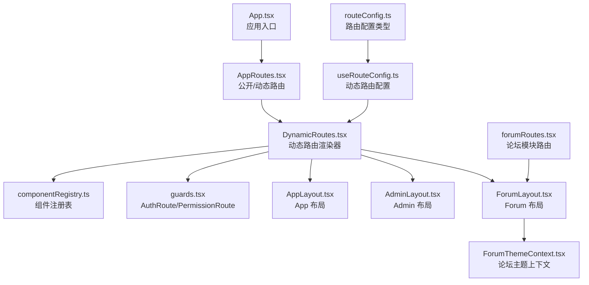
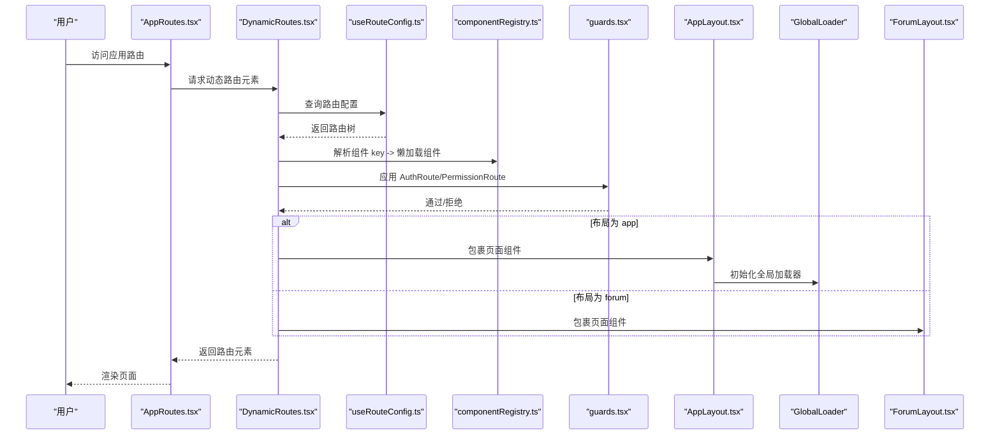
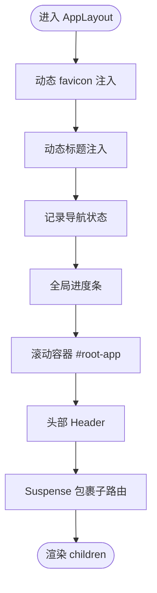
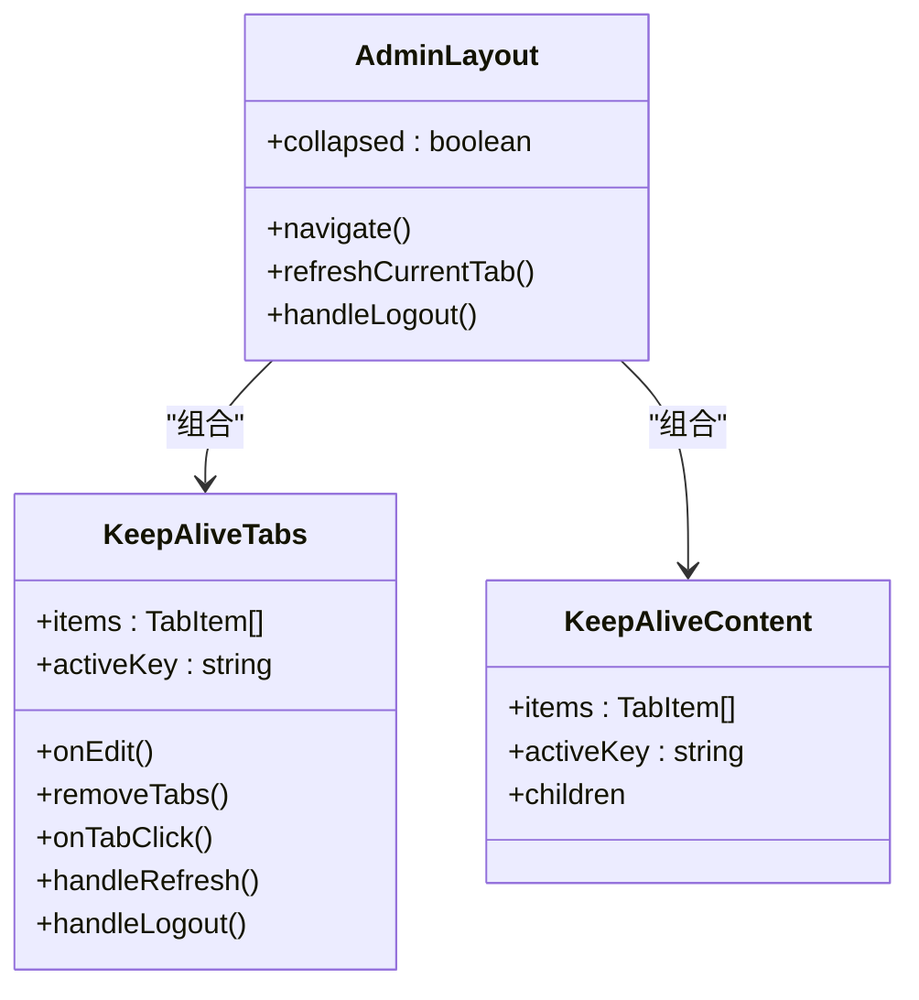
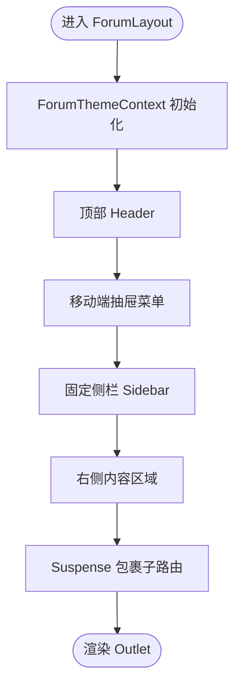
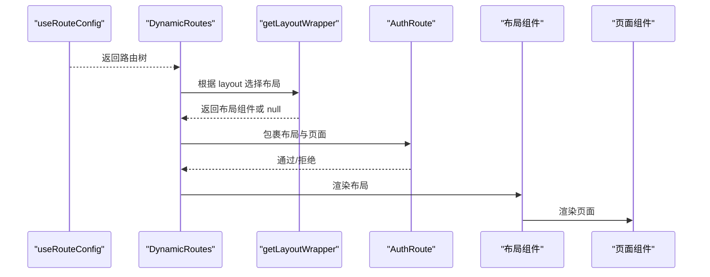
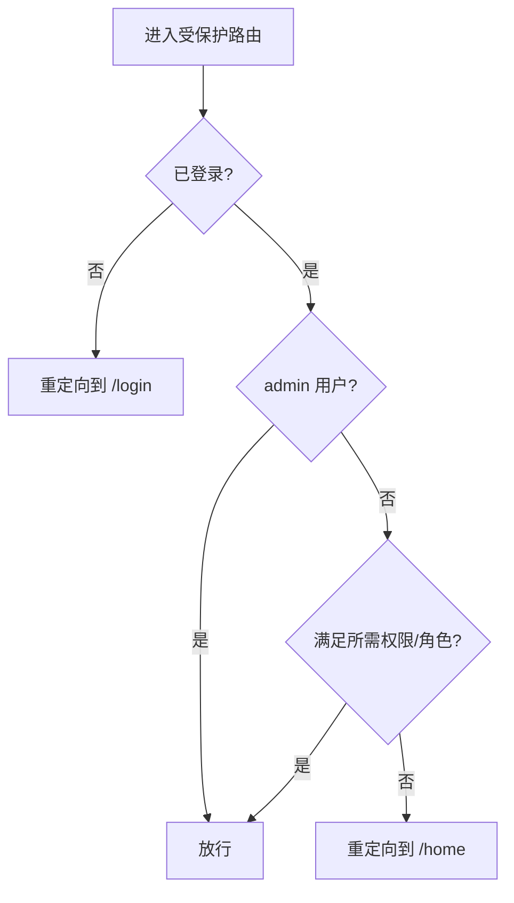
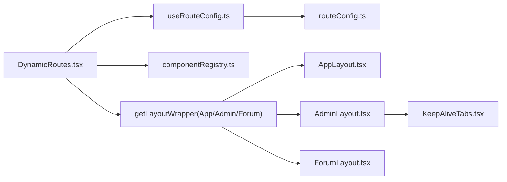

# 布局管理

<cite>
**本文引用的文件**
- [App.tsx](file://src/App.tsx)
- [AppRoutes.tsx](file://src/routes/AppRoutes.tsx)
- [DynamicRoutes.tsx](file://src/routes/DynamicRoutes.tsx)
- [guards.tsx](file://src/routes/guards.tsx)
- [useRouteConfig.ts](file://src/hooks/useRouteConfig.ts)
- [routeConfig.ts](file://src/types/routeConfig.ts)
- [componentRegistry.ts](file://src/routes/componentRegistry.ts)
- [AppLayout.tsx](file://src/modules/app/layouts/AppLayout.tsx)
- [AdminLayout.tsx](file://src/modules/admin/layouts/AdminLayout.tsx)
- [ForumLayout.tsx](file://src/modules/forum/layouts/ForumLayout.tsx)
- [ForumThemeContext.tsx](file://src/modules/forum/context/ForumThemeContext.tsx)
- [forumRoutes.tsx](file://src/routes/forumRoutes.tsx)
- [KeepAliveTabs.tsx](file://src/modules/admin/layouts/KeepAlive/KeepAliveTabs.tsx)
</cite>

## 目录
1. [简介](#简介)
2. [项目结构](#项目结构)
3. [核心组件](#核心组件)
4. [架构总览](#架构总览)
5. [组件详解](#组件详解)
6. [依赖关系分析](#依赖关系分析)
7. [性能考量](#性能考量)
8. [故障排查指南](#故障排查指南)
9. [结论](#结论)
10. [附录](#附录)

## 简介
本文件系统化梳理 zTorrent 站点的布局管理系统，覆盖以下重点：
- 不同布局类型的实现方式与设计理念：App 布局、Admin 布局、Forum 布局
- 布局组件的嵌套结构与切换机制
- 路由与布局的动态绑定、权限守卫与导航状态管理
- 生命周期管理、状态传递与样式定制策略
- 性能优化、响应式设计与主题切换
- 自定义布局组件的开发指南与最佳实践

## 项目结构
布局系统围绕“动态路由 + 布局包装器”的架构展开，核心文件分布如下：
- 应用入口与顶层路由：App.tsx、AppRoutes.tsx
- 动态路由渲染与布局选择：DynamicRoutes.tsx
- 权限与登录守卫：guards.tsx
- 路由配置来源与响应式刷新：useRouteConfig.ts、routeConfig.ts
- 组件注册表：componentRegistry.ts
- 布局实现：AppLayout.tsx、AdminLayout.tsx、ForumLayout.tsx
- 论坛主题上下文：ForumThemeContext.tsx
- 论坛模块路由：forumRoutes.tsx
- Admin 标签页保活：KeepAliveTabs.tsx

图表来源
- [App.tsx](file://src/App.tsx#L1-L52)
- [AppRoutes.tsx](file://src/routes/AppRoutes.tsx#L1-L115)
- [DynamicRoutes.tsx](file://src/routes/DynamicRoutes.tsx#L1-L308)
- [guards.tsx](file://src/routes/guards.tsx#L1-L103)
- [useRouteConfig.ts](file://src/hooks/useRouteConfig.ts#L1-L109)
- [routeConfig.ts](file://src/types/routeConfig.ts#L1-L49)
- [componentRegistry.ts](file://src/routes/componentRegistry.ts#L1-L259)
- [AppLayout.tsx](file://src/modules/app/layouts/AppLayout.tsx#L1-L83)
- [AdminLayout.tsx](file://src/modules/admin/layouts/AdminLayout.tsx#L1-L94)
- [ForumLayout.tsx](file://src/modules/forum/layouts/ForumLayout.tsx#L1-L109)
- [ForumThemeContext.tsx](file://src/modules/forum/context/ForumThemeContext.tsx#L1-L68)
- [forumRoutes.tsx](file://src/routes/forumRoutes.tsx#L1-L106)

章节来源
- [App.tsx](file://src/App.tsx#L1-L52)
- [AppRoutes.tsx](file://src/routes/AppRoutes.tsx#L1-L115)
- [DynamicRoutes.tsx](file://src/routes/DynamicRoutes.tsx#L1-L308)
- [guards.tsx](file://src/routes/guards.tsx#L1-L103)
- [useRouteConfig.ts](file://src/hooks/useRouteConfig.ts#L1-L109)
- [routeConfig.ts](file://src/types/routeConfig.ts#L1-L49)
- [componentRegistry.ts](file://src/routes/componentRegistry.ts#L1-L259)
- [AppLayout.tsx](file://src/modules/app/layouts/AppLayout.tsx#L1-L83)
- [AdminLayout.tsx](file://src/modules/admin/layouts/AdminLayout.tsx#L1-L94)
- [ForumLayout.tsx](file://src/modules/forum/layouts/ForumLayout.tsx#L1-L109)
- [ForumThemeContext.tsx](file://src/modules/forum/context/ForumThemeContext.tsx#L1-L68)
- [forumRoutes.tsx](file://src/routes/forumRoutes.tsx#L1-L106)

## 核心组件
- 动态路由渲染器：根据后端返回的路由配置，按布局类型动态包裹组件，支持重定向、新标签页打开、索引路由等特性。
- 布局包装器：
  - AppLayout：面向普通业务页面，提供头部、进度条、悬浮导航、主题注入等。
  - AdminLayout：面向管理后台，集成侧边栏、标签页保活、路由过渡动画、动态标题同步。
  - ForumLayout：面向论坛模块，提供顶部导航、侧边栏、移动端抽屉、主题上下文与全局编辑器。
- 权限守卫：AuthRoute 基于登录态；PermissionRoute 基于角色/权限集合进行细粒度校验。
- 路由配置 Hook：useRouteConfig 从后端拉取路由树，自动处理认证状态变化与兜底配置。

章节来源
- [DynamicRoutes.tsx](file://src/routes/DynamicRoutes.tsx#L39-L51)
- [AppLayout.tsx](file://src/modules/app/layouts/AppLayout.tsx#L40-L82)
- [AdminLayout.tsx](file://src/modules/admin/layouts/AdminLayout.tsx#L20-L93)
- [ForumLayout.tsx](file://src/modules/forum/layouts/ForumLayout.tsx#L24-L100)
- [guards.tsx](file://src/routes/guards.tsx#L11-L15)
- [guards.tsx](file://src/routes/guards.tsx#L20-L102)
- [useRouteConfig.ts](file://src/hooks/useRouteConfig.ts#L38-L108)

## 架构总览
动态路由系统以“配置驱动”为核心，后端返回的路由树决定前端渲染的布局与页面。布局包装器负责统一的导航、主题、加载与错误处理体验。

图表来源
- [AppRoutes.tsx](file://src/routes/AppRoutes.tsx#L73-L98)
- [DynamicRoutes.tsx](file://src/routes/DynamicRoutes.tsx#L255-L264)
- [useRouteConfig.ts](file://src/hooks/useRouteConfig.ts#L63-L100)
- [componentRegistry.ts](file://src/routes/componentRegistry.ts#L248-L250)
- [guards.tsx](file://src/routes/guards.tsx#L11-L15)
- [AppLayout.tsx](file://src/modules/app/layouts/AppLayout.tsx#L40-L82)
- [ForumLayout.tsx](file://src/modules/forum/layouts/ForumLayout.tsx#L90-L100)

## 组件详解

### App 布局（AppLayout）
- 设计理念：统一的业务壳层，承载头部、进度条、悬浮导航与主题注入，保证页面滚动容器隔离，避免 UI 锁定导致的页面抖动。
- 生命周期与状态：
  - 动态 favicon 注入、动态标题注入、导航状态记录。
  - 使用 Suspense 包裹子路由，配合进度条提升感知。
- 样式定制：
  - 通过 SiteConfigProvider 与主题上下文，结合 CSS 选择器 #root-app 实现样式作用域隔离。
- 响应式与交互：
  - 悬浮导航按钮使用 sticky 定位，适配滚动容器内部定位，避免遮挡滚动条。

图表来源
- [AppLayout.tsx](file://src/modules/app/layouts/AppLayout.tsx#L17-L82)

章节来源
- [AppLayout.tsx](file://src/modules/app/layouts/AppLayout.tsx#L1-L83)

### Admin 布局（AdminLayout）
- 设计理念：管理后台专用布局，强调多标签页保活、侧边栏折叠、路由过渡动画与动态标题同步。
- 核心能力：
  - KeepAlive 标签页系统：支持标签页创建/关闭、刷新、批量关闭、未保存状态提示。
  - 侧边栏折叠动画：基于 framer-motion 的平滑过渡。
  - 动态标题：根据当前激活标签页标题同步浏览器标签页标题。
- 生命周期与状态：
  - 通过 useKeepAliveTabs 管理标签页集合与激活键。
  - 使用 useRouteConfig 获取路由树，构建标签页项。
- 样式定制：
  - 通过 #root-admin 作用域容器与主题样式文件协同，确保样式隔离。

图表来源
- [AdminLayout.tsx](file://src/modules/admin/layouts/AdminLayout.tsx#L20-L93)
- [KeepAliveTabs.tsx](file://src/modules/admin/layouts/KeepAlive/KeepAliveTabs.tsx#L45-L222)

章节来源
- [AdminLayout.tsx](file://src/modules/admin/layouts/AdminLayout.tsx#L1-L94)
- [KeepAliveTabs.tsx](file://src/modules/admin/layouts/KeepAlive/KeepAliveTabs.tsx#L1-L222)

### Forum 布局（ForumLayout）
- 设计理念：论坛专用布局，强调顶部导航、左侧边栏、移动端抽屉与主题上下文，提供统一的讨论区体验。
- 生命周期与状态：
  - 顶部搜索状态、侧栏分类选择、移动端菜单开关。
  - 通过 ForumThemeContext 提供主题切换与颜色映射。
- 响应式与交互：
  - 侧栏固定定位，独立滚动；移动端抽屉风格，适配小屏设备。
- 样式定制：
  - 通过 CSS 类名与主题上下文的颜色变量，实现暗色/亮色模式切换。

图表来源
- [ForumLayout.tsx](file://src/modules/forum/layouts/ForumLayout.tsx#L24-L100)
- [ForumThemeContext.tsx](file://src/modules/forum/context/ForumThemeContext.tsx#L14-L67)

章节来源
- [ForumLayout.tsx](file://src/modules/forum/layouts/ForumLayout.tsx#L1-L109)
- [ForumThemeContext.tsx](file://src/modules/forum/context/ForumThemeContext.tsx#L1-L68)

### 动态路由与布局切换
- 布局选择器：根据路由配置的 layout 字段选择 AppLayout、AdminLayout 或不包裹（forum 场景由独立路由系统处理）。
- 路由渲染：
  - 支持重定向（当前页/新标签页）、索引路由、子路由递归渲染。
  - 对未启用的子路由进行过滤，避免渲染无效节点。
- 论坛模块路由：forumRoutes.tsx 独立于主路由，使用 ForumLayout 作为容器，内置多级路由与 404 处理。

图表来源
- [DynamicRoutes.tsx](file://src/routes/DynamicRoutes.tsx#L39-L51)
- [DynamicRoutes.tsx](file://src/routes/DynamicRoutes.tsx#L130-L249)
- [guards.tsx](file://src/routes/guards.tsx#L11-L15)
- [forumRoutes.tsx](file://src/routes/forumRoutes.tsx#L57-L104)

章节来源
- [DynamicRoutes.tsx](file://src/routes/DynamicRoutes.tsx#L1-L308)
- [forumRoutes.tsx](file://src/routes/forumRoutes.tsx#L1-L106)

### 权限与登录守卫
- AuthRoute：仅判断是否已登录，未登录则重定向至登录页。
- PermissionRoute：支持角色与权限的 AND/OR 组合、matchAll 策略，admin 用户直通，其余情况不足则重定向至首页。
- 认证状态监听：useRouteConfig 监听 authChange 与 storage 事件，确保登录态变化时路由配置刷新。

图表来源
- [guards.tsx](file://src/routes/guards.tsx#L11-L15)
- [guards.tsx](file://src/routes/guards.tsx#L20-L102)
- [useRouteConfig.ts](file://src/hooks/useRouteConfig.ts#L46-L61)

章节来源
- [guards.tsx](file://src/routes/guards.tsx#L1-L103)
- [useRouteConfig.ts](file://src/hooks/useRouteConfig.ts#L1-L109)

## 依赖关系分析
- 路由配置依赖后端 API，通过 useRouteConfig 获取 RouteConfig 数组，类型定义见 routeConfig.ts。
- DynamicRoutes 根据 layout 选择布局组件，组件通过 componentRegistry 解析为懒加载组件。
- 布局之间无直接耦合，通过统一的路由配置与守卫解耦。
- AdminLayout 与 KeepAliveTabs 协作实现标签页保活，彼此通过上下文共享状态。

图表来源
- [useRouteConfig.ts](file://src/hooks/useRouteConfig.ts#L38-L108)
- [routeConfig.ts](file://src/types/routeConfig.ts#L14-L41)
- [DynamicRoutes.tsx](file://src/routes/DynamicRoutes.tsx#L130-L249)
- [componentRegistry.ts](file://src/routes/componentRegistry.ts#L15-L250)
- [AppLayout.tsx](file://src/modules/app/layouts/AppLayout.tsx#L40-L82)
- [AdminLayout.tsx](file://src/modules/admin/layouts/AdminLayout.tsx#L20-L93)
- [ForumLayout.tsx](file://src/modules/forum/layouts/ForumLayout.tsx#L90-L100)
- [KeepAliveTabs.tsx](file://src/modules/admin/layouts/KeepAlive/KeepAliveTabs.tsx#L45-L222)

章节来源
- [useRouteConfig.ts](file://src/hooks/useRouteConfig.ts#L1-L109)
- [routeConfig.ts](file://src/types/routeConfig.ts#L1-L49)
- [DynamicRoutes.tsx](file://src/routes/DynamicRoutes.tsx#L1-L308)
- [componentRegistry.ts](file://src/routes/componentRegistry.ts#L1-L259)
- [AppLayout.tsx](file://src/modules/app/layouts/AppLayout.tsx#L1-L83)
- [AdminLayout.tsx](file://src/modules/admin/layouts/AdminLayout.tsx#L1-L94)
- [ForumLayout.tsx](file://src/modules/forum/layouts/ForumLayout.tsx#L1-L109)
- [KeepAliveTabs.tsx](file://src/modules/admin/layouts/KeepAlive/KeepAliveTabs.tsx#L1-L222)

## 性能考量
- 懒加载与 Suspense：所有页面与布局均采用懒加载与 Suspense 包裹，减少首屏体积与白屏时间。
- 动态路由配置缓存：useRouteConfig 设置 5 分钟 staleTime，降低频繁请求带来的压力。
- 进度条与加载器：全局进度条与全屏加载器提升感知，避免用户误以为卡死。
- 滚动容器隔离：AppLayout 将滚动容器从 body 转移到 #root-app，避免 Radix UI 锁定 body 导致的抖动。
- Admin 标签页保活：KeepAliveContent 仅在激活时渲染，减少重复实例化与资源消耗。
- 主题切换：ForumThemeContext 使用 localStorage 缓存偏好，useLayoutEffect 同步 html class，避免不必要的重排。

章节来源
- [AppLayout.tsx](file://src/modules/app/layouts/AppLayout.tsx#L53-L76)
- [AdminLayout.tsx](file://src/modules/admin/layouts/AdminLayout.tsx#L78-L86)
- [DynamicRoutes.tsx](file://src/routes/DynamicRoutes.tsx#L77-L86)
- [DynamicRoutes.tsx](file://src/routes/DynamicRoutes.tsx#L10-L13)
- [useRouteConfig.ts](file://src/hooks/useRouteConfig.ts#L96-L98)
- [ForumThemeContext.tsx](file://src/modules/forum/context/ForumThemeContext.tsx#L39-L50)

## 故障排查指南
- 登录态不生效或路由不更新
  - 检查 useRouteConfig 是否监听 authChange 与 storage 事件，确认 enabled 条件随登录态变化。
  - 确认 AuthRoute 是否正确包裹布局与页面。
- 权限不足被重定向
  - 查看 PermissionRoute 的 requiredPermissions/requiredRoles 与 combine/matchAll 配置，确认用户角色/权限集合。
- Admin 标签页异常
  - 检查 useKeepAliveTabs 的 items/activeKey 与 onEdit/removeTabs/onTabClick 的调用链。
  - 确认 KeepAliveContext.Provider 是否正确提供 setTabSaved。
- 论坛主题切换无效
  - 检查 ForumThemeContext 的 forceTheme 与 localStorage 偏好，确认 html 元素 class 是否同步。
- 动态路由 404
  - 确认后端返回的路由树是否包含目标路径，必要时检查兜底配置与 isEnabled 字段。

章节来源
- [useRouteConfig.ts](file://src/hooks/useRouteConfig.ts#L46-L61)
- [guards.tsx](file://src/routes/guards.tsx#L38-L58)
- [AdminLayout.tsx](file://src/modules/admin/layouts/AdminLayout.tsx#L25-L27)
- [KeepAliveTabs.tsx](file://src/modules/admin/layouts/KeepAlive/KeepAliveTabs.tsx#L28-L43)
- [ForumThemeContext.tsx](file://src/modules/forum/context/ForumThemeContext.tsx#L21-L50)
- [DynamicRoutes.tsx](file://src/routes/DynamicRoutes.tsx#L164-L174)

## 结论
该布局管理系统以“配置驱动 + 布局包装器 + 权限守卫”为核心，实现了高内聚、低耦合的多布局体系。通过动态路由与组件注册表，系统具备良好的扩展性；通过 KeepAlive 标签页与主题上下文，兼顾了性能与用户体验。建议在新增布局时遵循现有模式：定义布局组件、在 DynamicRoutes 中注册布局选择器、在 componentRegistry 中注册页面组件、在后端路由配置中声明 layout 与权限。

## 附录

### 布局类型与使用场景
- App 布局：适用于普通业务页面，强调统一头部、进度条与滚动容器隔离。
- Admin 布局：适用于管理后台，强调侧边栏、标签页保活与路由过渡动画。
- Forum 布局：适用于论坛模块，强调顶部导航、侧栏与移动端抽屉、主题上下文。

章节来源
- [routeConfig.ts](file://src/types/routeConfig.ts#L9-L22)
- [DynamicRoutes.tsx](file://src/routes/DynamicRoutes.tsx#L39-L51)
- [AppLayout.tsx](file://src/modules/app/layouts/AppLayout.tsx#L40-L82)
- [AdminLayout.tsx](file://src/modules/admin/layouts/AdminLayout.tsx#L20-L93)
- [ForumLayout.tsx](file://src/modules/forum/layouts/ForumLayout.tsx#L24-L100)

### 自定义布局组件开发指南
- 布局组件规范
  - 接收 children 并渲染，内部可挂载公共 UI（头部、侧边栏、加载器、主题注入等）。
  - 使用 Suspense 包裹子路由，提供进度条反馈。
- 在 DynamicRoutes 中注册
  - 在 getLayoutWrapper 中添加 layout 字段到布局组件的映射。
- 在后端路由配置中声明
  - 为相关路由设置 layout 字段（app/admin/forum/none），并配置权限与可见性。
- 样式与主题
  - 通过作用域容器（如 #root-app/#root-admin/#root-forum）与主题上下文实现样式隔离与主题切换。

章节来源
- [DynamicRoutes.tsx](file://src/routes/DynamicRoutes.tsx#L39-L51)
- [componentRegistry.ts](file://src/routes/componentRegistry.ts#L248-L250)
- [routeConfig.ts](file://src/types/routeConfig.ts#L21-L22)