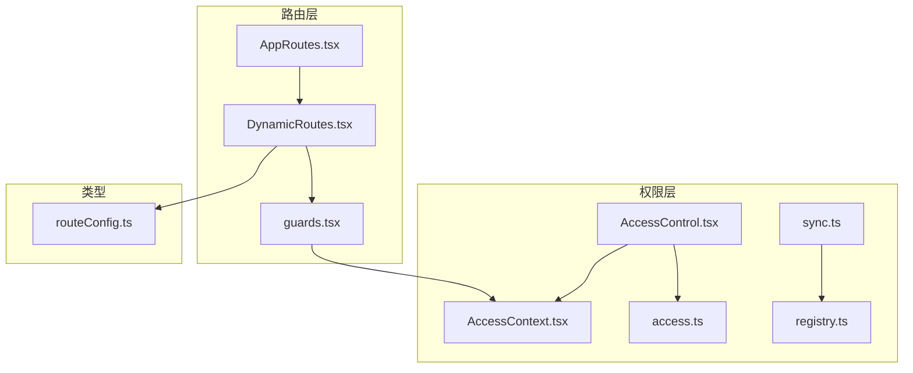
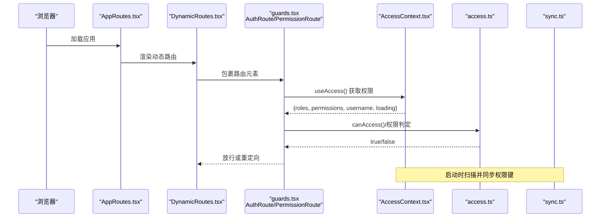
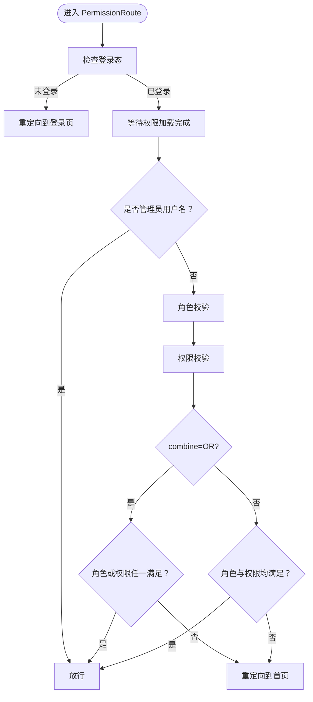
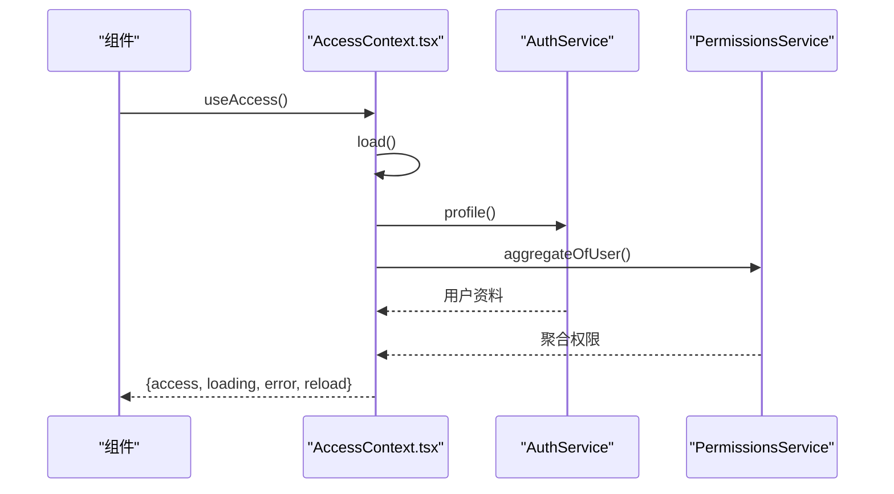
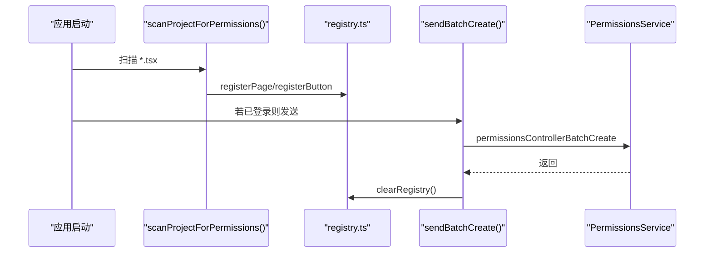
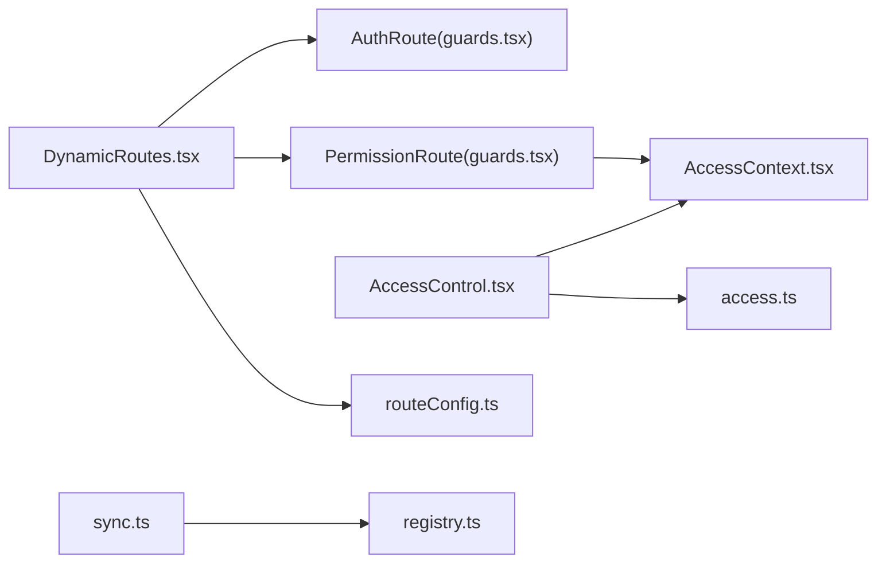

# 路由守卫

<cite>
**本文引用的文件**
- [guards.tsx](file://src/routes/guards.tsx)
- [AccessControl.tsx](file://src/permissions/AccessControl.tsx)
- [access.ts](file://src/utils/access.ts)
- [AccessContext.tsx](file://src/context/AccessContext.tsx)
- [AppRoutes.tsx](file://src/routes/AppRoutes.tsx)
- [DynamicRoutes.tsx](file://src/routes/DynamicRoutes.tsx)
- [routeConfig.ts](file://src/types/routeConfig.ts)
- [sync.ts](file://src/permissions/sync.ts)
- [registry.ts](file://src/permissions/registry.ts)
</cite>

## 目录
1. [简介](#简介)
2. [项目结构](#项目结构)
3. [核心组件](#核心组件)
4. [架构总览](#架构总览)
5. [组件详解](#组件详解)
6. [依赖关系分析](#依赖关系分析)
7. [性能考量](#性能考量)
8. [故障排查指南](#故障排查指南)
9. [结论](#结论)
10. [附录](#附录)

## 简介
本文件面向前端路由守卫体系，系统化阐述权限路由的实现原理、认证状态检查与访问控制机制。重点覆盖：
- 路由守卫的执行顺序与条件判断逻辑
- 权限验证与用户状态管理、会话管理最佳实践
- 自定义路由守卫开发指南、权限配置方法与调试技巧
- 复杂权限组合与动态权限验证场景的处理思路

## 项目结构
围绕路由守卫的关键文件组织如下：
- 路由层：应用路由入口、动态路由渲染与守卫注入
- 权限层：权限上下文、权限工具与权限注册/同步
- 类型层：路由配置类型定义

图表来源
- [AppRoutes.tsx](file://src/routes/AppRoutes.tsx#L73-L98)
- [DynamicRoutes.tsx](file://src/routes/DynamicRoutes.tsx#L1-L308)
- [guards.tsx](file://src/routes/guards.tsx#L1-L103)
- [AccessContext.tsx](file://src/context/AccessContext.tsx#L64-L181)
- [AccessControl.tsx](file://src/permissions/AccessControl.tsx#L1-L43)
- [access.ts](file://src/utils/access.ts#L1-L65)
- [registry.ts](file://src/permissions/registry.ts#L1-L129)
- [sync.ts](file://src/permissions/sync.ts#L1-L159)
- [routeConfig.ts](file://src/types/routeConfig.ts#L1-L49)

章节来源
- [AppRoutes.tsx](file://src/routes/AppRoutes.tsx#L1-L115)
- [DynamicRoutes.tsx](file://src/routes/DynamicRoutes.tsx#L1-L308)
- [guards.tsx](file://src/routes/guards.tsx#L1-L103)
- [AccessContext.tsx](file://src/context/AccessContext.tsx#L1-L181)
- [AccessControl.tsx](file://src/permissions/AccessControl.tsx#L1-L43)
- [access.ts](file://src/utils/access.ts#L1-L65)
- [registry.ts](file://src/permissions/registry.ts#L1-L129)
- [sync.ts](file://src/permissions/sync.ts#L1-L159)
- [routeConfig.ts](file://src/types/routeConfig.ts#L1-L49)

## 核心组件
- 认证守卫 AuthRoute：基于本地令牌判断登录态，未登录则重定向至登录页
- 权限守卫 PermissionRoute：结合后端聚合权限与角色，支持 AND/OR、matchAll 等策略
- 权限控制组件 AccessControl：在 UI 层进行细粒度权限控制
- 权限工具 canAccess：统一的权限判定逻辑
- 权限上下文 AccessContext：统一拉取用户资料、聚合权限并提供全局状态
- 权限注册/同步：启动时扫描前端权限键并批量同步到后端

章节来源
- [guards.tsx](file://src/routes/guards.tsx#L11-L15)
- [guards.tsx](file://src/routes/guards.tsx#L20-L102)
- [AccessControl.tsx](file://src/permissions/AccessControl.tsx#L17-L42)
- [access.ts](file://src/utils/access.ts#L16-L63)
- [AccessContext.tsx](file://src/context/AccessContext.tsx#L64-L181)
- [sync.ts](file://src/permissions/sync.ts#L17-L38)

## 架构总览
下图展示了从路由渲染到权限校验的整体流程，以及关键组件间的交互。

图表来源
- [AppRoutes.tsx](file://src/routes/AppRoutes.tsx#L73-L98)
- [DynamicRoutes.tsx](file://src/routes/DynamicRoutes.tsx#L150-L248)
- [guards.tsx](file://src/routes/guards.tsx#L35-L102)
- [AccessContext.tsx](file://src/context/AccessContext.tsx#L83-L155)
- [access.ts](file://src/utils/access.ts#L16-L63)
- [sync.ts](file://src/permissions/sync.ts#L17-L38)

## 组件详解

### 认证守卫 AuthRoute
- 作用：仅做登录态检查，未登录则重定向至登录页
- 实现要点：
  - 依据本地存储的访问令牌判断登录态
  - 未登录时返回重定向元素，阻止进入受保护路由

章节来源
- [guards.tsx](file://src/routes/guards.tsx#L11-L15)

### 权限守卫 PermissionRoute
- 作用：在登录态基础上，进一步校验角色与权限
- 关键逻辑：
  - 登录态校验：未登录重定向
  - 权限加载：等待权限上下文加载完成
  - 角色与权限判定：
    - 支持 requiredRoles / requiredPermissions
    - 支持 matchAll（组内是否全部满足）与 combine（角色组与权限组关系 OR/AND）
    - 管理员用户名直接放行
  - 未满足条件时重定向至首页

图表来源
- [guards.tsx](file://src/routes/guards.tsx#L35-L102)

章节来源
- [guards.tsx](file://src/routes/guards.tsx#L20-L102)

### 权限控制组件 AccessControl
- 作用：在 UI 层根据权限决定是否渲染子节点或回退元素
- 行为：
  - 读取权限上下文与规则
  - 调用 canAccess 判断
  - 不满足时渲染 fallback

章节来源
- [AccessControl.tsx](file://src/permissions/AccessControl.tsx#L17-L42)
- [access.ts](file://src/utils/access.ts#L16-L63)

### 权限工具 canAccess
- 作用：统一的权限判定逻辑，与 PermissionRoute 保持一致
- 支持：
  - requiredPermissions / requiredRoles
  - matchAll 与 combine
  - 管理员用户名直接放行

章节来源
- [access.ts](file://src/utils/access.ts#L16-L63)

### 权限上下文 AccessContext
- 作用：全局管理用户访问权限、角色与用户名，并在登录/登出时自动刷新
- 关键能力：
  - 并行拉取用户资料与聚合权限
  - 优先使用聚合权限，回退到资料接口
  - 监听自定义 authChange 事件，自动重新加载
  - 提供 useAccess Hook 便捷获取

图表来源
- [AccessContext.tsx](file://src/context/AccessContext.tsx#L83-L155)

章节来源
- [AccessContext.tsx](file://src/context/AccessContext.tsx#L64-L181)

### 动态路由与守卫注入
- AppRoutes.tsx：公开路由与动态路由并存，动态路由加载期间显示加载器
- DynamicRoutes.tsx：根据后端路由配置动态渲染，将 AuthRoute 包裹在布局外层，确保所有受保护页面均经过登录态校验

章节来源
- [AppRoutes.tsx](file://src/routes/AppRoutes.tsx#L73-L98)
- [DynamicRoutes.tsx](file://src/routes/DynamicRoutes.tsx#L150-L248)

### 路由配置类型
- RouteConfig 定义了路由的权限、布局、子路由、重定向等字段，用于动态渲染与守卫策略

章节来源
- [routeConfig.ts](file://src/types/routeConfig.ts#L14-L41)

### 权限注册与同步
- registry.ts：在应用启动或扫描阶段收集页面/按钮权限键，去重并导出批量创建 DTO
- sync.ts：启动时扫描前端代码，提取权限键并调用后端批量创建接口；若未登录则监听 authChange 事件后再同步

图表来源
- [sync.ts](file://src/permissions/sync.ts#L74-L115)
- [registry.ts](file://src/permissions/registry.ts#L89-L101)

章节来源
- [registry.ts](file://src/permissions/registry.ts#L1-L129)
- [sync.ts](file://src/permissions/sync.ts#L1-L159)

## 依赖关系分析
- 路由层依赖守卫与上下文：DynamicRoutes.tsx 通过 AuthRoute 包裹布局，PermissionRoute 在需要时用于更细粒度的权限控制
- 权限层内部解耦：AccessControl 与 canAccess 独立于守卫，既可用于导航也可用于按钮级控制
- 上下文与服务：AccessContext 并行拉取用户资料与聚合权限，减少首屏阻塞
- 启动同步：sync.ts 与 registry.ts 解耦扫描与发送逻辑，避免重复同步

图表来源
- [DynamicRoutes.tsx](file://src/routes/DynamicRoutes.tsx#L150-L248)
- [guards.tsx](file://src/routes/guards.tsx#L11-L102)
- [AccessContext.tsx](file://src/context/AccessContext.tsx#L64-L181)
- [AccessControl.tsx](file://src/permissions/AccessControl.tsx#L1-L43)
- [access.ts](file://src/utils/access.ts#L1-L65)
- [sync.ts](file://src/permissions/sync.ts#L1-L159)
- [registry.ts](file://src/permissions/registry.ts#L1-L129)
- [routeConfig.ts](file://src/types/routeConfig.ts#L1-L49)

章节来源
- [DynamicRoutes.tsx](file://src/routes/DynamicRoutes.tsx#L1-L308)
- [guards.tsx](file://src/routes/guards.tsx#L1-L103)
- [AccessControl.tsx](file://src/permissions/AccessControl.tsx#L1-L43)
- [access.ts](file://src/utils/access.ts#L1-L65)
- [AccessContext.tsx](file://src/context/AccessContext.tsx#L1-L181)
- [sync.ts](file://src/permissions/sync.ts#L1-L159)
- [registry.ts](file://src/permissions/registry.ts#L1-L129)
- [routeConfig.ts](file://src/types/routeConfig.ts#L1-L49)

## 性能考量
- 并行加载：AccessContext 并行请求用户资料与聚合权限，降低首屏等待时间
- 懒加载：动态路由与布局组件采用懒加载，配合进度条提升体验
- 权限缓存：权限来自上下文，避免重复计算；管理员用户名直接放行，减少判断成本
- 启动同步：仅在应用启动时扫描并批量创建，避免频繁网络请求

章节来源
- [AccessContext.tsx](file://src/context/AccessContext.tsx#L102-L105)
- [DynamicRoutes.tsx](file://src/routes/DynamicRoutes.tsx#L77-L86)
- [guards.tsx](file://src/routes/guards.tsx#L89-L93)
- [sync.ts](file://src/permissions/sync.ts#L17-L38)

## 故障排查指南
- 登录态异常
  - 现象：受保护页面反复跳转到登录页
  - 排查：确认本地存储存在访问令牌；检查 AuthRoute 的登录态判断逻辑
- 权限加载卡住
  - 现象：页面长时间处于加载状态
  - 排查：观察权限加载状态；确认 AccessContext 的并行请求是否成功；检查后端聚合权限接口
- 权限不足被重定向
  - 现象：权限不足时跳转到首页
  - 排查：检查 PermissionRoute 的 requiredPermissions / requiredRoles 与 combine/matchAll 配置；确认用户角色与权限集合
- 管理员仍被拒绝
  - 现象：管理员仍无法访问
  - 排查：确认用户名解析逻辑与管理员放行条件
- 启动同步未生效
  - 现象：权限键未同步到后端
  - 排查：确认启动时扫描是否执行；检查 authChange 事件监听与登录状态；查看批量创建接口返回

章节来源
- [guards.tsx](file://src/routes/guards.tsx#L35-L102)
- [AccessContext.tsx](file://src/context/AccessContext.tsx#L83-L155)
- [sync.ts](file://src/permissions/sync.ts#L17-L38)

## 结论
本路由守卫体系通过“登录态 + 权限判定 + 细粒度 UI 控制”三层保障，实现了灵活、可扩展的访问控制。配合启动时权限扫描与批量同步，确保前后端权限一致。建议在复杂权限场景中充分利用 OR 组合与 matchAll 策略，并通过 AccessControl 实现按钮级与页面级的精细化控制。

## 附录

### 开发与配置指南
- 自定义路由守卫
  - 在需要的路由层级引入 AuthRoute 或 PermissionRoute
  - 设置 requiredPermissions / requiredRoles 与 combine/matchAll
  - 管理员放行：保持用户名为管理员即可
- 权限配置方法
  - 在页面/按钮处使用 AccessControl 或 PermissionRoute
  - 启动时通过 syncPermissionsOnStartup 扫描并同步权限键
- 调试技巧
  - 查看 PermissionRoute 日志输出，核对 required 与用户权限集合
  - 使用 AccessControl 的 fallback 渲染占位元素，定位权限问题
  - 监听 authChange 事件，验证登录/登出后的权限刷新

章节来源
- [guards.tsx](file://src/routes/guards.tsx#L20-L102)
- [AccessControl.tsx](file://src/permissions/AccessControl.tsx#L17-L42)
- [sync.ts](file://src/permissions/sync.ts#L17-L38)