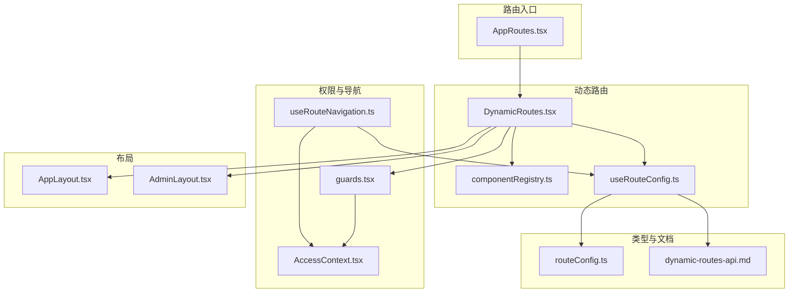
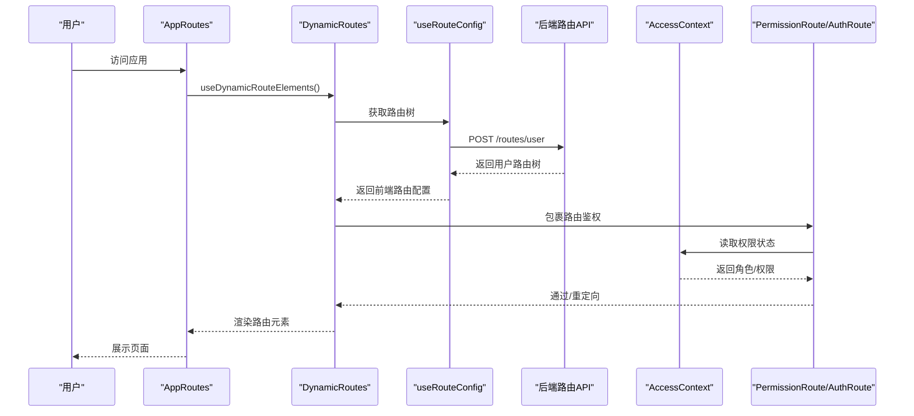
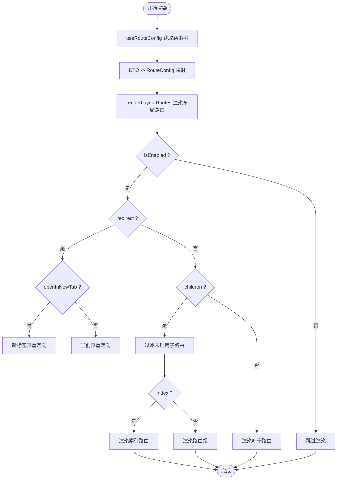
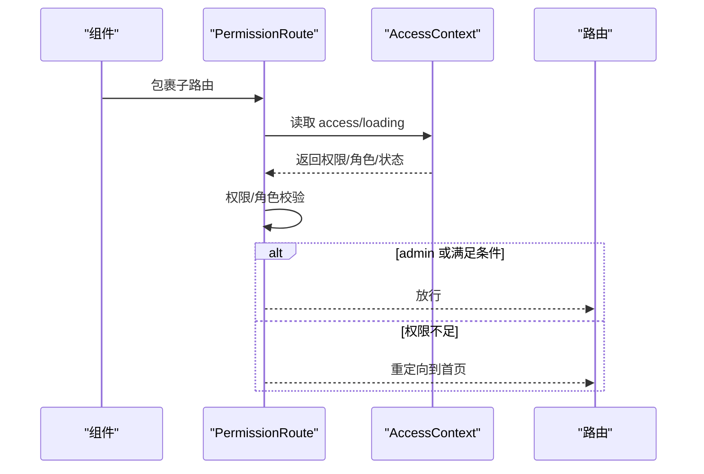
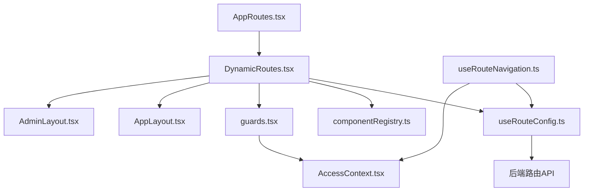

# 路由系统

<cite>
**本文档引用的文件**
- [src\routes\AppRoutes.tsx](file://src\routes\AppRoutes.tsx)
- [src\routes\DynamicRoutes.tsx](file://src\routes\DynamicRoutes.tsx)
- [src\routes\guards.tsx](file://src\routes\guards.tsx)
- [src\routes\componentRegistry.ts](file://src\routes\componentRegistry.ts)
- [src\types\routeConfig.ts](file://src\types\routeConfig.ts)
- [src\hooks\useRouteConfig.ts](file://src\hooks\useRouteConfig.ts)
- [src\hooks\useRouteNavigation.ts](file://src\hooks\useRouteNavigation.ts)
- [src\context\AccessContext.tsx](file://src\context\AccessContext.tsx)
- [src\modules\app\layouts\AppLayout.tsx](file://src\modules\app\layouts\AppLayout.tsx)
- [src\modules\admin\layouts\AdminLayout.tsx](file://src\modules\admin\layouts\AdminLayout.tsx)
- [docs\dev\dynamic-routes-api.md](file://docs\dev\dynamic-routes-api.md)
- [scripts\import-routes.ts](file://scripts\import-routes.ts)
- [scripts\check-routes.ts](file://scripts\check-routes.ts)
</cite>

## 目录
1. [简介](#简介)
2. [项目结构](#项目结构)
3. [核心组件](#核心组件)
4. [架构总览](#架构总览)
5. [详细组件分析](#详细组件分析)
6. [依赖关系分析](#依赖关系分析)
7. [性能考量](#性能考量)
8. [故障排查指南](#故障排查指南)
9. [结论](#结论)
10. [附录](#附录)

## 简介
本路由系统采用“后端驱动 + 前端动态渲染”的架构，通过后端提供的用户可访问路由树，前端在运行时动态构建路由配置、组件注册与权限校验，实现灵活的菜单、导航与权限控制。系统支持三类布局（app/admin/forum），具备动态路由解析、权限路由守卫、导航数据抽取与缓存策略，并提供调试与扩展指南。

## 项目结构
路由系统主要由以下层次构成：
- 路由入口与公共页面：负责公开路由（登录/注册/忘记密码）与全局加载指示。
- 动态路由渲染器：根据后端路由树生成 React Router 路由配置，支持布局包装、索引路由、重定向与新标签页打开。
- 组件注册表：维护 componentKey 与懒加载组件的映射，支持按需加载。
- 路由配置 Hook：从后端拉取用户路由树，进行 DTO 到前端配置的映射与兜底处理。
- 权限上下文与守卫：提供登录态与权限态，实现基于角色/权限的路由守卫。
- 导航 Hook：从路由配置派生导航项，支持平台区分与权限过滤。
- 布局组件：AppLayout/AdminLayout 提供页面骨架与特定功能（如后台标签页缓存）。



**图表来源**
- [src\routes\AppRoutes.tsx](file://src\routes\AppRoutes.tsx#L73-L98)
- [src\routes\DynamicRoutes.tsx](file://src\routes\DynamicRoutes.tsx#L255-L264)
- [src\routes\componentRegistry.ts](file://src\routes\componentRegistry.ts#L15-L250)
- [src\hooks\useRouteConfig.ts](file://src\hooks\useRouteConfig.ts#L38-L108)
- [src\routes\guards.tsx](file://src\routes\guards.tsx#L11-L15)
- [src\context\AccessContext.tsx](file://src\context\AccessContext.tsx#L64-L172)
- [src\hooks\useRouteNavigation.ts](file://src\hooks\useRouteNavigation.ts#L105-L141)
- [src\modules\app\layouts\AppLayout.tsx](file://src\modules\app\layouts\AppLayout.tsx#L40-L82)
- [src\modules\admin\layouts\AdminLayout.tsx](file://src\modules\admin\layouts\AdminLayout.tsx#L20-L93)
- [src\types\routeConfig.ts](file://src\types\routeConfig.ts#L14-L48)
- [docs\dev\dynamic-routes-api.md](file://docs\dev\dynamic-routes-api.md#L1-L127)

**章节来源**
- [src\routes\AppRoutes.tsx](file://src\routes\AppRoutes.tsx#L1-L115)
- [src\routes\DynamicRoutes.tsx](file://src\routes\DynamicRoutes.tsx#L1-L308)
- [src\routes\componentRegistry.ts](file://src\routes\componentRegistry.ts#L1-L259)
- [src\types\routeConfig.ts](file://src\types\routeConfig.ts#L1-L49)
- [src\hooks\useRouteConfig.ts](file://src\hooks\useRouteConfig.ts#L1-L109)
- [src\hooks\useRouteNavigation.ts](file://src\hooks\useRouteNavigation.ts#L1-L142)
- [src\routes\guards.tsx](file://src\routes\guards.tsx#L1-L103)
- [src\context\AccessContext.tsx](file://src\context\AccessContext.tsx#L1-L181)
- [src\modules\app\layouts\AppLayout.tsx](file://src\modules\app\layouts\AppLayout.tsx#L1-L83)
- [src\modules\admin\layouts\AdminLayout.tsx](file://src\modules\admin\layouts\AdminLayout.tsx#L1-L94)
- [docs\dev\dynamic-routes-api.md](file://docs\dev\dynamic-routes-api.md#L1-L127)

## 核心组件
- 路由入口与公共页面：负责公开路由与全局加载指示，以及 404 回退策略。
- 动态路由渲染器：将后端路由树转换为 React Router 路由，支持布局包装、索引路由、重定向与新标签页打开。
- 组件注册表：集中管理 componentKey 与懒加载组件映射，支持查询与存在性检查。
- 路由配置 Hook：从后端获取用户路由树，进行 DTO 到前端配置的映射与兜底处理。
- 权限上下文与守卫：提供登录态与权限态，实现基于角色/权限的路由守卫。
- 导航 Hook：从路由配置派生导航项，支持平台区分与权限过滤。
- 布局组件：AppLayout/AdminLayout 提供页面骨架与特定功能（如后台标签页缓存）。

**章节来源**
- [src\routes\AppRoutes.tsx](file://src\routes\AppRoutes.tsx#L73-L115)
- [src\routes\DynamicRoutes.tsx](file://src\routes\DynamicRoutes.tsx#L255-L308)
- [src\routes\componentRegistry.ts](file://src\routes\componentRegistry.ts#L243-L259)
- [src\hooks\useRouteConfig.ts](file://src\hooks\useRouteConfig.ts#L38-L109)
- [src\routes\guards.tsx](file://src\routes\guards.tsx#L11-L103)
- [src\hooks\useRouteNavigation.ts](file://src\hooks\useRouteNavigation.ts#L105-L142)
- [src\modules\app\layouts\AppLayout.tsx](file://src\modules\app\layouts\AppLayout.tsx#L40-L82)
- [src\modules\admin\layouts\AdminLayout.tsx](file://src\modules\admin\layouts\AdminLayout.tsx#L20-L93)

## 架构总览
系统采用“后端驱动 + 前端渲染”模式：
- 后端提供用户可访问的路由树（含权限、布局、重定向等元数据）。
- 前端通过 Hook 拉取并映射为前端路由配置，动态渲染路由与布局。
- 权限守卫结合 AccessContext 的权限状态进行细粒度控制。
- 导航数据从路由配置派生，支持平台区分与权限过滤。



**图表来源**
- [src\routes\AppRoutes.tsx](file://src\routes\AppRoutes.tsx#L73-L98)
- [src\routes\DynamicRoutes.tsx](file://src\routes\DynamicRoutes.tsx#L255-L264)
- [src\hooks\useRouteConfig.ts](file://src\hooks\useRouteConfig.ts#L63-L100)
- [src\routes\guards.tsx](file://src\routes\guards.tsx#L11-L103)
- [src\context\AccessContext.tsx](file://src\context\AccessContext.tsx#L64-L172)
- [docs\dev\dynamic-routes-api.md](file://docs\dev\dynamic-routes-api.md#L16-L23)

## 详细组件分析

### 动态路由设计与渲染流程
- 路由树映射：Hook 将后端 DTO 转换为前端 RouteConfig，处理 component、layout、index、redirect、openInNewTab、isVisible、isEnabled、icon 等字段。
- 渲染策略：
  - 布局包装：根据 layout 选择 AppLayout/AdminLayout/ForumLayout 或无布局。
  - 索引路由：支持 index 与 path 同时渲染，解决 /admin/users/list 访问不到的问题。
  - 重定向：支持当前页重定向与新标签页打开；Admin/Forum 提供局部 404。
  - 子路由过滤：未启用的子路由会被过滤。
- 性能与体验：使用 Suspense 与进度条组件提升加载体验；全局加载器在动态路由加载期间触发。



**图表来源**
- [src\hooks\useRouteConfig.ts](file://src\hooks\useRouteConfig.ts#L15-L32)
- [src\routes\DynamicRoutes.tsx](file://src\routes\DynamicRoutes.tsx#L130-L249)
- [src\routes\DynamicRoutes.tsx](file://src\routes\DynamicRoutes.tsx#L56-L125)

**章节来源**
- [src\hooks\useRouteConfig.ts](file://src\hooks\useRouteConfig.ts#L15-L32)
- [src\routes\DynamicRoutes.tsx](file://src\routes\DynamicRoutes.tsx#L130-L249)
- [src\routes\DynamicRoutes.tsx](file://src\routes\DynamicRoutes.tsx#L56-L125)

### 路由配置模型与数据结构
- RouteConfig：前端路由配置模型，包含 id、path、component、layout、permissions、children、name、index、redirect、openInNewTab、isVisible、isEnabled、icon 等字段。
- RouteConfigResponse：后端返回的路由树结构。
- 布局类型：app/admin/forum/none。
- 组件键：component 字段对应 componentRegistry 中的 key，用于懒加载组件映射。

```mermaid
classDiagram
class RouteConfig {
+string id
+string path
+string component
+LayoutType layout
+string[] permissions
+RouteConfig[] children
+string name
+boolean index
+string redirect
+boolean openInNewTab
+boolean isVisible
+boolean isEnabled
+string icon
}
class RouteConfigResponse {
+RouteConfig[] routes
}
class LayoutType {
<<enumeration>>
"app"
"admin"
"forum"
"none"
}
RouteConfigResponse --> RouteConfig : "包含"
RouteConfig --> LayoutType : "使用"
```

**图表来源**
- [src\types\routeConfig.ts](file://src\types\routeConfig.ts#L14-L48)

**章节来源**
- [src\types\routeConfig.ts](file://src\types\routeConfig.ts#L1-L49)

### 组件注册机制
- 组件注册表：集中维护 componentKey 与懒加载组件映射，提供 getComponent/hasComponent 查询能力。
- 动态路由渲染：通过 getComponent 根据 key 获取懒加载组件，结合 Suspense 提升用户体验。
- 扩展方式：新增页面只需在注册表中添加 key 与路径映射，即可被后端路由树引用。


**图表来源**
- [src\routes\componentRegistry.ts](file://src\routes\componentRegistry.ts#L15-L250)
- [src\routes\DynamicRoutes.tsx](file://src\routes\DynamicRoutes.tsx#L77-L86)

**章节来源**
- [src\routes\componentRegistry.ts](file://src\routes\componentRegistry.ts#L1-L259)
- [src\routes\DynamicRoutes.tsx](file://src\routes\DynamicRoutes.tsx#L77-L86)

### 权限路由与守卫
- 登录态守卫：AuthRoute 仅判断是否已登录，未登录则重定向至登录页。
- 权限守卫：PermissionRoute 支持角色与权限的 AND/OR 组合、matchAll 控制、admin 用户直通。
- 权限来源：AccessContext 提供角色/权限/用户名/头像等信息，支持从 JWT 解析用户名作为降级方案。
- 导航过滤：useRouteNavigation 在派生导航项时进行权限过滤，隐藏无权限的父级与子级。



**图表来源**
- [src\routes\guards.tsx](file://src\routes\guards.tsx#L20-L102)
- [src\context\AccessContext.tsx](file://src\context\AccessContext.tsx#L64-L172)
- [src\hooks\useRouteNavigation.ts](file://src\hooks\useRouteNavigation.ts#L71-L99)

**章节来源**
- [src\routes\guards.tsx](file://src\routes\guards.tsx#L1-L103)
- [src\context\AccessContext.tsx](file://src\context\AccessContext.tsx#L1-L181)
- [src\hooks\useRouteNavigation.ts](file://src\hooks\useRouteNavigation.ts#L71-L99)

### 导航系统管理策略
- 导航数据来源：从路由配置派生，支持 desktop/mobile 平台区分。
- 权限过滤：递归过滤无权限的导航项，若子项全部被过滤则隐藏父项。
- 平台适配：根据 layout 与 parentPath 生成完整路径，分别输出桌面端与移动端导航。
- 与路由联动：导航项与路由配置保持一致，确保菜单与页面访问一致。

**章节来源**
- [src\hooks\useRouteNavigation.ts](file://src\hooks\useRouteNavigation.ts#L33-L141)

### 布局与页面骨架
- AppLayout：提供站点级头部、全局进度条、动态标题注入、导航状态记录与悬浮导航按钮容器。
- AdminLayout：提供侧边栏、标签页缓存（KeepAlive）、动态标题同步、刷新与退出登录等后台专属功能。
- 动态路由渲染：根据 layout 选择对应布局组件，支持 Forum 特殊布局与全局加载器触发器。

**章节来源**
- [src\modules\app\layouts\AppLayout.tsx](file://src\modules\app\layouts\AppLayout.tsx#L40-L82)
- [src\modules\admin\layouts\AdminLayout.tsx](file://src\modules\admin\layouts\AdminLayout.tsx#L20-L93)
- [src\routes\DynamicRoutes.tsx](file://src\routes\DynamicRoutes.tsx#L130-L249)

## 依赖关系分析
- 组件耦合与内聚：
  - DynamicRoutes 依赖 useRouteConfig、componentRegistry、guards、布局组件与全局加载器。
  - AppRoutes 依赖 DynamicRoutes 与全局加载器，负责公开路由与 404 回退。
  - useRouteNavigation 依赖 useRouteConfig 与 AccessContext，负责导航数据派生与权限过滤。
  - guards 依赖 AccessContext，提供权限守卫。
- 外部依赖：
  - 后端路由 API：提供用户可访问的路由树，包含权限、布局、重定向等元数据。
  - 组件注册表：集中管理懒加载组件映射。
- 潜在循环依赖：
  - 通过懒加载与独立模块避免直接循环依赖（例如动态导入布局与页面组件）。



**图表来源**
- [src\routes\DynamicRoutes.tsx](file://src\routes\DynamicRoutes.tsx#L1-L16)
- [src\hooks\useRouteConfig.ts](file://src\hooks\useRouteConfig.ts#L1-L11)
- [src\routes\guards.tsx](file://src\routes\guards.tsx#L1-L7)
- [src\hooks\useRouteNavigation.ts](file://src\hooks\useRouteNavigation.ts#L1-L7)
- [src\context\AccessContext.tsx](file://src\context\AccessContext.tsx#L1-L5)
- [src\routes\AppRoutes.tsx](file://src\routes\AppRoutes.tsx#L1-L10)

**章节来源**
- [src\routes\DynamicRoutes.tsx](file://src\routes\DynamicRoutes.tsx#L1-L308)
- [src\hooks\useRouteConfig.ts](file://src\hooks\useRouteConfig.ts#L1-L109)
- [src\hooks\useRouteNavigation.ts](file://src\hooks\useRouteNavigation.ts#L1-L142)
- [src\routes\guards.tsx](file://src\routes\guards.tsx#L1-L103)
- [src\context\AccessContext.tsx](file://src\context\AccessContext.tsx#L1-L181)
- [src\routes\AppRoutes.tsx](file://src\routes\AppRoutes.tsx#L1-L115)

## 性能考量
- 懒加载与分割：组件注册表统一管理懒加载组件，配合 Suspense 与进度条，减少首屏负载。
- 缓存策略：useRouteConfig 对路由树设置 5 分钟缓存时间，降低频繁请求带来的压力。
- 兜底处理：当后端未返回 Admin 节点时，应用本地兜底配置，确保 /admin 路径可匹配。
- 导航过滤：在前端对导航项进行权限过滤，避免渲染无权限菜单项。
- 后台标签页缓存：AdminLayout 使用 KeepAlive 标签页机制，减少重复渲染与请求。

**章节来源**
- [src\hooks\useRouteConfig.ts](file://src\hooks\useRouteConfig.ts#L96-L98)
- [src\hooks\useRouteNavigation.ts](file://src\hooks\useRouteNavigation.ts#L71-L99)
- [src\modules\admin\layouts\AdminLayout.tsx](file://src\modules\admin\layouts\AdminLayout.tsx#L25-L28)

## 故障排查指南
- 路由未生效：
  - 检查后端返回的 isEnabled 与 isVisible 字段是否正确。
  - 确认 componentKey 是否存在于组件注册表。
  - 查看控制台日志，确认 useRouteConfig 是否成功获取路由树。
- 权限不足被重定向：
  - 检查 AccessContext 是否正确加载权限与角色。
  - 确认 PermissionRoute 的 requiredPermissions/requiredRoles 与 combine/matchAll 设置。
- 登录态异常：
  - 确认 localStorage 中是否存在 accessToken。
  - 检查 AccessContext 的加载流程与错误状态。
- 导航缺失或错乱：
  - 检查 useRouteNavigation 的平台区分与权限过滤逻辑。
  - 确认路由树中 children 与 isVisible 的组合是否符合预期。
- 调试工具：
  - 使用脚本检查后端 API 文档中的导航相关路由。
  - 手动清理后端路由缓存或导入全量路由数据进行验证。

**章节来源**
- [src\hooks\useRouteConfig.ts](file://src\hooks\useRouteConfig.ts#L63-L100)
- [src\routes\guards.tsx](file://src\routes\guards.tsx#L38-L58)
- [src\context\AccessContext.tsx](file://src\context\AccessContext.tsx#L83-L155)
- [src\hooks\useRouteNavigation.ts](file://src\hooks\useRouteNavigation.ts#L109-L133)
- [scripts\check-routes.ts](file://scripts\check-routes.ts#L1-L29)
- [docs\dev\dynamic-routes-api.md](file://docs\dev\dynamic-routes-api.md#L123-L127)

## 结论
该路由系统通过后端驱动的动态路由树，实现了灵活的页面访问控制、布局管理与导航派生。组件注册表与权限守卫提供了良好的扩展性与安全性，配合缓存与懒加载策略，兼顾了性能与用户体验。建议在后续迭代中持续完善权限模型与导航过滤逻辑，并加强路由变更的可观测性与自动化校验。

## 附录

### 路由配置的数据结构
- RouteConfig：前端路由配置模型，包含 id、path、component、layout、permissions、children、name、index、redirect、openInNewTab、isVisible、isEnabled、icon 等字段。
- RouteConfigResponse：后端返回的路由树结构。

**章节来源**
- [src\types\routeConfig.ts](file://src\types\routeConfig.ts#L14-L48)

### 动态路由解析算法
- DTO 映射：将后端 RouteTreeNodeDto 映射为前端 RouteConfig，处理 component、layout、index、redirect、openInNewTab、isVisible、isEnabled、icon 等字段。
- 渲染决策：根据 isEnabled、redirect、openInNewTab、layout、children、index 等字段决定最终渲染形态。
- 子路由过滤：未启用的子路由会被过滤，确保只渲染有效路由。

**章节来源**
- [src\hooks\useRouteConfig.ts](file://src\hooks\useRouteConfig.ts#L15-L32)
- [src\routes\DynamicRoutes.tsx](file://src\routes\DynamicRoutes.tsx#L56-L125)

### 路由缓存机制
- 前端缓存：useRouteConfig 对路由树设置 5 分钟缓存时间，避免频繁请求。
- 后端缓存：后端路由树在 Redis 中缓存 10 分钟，后台修改后自动清理。
- 兜底策略：当后端未返回 Admin 节点时，应用本地兜底配置，确保 /admin 路径可匹配。

**章节来源**
- [src\hooks\useRouteConfig.ts](file://src\hooks\useRouteConfig.ts#L96-L98)
- [docs\dev\dynamic-routes-api.md](file://docs\dev\dynamic-routes-api.md#L10-L11)

### 路由导航最佳实践
- 使用 useRouteNavigation 从路由配置派生导航项，确保导航与路由一致。
- 对导航项进行权限过滤，隐藏无权限的父级与子级。
- 平台区分：分别输出 desktop/mobile 导航，保证移动端体验。
- 与布局联动：确保导航项与布局组件（AppLayout/AdminLayout）协同工作。

**章节来源**
- [src\hooks\useRouteNavigation.ts](file://src\hooks\useRouteNavigation.ts#L105-L141)

### 路由扩展指南与自定义组件开发
- 新增页面组件：在 componentRegistry 中添加 componentKey 与懒加载组件映射。
- 配置路由节点：在后端路由树中新增节点，设置 path、component、layout、permissions、isVisible、isEnabled、icon 等字段。
- 权限控制：在路由节点上绑定权限点，或在页面组件中使用 PermissionRoute 进行细粒度控制。
- 导航派生：确保路由配置可被 useRouteNavigation 正确派生为导航项。
- 调试与验证：使用脚本检查后端 API 文档与路由导入工具，验证路由变更。

**章节来源**
- [src\routes\componentRegistry.ts](file://src\routes\componentRegistry.ts#L243-L259)
- [scripts\import-routes.ts](file://scripts\import-routes.ts#L1-L800)
- [docs\dev\dynamic-routes-api.md](file://docs\dev\dynamic-routes-api.md#L62-L76)