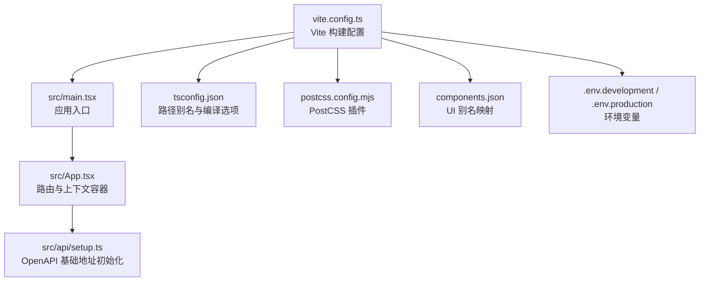
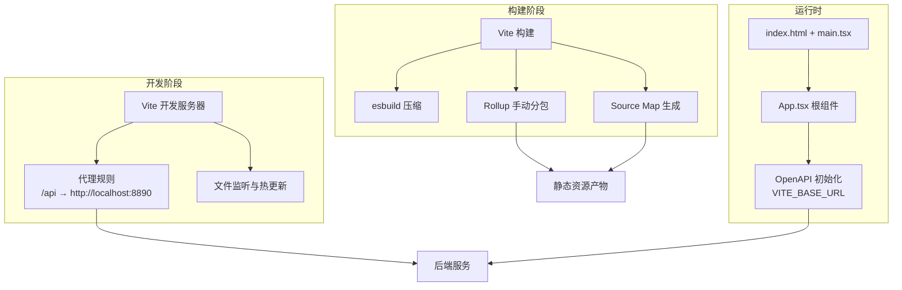
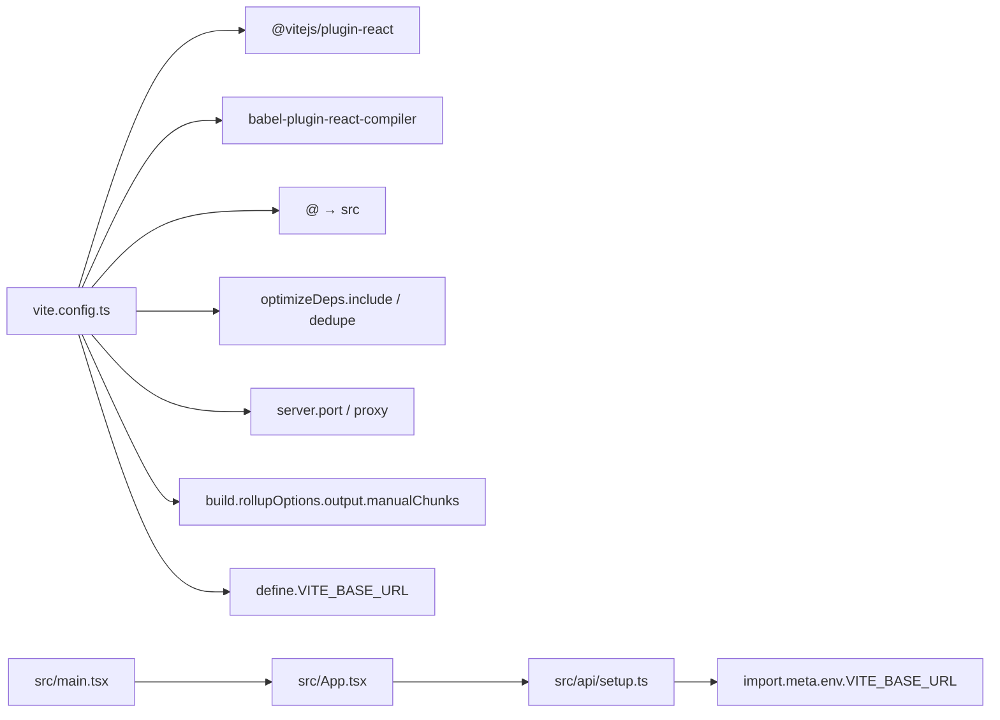

# 构建配置

<cite>
**本文引用的文件**
- [vite.config.ts](file://vite.config.ts)
- [package.json](file://package.json)
- [tsconfig.json](file://tsconfig.json)
- [postcss.config.mjs](file://postcss.config.mjs)
- [index.html](file://index.html)
- [.eslintrc.js](file://.eslintrc.js)
- [.prettierrc](file://.prettierrc)
- [components.json](file://components.json)
- [.env.development](file://.env.development)
- [.env.production](file://.env.production)
- [src/main.tsx](file://src/main.tsx)
- [src/App.tsx](file://src/App.tsx)
- [src/api/setup.ts](file://src/api/setup.ts)
</cite>

## 目录
1. [简介](#简介)
2. [项目结构](#项目结构)
3. [核心组件](#核心组件)
4. [架构总览](#架构总览)
5. [详细组件分析](#详细组件分析)
6. [依赖关系分析](#依赖关系分析)
7. [性能考量](#性能考量)
8. [故障排查指南](#故障排查指南)
9. [结论](#结论)
10. [附录](#附录)

## 简介
本文件面向前端工程团队与运维人员，系统性梳理本项目的 Vite 构建配置与相关工具链，重点覆盖以下方面：
- 开发服务器与代理配置
- 代码分割策略与手动分包
- 生产构建优化与资源压缩
- React Compiler 配置与 ESLint 插件联动
- 插件体系与别名解析机制
- 构建产物分析与打包体积控制
- 最佳实践与常见问题处理

## 项目结构
本项目采用 Vite 6 作为构建引擎，结合 React 19、React Router 7、TailwindCSS 4 与 TypeScript 进行现代化前端开发。构建配置集中在 vite.config.ts 中，类型检查与路径别名由 tsconfig.json 提供，PostCSS 通过 postcss.config.mjs 配置，UI 组件库与别名由 components.json 管理。

图表来源
- [vite.config.ts](file://vite.config.ts#L1-L86)
- [tsconfig.json](file://tsconfig.json#L1-L44)
- [postcss.config.mjs](file://postcss.config.mjs#L1-L6)
- [components.json](file://components.json#L1-L23)
- [.env.development](file://.env.development#L1-L5)
- [.env.production](file://.env.production#L1-L5)
- [src/main.tsx](file://src/main.tsx#L1-L18)
- [src/App.tsx](file://src/App.tsx#L1-L52)
- [src/api/setup.ts](file://src/api/setup.ts#L1-L35)

章节来源
- [vite.config.ts](file://vite.config.ts#L1-L86)
- [tsconfig.json](file://tsconfig.json#L1-L44)
- [postcss.config.mjs](file://postcss.config.mjs#L1-L6)
- [components.json](file://components.json#L1-L23)
- [.env.development](file://.env.development#L1-L5)
- [.env.production](file://.env.production#L1-L5)
- [src/main.tsx](file://src/main.tsx#L1-L18)
- [src/App.tsx](file://src/App.tsx#L1-L52)
- [src/api/setup.ts](file://src/api/setup.ts#L1-L35)

## 核心组件
- Vite 配置中心：定义插件、别名、开发服务器、代理、依赖预优化、构建输出与 define 注入。
- React 插件与 React Compiler：启用 babel 插件驱动的 React Compiler，并通过 ESLint 规则强制启用。
- 路径别名与类型支持：tsconfig.json 与 components.json 提供统一的 @/* 别名与 UI 组件别名。
- 环境变量注入：通过 define 将 VITE_BASE_URL 注入运行时，供 OpenAPI 初始化使用。
- PostCSS：集成 TailwindCSS PostCSS 插件，配合 TailwindCSS 4 使用。

章节来源
- [vite.config.ts](file://vite.config.ts#L1-L86)
- [.eslintrc.js](file://.eslintrc.js#L1-L9)
- [tsconfig.json](file://tsconfig.json#L1-L44)
- [components.json](file://components.json#L1-L23)
- [postcss.config.mjs](file://postcss.config.mjs#L1-L6)
- [src/api/setup.ts](file://src/api/setup.ts#L1-L35)

## 架构总览
下图展示了从开发到生产的整体流程，以及关键配置点如何影响构建结果。

图表来源
- [vite.config.ts](file://vite.config.ts#L39-L83)
- [index.html](file://index.html#L1-L31)
- [src/main.tsx](file://src/main.tsx#L1-L18)
- [src/App.tsx](file://src/App.tsx#L1-L52)
- [src/api/setup.ts](file://src/api/setup.ts#L1-L35)

## 详细组件分析

### 开发服务器与代理配置
- 端口与文件监听：开发服务器默认端口为 3000；使用轮询监听以提升跨平台稳定性，并忽略 node_modules。
- 代理规则：
  - /api 前缀转发至 http://localhost:8890，并去除前缀。
  - /uploads 前缀转发至 http://localhost:8890，保持原路径。
- 变更来源：开发与生产模式共享同一份代理配置，便于前后端联调。

章节来源
- [vite.config.ts](file://vite.config.ts#L39-L58)

### 代码分割策略与手动分包
- 分包目标：将常用第三方库拆分为独立 chunk，降低首屏体积与缓存命中率。
- 已配置分包组：
  - react-vendor：react、react-dom、react-router-dom
  - ui-vendor：动画与 UI 组件（如 framer-motion、radix-ui 系列）
  - data-vendor：状态与网络（@tanstack/react-query、axios、zustand）
  - chart-vendor：可视化（recharts）
  - utils-vendor：加密与工具（crypto-js、es-toolkit）
- 产物体积预警：当单个 chunk 超过 1024KB 时触发警告，便于及时优化。

章节来源
- [vite.config.ts](file://vite.config.ts#L60-L79)

### 优化选项与构建行为
- 压缩器：使用 esbuild 进行最小化，兼顾速度与效果。
- Source Map：生产构建开启，便于线上问题定位。
- Rollup 输出：通过 manualChunks 实现稳定的手动分包。
- define 注入：将 VITE_BASE_URL 注入到运行时，供 OpenAPI 初始化使用。

章节来源
- [vite.config.ts](file://vite.config.ts#L60-L83)

### React Compiler 配置与 ESLint 联动
- React Compiler：通过 babel 插件启用，目标版本针对 React 19 进行优化。
- ESLint 规则：强制启用 eslint-plugin-react-compiler，并将规则设为错误级别，确保团队一致遵循。

章节来源
- [vite.config.ts](file://vite.config.ts#L10-L21)
- [.eslintrc.js](file://.eslintrc.js#L1-L9)

### 插件系统与别名解析机制
- 插件：
  - @vitejs/plugin-react：提供 React JSX 支持与 HMR。
  - rollup-plugin-visualizer（注释态）：用于构建产物可视化分析。
- 别名：
  - Vite resolve.alias：@ 指向 src。
  - tsconfig.json paths：同步 @/* → src/*。
  - components.json：提供 UI 组件库别名（如 @/components、@/lib、@/hooks）。
- 类型支持：tsconfig.json 启用 bundler 模块解析与 jsx react-jsx，确保类型检查与导入行为一致。

章节来源
- [vite.config.ts](file://vite.config.ts#L16-L38)
- [tsconfig.json](file://tsconfig.json#L1-L44)
- [components.json](file://components.json#L1-L23)

### 依赖预优化与去重
- optimizeDeps.include：显式声明需要预优化的依赖（react、react-dom、sonner），加速冷启动。
- dedupe：在依赖解析阶段去重，避免重复打包。

章节来源
- [vite.config.ts](file://vite.config.ts#L35-L38)

### 环境变量与运行时注入
- 环境变量：VITE_BASE_URL 在开发与生产环境均可用。
- 注入方式：通过 define 将 import.meta.env.VITE_BASE_URL 注入到运行时。
- 使用方式：OpenAPI 初始化时读取该值并规范化，作为所有接口的基础地址。

章节来源
- [vite.config.ts](file://vite.config.ts#L81-L83)
- [.env.development](file://.env.development#L1-L2)
- [.env.production](file://.env.production#L1-L2)
- [src/api/setup.ts](file://src/api/setup.ts#L17-L34)

### PostCSS 与 TailwindCSS 集成
- PostCSS 插件：启用 @tailwindcss/postcss，确保样式层正确编译。
- TailwindCSS 4：与 Vite 配合工作，无需额外插件入口。

章节来源
- [postcss.config.mjs](file://postcss.config.mjs#L1-L6)

### 入口与运行时装配
- HTML：index.html 中挂载 #root-app 并引入 /src/main.tsx。
- main.tsx：初始化 Axios 拦截器与 OpenAPI，随后渲染根组件。
- App.tsx：装配路由、权限、用户上下文、下载器上下文、全局加载器与主题切换等。

章节来源
- [index.html](file://index.html#L1-L31)
- [src/main.tsx](file://src/main.tsx#L1-L18)
- [src/App.tsx](file://src/App.tsx#L1-L52)

## 依赖关系分析
下图展示 Vite 配置与关键运行时模块之间的依赖关系。

图表来源
- [vite.config.ts](file://vite.config.ts#L1-L86)
- [src/main.tsx](file://src/main.tsx#L1-L18)
- [src/App.tsx](file://src/App.tsx#L1-L52)
- [src/api/setup.ts](file://src/api/setup.ts#L1-L35)

章节来源
- [vite.config.ts](file://vite.config.ts#L1-L86)
- [src/main.tsx](file://src/main.tsx#L1-L18)
- [src/App.tsx](file://src/App.tsx#L1-L52)
- [src/api/setup.ts](file://src/api/setup.ts#L1-L35)

## 性能考量
- 代码分割
  - 使用 manualChunks 将大型依赖库拆分为独立 chunk，提升缓存复用率。
  - 对 UI 动画、图表、数据访问与工具库进行分组，避免单个 chunk 过大。
- 压缩与 Source Map
  - 生产构建启用 esbuild 压缩，平衡体积与构建速度。
  - 开启 Source Map 便于线上调试，建议在 CI 中上传 Source Map。
- 依赖预优化
  - 通过 optimizeDeps.include 与 dedupe 减少冷启动时间与重复打包。
- 体积监控
  - 利用 chunkSizeWarningLimit 设置阈值，及早发现异常增长。
- 工具链协同
  - ESLint 与 React Compiler 规范化编译路径，减少运行时开销。
  - PostCSS 与 TailwindCSS 4 保证样式层高效编译。

章节来源
- [vite.config.ts](file://vite.config.ts#L60-L83)
- [.eslintrc.js](file://.eslintrc.js#L1-L9)

## 故障排查指南
- 代理 404 或路径异常
  - 确认 /api 与 /uploads 代理规则是否匹配请求前缀。
  - 检查后端服务是否在 http://localhost:8890 正常运行。
- 环境变量未生效
  - 确认 .env.development 与 .env.production 中 VITE_BASE_URL 是否正确。
  - 确认 define 注入已生效，且 OpenAPI 初始化读取到规范化后的 BASE。
- 构建体积过大
  - 关注 chunkSizeWarningLimit 警告，优先拆分或懒加载大依赖。
  - 审视 manualChunks 分组，避免将过多模块塞入同一 chunk。
- React Compiler 报错
  - 确保 ESLint 规则已启用，避免跳过编译优化。
  - 检查 babel 插件配置与 React 版本兼容性。
- 样式未生效
  - 确认 PostCSS 插件已启用，TailwindCSS 4 配置正确。
  - 检查 index.html 中样式引入顺序与类名拼写。

章节来源
- [vite.config.ts](file://vite.config.ts#L39-L83)
- [.env.development](file://.env.development#L1-L2)
- [.env.production](file://.env.production#L1-L2)
- [src/api/setup.ts](file://src/api/setup.ts#L17-L34)
- [.eslintrc.js](file://.eslintrc.js#L1-L9)
- [postcss.config.mjs](file://postcss.config.mjs#L1-L6)

## 结论
本项目的 Vite 构建配置围绕“清晰的分包策略、稳定的开发体验、可控的产物体积”展开。通过 React Compiler、ESLint 规则与 PostCSS/TailwindCSS 的协同，既提升了开发效率，也保障了运行时性能。建议在后续迭代中持续关注 chunkSizeWarningLimit 警告，定期评估 manualChunks 分组与依赖版本，以维持最佳的构建与运行表现。

## 附录
- 术语
  - 分包：将大型依赖拆分为独立 chunk，提升缓存命中率。
  - Source Map：用于将压缩后的代码映射回源码，便于调试。
  - 代理：开发阶段将特定路径转发到后端服务，便于联调。
- 参考实现位置
  - 开发服务器与代理：[vite.config.ts](file://vite.config.ts#L39-L58)
  - 代码分割与构建选项：[vite.config.ts](file://vite.config.ts#L60-L83)
  - React Compiler 与 ESLint：[vite.config.ts](file://vite.config.ts#L10-L21)、[.eslintrc.js](file://.eslintrc.js#L1-L9)
  - 别名与类型支持：[tsconfig.json](file://tsconfig.json#L1-L44)、[components.json](file://components.json#L1-L23)
  - 环境变量注入与使用：[vite.config.ts](file://vite.config.ts#L81-L83)、[src/api/setup.ts](file://src/api/setup.ts#L17-L34)
  - PostCSS 集成：[postcss.config.mjs](file://postcss.config.mjs#L1-L6)
  - 应用入口与运行时装配：[index.html](file://index.html#L1-L31)、[src/main.tsx](file://src/main.tsx#L1-L18)、[src/App.tsx](file://src/App.tsx#L1-L52)