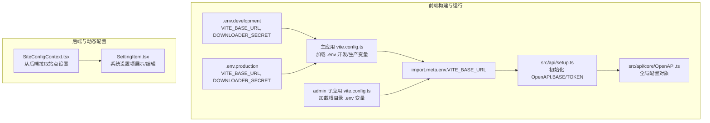
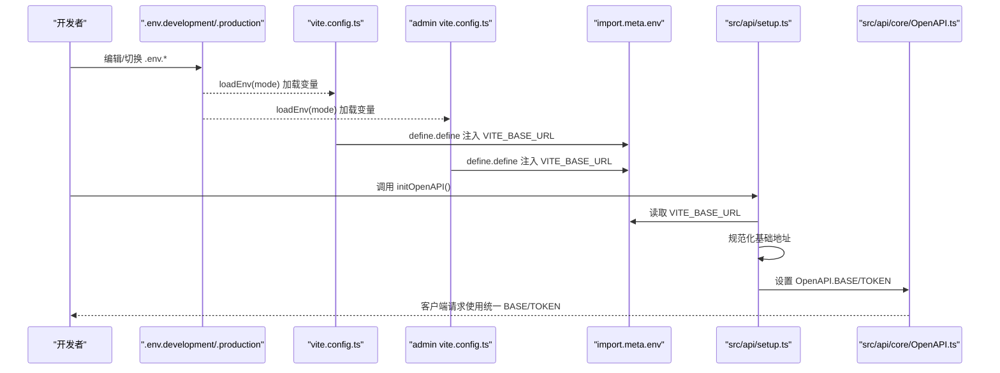
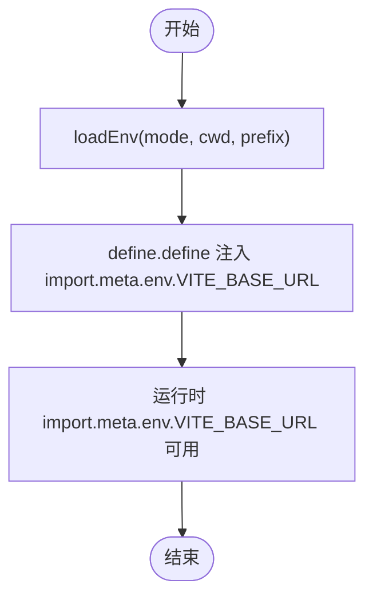
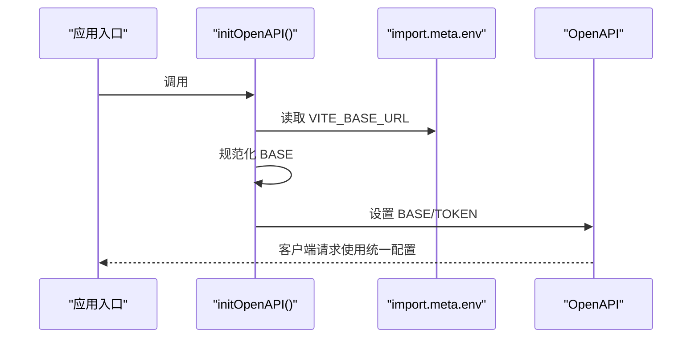
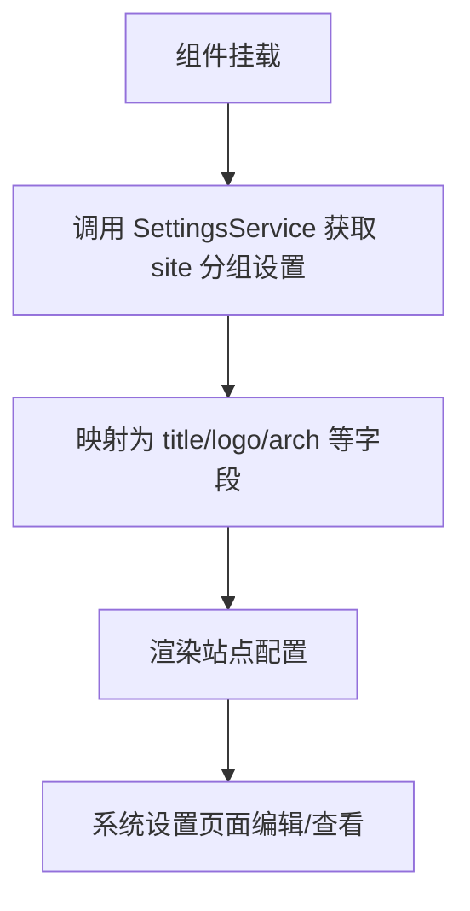
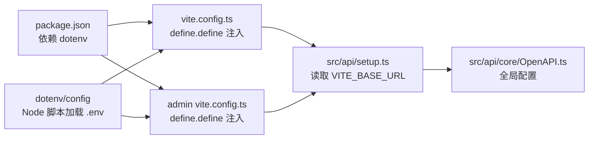

# 环境管理

<cite>
**本文引用的文件**
- [.env.development](file://.env.development)
- [.env.production](file://.env.production)
- [vite.config.ts](file://vite.config.ts)
- [src/modules/admin/vite.config.ts](file://src/modules/admin/vite.config.ts)
- [src/api/setup.ts](file://src/api/setup.ts)
- [src/api/core/OpenAPI.ts](file://src/api/core/OpenAPI.ts)
- [src/vite-env.d.ts](file://src/vite-env.d.ts)
- [package.json](file://package.json)
- [src/context/SiteConfigContext.tsx](file://src/context/SiteConfigContext.tsx)
- [src/modules/admin/pages/system/SystemSettingsPage/components/SettingItem.tsx](file://src/modules/admin/pages/system/SystemSettingsPage/components/SettingItem.tsx)
- [scripts/sync-permissions.ts](file://scripts/sync-permissions.ts)
- [scripts/sync-routes.ts](file://scripts/sync-routes.ts)
</cite>

## 目录
1. [简介](#简介)
2. [项目结构](#项目结构)
3. [核心组件](#核心组件)
4. [架构总览](#架构总览)
5. [详细组件分析](#详细组件分析)
6. [依赖分析](#依赖分析)
7. [性能考虑](#性能考虑)
8. [故障排查指南](#故障排查指南)
9. [结论](#结论)
10. [附录](#附录)

## 简介
本指南面向 zTorrent-site 项目的环境管理，聚焦于开发与生产环境的配置差异、环境变量定义与命名规范、敏感信息管理与安全配置、.env 文件结构与加载机制、环境切换策略、配置验证与错误处理、环境迁移与备份恢复、配置审计与变更管理以及版本控制策略。文档以仓库中现有实现为依据，结合 Vite 环境变量注入、OpenAPI 客户端初始化、站点设置动态加载等关键点，给出可操作的实践建议。

## 项目结构
本项目采用 Vite 作为前端构建工具，并通过多套 vite.config.ts 配置分别服务于主应用与 admin 子应用。环境变量通过 Vite 的 loadEnv 机制从 .env.* 文件加载，并注入到 import.meta.env 中，供运行时使用。OpenAPI 客户端在应用初始化阶段读取 import.meta.env.VITE_BASE_URL 并规范化基础地址，同时统一从本地存储读取访问令牌。

图表来源
- [vite.config.ts](file://vite.config.ts#L1-L86)
- [src/modules/admin/vite.config.ts](file://src/modules/admin/vite.config.ts#L1-L46)
- [.env.development](file://.env.development#L1-L5)
- [.env.production](file://.env.production#L1-L5)
- [src/api/setup.ts](file://src/api/setup.ts#L1-L35)
- [src/api/core/OpenAPI.ts](file://src/api/core/OpenAPI.ts#L1-L33)
- [src/context/SiteConfigContext.tsx](file://src/context/SiteConfigContext.tsx#L1-L33)
- [src/modules/admin/pages/system/SystemSettingsPage/components/SettingItem.tsx](file://src/modules/admin/pages/system/SystemSettingsPage/components/SettingItem.tsx#L206-L245)

章节来源
- [vite.config.ts](file://vite.config.ts#L1-L86)
- [src/modules/admin/vite.config.ts](file://src/modules/admin/vite.config.ts#L1-L46)
- [.env.development](file://.env.development#L1-L5)
- [.env.production](file://.env.production#L1-L5)
- [src/api/setup.ts](file://src/api/setup.ts#L1-L35)
- [src/api/core/OpenAPI.ts](file://src/api/core/OpenAPI.ts#L1-L33)
- [src/context/SiteConfigContext.tsx](file://src/context/SiteConfigContext.tsx#L1-L33)
- [src/modules/admin/pages/system/SystemSettingsPage/components/SettingItem.tsx](file://src/modules/admin/pages/system/SystemSettingsPage/components/SettingItem.tsx#L206-L245)

## 核心组件
- 环境变量加载与注入
  - 主应用与 admin 子应用均通过 Vite 的 loadEnv 从 .env.* 文件加载变量，并将其注入到 import.meta.env。主应用在 define.define 中显式注入 VITE_BASE_URL；admin 子应用在 define.define 中同样注入 VITE_BASE_URL。
- OpenAPI 客户端初始化
  - 应用初始化时调用 initOpenAPI，从 import.meta.env.VITE_BASE_URL 读取基础地址并去除尾部斜杠，随后设置 OpenAPI.BASE；同时统一从 localStorage 读取访问令牌用于请求附带。
- 类型声明与约束
  - 通过 src/vite-env.d.ts 对 import.meta.env 的键进行类型约束，确保 VITE_BASE_URL 的存在性与类型正确性。
- 动态站点配置
  - SiteConfigContext.tsx 在运行时从后端接口拉取“site”分组的设置项，并映射到标题、Logo、架构等字段；SettingItem.tsx 展示与编辑这些设置项。

章节来源
- [vite.config.ts](file://vite.config.ts#L81-L83)
- [src/modules/admin/vite.config.ts](file://src/modules/admin/vite.config.ts#L41-L44)
- [src/api/setup.ts](file://src/api/setup.ts#L18-L34)
- [src/api/core/OpenAPI.ts](file://src/api/core/OpenAPI.ts#L10-L32)
- [src/vite-env.d.ts](file://src/vite-env.d.ts#L3-L9)
- [src/context/SiteConfigContext.tsx](file://src/context/SiteConfigContext.tsx#L13-L33)
- [src/modules/admin/pages/system/SystemSettingsPage/components/SettingItem.tsx](file://src/modules/admin/pages/system/SystemSettingsPage/components/SettingItem.tsx#L206-L245)

## 架构总览
下图展示了从 .env 到运行时配置的整体链路，包括变量加载、注入、初始化与使用。

图表来源
- [vite.config.ts](file://vite.config.ts#L7-L83)
- [src/modules/admin/vite.config.ts](file://src/modules/admin/vite.config.ts#L6-L44)
- [src/api/setup.ts](file://src/api/setup.ts#L18-L34)
- [src/api/core/OpenAPI.ts](file://src/api/core/OpenAPI.ts#L22-L32)

## 详细组件分析

### 组件一：环境变量加载与注入机制
- 加载源
  - 主应用：通过 loadEnv(mode, process.cwd(), "") 从项目根目录加载 .env.development 或 .env.production。
  - admin 子应用：通过 loadEnv(mode, path.resolve(__dirname, "../../../"), "") 指向根目录加载 .env.*。
- 注入目标
  - 两者均在 define.define 中将 VITE_BASE_URL 注入到 import.meta.env，供运行时读取。
- 类型约束
  - vite-env.d.ts 声明了 VITE_BASE_URL 的存在性，便于 TS 推断与静态检查。

图表来源
- [vite.config.ts](file://vite.config.ts#L7-L83)
- [src/modules/admin/vite.config.ts](file://src/modules/admin/vite.config.ts#L6-L44)
- [src/vite-env.d.ts](file://src/vite-env.d.ts#L3-L9)

章节来源
- [vite.config.ts](file://vite.config.ts#L7-L83)
- [src/modules/admin/vite.config.ts](file://src/modules/admin/vite.config.ts#L6-L44)
- [src/vite-env.d.ts](file://src/vite-env.d.ts#L3-L9)

### 组件二：OpenAPI 客户端初始化与令牌策略
- 初始化流程
  - initOpenAPI 在首次调用时设置全局标记，避免重复初始化。
  - 从 import.meta.env.VITE_BASE_URL 读取基础地址，去除尾部斜杠后赋给 OpenAPI.BASE。
  - 统一从 localStorage 读取 accessToken 作为 TOKEN 回调。
- 安全要点
  - TOKEN 来自本地存储，需配合安全的登录与会话管理策略。
  - 建议在生产环境启用 HTTPS 与安全的 Cookie 属性（如 SameSite、Secure、HttpOnly）以保护令牌。

图表来源
- [src/api/setup.ts](file://src/api/setup.ts#L18-L34)
- [src/api/core/OpenAPI.ts](file://src/api/core/OpenAPI.ts#L22-L32)

章节来源
- [src/api/setup.ts](file://src/api/setup.ts#L18-L34)
- [src/api/core/OpenAPI.ts](file://src/api/core/OpenAPI.ts#L22-L32)

### 组件三：动态站点配置与系统设置
- 运行时配置
  - SiteConfigContext.tsx 在组件挂载时调用 SettingsService 拉取“site”分组设置，映射为标题、Logo、架构等字段。
- 系统设置界面
  - SettingItem.tsx 展示设置项的描述、键名、类型与可变性，支持编辑与锁定状态提示。

图表来源
- [src/context/SiteConfigContext.tsx](file://src/context/SiteConfigContext.tsx#L13-L33)
- [src/modules/admin/pages/system/SystemSettingsPage/components/SettingItem.tsx](file://src/modules/admin/pages/system/SystemSettingsPage/components/SettingItem.tsx#L206-L245)

章节来源
- [src/context/SiteConfigContext.tsx](file://src/context/SiteConfigContext.tsx#L13-L33)
- [src/modules/admin/pages/system/SystemSettingsPage/components/SettingItem.tsx](file://src/modules/admin/pages/system/SystemSettingsPage/components/SettingItem.tsx#L206-L245)

### 组件四：脚本中的环境变量使用
- 脚本加载 dotenv
  - scripts/sync-permissions.ts 与 scripts/sync-routes.ts 通过 import "dotenv/config" 加载根目录 .env.* 中的变量。
- 适用场景
  - 服务端脚本或 Node 工具在执行时需要读取环境变量（如数据库连接、密钥等）。

章节来源
- [scripts/sync-permissions.ts](file://scripts/sync-permissions.ts#L21-L21)
- [scripts/sync-routes.ts](file://scripts/sync-routes.ts#L21-L21)

## 依赖分析
- Vite 与 dotenv
  - package.json 中声明了 dotenv 依赖，用于在 Node 环境中加载 .env 文件；Vite 在浏览器侧通过 define.define 注入变量。
- 环境变量耦合点
  - VITE_BASE_URL 是前端请求的基础地址，贯穿 vite.config.ts、admin vite.config.ts、src/api/setup.ts 与 src/api/core/OpenAPI.ts。
- 外部集成
  - 后端接口提供动态站点配置，前端通过 SettingsService 拉取并渲染。

图表来源
- [package.json](file://package.json#L54-L54)
- [vite.config.ts](file://vite.config.ts#L81-L83)
- [src/modules/admin/vite.config.ts](file://src/modules/admin/vite.config.ts#L41-L44)
- [src/api/setup.ts](file://src/api/setup.ts#L24-L32)
- [src/api/core/OpenAPI.ts](file://src/api/core/OpenAPI.ts#L22-L32)
- [scripts/sync-permissions.ts](file://scripts/sync-permissions.ts#L21-L21)
- [scripts/sync-routes.ts](file://scripts/sync-routes.ts#L21-L21)

章节来源
- [package.json](file://package.json#L54-L54)
- [vite.config.ts](file://vite.config.ts#L81-L83)
- [src/modules/admin/vite.config.ts](file://src/modules/admin/vite.config.ts#L41-L44)
- [src/api/setup.ts](file://src/api/setup.ts#L24-L32)
- [src/api/core/OpenAPI.ts](file://src/api/core/OpenAPI.ts#L22-L32)
- [scripts/sync-permissions.ts](file://scripts/sync-permissions.ts#L21-L21)
- [scripts/sync-routes.ts](file://scripts/sync-routes.ts#L21-L21)

## 性能考虑
- 构建期注入
  - 通过 define.define 将 VITE_BASE_URL 注入 import.meta.env，避免在运行时进行额外的字符串拼接或正则替换，减少运行时开销。
- 代理与开发体验
  - vite.config.ts 配置了 /api 与 /uploads 代理，开发时直接转发至后端服务，减少跨域与中间层复杂度。
- 代码分割
  - vite.config.ts 中对 vendor 包进行了手动分块，有助于缓存与加载性能优化。

章节来源
- [vite.config.ts](file://vite.config.ts#L46-L58)
- [vite.config.ts](file://vite.config.ts#L64-L79)

## 故障排查指南
- 症状：请求地址异常或重复斜杠
  - 检查 VITE_BASE_URL 是否以斜杠结尾；initOpenAPI 会对尾部斜杠进行规范化处理，若仍异常，请确认 define.define 注入是否生效。
- 症状：TOKEN 未携带导致鉴权失败
  - 确认 localStorage 中是否存在 accessToken；OpenAPI.TOKEN 默认从 localStorage 读取。
- 症状：admin 子应用无法加载 .env 变量
  - 确认 admin vite.config.ts 的 envDir 与 root 配置是否指向根目录；确保 loadEnv(mode, ...) 路径正确。
- 症状：TS 类型报错
  - 确认 vite-env.d.ts 中已声明 VITE_BASE_URL；确保 tsconfig 或 IDE 能识别该类型声明。
- 症状：脚本执行时报错找不到环境变量
  - 确认脚本中已引入 dotenv/config；确保 .env.* 文件存在于项目根目录且包含所需键值。

章节来源
- [src/api/setup.ts](file://src/api/setup.ts#L24-L32)
- [src/modules/admin/vite.config.ts](file://src/modules/admin/vite.config.ts#L6-L44)
- [src/vite-env.d.ts](file://src/vite-env.d.ts#L3-L9)
- [scripts/sync-permissions.ts](file://scripts/sync-permissions.ts#L21-L21)
- [scripts/sync-routes.ts](file://scripts/sync-routes.ts#L21-L21)

## 结论
本项目通过 Vite 的环境变量注入与 OpenAPI 客户端初始化，实现了前端请求基础地址的统一管理与令牌策略的集中处理。.env.* 文件与 vite.config.ts 的配合保证了开发与生产环境的一致性与可移植性。动态站点配置由后端提供并通过前端上下文渲染，形成“构建期注入 + 运行时拉取”的双轨配置体系。建议在生产环境中强化令牌与网络传输的安全策略，并完善配置审计与变更流程以保障稳定性与可追溯性。

## 附录

### 开发与生产环境配置差异
- 当前仓库中 .env.development 与 .env.production 的内容一致，均包含 VITE_BASE_URL 与 DOWNLOADER_SECRET。
- 建议在生产环境将 DOWNLOADER_SECRET 改为更严格的随机值，并限制其在客户端的暴露范围（例如仅在服务端脚本中使用）。

章节来源
- [.env.development](file://.env.development#L1-L5)
- [.env.production](file://.env.production#L1-L5)

### 环境变量定义与命名规范
- 命名规范
  - 使用 VITE_ 前缀的变量将被 Vite 注入到 import.meta.env。
  - 本项目使用 VITE_BASE_URL 表示后端基础地址。
- 类型约束
  - 通过 vite-env.d.ts 对 import.meta.env 的键进行类型约束，确保类型安全。

章节来源
- [src/vite-env.d.ts](file://src/vite-env.d.ts#L3-L9)

### 敏感信息管理与安全配置
- 令牌管理
  - OpenAPI.TOKEN 默认从 localStorage 读取 accessToken；建议在生产环境启用 HTTPS、安全的 Cookie 属性与严格的 CSP。
- 密钥管理
  - DOWNLOADER_SECRET 当前在 .env.* 中可见，建议仅在服务端脚本中使用，并通过 CI/CD 的机密变量注入。

章节来源
- [src/api/setup.ts](file://src/api/setup.ts#L31-L32)
- [.env.development](file://.env.development#L3-L3)
- [.env.production](file://.env.production#L3-L3)

### 环境切换策略
- 切换方式
  - 通过 Vite 的 --mode 参数选择 .env.development 或 .env.production。
  - admin 子应用通过独立的 vite.config.ts 指向根目录加载 .env.*。
- 建议
  - 在 CI/CD 中通过环境变量覆盖 mode 与 .env 内容，避免硬编码。

章节来源
- [vite.config.ts](file://vite.config.ts#L7-L8)
- [src/modules/admin/vite.config.ts](file://src/modules/admin/vite.config.ts#L7-L8)

### 配置验证与错误处理
- 构建期验证
  - 通过 vite-env.d.ts 提前发现缺失或类型不符的变量。
- 运行时验证
  - initOpenAPI 对 VITE_BASE_URL 进行规范化；可在调用前增加空值校验与日志输出。
- 错误处理
  - 若 TOKEN 为空，OpenAPI 请求不会附带令牌；建议在调用前进行兜底处理或提示用户登录。

章节来源
- [src/vite-env.d.ts](file://src/vite-env.d.ts#L3-L9)
- [src/api/setup.ts](file://src/api/setup.ts#L24-L32)

### 环境迁移指南
- 迁移步骤
  - 准备新环境的 .env.* 文件，确保包含 VITE_BASE_URL 与必要的服务端密钥。
  - 在构建阶段注入新变量，确保 define.define 与 loadEnv 配置一致。
  - 验证 OpenAPI.BASE 与代理配置是否匹配新后端地址。
- 回归测试
  - 测试登录流程（TOKEN）、API 请求、上传代理与动态站点配置拉取。

章节来源
- [vite.config.ts](file://vite.config.ts#L81-L83)
- [src/modules/admin/vite.config.ts](file://src/modules/admin/vite.config.ts#L41-L44)
- [src/api/setup.ts](file://src/api/setup.ts#L24-L32)

### 配置备份与恢复流程
- 备份
  - 备份 .env.development 与 .env.production，以及 vite.config.ts 与 vite-env.d.ts 的关键配置。
- 恢复
  - 恢复 .env.* 后重新构建；如涉及 OpenAPI.BASE 变更，需同步更新代理与后端地址。

章节来源
- [.env.development](file://.env.development#L1-L5)
- [.env.production](file://.env.production#L1-L5)
- [vite.config.ts](file://vite.config.ts#L81-L83)

### 配置审计、变更管理与版本控制策略
- 审计
  - 记录 .env.* 的变更历史与责任人；对敏感变量变更进行审批与回滚预案。
- 变更管理
  - 通过分支策略隔离不同环境的 .env.*；在合并前进行自动化校验（类型、必填项）。
- 版本控制
  - .env.* 不纳入版本库；通过模板文件与 CI/CD 机密变量注入；仅提交 .env.example 或说明文档。

章节来源
- [package.json](file://package.json#L126-L138)