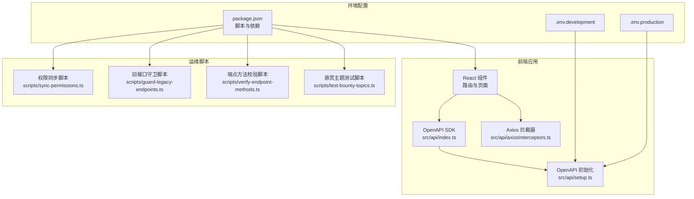
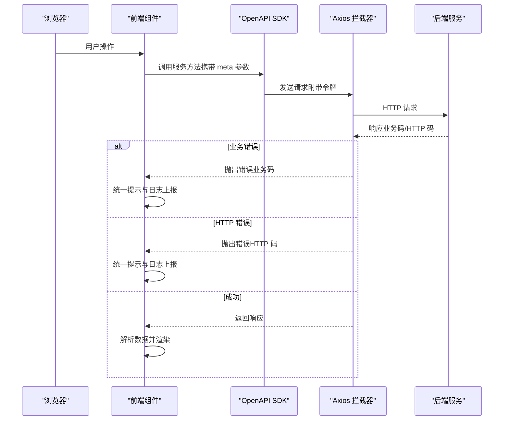
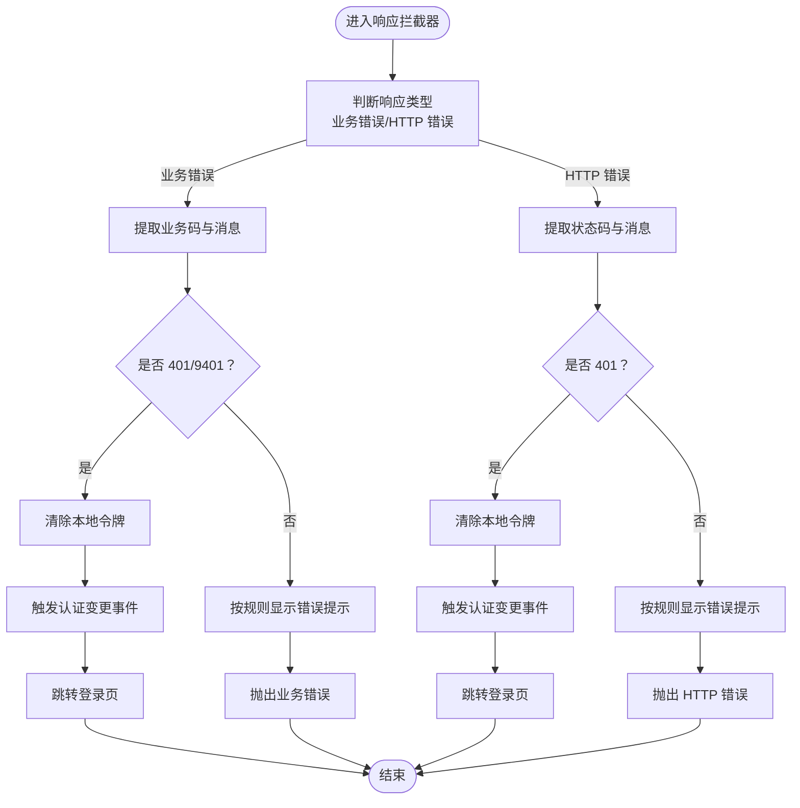
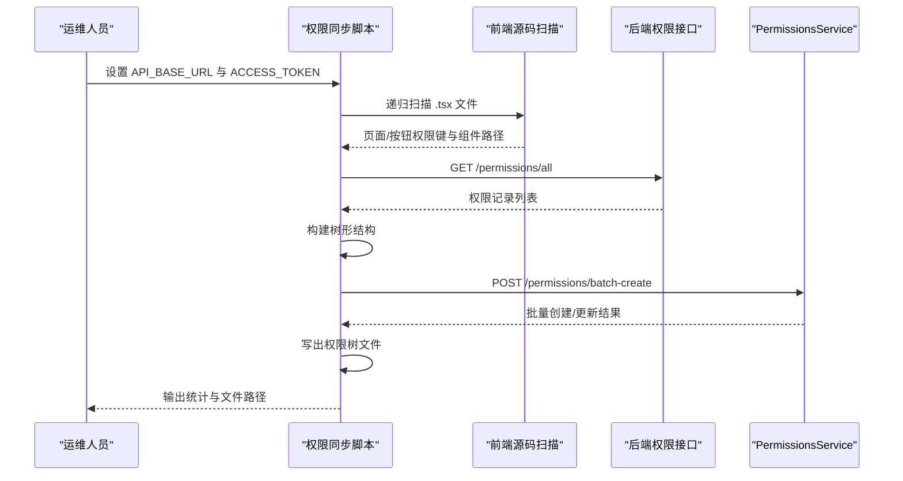
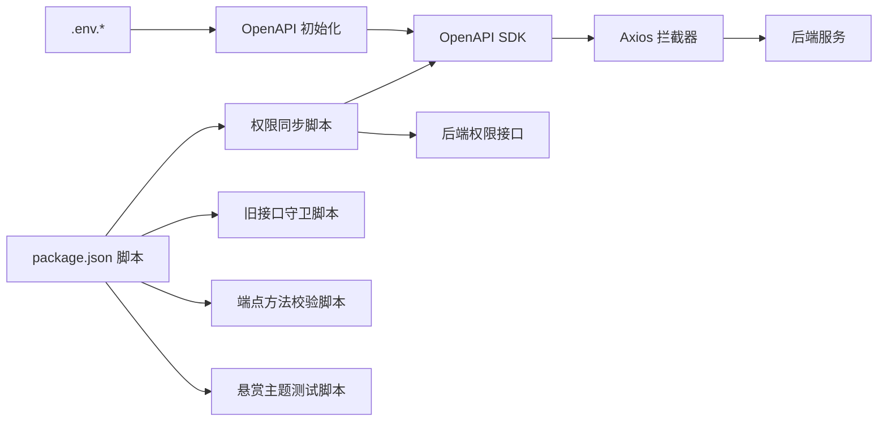

# 监控运维

<cite>
**本文引用的文件**
- [README.md](file://README.md)
- [package.json](file://package.json)
- [.env.development](file://.env.development)
- [.env.production](file://.env.production)
- [src/api/setup.ts](file://src/api/setup.ts)
- [src/api/axiosInterceptors.ts](file://src/api/axiosInterceptors.ts)
- [src/api/index.ts](file://src/api/index.ts)
- [scripts/sync-permissions.ts](file://scripts/sync-permissions.ts)
- [scripts/guard-legacy-endpoints.ts](file://scripts/guard-legacy-endpoints.ts)
- [scripts/verify-endpoint-methods.ts](file://scripts/verify-endpoint-methods.ts)
- [scripts/test-bounty-topics.ts](file://scripts/test-bounty-topics.ts)
</cite>

## 目录
1. [简介](#简介)
2. [项目结构](#项目结构)
3. [核心组件](#核心组件)
4. [架构总览](#架构总览)
5. [详细组件分析](#详细组件分析)
6. [依赖关系分析](#依赖关系分析)
7. [性能考量](#性能考量)
8. [故障排查指南](#故障排查指南)
9. [结论](#结论)
10. [附录](#附录)

## 简介
本运维指南面向 zTorrent-site 项目的监控与运维场景，聚焦以下目标：
- 应用性能监控与健康检查策略
- 错误追踪与日志管理
- 性能指标监控与告警配置
- 运维脚本使用、自动化任务与批量操作
- 故障诊断流程、问题排查工具与应急响应预案
- 系统维护计划、容量规划与性能优化建议
- 运维最佳实践与团队协作规范

本指南基于仓库现有代码与脚本进行分析，结合前端 SDK 初始化、统一请求拦截与错误处理、权限同步与接口守卫等能力，形成可落地的运维方案。

## 项目结构
项目为前端单页应用（Vite + React），通过 OpenAPI 生成的 SDK 调用后端接口，并在运行时集中初始化基础地址与认证令牌。运维侧关注的关键点包括：
- 前端运行时配置（Vite 环境变量）与 SDK 初始化
- 统一请求拦截与错误处理
- 权限与接口治理脚本
- 开发与生产环境变量

图表来源
- [src/api/setup.ts](file://src/api/setup.ts#L12-L34)
- [src/api/axiosInterceptors.ts](file://src/api/axiosInterceptors.ts#L196-L292)
- [src/api/index.ts](file://src/api/index.ts#L1-L10)
- [package.json](file://package.json#L126-L139)
- [.env.development](file://.env.development#L1-L5)
- [.env.production](file://.env.production#L1-L5)
- [scripts/sync-permissions.ts](file://scripts/sync-permissions.ts#L62-L99)
- [scripts/guard-legacy-endpoints.ts](file://scripts/guard-legacy-endpoints.ts#L10-L115)
- [scripts/verify-endpoint-methods.ts](file://scripts/verify-endpoint-methods.ts#L9-L103)
- [scripts/test-bounty-topics.ts](file://scripts/test-bounty-topics.ts#L1-L54)

章节来源
- [README.md](file://README.md#L1-L11)
- [package.json](file://package.json#L126-L139)
- [.env.development](file://.env.development#L1-L5)
- [.env.production](file://.env.production#L1-L5)

## 核心组件
- OpenAPI 运行时初始化：集中设置基础地址与令牌，确保 SDK 请求的一致性与可追踪性。
- Axios 统一拦截器：封装业务错误码、HTTP 错误与网络错误，统一提示与跳转逻辑。
- 权限同步脚本：扫描前端源码与后端接口权限，批量创建/更新权限树，支撑 RBAC 管理。
- 旧接口守卫脚本：从变更记录提取“旧→新”映射，扫描代码与文档，防止旧路径残留。
- 端点方法校验脚本：静态扫描关键端点是否以 POST 声明，保障接口契约一致性。
- 悬赏主题测试脚本：开发阶段验证参数映射与响应处理，辅助回归测试。

章节来源
- [src/api/setup.ts](file://src/api/setup.ts#L12-L34)
- [src/api/axiosInterceptors.ts](file://src/api/axiosInterceptors.ts#L196-L292)
- [scripts/sync-permissions.ts](file://scripts/sync-permissions.ts#L62-L99)
- [scripts/guard-legacy-endpoints.ts](file://scripts/guard-legacy-endpoints.ts#L10-L115)
- [scripts/verify-endpoint-methods.ts](file://scripts/verify-endpoint-methods.ts#L9-L103)
- [scripts/test-bounty-topics.ts](file://scripts/test-bounty-topics.ts#L1-L54)

## 架构总览
前端通过 OpenAPI SDK 发起请求，SDK 在运行时读取 Vite 环境变量配置基础地址与令牌。请求经由 Axios 拦截器统一处理成功/失败分支，业务错误与 HTTP 错误分别走不同分支，必要时触发全局认证失效处理与跳转。运维脚本贯穿开发与发布流程，保障权限与接口契约的正确性与一致性。

图表来源
- [src/api/setup.ts](file://src/api/setup.ts#L18-L34)
- [src/api/axiosInterceptors.ts](file://src/api/axiosInterceptors.ts#L204-L291)
- [src/api/index.ts](file://src/api/index.ts#L1-L10)

## 详细组件分析

### OpenAPI 运行时初始化
职责与行为
- 读取 Vite 环境变量作为基础地址，规范化去除尾部斜杠，避免路径拼接问题
- 统一从本地存储读取访问令牌，供 SDK 请求时附带
- 通过全局标记确保初始化仅执行一次，避免热更新导致的重复配置

运维要点
- 确保部署时正确注入 VITE_BASE_URL，避免跨域与路径拼接异常
- 令牌读取策略可按需扩展，如刷新与持久化策略
- 初始化应在应用入口尽早调用，保证 SDK 请求一致性

章节来源
- [src/api/setup.ts](file://src/api/setup.ts#L12-L34)
- [.env.development](file://.env.development#L1-L2)
- [.env.production](file://.env.production#L1-L2)

### Axios 统一拦截器
职责与行为
- 成功响应：校验业务码，非成功码时构造错误对象并中断后续链路
- 失败响应：优先判定业务码，其次 HTTP 状态码；401 统一触发认证失效处理与跳转
- 错误消息提取：优先后端 message，其次自定义 meta，再回落至默认文案
- 业务错误码映射：内置常见业务码与 HTTP 状态码对应文案
- 状态控制：防止重复跳转与重复提示

运维要点
- 业务错误码与 HTTP 状态码的映射需与后端保持一致
- 可根据需要扩展 meta 参数（静默、跳过特定错误码等）
- 开发环境可利用控制台分组输出定位问题

图表来源
- [src/api/axiosInterceptors.ts](file://src/api/axiosInterceptors.ts#L204-L291)

章节来源
- [src/api/axiosInterceptors.ts](file://src/api/axiosInterceptors.ts#L196-L292)

### 权限同步脚本
职责与行为
- 扫描前端源码，提取页面与按钮权限键，构建树形结构
- 从后端拉取 API 权限记录并合并，完善 type、scope、urls 等字段
- 通过 SDK 调用批量创建/更新权限树，输出权限树文件
- 支持路由解析、组件依赖闭包构建，确保按钮权限与页面组件关联

运维要点
- 运行前需配置后端地址与管理员令牌
- 生成的权限树可用于审计与可视化
- 建议在权限变更后定期执行，确保前后端一致

图表来源
- [scripts/sync-permissions.ts](file://scripts/sync-permissions.ts#L62-L99)
- [scripts/sync-permissions.ts](file://scripts/sync-permissions.ts#L218-L260)
- [scripts/sync-permissions.ts](file://scripts/sync-permissions.ts#L574-L598)

章节来源
- [scripts/sync-permissions.ts](file://scripts/sync-permissions.ts#L62-L99)
- [scripts/sync-permissions.ts](file://scripts/sync-permissions.ts#L218-L260)
- [scripts/sync-permissions.ts](file://scripts/sync-permissions.ts#L574-L598)

### 旧接口守卫脚本
职责与行为
- 从变更记录中解析“旧→新”接口映射
- 扫描指定目录（源码与文档），匹配残留旧接口字符串
- 对命中但为新路径前缀的情况进行过滤，避免误报
- 输出违规清单并退出（非零码），阻止 CI 继续

运维要点
- 变更记录需及时更新，确保映射准确
- 建议在 CI 中集成该脚本，保证发布质量

章节来源
- [scripts/guard-legacy-endpoints.ts](file://scripts/guard-legacy-endpoints.ts#L10-L115)

### 端点方法校验脚本
职责与行为
- 静态扫描关键端点是否出现在源码中
- 检查端点附近是否存在 method: 'POST' 声明
- 输出缺失端点与非 POST 声明清单并退出

运维要点
- 目标端点列表需随接口契约更新
- 与权限同步脚本配合，确保端点与权限一致

章节来源
- [scripts/verify-endpoint-methods.ts](file://scripts/verify-endpoint-methods.ts#L9-L103)

### 悬赏主题测试脚本
职责与行为
- 开发阶段验证前端 hook 的参数映射与响应处理
- 通过覆写服务方法注入 Mock 数据，输出关键字段验证

运维要点
- 作为回归测试的一部分，建议在本地与 CI 中运行
- 可扩展为更全面的单元测试

章节来源
- [scripts/test-bounty-topics.ts](file://scripts/test-bounty-topics.ts#L1-L54)

## 依赖关系分析
- 前端运行时依赖 Vite 环境变量与 OpenAPI SDK 初始化
- SDK 依赖 Axios 拦截器进行统一错误处理
- 权限同步脚本依赖 SDK 与后端接口
- 旧接口守卫与端点方法校验脚本依赖源码与文档扫描
- 测试脚本依赖前端模块与 SDK 服务

图表来源
- [src/api/setup.ts](file://src/api/setup.ts#L18-L34)
- [src/api/axiosInterceptors.ts](file://src/api/axiosInterceptors.ts#L196-L292)
- [src/api/index.ts](file://src/api/index.ts#L1-L10)
- [package.json](file://package.json#L126-L139)
- [scripts/sync-permissions.ts](file://scripts/sync-permissions.ts#L62-L99)
- [scripts/guard-legacy-endpoints.ts](file://scripts/guard-legacy-endpoints.ts#L10-L115)
- [scripts/verify-endpoint-methods.ts](file://scripts/verify-endpoint-methods.ts#L9-L103)
- [scripts/test-bounty-topics.ts](file://scripts/test-bounty-topics.ts#L1-L54)

章节来源
- [package.json](file://package.json#L126-L139)

## 性能考量
- 请求层优化
  - 合理使用 meta 参数控制提示与静默，减少不必要的 UI 干扰
  - 对高频接口考虑缓存策略（如查询类接口），避免重复请求
- SDK 初始化
  - 确保基础地址与令牌配置正确，避免重定向与鉴权失败导致的额外往返
- 脚本执行
  - 在 CI 中并行执行多个校验脚本，缩短流水线时间
- 日志与监控
  - 在拦截器中增加采样与上报逻辑，结合后端指标进行聚合分析

## 故障排查指南
- 常见问题与定位
  - 401/9401：检查令牌是否过期或被清除，确认拦截器跳转逻辑是否生效
  - 业务错误：查看控制台分组输出，核对后端 message 与业务码映射
  - 跨域/路径拼接：检查 VITE_BASE_URL 与路径末尾斜杠
- 关键步骤
  - 打开浏览器开发者工具 Network 面板，观察请求与响应
  - 在 Console 分组查看错误详情，定位具体接口与参数
  - 使用权限同步脚本比对权限树，确认页面与按钮权限是否正确
  - 使用旧接口守卫与端点方法校验脚本，排除契约不一致问题
- 应急响应
  - 临时降级：在拦截器中增加开关，屏蔽部分错误提示与跳转
  - 回滚：冻结权限与接口变更，确保最小化影响范围

章节来源
- [src/api/axiosInterceptors.ts](file://src/api/axiosInterceptors.ts#L204-L291)
- [scripts/sync-permissions.ts](file://scripts/sync-permissions.ts#L62-L99)
- [scripts/guard-legacy-endpoints.ts](file://scripts/guard-legacy-endpoints.ts#L10-L115)
- [scripts/verify-endpoint-methods.ts](file://scripts/verify-endpoint-methods.ts#L9-L103)

## 结论
本指南基于仓库现有能力，构建了从前端初始化、统一拦截、权限治理到脚本校验的完整运维闭环。建议在实际生产中补充后端指标对接、日志采集与告警策略，持续完善自动化与可观测性体系，确保系统稳定与高效运维。

## 附录
- 运行与开发
  - 安装依赖与启动开发服务器
  - 生成 API 客户端代码（如需）
- 环境变量
  - VITE_BASE_URL：后端基础地址
  - DOWNLOADER_SECRET：下载器密钥（如涉及）
- 脚本清单
  - 权限同步：设置后端地址与令牌后执行
  - 旧接口守卫：在 CI 中集成
  - 端点方法校验：随接口契约更新维护目标列表
  - 悬赏主题测试：本地与 CI 中运行

章节来源
- [README.md](file://README.md#L6-L11)
- [package.json](file://package.json#L126-L139)
- [.env.development](file://.env.development#L1-L5)
- [.env.production](file://.env.production#L1-L5)