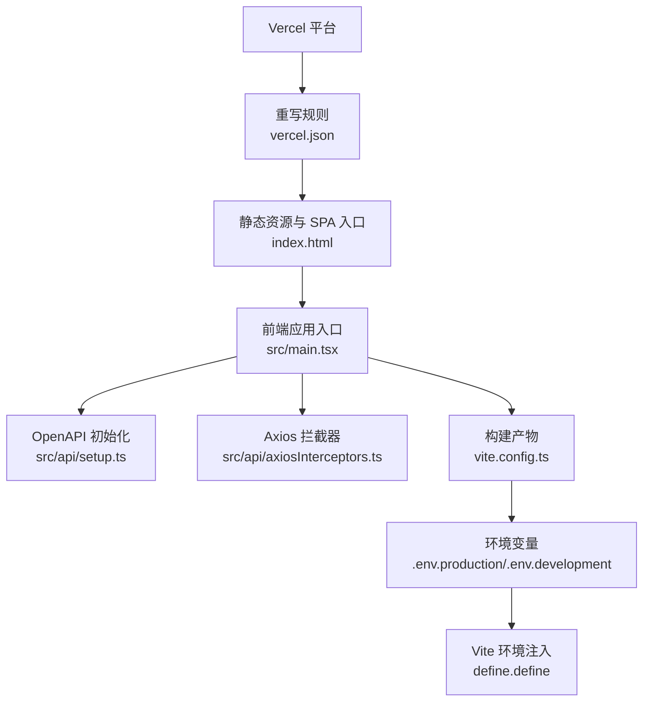
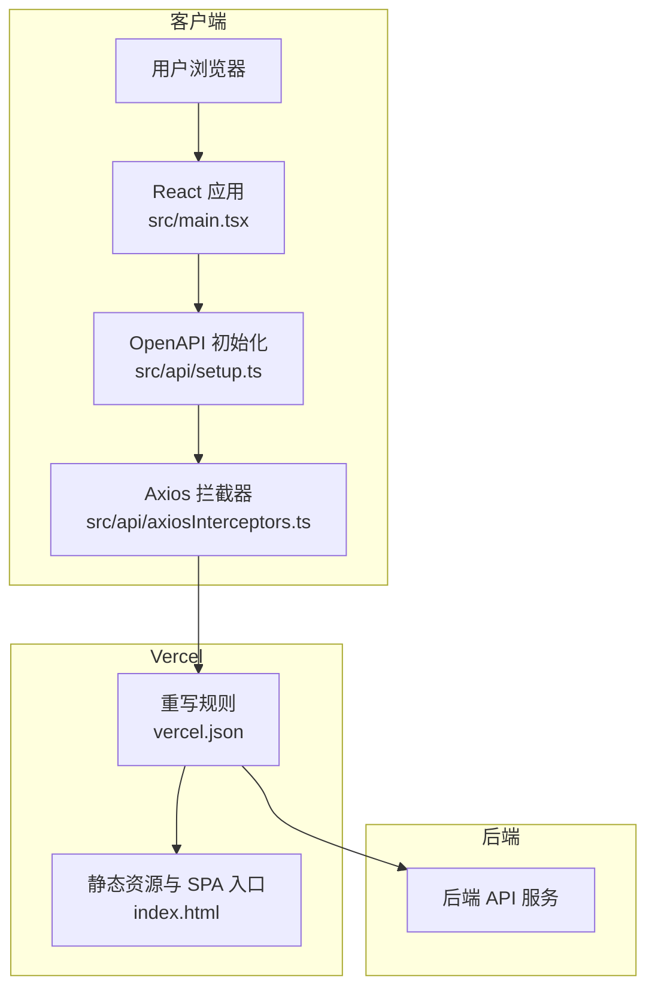
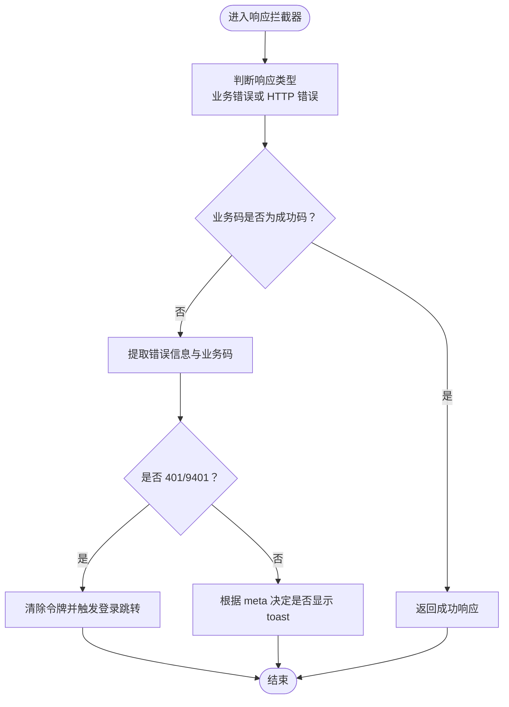
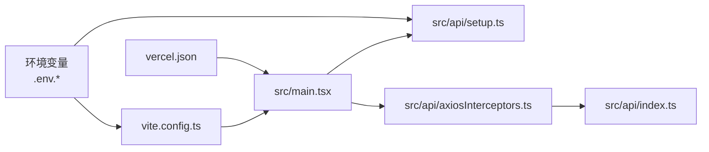

# 部署和运维

<cite>
**本文引用的文件**
- [vercel.json](file://vercel.json)
- [package.json](file://package.json)
- [vite.config.ts](file://vite.config.ts)
- [.env.production](file://.env.production)
- [.env.development](file://.env.development)
- [tsconfig.json](file://tsconfig.json)
- [postcss.config.mjs](file://postcss.config.mjs)
- [components.json](file://components.json)
- [src/api/setup.ts](file://src/api/setup.ts)
- [src/main.tsx](file://src/main.tsx)
- [src/api/axiosInterceptors.ts](file://src/api/axiosInterceptors.ts)
- [src/api/index.ts](file://src/api/index.ts)
- [index.html](file://index.html)
- [.vercelignore](file://.vercelignore)
</cite>

## 目录
1. [简介](#简介)
2. [项目结构](#项目结构)
3. [核心组件](#核心组件)
4. [架构总览](#架构总览)
5. [详细组件分析](#详细组件分析)
6. [依赖关系分析](#依赖关系分析)
7. [性能考量](#性能考量)
8. [故障排除指南](#故障排除指南)
9. [结论](#结论)
10. [附录](#附录)

## 简介
本指南面向生产环境的部署与运维，围绕前端单页应用（SPA）在 Vercel 上的部署配置、环境变量管理、资源优化策略、CI/CD 设计、监控告警、故障排除、部署检查清单、性能监控指标、安全配置以及版本管理与回滚策略展开。内容基于仓库中的 Vite 构建配置、OpenAPI 客户端初始化、Axios 统一拦截器、Vercel 重写规则与忽略规则等关键文件进行梳理与落地。

## 项目结构
本项目采用 Vite 作为构建工具，前端为 React 应用，通过 OpenAPI 生成的客户端与后端交互；后端接口通过代理在开发环境访问本地服务，在生产环境由 Vercel 重写至后端路由。关键目录与文件如下：
- 构建与脚本：package.json 中定义开发、构建与 API 文档生成脚本
- 构建配置：vite.config.ts 控制插件、别名、代理、分包与源码映射
- 环境变量：.env.production 与 .env.development
- Vercel 配置：vercel.json 与 .vercelignore
- 前端入口与 API 初始化：src/main.tsx、src/api/setup.ts、src/api/axiosInterceptors.ts
- UI 与样式：components.json、postcss.config.mjs、tsconfig.json

图表来源
- [vercel.json](file://vercel.json#L1-L12)
- [index.html](file://index.html#L1-L31)
- [src/main.tsx](file://src/main.tsx#L1-L18)
- [src/api/setup.ts](file://src/api/setup.ts#L1-L35)
- [src/api/axiosInterceptors.ts](file://src/api/axiosInterceptors.ts#L1-L294)
- [vite.config.ts](file://vite.config.ts#L1-L86)
- [.env.production](file://.env.production#L1-L5)
- [.env.development](file://.env.development#L1-L5)

章节来源
- [package.json](file://package.json#L126-L139)
- [vite.config.ts](file://vite.config.ts#L1-L86)
- [vercel.json](file://vercel.json#L1-L12)
- [.env.production](file://.env.production#L1-L5)
- [.env.development](file://.env.development#L1-L5)
- [index.html](file://index.html#L1-L31)
- [src/main.tsx](file://src/main.tsx#L1-L18)
- [src/api/setup.ts](file://src/api/setup.ts#L1-L35)
- [src/api/axiosInterceptors.ts](file://src/api/axiosInterceptors.ts#L1-L294)

## 核心组件
- Vercel 重写与路由
  - 通过重写将 /api/* 转发到后端入口，并将其他路径回退到 SPA 入口，保证前端路由生效
- OpenAPI 客户端初始化
  - 在应用启动时统一设置 BASE 与 TOKEN，确保请求基础地址与鉴权令牌一致
- Axios 统一拦截器
  - 统一处理业务错误码、HTTP 错误、401 自动登出、错误提示与日志输出
- 构建与资源优化
  - 通过手动分包策略拆分 vendor 包，启用 esbuild 压缩与源码映射，提升首屏与二次加载性能
- 环境变量与注入
  - 通过 Vite define 注入 import.meta.env.VITE_BASE_URL，确保运行时可读取

章节来源
- [vercel.json](file://vercel.json#L1-L12)
- [src/api/setup.ts](file://src/api/setup.ts#L1-L35)
- [src/api/axiosInterceptors.ts](file://src/api/axiosInterceptors.ts#L1-L294)
- [vite.config.ts](file://vite.config.ts#L60-L80)
- [src/main.tsx](file://src/main.tsx#L1-L18)

## 架构总览
前端应用在 Vercel 上以静态托管方式运行，通过重写规则将 API 请求转发至后端，其余路径回退到 SPA 入口，实现客户端路由与静态资源的统一管理。

图表来源
- [vercel.json](file://vercel.json#L1-L12)
- [index.html](file://index.html#L1-L31)
- [src/main.tsx](file://src/main.tsx#L1-L18)
- [src/api/setup.ts](file://src/api/setup.ts#L1-L35)
- [src/api/axiosInterceptors.ts](file://src/api/axiosInterceptors.ts#L1-L294)

## 详细组件分析

### Vercel 部署配置
- 重写规则
  - 将 /api/* 转发到后端入口，确保 API 请求正确到达后端
  - 将其他路径回退到 SPA 入口，保证前端路由可用
- 忽略规则
  - 排除 node_modules、build、dist、.git 等目录与日志文件，减少上传体积与风险

章节来源
- [vercel.json](file://vercel.json#L1-L12)
- [.vercelignore](file://.vercelignore#L1-L7)

### OpenAPI 客户端初始化
- 初始化逻辑
  - 读取 import.meta.env.VITE_BASE_URL，去除尾部斜杠，规范化基础地址
  - 统一从 localStorage 读取 accessToken 作为 TOKEN
  - 通过全局标记确保仅初始化一次，避免重复导入导致的配置污染
- 使用方式
  - 在应用入口或布局模块顶部调用一次 initOpenAPI()

章节来源
- [src/api/setup.ts](file://src/api/setup.ts#L1-L35)
- [src/main.tsx](file://src/main.tsx#L1-L18)

### Axios 统一拦截器
- 功能要点
  - 统一响应结构解析，区分业务错误码与 HTTP 状态码
  - 对 401/9401 自动清除本地令牌并跳转登录页
  - 支持 meta 配置控制静默提示、跳过特定错误码、自定义错误消息
  - 开发环境下打印详细错误信息，便于定位问题
- 错误处理流程

图表来源
- [src/api/axiosInterceptors.ts](file://src/api/axiosInterceptors.ts#L204-L291)

章节来源
- [src/api/axiosInterceptors.ts](file://src/api/axiosInterceptors.ts#L1-L294)

### 构建与资源优化
- 插件与别名
  - React 插件集成编译器配置，路径别名 @ 指向 src
- 依赖预优化
  - 预包含 react、react-dom、sonner，去重避免重复打包
- 代理配置
  - 开发环境将 /api 与 /uploads 代理到本地后端服务
- 构建优化
  - 启用 esbuild 压缩与源码映射，手动分包策略拆分 vendor 包
  - 增大 chunkSizeWarningLimit，降低体积警告阈值
- 环境变量注入
  - 通过 define 注入 VITE_BASE_URL，确保运行时可读取

章节来源
- [vite.config.ts](file://vite.config.ts#L1-L86)
- [src/main.tsx](file://src/main.tsx#L1-L18)

### 环境变量与注入
- 生产与开发环境变量
  - VITE_BASE_URL：API 基础地址（生产与开发均指向 /api）
  - DOWNLOADER_SECRET：下载器密钥（用于后端鉴权）
- 注入方式
  - Vite define 将 VITE_BASE_URL 注入到运行时环境

章节来源
- [.env.production](file://.env.production#L1-L5)
- [.env.development](file://.env.development#L1-L5)
- [vite.config.ts](file://vite.config.ts#L81-L84)

### 前端入口与路由回退
- 入口文件
  - index.html 中挂载点为 root-app，入口脚本加载应用与 Provider
- 路由回退
  - SPA 入口 index.html 作为所有非 API 路径的兜底，配合 Vercel 重写规则

章节来源
- [index.html](file://index.html#L1-L31)
- [src/main.tsx](file://src/main.tsx#L1-L18)
- [vercel.json](file://vercel.json#L7-L11)

## 依赖关系分析
- 组件耦合
  - 应用入口依赖 OpenAPI 初始化与 Axios 拦截器，形成稳定的请求层
  - 构建配置影响产物体积与加载性能，间接影响用户体验
- 外部依赖
  - Vercel 重写规则决定 API 与静态资源的路由行为
  - 环境变量注入影响运行时基础地址与令牌读取

图表来源
- [src/main.tsx](file://src/main.tsx#L1-L18)
- [src/api/setup.ts](file://src/api/setup.ts#L1-L35)
- [src/api/axiosInterceptors.ts](file://src/api/axiosInterceptors.ts#L1-L294)
- [src/api/index.ts](file://src/api/index.ts#L1-L642)
- [vite.config.ts](file://vite.config.ts#L1-L86)
- [.env.production](file://.env.production#L1-L5)
- [.env.development](file://.env.development#L1-L5)
- [vercel.json](file://vercel.json#L1-L12)

章节来源
- [src/main.tsx](file://src/main.tsx#L1-L18)
- [src/api/setup.ts](file://src/api/setup.ts#L1-L35)
- [src/api/axiosInterceptors.ts](file://src/api/axiosInterceptors.ts#L1-L294)
- [src/api/index.ts](file://src/api/index.ts#L1-L642)
- [vite.config.ts](file://vite.config.ts#L1-L86)
- [vercel.json](file://vercel.json#L1-L12)

## 性能考量
- 构建优化
  - 使用 esbuild 压缩与源码映射，提升构建速度与调试体验
  - 手动分包策略将常用第三方库拆分为独立 chunk，减少缓存失效
- 体积监控
  - 增大 chunkSizeWarningLimit，结合可视化工具（注释中的 rollup-plugin-visualizer 可启用）持续监控
- 运行时优化
  - React 编译器配置与依赖去重，减少重复包体积
  - 开发环境代理与轮询监听，提升热更新稳定性

章节来源
- [vite.config.ts](file://vite.config.ts#L60-L80)
- [vite.config.ts](file://vite.config.ts#L11-L27)

## 故障排除指南
- API 401 自动登出
  - 当拦截器检测到 401 或业务码 9401 时，清除本地令牌并跳转登录页
  - 若未发生跳转，检查本地存储中是否存在 accessToken，确认拦截器是否重复安装
- 业务错误提示
  - 通过 meta.skipErrorCodes 与 meta.skipBusinessCodes 控制是否显示 toast
  - 开发环境下可在控制台查看详细错误堆栈与描述
- 代理与路由
  - 开发环境需确保 /api 与 /uploads 代理到本地后端服务
  - 生产环境确认 Vercel 重写规则已生效，非 API 路径回退到 SPA 入口
- 环境变量
  - 确认 VITE_BASE_URL 注入成功，避免请求地址异常

章节来源
- [src/api/axiosInterceptors.ts](file://src/api/axiosInterceptors.ts#L166-L192)
- [src/api/axiosInterceptors.ts](file://src/api/axiosInterceptors.ts#L149-L161)
- [vite.config.ts](file://vite.config.ts#L46-L58)
- [vercel.json](file://vercel.json#L1-L12)
- [src/main.tsx](file://src/main.tsx#L1-L18)

## 结论
本指南基于现有配置文件，给出了在 Vercel 上部署前端应用的完整方案：通过重写规则实现 API 与 SPA 的统一路由，借助 OpenAPI 初始化与 Axios 拦截器保障请求一致性与错误处理，利用 Vite 构建优化与环境变量注入提升性能与可维护性。建议在生产环境中完善 CI/CD、监控告警与安全加固，并制定版本管理与回滚策略以确保稳定交付。

## 附录

### CI/CD 流程设计建议
- 触发条件
  - push 到主分支或创建标签
- 步骤
  - 安装依赖（使用 pnpm）
  - 类型检查与代码格式化验证
  - 构建产物（vite build）
  - 上传到 Vercel（通过 CLI 或平台集成）
- 关键配置
  - 环境变量注入（VITE_BASE_URL、DOWNLOADER_SECRET）
  - 构建产物目录（默认 dist）

章节来源
- [package.json](file://package.json#L126-L139)
- [vite.config.ts](file://vite.config.ts#L60-L80)
- [.env.production](file://.env.production#L1-L5)

### 监控告警设置建议
- 指标
  - 页面加载时间（First Contentful Paint、Largest Contentful Paint）
  - 首屏渲染时间与交互延迟
  - API 错误率与 401 登录失效率
  - 构建体积与缓存命中率
- 工具
  - 使用 Vercel 自带监控或接入第三方 APM
  - 前端埋点上报关键指标

### 部署检查清单
- 代码
  - 通过类型检查与格式化验证
  - 构建产物无明显体积异常
- 配置
  - vercel.json 重写规则正确
  - .vercelignore 排除无关文件
  - 环境变量已注入 Vercel 项目
- 回归测试
  - 前端路由与 API 请求连通性
  - 登录态与 401 自动登出流程

### 版本管理与回滚策略
- 版本管理
  - 使用语义化版本号（package.json version）
  - 发布前打标签（Git Tag）
- 回滚策略
  - 通过 Vercel 平台回滚到上一个稳定版本
  - 如需快速修复，先在测试环境验证，再灰度发布

### 安全配置指南
- 环境变量
  - DOWNLOADER_SECRET 等敏感信息仅在受控环境中使用
  - 避免将密钥硬编码到前端源码
- 路由与鉴权
  - 401 自动登出与令牌清理
  - 仅在必要时暴露 /api 路由，限制跨域访问