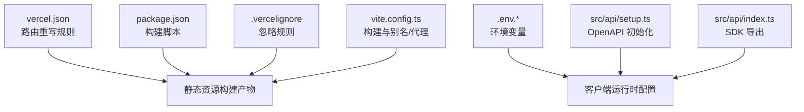
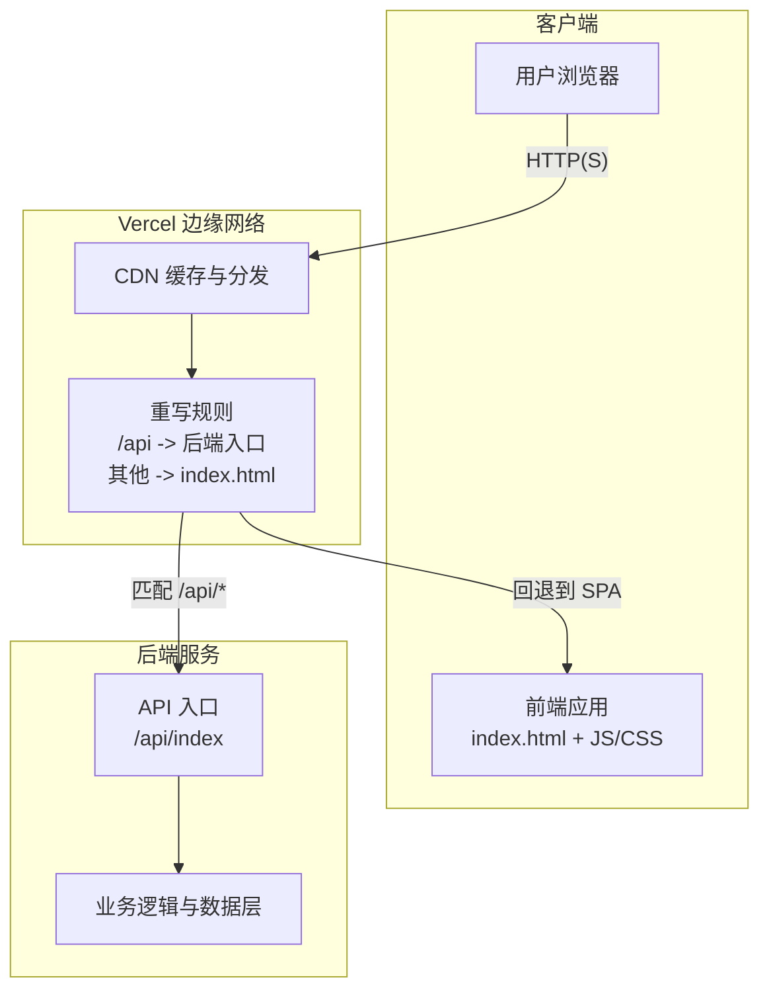
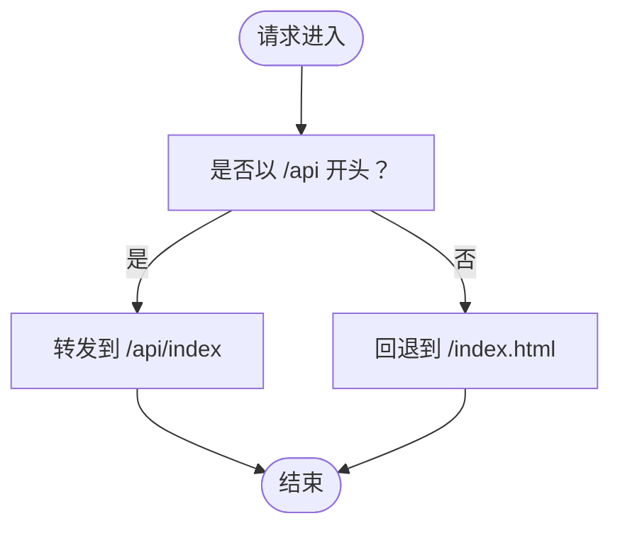
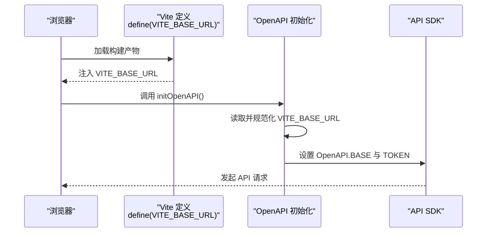
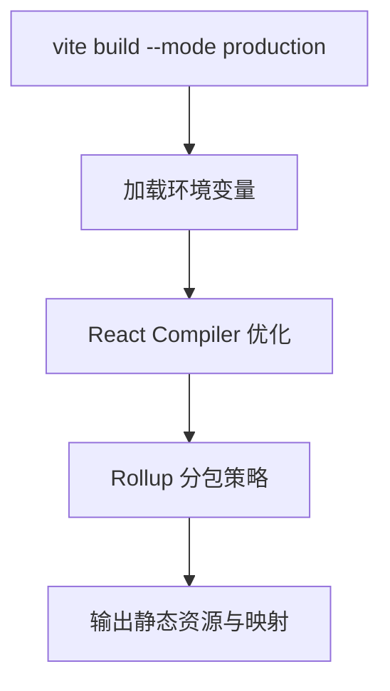
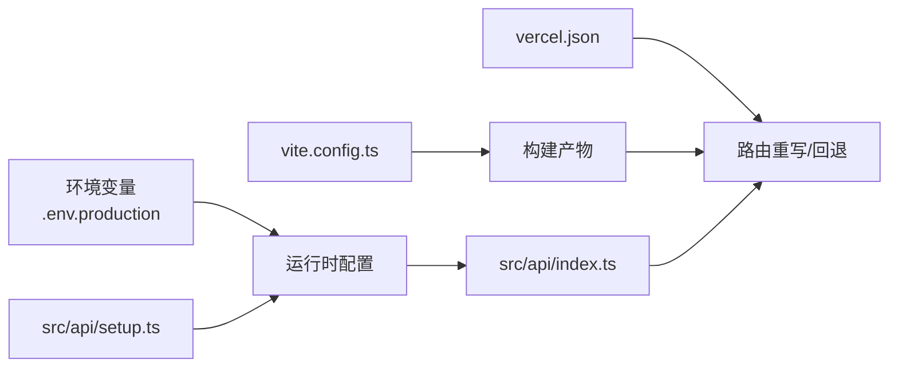

# 部署流程

<cite>
**本文引用的文件**
- [vercel.json](file://vercel.json)
- [package.json](file://package.json)
- [.env.production](file://.env.production)
- [.env.development](file://.env.development)
- [.vercelignore](file://.vercelignore)
- [vite.config.ts](file://vite.config.ts)
- [src/api/setup.ts](file://src/api/setup.ts)
- [src/api/index.ts](file://src/api/index.ts)
- [README.md](file://README.md)
</cite>

## 目录
1. [简介](#简介)
2. [项目结构](#项目结构)
3. [核心组件](#核心组件)
4. [架构总览](#架构总览)
5. [详细组件分析](#详细组件分析)
6. [依赖关系分析](#依赖关系分析)
7. [性能考量](#性能考量)
8. [故障排查指南](#故障排查指南)
9. [结论](#结论)
10. [附录](#附录)

## 简介
本指南面向在 Vercel 平台上部署 zTorrent-site 前后端一体化应用的工程团队，系统性说明以下内容：
- Vercel 平台部署配置与路由重写规则
- 环境变量设置与本地开发差异
- 域名绑定与 HTTPS 配置
- 静态资源部署、CDN 与缓存策略
- 部署前检查清单、常用部署命令与验证步骤
- 多环境部署策略、蓝绿部署与金丝雀发布建议
- 部署失败排查、回滚机制与紧急修复流程

## 项目结构
本项目采用前端框架与 API SDK 一体化的组织方式，关键部署相关文件如下：
- 构建与运行脚本：package.json
- Vercel 路由与重写：vercel.json
- 忽略规则：.vercelignore
- 开发与生产环境变量：.env.development、.env.production
- 前端构建配置：vite.config.ts
- API SDK 初始化：src/api/setup.ts
- API SDK 入口导出：src/api/index.ts

图表来源
- [vercel.json](file://vercel.json#L1-L12)
- [package.json](file://package.json#L126-L139)
- [.vercelignore](file://.vercelignore#L1-L7)
- [vite.config.ts](file://vite.config.ts#L1-L86)
- [.env.production](file://.env.production#L1-L5)
- [.env.development](file://.env.development#L1-L5)
- [src/api/setup.ts](file://src/api/setup.ts#L1-L34)
- [src/api/index.ts](file://src/api/index.ts#L1-L10)

章节来源
- [vercel.json](file://vercel.json#L1-L12)
- [package.json](file://package.json#L126-L139)
- [.vercelignore](file://.vercelignore#L1-L7)
- [vite.config.ts](file://vite.config.ts#L1-L86)
- [.env.production](file://.env.production#L1-L5)
- [.env.development](file://.env.development#L1-L5)
- [src/api/setup.ts](file://src/api/setup.ts#L1-L34)
- [src/api/index.ts](file://src/api/index.ts#L1-L10)

## 核心组件
- Vercel 路由重写与 SPA 回退
  - 将 /api 前缀的请求转发到后端入口；将其他路径回退到 index.html，支持前端路由。
- 构建与运行脚本
  - 提供开发、构建与类型检查等脚本，生产构建使用生产模式。
- 环境变量
  - 客户端通过 VITE_BASE_URL 指定 API 基础路径；生产与开发环境均定义了该变量。
- 前端构建配置
  - 包含代理、别名、分包策略、源码映射与 define 注入等，影响打包与运行时行为。
- API SDK 初始化
  - 在运行时读取 VITE_BASE_URL 并规范化，同时注入令牌读取策略。

章节来源
- [vercel.json](file://vercel.json#L2-L11)
- [package.json](file://package.json#L126-L139)
- [.env.production](file://.env.production#L1-L2)
- [.env.development](file://.env.development#L1-L2)
- [vite.config.ts](file://vite.config.ts#L60-L84)
- [src/api/setup.ts](file://src/api/setup.ts#L12-L34)

## 架构总览
下图展示 Vercel 平台上的部署与访问路径，包括静态资源、路由重写与 API 请求链路。

图表来源
- [vercel.json](file://vercel.json#L2-L11)

## 详细组件分析

### Vercel 路由重写与 SPA 支持
- 作用
  - 将以 /api 开头的请求转发至后端入口，实现 API 与静态资源分离。
  - 将未匹配的路径回退到 index.html，使前端路由生效。
- 影响
  - 需要确保后端入口路径与 vercel.json 中 destination 一致。
  - 前端路由跳转需遵循该回退策略，避免 404。

图表来源
- [vercel.json](file://vercel.json#L2-L11)

章节来源
- [vercel.json](file://vercel.json#L2-L11)

### 环境变量与运行时配置
- VITE_BASE_URL
  - 生产与开发环境均定义，用于指定 API 基础路径。
  - 客户端通过 define 注入，API SDK 初始化时读取并规范化。
- DOWNLOADER_SECRET
  - 生产与开发环境均定义，用于下载器鉴权等用途。

图表来源
- [vite.config.ts](file://vite.config.ts#L81-L84)
- [src/api/setup.ts](file://src/api/setup.ts#L18-L34)
- [src/api/index.ts](file://src/api/index.ts#L5-L9)

章节来源
- [.env.production](file://.env.production#L1-L5)
- [.env.development](file://.env.development#L1-L5)
- [vite.config.ts](file://vite.config.ts#L81-L84)
- [src/api/setup.ts](file://src/api/setup.ts#L12-L34)
- [src/api/index.ts](file://src/api/index.ts#L5-L9)

### 构建与分包策略
- 构建目标
  - 使用生产模式进行打包，启用源码映射便于问题定位。
- 分包策略
  - 将 React 生态、UI 组件库、数据与工具库分别拆分为独立 chunk，提升缓存命中率。
- 别名与代理
  - @ 指向 src，开发时通过代理将 /api 与 /uploads 转发到本地后端服务，便于联调。

图表来源
- [package.json](file://package.json#L129)
- [vite.config.ts](file://vite.config.ts#L60-L79)
- [vite.config.ts](file://vite.config.ts#L29-L38)
- [vite.config.ts](file://vite.config.ts#L46-L58)

章节来源
- [package.json](file://package.json#L129)
- [vite.config.ts](file://vite.config.ts#L60-L79)
- [vite.config.ts](file://vite.config.ts#L29-L38)
- [vite.config.ts](file://vite.config.ts#L46-L58)

### 部署前检查清单
- 代码与分支
  - 确认已合并至待部署分支，清理未提交变更。
- 本地验证
  - 运行开发服务器，确认代理与前端路由正常。
  - 执行生产构建，检查产物与分包情况。
- 环境变量
  - 确认 .env.production 中 VITE_BASE_URL 与 DOWNLOADER_SECRET 正确。
- 忽略规则
  - 确认 .vercelignore 中排除了 node_modules、构建产物与日志文件。
- 路由重写
  - 确认 vercel.json 中重写规则与后端入口一致。
- 依赖安装
  - 使用 packageManager 指定的包管理器安装依赖。

章节来源
- [README.md](file://README.md#L6-L11)
- [package.json](file://package.json#L140-L147)
- [.vercelignore](file://.vercelignore#L1-L7)
- [vercel.json](file://vercel.json#L2-L11)
- [.env.production](file://.env.production#L1-L5)

### 部署命令与验证步骤
- 常用命令
  - 安装依赖：使用仓库指定的包管理器安装依赖。
  - 本地开发：启动开发服务器，验证代理与路由。
  - 生产构建：执行生产模式构建，产出静态资源。
- 验证步骤
  - 访问首页，确认 SPA 回退生效。
  - 访问 /api 路径，确认转发到后端入口。
  - 检查构建产物中是否存在分包与源码映射文件。

章节来源
- [README.md](file://README.md#L6-L11)
- [package.json](file://package.json#L126-L139)
- [package.json](file://package.json#L129)
- [vercel.json](file://vercel.json#L2-L11)

### 多环境部署策略、蓝绿部署与金丝雀发布
- 多环境
  - 通过不同环境变量文件区分开发、测试与生产环境。
- 蓝绿部署
  - 在 Vercel 中利用环境别名与预览分支，先部署到新环境，验证后再切换流量。
- 金丝雀发布
  - 通过边缘权重或子路径分流，逐步扩大新版本流量比例，观察指标后决定全量。

（本节为通用实践说明，不直接分析具体文件）

### 部署失败排查、回滚机制与紧急修复流程
- 常见问题
  - 路由重写不匹配：检查 vercel.json 与后端入口路径一致性。
  - 环境变量缺失：确认 .env.production 中 VITE_BASE_URL 与 DOWNLOADER_SECRET。
  - 构建失败：查看生产构建日志，关注分包与源码映射相关错误。
- 回滚机制
  - 在 Vercel 控制台选择历史部署进行回滚。
- 紧急修复
  - 临时关闭新功能开关或降级到上一个稳定版本，尽快修复后重新发布。

（本节为通用实践说明，不直接分析具体文件）

## 依赖关系分析
- 组件耦合
  - 前端构建配置影响最终产物与运行时行为。
  - API SDK 初始化依赖 VITE_BASE_URL，进而影响所有 API 请求。
  - vercel.json 决定路由重写与 SPA 回退，直接影响访问路径。
- 外部依赖
  - Vercel Node 运行时与 NFT 打包工具参与构建与运行时处理。

图表来源
- [vite.config.ts](file://vite.config.ts#L60-L84)
- [.env.production](file://.env.production#L1-L5)
- [src/api/setup.ts](file://src/api/setup.ts#L18-L34)
- [src/api/index.ts](file://src/api/index.ts#L5-L9)
- [vercel.json](file://vercel.json#L2-L11)

章节来源
- [vite.config.ts](file://vite.config.ts#L60-L84)
- [.env.production](file://.env.production#L1-L5)
- [src/api/setup.ts](file://src/api/setup.ts#L18-L34)
- [src/api/index.ts](file://src/api/index.ts#L5-L9)
- [vercel.json](file://vercel.json#L2-L11)

## 性能考量
- 分包与缓存
  - 通过手动分包策略提升缓存命中率，减少重复下载。
- 源码映射
  - 生产构建启用源码映射，便于问题定位但会增加体积，建议结合 CDN 缓存策略使用。
- CDN 与回退
  - 利用 Vercel CDN 分发静态资源，路由回退保证前端路由体验。

（本节提供一般性指导，不直接分析具体文件）

## 故障排查指南
- 构建阶段
  - 检查生产构建日志，确认分包与源码映射生成成功。
- 运行阶段
  - 确认 VITE_BASE_URL 正确且无多余斜杠，避免路径拼接问题。
  - 检查 API SDK 初始化是否在页面加载早期执行。
- 路由阶段
  - 若出现 404，请检查 vercel.json 重写规则与前端路由是否冲突。

章节来源
- [package.json](file://package.json#L129)
- [vite.config.ts](file://vite.config.ts#L60-L84)
- [src/api/setup.ts](file://src/api/setup.ts#L18-L34)
- [vercel.json](file://vercel.json#L2-L11)

## 结论
本指南基于仓库现有配置，明确了在 Vercel 上部署 zTorrent-site 的关键点：路由重写、环境变量、构建与分包策略以及 API SDK 初始化。建议在实际部署中结合团队的多环境与发布策略，完善自动化与监控流程，确保发布质量与稳定性。

## 附录
- 关键文件速览
  - vercel.json：路由重写与 SPA 回退
  - package.json：构建与运行脚本
  - .env.production / .env.development：环境变量
  - vite.config.ts：构建配置与代理
  - src/api/setup.ts：API SDK 初始化
  - src/api/index.ts：API SDK 导出

章节来源
- [vercel.json](file://vercel.json#L1-L12)
- [package.json](file://package.json#L126-L139)
- [.env.production](file://.env.production#L1-L5)
- [.env.development](file://.env.development#L1-L5)
- [vite.config.ts](file://vite.config.ts#L1-L86)
- [src/api/setup.ts](file://src/api/setup.ts#L1-L34)
- [src/api/index.ts](file://src/api/index.ts#L1-L10)