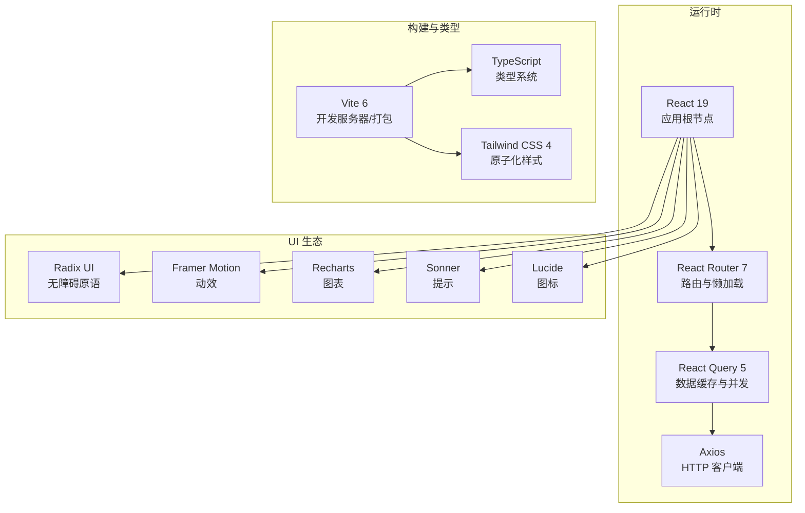
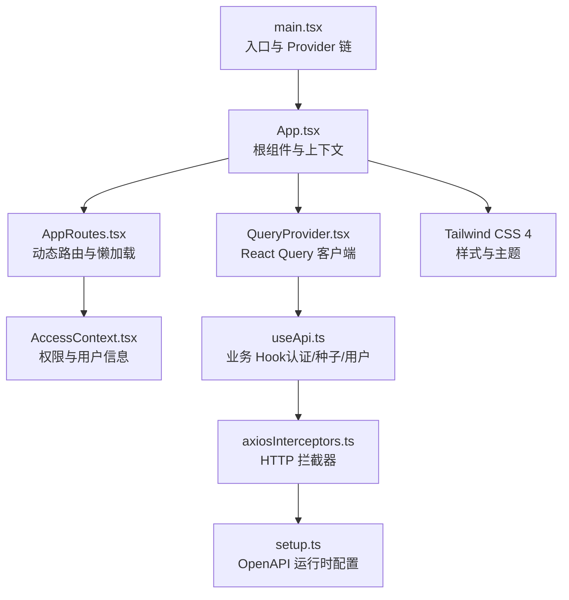
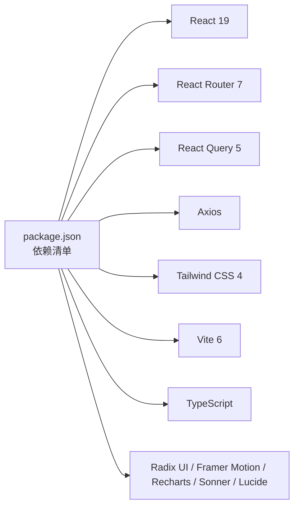
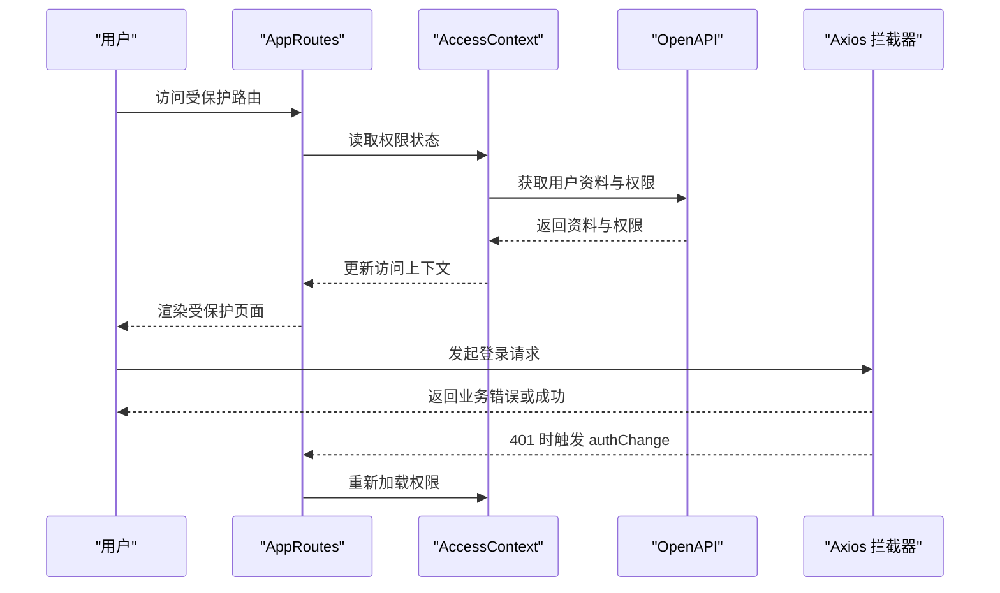

# 技术栈概览

<cite>
**本文引用的文件**
- [package.json](file://package.json)
- [vite.config.ts](file://vite.config.ts)
- [tsconfig.json](file://tsconfig.json)
- [src/main.tsx](file://src/main.tsx)
- [src/App.tsx](file://src/App.tsx)
- [src/providers/QueryProvider.tsx](file://src/providers/QueryProvider.tsx)
- [src/routes/AppRoutes.tsx](file://src/routes/AppRoutes.tsx)
- [src/hooks/useApi.ts](file://src/hooks/useApi.ts)
- [src/context/AccessContext.tsx](file://src/context/AccessContext.tsx)
- [src/utils/errorMessage.ts](file://src/utils/errorMessage.ts)
- [src/api/setup.ts](file://src/api/setup.ts)
- [src/api/axiosInterceptors.ts](file://src/api/axiosInterceptors.ts)
- [components.json](file://components.json)
- [postcss.config.mjs](file://postcss.config.mjs)
- [src/modules/admin/guidelines/antd-tailwind-integration.md](file://src/modules/admin/guidelines/antd-tailwind-integration.md)
</cite>

## 目录
1. [引言](#引言)
2. [项目结构](#项目结构)
3. [核心组件](#核心组件)
4. [架构总览](#架构总览)
5. [详细组件分析](#详细组件分析)
6. [依赖分析](#依赖分析)
7. [性能考虑](#性能考虑)
8. [故障排查指南](#故障排查指南)
9. [结论](#结论)
10. [附录](#附录)

## 引言
本文件面向 zTorrent-site 前端团队与相关利益方，系统梳理并阐释项目当前采用的技术栈与架构设计。重点涵盖 React 19、Vite 6、TypeScript、React Router 7、React Query 5、Tailwind CSS 4 等核心技术的选择动机、实现方式与在项目中的职责定位；同时给出第三方依赖的使用现状、版本兼容性与升级策略建议，并提供可操作的最佳实践与排障指引。

## 项目结构
前端工程采用“库/框架 + 构建工具 + 类型系统 + UI 基础设施”的分层组织方式：
- 应用入口与运行时：React 19 + React Router 7 + React Query 5 + Axios
- 构建与开发体验：Vite 6 + TypeScript + PostCSS + Tailwind CSS 4
- UI 与组件生态：Radix UI、Framer Motion、Recharts、Sonner、Lucide 等
- API 与数据流：OpenAPI 生成客户端 + 查询缓存 + 全局拦截器 + 权限上下文

**章节来源**
- file://src/main.tsx#L1-L18
- file://src/App.tsx#L1-L52
- file://vite.config.ts#L1-L86
- file://tsconfig.json#L1-L44
- file://package.json#L1-L148

## 核心组件
- 应用入口与 Provider 链
  - 入口文件负责初始化拦截器、OpenAPI 基础配置，并以 QueryProvider 包裹应用根组件，随后渲染 App。
  - App 组件内装配路由、权限上下文、下载器上下文、全局加载器、主题切换与全局提示等基础设施。
- 路由体系
  - 使用 React Router 7 的动态路由与懒加载，公开路由（登录/注册/忘记密码）与受保护路由（含管理端）分离，404 场景统一处理。
- 数据层
  - React Query 5 提供查询客户端与默认缓存策略（即时失效、较长 GC 时间、挂载时刷新、有限重试），结合 Axios 拦截器统一错误处理与鉴权跳转。
- API 与拦截器
  - OpenAPI 运行时集中初始化 BASE 与 TOKEN；Axios 拦截器统一处理业务错误码、HTTP 错误、401 自动登出与提示策略。
- 权限与访问控制
  - AccessContext 负责拉取用户资料与聚合权限，支持回退解析 JWT 用户名，监听 authChange 事件自动刷新状态。
- UI 基础设施
  - Tailwind CSS 4 与 shadcn/ui 配置集成，PostCSS 插件启用；部分 AntD 风格通过 Tailwind CSS 变量映射与工具类实现。

**章节来源**
- file://src/main.tsx#L1-L18
- file://src/App.tsx#L1-L52
- file://src/providers/QueryProvider.tsx#L1-L30
- file://src/routes/AppRoutes.tsx#L1-L115
- file://src/api/setup.ts#L1-L35
- file://src/api/axiosInterceptors.ts#L1-L294
- file://src/context/AccessContext.tsx#L1-L181
- file://components.json#L1-L23
- file://postcss.config.mjs#L1-L6

## 架构总览
整体架构围绕“声明式路由 + 响应式数据 + 统一错误与鉴权 + 可维护的 UI 基础设施”展开。前端通过 OpenAPI 生成的客户端与后端交互，Axios 拦截器保证错误与鉴权的一致性，React Query 负责缓存与并发，路由系统支持动态与懒加载，Tailwind 提供可扩展的样式基线。

**图示来源**
- [src/main.tsx](file://src/main.tsx#L1-L18)
- [src/App.tsx](file://src/App.tsx#L1-L52)
- [src/routes/AppRoutes.tsx](file://src/routes/AppRoutes.tsx#L1-L115)
- [src/context/AccessContext.tsx](file://src/context/AccessContext.tsx#L1-L181)
- [src/providers/QueryProvider.tsx](file://src/providers/QueryProvider.tsx#L1-L30)
- [src/hooks/useApi.ts](file://src/hooks/useApi.ts#L1-L312)
- [src/api/axiosInterceptors.ts](file://src/api/axiosInterceptors.ts#L1-L294)
- [src/api/setup.ts](file://src/api/setup.ts#L1-L35)

## 详细组件分析

### React 19：应用运行时与编译优化
- 选择理由
  - 更强的并发能力与更优的开发体验，配合 React Compiler 可获得更好的构建产物与运行时性能。
- 实现要点
  - Vite 配置启用 babel-plugin-react-compiler，目标版本指向 React 19，确保编译器按新语义优化。
  - 依赖去重与预优化，减少重复包与冷启动时间。
- 最佳实践
  - 使用严格模式与并发特性时，避免副作用在渲染阶段产生不可预期行为；合理拆分组件以提升重渲染局部性。

**章节来源**
- file://vite.config.ts#L10-L21
- file://package.json#L68-L71

### Vite 6：构建与开发体验
- 选择理由
  - 构建速度快、热更新稳定、插件生态完善，适合现代前端工程。
- 实现要点
  - 开发服务器代理 /api 与 /uploads，便于联调后端。
  - 依赖预优化与别名配置，提升开发效率。
  - Rollup 分包策略将 React 生态、UI 组件、数据层、图表与工具库独立打包，降低首屏阻塞。
- 最佳实践
  - 保持 alias 与 optimizeDeps 的一致性；谨慎开启可视化分析工具以避免影响 CI。

**章节来源**
- file://vite.config.ts#L1-L86
- file://package.json#L124-L124

### TypeScript：类型安全与开发效率
- 选择理由
  - 在大型前端项目中显著降低运行时错误，提升协作效率。
- 实现要点
  - 模块解析使用 bundler，JSX 使用 react-jsx，路径别名统一为 @/src/*。
  - 类型声明集中于 tsconfig 的 types 字段，避免全局污染。
- 最佳实践
  - 逐步引入严格模式规则；为公共 API 与模型补充完整类型注解。

**章节来源**
- file://tsconfig.json#L1-L44
- file://package.json#L102-L103

### React Router 7：路由与导航
- 选择理由
  - 与 React 19 并发特性契合，支持 Suspense 与懒加载，提供更流畅的用户体验。
- 实现要点
  - 动态路由系统与懒加载页面组合，公开路由与受保护路由分离。
  - 404 场景根据登录状态决定重定向或展示页面。
- 最佳实践
  - 将路由守卫与权限上下文解耦，避免在路由层做过多业务逻辑。

**章节来源**
- file://src/routes/AppRoutes.tsx#L1-L115
- file://package.json#L75-L75

### React Query 5：数据缓存与并发
- 选择理由
  - 优秀的缓存策略、并发控制与错误恢复能力，适合复杂数据场景。
- 实现要点
  - 默认查询策略：staleTime=0（立即失效）、较长 gcTime（10 分钟）、refetchOnMount=true、有限重试。
  - 在登录/登出后主动失效相关查询键，确保数据一致性。
- 最佳实践
  - 为关键查询设置合理的查询键与失效策略；避免滥用全局 invalidation。

**章节来源**
- file://src/providers/QueryProvider.tsx#L1-L30
- file://src/hooks/useApi.ts#L1-L312
- file://package.json#L37-L37

### Tailwind CSS 4：样式与主题
- 选择理由
  - 原子化样式提升开发效率与一致性，易于与 UI 组件库协同。
- 实现要点
  - PostCSS 集成 Tailwind 插件；shadcn/ui 配置启用 TSX、CSS 变量与别名。
  - 通过 CSS 变量映射 AntD 颜色与尺寸，实现风格统一。
- 最佳实践
  - 控制样式规模，避免过度堆叠类名；优先使用工具类与主题变量。

**章节来源**
- file://components.json#L1-L23
- file://postcss.config.mjs#L1-L6
- file://src/modules/admin/guidelines/antd-tailwind-integration.md#L62-L204

### Axios 与 OpenAPI：HTTP 与 SDK
- 选择理由
  - Axios 提供完善的拦截器与错误处理能力；OpenAPI 生成客户端保证前后端契约一致。
- 实现要点
  - OpenAPI 运行时集中初始化 BASE 与 TOKEN，避免多处硬编码。
  - Axios 拦截器统一处理业务错误码、HTTP 错误、401 自动登出与提示策略。
- 最佳实践
  - 为每个请求明确 meta（silent/skipErrorCodes/skipBusinessCodes/customErrorMessage），精细化错误提示。

**章节来源**
- file://src/api/setup.ts#L1-L35
- file://src/api/axiosInterceptors.ts#L1-L294
- file://package.json#L47-L47

### 权限与访问控制：AccessContext
- 设计理念
  - 将用户资料与权限聚合在一个上下文中，支持回退解析与事件驱动刷新。
- 实现要点
  - 并行请求用户资料与聚合权限，优先使用聚合权限；监听 authChange 事件自动刷新。
- 最佳实践
  - 将权限判定与 UI 组件解耦，通过 Hook 暴露能力；避免在权限上下文中放置业务逻辑。

**章节来源**
- file://src/context/AccessContext.tsx#L1-L181

### 错误处理与提示：统一错误提取
- 设计理念
  - 从响应体、错误对象、业务码与默认文案中提取最合适的错误信息，保证用户可理解。
- 实现要点
  - 提供 extractErrorMessage 工具函数，支持多种后端响应形态。
- 最佳实践
  - 在业务 Hook 中统一调用该工具函数，避免分散处理。

**章节来源**
- file://src/utils/errorMessage.ts#L1-L12

## 依赖分析
- 核心依赖
  - React 19、React Router 7、React Query 5、Axios、Tailwind CSS 4、Vite 6、TypeScript。
- UI 生态
  - Radix UI、Framer Motion、Recharts、Sonner、Lucide、shadcn/ui。
- 工具与辅助
  - dayjs、crypto-js、es-toolkit、zustand、form-data、marked、turndown 等。
- 版本兼容性
  - React 19 与 Vite 6、React Router 7、React Query 5、Tailwind CSS 4 均在当前仓库中使用，版本号见 package.json。
- 升级策略
  - 采用“小步快跑”策略：先在 dev 分支验证，再合并至 main；对 React 19、Vite 6、React Query 5 等关键依赖，优先进行类型与编译器兼容性测试；Tailwind 4 与 shadcn/ui 配置需同步调整。

**图示来源**
- [package.json](file://package.json#L1-L148)

**章节来源**
- file://package.json#L1-L148

## 性能考虑
- 构建与分包
  - Vite 预优化与 Rollup 手动分包策略有效降低首屏体积与加载时间。
- 运行时缓存
  - React Query 默认策略在“即时失效 + 较长 GC + 挂载刷新”间取得平衡，兼顾实时性与体验。
- 样式与主题
  - Tailwind 原子化与 CSS 变量映射减少运行时计算成本，提升渲染性能。
- 最佳实践
  - 对大列表使用虚拟化与懒加载；对高频交互组件使用 memo 化；避免在渲染阶段进行昂贵计算。

[本节为通用性能建议，不直接分析具体文件]

## 故障排查指南
- 登录/鉴权问题
  - 症状：401 自动跳转登录、提示“登录已过期”。
  - 排查：确认 OpenAPI BASE/TOKEN 初始化是否正确；检查 localStorage 中 accessToken 是否存在；查看拦截器对 9401 的处理逻辑。
- 请求失败与业务错误
  - 症状：业务错误码未提示或提示不准确。
  - 排查：核对 Axios 拦截器的错误码映射与 shouldShowToast 策略；确认 meta 参数是否正确传递。
- 路由与权限
  - 症状：页面白屏或权限判定异常。
  - 排查：确认 AccessContext 是否正确加载用户资料与权限；检查 authChange 事件是否触发；核对动态路由配置与懒加载。
- 样式与主题
  - 症状：颜色/尺寸不一致。
  - 排查：检查 Tailwind 配置与 CSS 变量映射；确认 shadcn/ui 别名与组件使用是否一致。

**章节来源**
- file://src/api/setup.ts#L1-L35
- file://src/api/axiosInterceptors.ts#L1-L294
- file://src/context/AccessContext.tsx#L1-L181
- file://src/utils/errorMessage.ts#L1-L12

## 结论
本项目以 React 19 为核心运行时，结合 Vite 6、TypeScript、React Router 7、React Query 5 与 Tailwind CSS 4，构建了高性能、可维护、可扩展的前端架构。通过 OpenAPI 与 Axios 拦截器统一数据契约与错误处理，配合 React Query 的缓存策略与权限上下文，形成清晰的分层与职责边界。建议在后续迭代中持续关注依赖兼容性与升级风险，保持小步快跑的演进节奏。

[本节为总结性内容，不直接分析具体文件]

## 附录
- 关键流程示意：登录与路由守卫

**图示来源**
- [src/routes/AppRoutes.tsx](file://src/routes/AppRoutes.tsx#L1-L115)
- [src/context/AccessContext.tsx](file://src/context/AccessContext.tsx#L1-L181)
- [src/api/setup.ts](file://src/api/setup.ts#L1-L35)
- [src/api/axiosInterceptors.ts](file://src/api/axiosInterceptors.ts#L1-L294)