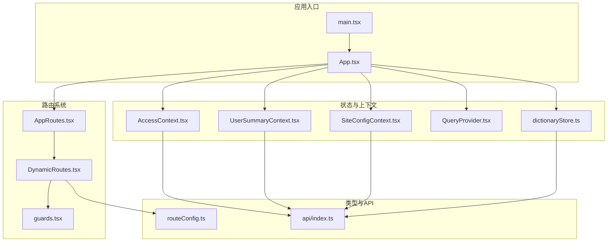
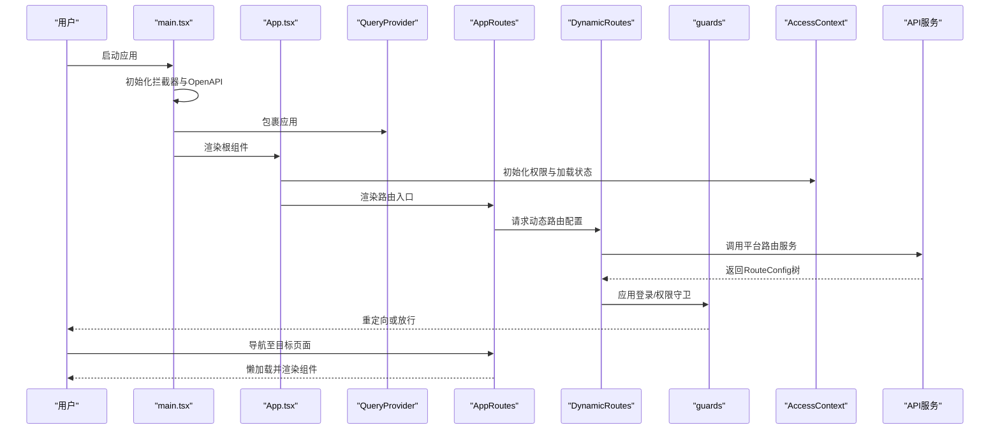
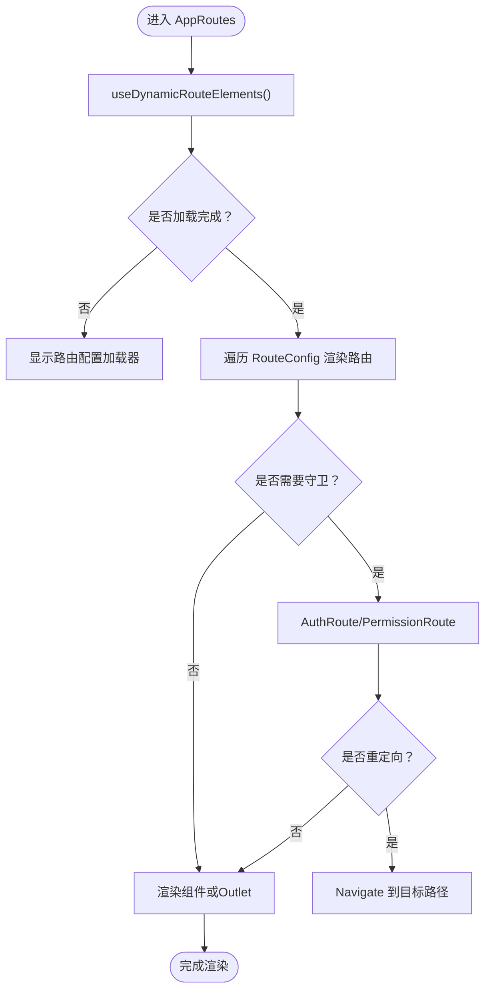
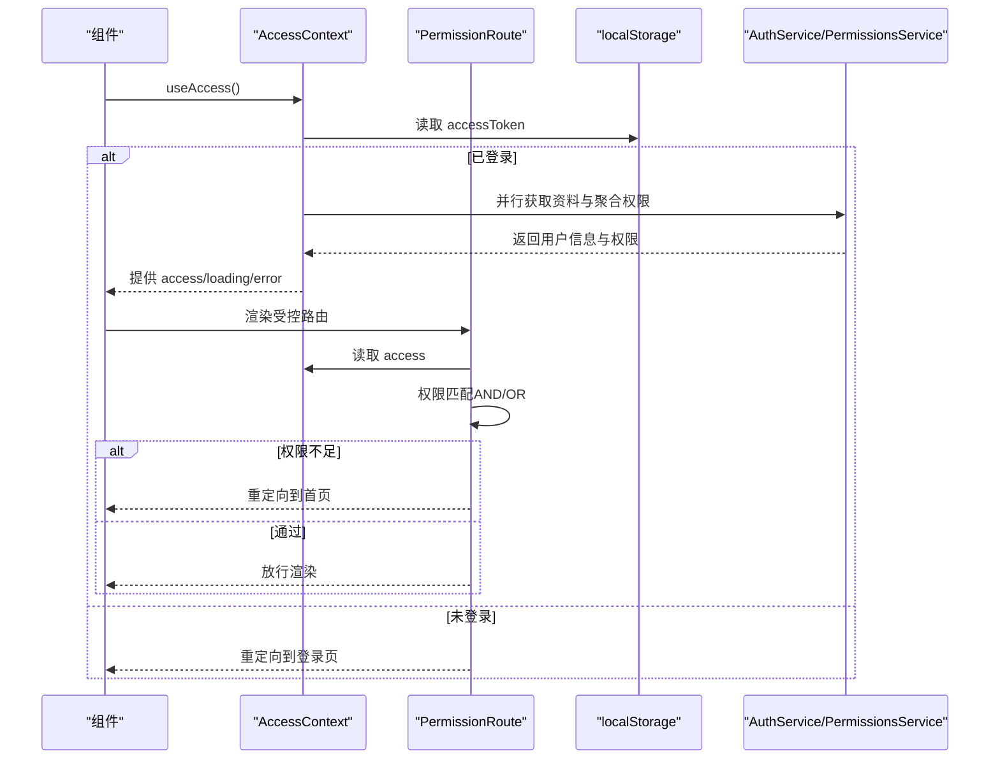
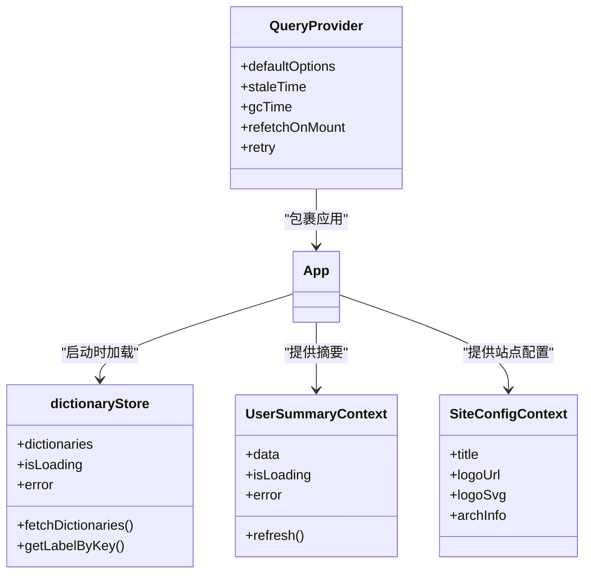
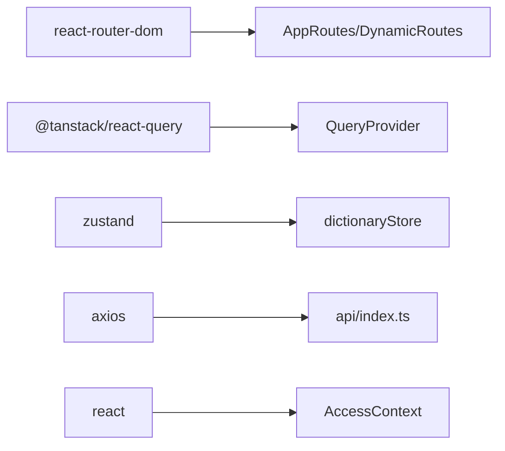

# 架构设计概览

<cite>
**本文档引用的文件**
- [src/main.tsx](file://src/main.tsx)
- [src/App.tsx](file://src/App.tsx)
- [src/providers/QueryProvider.tsx](file://src/providers/QueryProvider.tsx)
- [src/routes/AppRoutes.tsx](file://src/routes/AppRoutes.tsx)
- [src/routes/DynamicRoutes.tsx](file://src/routes/DynamicRoutes.tsx)
- [src/hooks/useRouteConfig.ts](file://src/hooks/useRouteConfig.ts)
- [src/types/routeConfig.ts](file://src/types/routeConfig.ts)
- [src/context/AccessContext.tsx](file://src/context/AccessContext.tsx)
- [src/routes/guards.tsx](file://src/routes/guards.tsx)
- [src/modules/app/context/UserSummaryContext.tsx](file://src/modules/app/context/UserSummaryContext.tsx)
- [src/stores/dictionaryStore.ts](file://src/stores/dictionaryStore.ts)
- [src/context/SiteConfigContext.tsx](file://src/context/SiteConfigContext.tsx)
- [src/api/index.ts](file://src/api/index.ts)
- [package.json](file://package.json)
</cite>

## 目录
1. [简介](#简介)
2. [项目结构](#项目结构)
3. [核心组件](#核心组件)
4. [架构总览](#架构总览)
5. [详细组件分析](#详细组件分析)
6. [依赖关系分析](#依赖关系分析)
7. [性能考量](#性能考量)
8. [故障排查指南](#故障排查指南)
9. [结论](#结论)

## 简介
本项目采用前端模块化与组件化设计，结合动态路由系统、权限控制机制与状态管理策略，构建可扩展、可演进的单页应用（SPA）。整体架构围绕以下关键模式展开：
- 模块化架构：按功能域划分模块（如 app、admin、forum），职责清晰、边界明确
- 组件化设计：基于 React Hooks 与 Context 实现可复用的 UI 与业务逻辑抽象
- Hook 模式：通过自定义 Hook（如 useRouteConfig、useAccess）封装复杂逻辑，提升可测试性与可维护性
- Provider 模式：通过 Context 与 QueryClient Provider 提供全局状态与数据缓存能力

系统通过动态路由与后端权限模型联动，实现“路由即配置”的灵活扩展；通过 React Query 实现高效的数据缓存与并发请求管理；通过 Zustand Store 管理轻量全局状态。

## 项目结构
项目采用按功能域驱动的目录组织方式，核心层次如下：
- 根入口与应用壳层：main.tsx、App.tsx、providers/QueryProvider.tsx
- 路由与导航：routes/AppRoutes.tsx、routes/DynamicRoutes.tsx、routes/guards.tsx
- 权限与上下文：context/AccessContext.tsx、context/SiteConfigContext.tsx
- 状态与工具：stores/dictionaryStore.ts、modules/app/context/UserSummaryContext.tsx
- 类型与 API：types/routeConfig.ts、api/index.ts
- 依赖与脚本：package.json

图表来源
- [src/main.tsx](file://src/main.tsx#L1-L18)
- [src/App.tsx](file://src/App.tsx#L1-L52)
- [src/routes/AppRoutes.tsx](file://src/routes/AppRoutes.tsx#L1-L115)
- [src/routes/DynamicRoutes.tsx](file://src/routes/DynamicRoutes.tsx#L1-L308)
- [src/routes/guards.tsx](file://src/routes/guards.tsx#L1-L103)
- [src/context/AccessContext.tsx](file://src/context/AccessContext.tsx#L1-L181)
- [src/modules/app/context/UserSummaryContext.tsx](file://src/modules/app/context/UserSummaryContext.tsx#L1-L112)
- [src/context/SiteConfigContext.tsx](file://src/context/SiteConfigContext.tsx#L1-L50)
- [src/providers/QueryProvider.tsx](file://src/providers/QueryProvider.tsx#L1-L30)
- [src/stores/dictionaryStore.ts](file://src/stores/dictionaryStore.ts#L1-L119)
- [src/types/routeConfig.ts](file://src/types/routeConfig.ts#L1-L49)
- [src/api/index.ts](file://src/api/index.ts#L1-L642)

章节来源
- [src/main.tsx](file://src/main.tsx#L1-L18)
- [src/App.tsx](file://src/App.tsx#L1-L52)
- [package.json](file://package.json#L1-L148)

## 核心组件
- 应用入口与初始化：main.tsx 负责初始化拦截器、OpenAPI 配置与 Provider 包裹，随后渲染根组件 App
- 应用壳与全局状态：App.tsx 在根部注入路由、权限上下文、下载器上下文、全局加载器、主题切换与错误边界，并在启动时预加载字典与偏好分类
- 动态路由系统：AppRoutes.tsx 与 DynamicRoutes.tsx 协作，基于后端返回的 RouteConfig 动态渲染路由树，支持布局包装、重定向、新标签页打开与 404 处理
- 权限与访问控制：AccessContext.tsx 负责加载用户资料与聚合权限，guards.tsx 提供基础登录守卫与细粒度权限守卫
- 状态管理：QueryProvider.tsx 提供 React Query 客户端；dictionaryStore.ts 与 UserSummaryContext.tsx 管理字典与用户摘要等全局状态
- 类型与 API：routeConfig.ts 定义动态路由配置类型；api/index.ts 暴露 OpenAPI 生成的服务与模型

章节来源
- [src/main.tsx](file://src/main.tsx#L1-L18)
- [src/App.tsx](file://src/App.tsx#L1-L52)
- [src/providers/QueryProvider.tsx](file://src/providers/QueryProvider.tsx#L1-L30)
- [src/routes/AppRoutes.tsx](file://src/routes/AppRoutes.tsx#L1-L115)
- [src/routes/DynamicRoutes.tsx](file://src/routes/DynamicRoutes.tsx#L1-L308)
- [src/context/AccessContext.tsx](file://src/context/AccessContext.tsx#L1-L181)
- [src/routes/guards.tsx](file://src/routes/guards.tsx#L1-L103)
- [src/stores/dictionaryStore.ts](file://src/stores/dictionaryStore.ts#L1-L119)
- [src/modules/app/context/UserSummaryContext.tsx](file://src/modules/app/context/UserSummaryContext.tsx#L1-L112)
- [src/types/routeConfig.ts](file://src/types/routeConfig.ts#L1-L49)
- [src/api/index.ts](file://src/api/index.ts#L1-L642)

## 架构总览
系统采用“入口初始化 → 应用壳 → 动态路由 → 权限控制 → 状态管理”的分层设计，数据流自上而下传递，职责边界清晰：

图表来源
- [src/main.tsx](file://src/main.tsx#L1-L18)
- [src/App.tsx](file://src/App.tsx#L1-L52)
- [src/routes/AppRoutes.tsx](file://src/routes/AppRoutes.tsx#L1-L115)
- [src/routes/DynamicRoutes.tsx](file://src/routes/DynamicRoutes.tsx#L1-L308)
- [src/routes/guards.tsx](file://src/routes/guards.tsx#L1-L103)
- [src/context/AccessContext.tsx](file://src/context/AccessContext.tsx#L1-L181)
- [src/api/index.ts](file://src/api/index.ts#L1-L642)

## 详细组件分析

### 动态路由系统
- 设计要点
  - 路由配置来源于后端 API，前端通过 useRouteConfig Hook 获取 RouteConfig 树
  - DynamicRoutes 根据配置渲染路由，支持布局包装（app/admin/forum）、索引路由、重定向与新标签页打开
  - 对未启用的子路由进行过滤，保证渲染稳定性
- 关键流程
  - AppRoutes 作为路由入口，调用 useDynamicRouteElements 获取路由元素
  - DynamicRoutes 将 RouteConfig 映射为 React Router 路由节点，结合 AuthRoute/PermissionRoute 实施守卫
  - 支持 Admin/Forum 局部 404 页面，增强用户体验

图表来源
- [src/routes/AppRoutes.tsx](file://src/routes/AppRoutes.tsx#L1-L115)
- [src/routes/DynamicRoutes.tsx](file://src/routes/DynamicRoutes.tsx#L1-L308)
- [src/hooks/useRouteConfig.ts](file://src/hooks/useRouteConfig.ts#L1-L109)
- [src/types/routeConfig.ts](file://src/types/routeConfig.ts#L1-L49)

章节来源
- [src/routes/AppRoutes.tsx](file://src/routes/AppRoutes.tsx#L1-L115)
- [src/routes/DynamicRoutes.tsx](file://src/routes/DynamicRoutes.tsx#L1-L308)
- [src/hooks/useRouteConfig.ts](file://src/hooks/useRouteConfig.ts#L1-L109)
- [src/types/routeConfig.ts](file://src/types/routeConfig.ts#L1-L49)

### 权限控制机制
- 认证与角色权限
  - AccessContext 在应用启动时并行加载用户资料与聚合权限，支持从 JWT Token 解析用户名作为降级方案
  - 提供 useAccess Hook，组件可安全读取 roles/permissions/username/avatar
- 路由级权限守卫
  - AuthRoute 仅校验登录态
  - PermissionRoute 支持角色与权限的 AND/OR 组合、matchAll 策略与管理员豁免
- 事件驱动刷新
  - 监听 authChange 与 storage 事件，确保多标签页登录状态一致

图表来源
- [src/context/AccessContext.tsx](file://src/context/AccessContext.tsx#L1-L181)
- [src/routes/guards.tsx](file://src/routes/guards.tsx#L1-L103)

章节来源
- [src/context/AccessContext.tsx](file://src/context/AccessContext.tsx#L1-L181)
- [src/routes/guards.tsx](file://src/routes/guards.tsx#L1-L103)

### 状态管理策略
- React Query（QueryProvider）
  - 默认配置：staleTime=0、gcTime 较长、refetchOnMount=true、retry=1
  - 保障“秒开”体验与后台静默更新，减少用户感知的网络抖动
- 全局字典（dictionaryStore）
  - 启动时由 App.tsx 触发，兼容后端统一响应包装，规范化字典项
  - 提供按类别与 key 查询 label 的便捷方法
- 用户摘要（UserSummaryContext）
  - 定时刷新（15 分钟）与页面可见性感知，降低不必要的请求
- 站点配置（SiteConfigContext）
  - 启动时从后端拉取站点设置，提供标题、Logo、架构信息等

图表来源
- [src/providers/QueryProvider.tsx](file://src/providers/QueryProvider.tsx#L1-L30)
- [src/stores/dictionaryStore.ts](file://src/stores/dictionaryStore.ts#L1-L119)
- [src/modules/app/context/UserSummaryContext.tsx](file://src/modules/app/context/UserSummaryContext.tsx#L1-L112)
- [src/context/SiteConfigContext.tsx](file://src/context/SiteConfigContext.tsx#L1-L50)

章节来源
- [src/providers/QueryProvider.tsx](file://src/providers/QueryProvider.tsx#L1-L30)
- [src/stores/dictionaryStore.ts](file://src/stores/dictionaryStore.ts#L1-L119)
- [src/modules/app/context/UserSummaryContext.tsx](file://src/modules/app/context/UserSummaryContext.tsx#L1-L112)
- [src/context/SiteConfigContext.tsx](file://src/context/SiteConfigContext.tsx#L1-L50)

### 模块化与组件化设计
- 模块边界
  - app、admin、forum 模块各自拥有独立的路由、布局与上下文，便于团队协作与独立演进
- 组件复用
  - 通过 Context 与 Hook 抽象公共逻辑（权限、用户摘要、站点配置）
  - 通过懒加载与 Suspense 提升首屏性能与交互体验

章节来源
- [src/routes/AppRoutes.tsx](file://src/routes/AppRoutes.tsx#L1-L115)
- [src/routes/DynamicRoutes.tsx](file://src/routes/DynamicRoutes.tsx#L1-L308)
- [src/context/AccessContext.tsx](file://src/context/AccessContext.tsx#L1-L181)

## 依赖关系分析
- 前端框架与生态
  - React 19、React Router 7、React Query 5、Zustand、TailwindCSS 等
- 关键依赖对架构的影响
  - React Router 7 的懒加载与 Suspense 生态与动态路由高度契合
  - React Query 的缓存与并发策略支撑动态路由与权限数据的高效获取
  - Zustand 的轻量状态管理适合字典与用户摘要等场景

图表来源
- [package.json](file://package.json#L1-L148)
- [src/routes/AppRoutes.tsx](file://src/routes/AppRoutes.tsx#L1-L115)
- [src/providers/QueryProvider.tsx](file://src/providers/QueryProvider.tsx#L1-L30)
- [src/stores/dictionaryStore.ts](file://src/stores/dictionaryStore.ts#L1-L119)
- [src/api/index.ts](file://src/api/index.ts#L1-L642)
- [src/context/AccessContext.tsx](file://src/context/AccessContext.tsx#L1-L181)

章节来源
- [package.json](file://package.json#L1-L148)

## 性能考量
- 首屏与交互优化
  - 动态路由配置加载期间显示专用加载器，避免白屏与闪烁
  - 懒加载页面组件与 404 页面，降低初始包体积
- 数据缓存与并发
  - QueryClient 默认 staleTime=0，确保数据即时更新；gcTime 较长，提升返回页面的体验
  - 并行加载用户资料与聚合权限，缩短初始化时间
- 状态与资源
  - 字典与用户摘要在启动阶段一次性加载，后续通过定时刷新与可见性感知控制刷新频率
  - 站点配置在启动时拉取，避免重复请求

章节来源
- [src/routes/AppRoutes.tsx](file://src/routes/AppRoutes.tsx#L1-L115)
- [src/providers/QueryProvider.tsx](file://src/providers/QueryProvider.tsx#L1-L30)
- [src/context/AccessContext.tsx](file://src/context/AccessContext.tsx#L1-L181)
- [src/stores/dictionaryStore.ts](file://src/stores/dictionaryStore.ts#L1-L119)
- [src/modules/app/context/UserSummaryContext.tsx](file://src/modules/app/context/UserSummaryContext.tsx#L1-L112)

## 故障排查指南
- 动态路由无法渲染
  - 检查 useRouteConfig 是否正确启用（依赖登录态），确认后端返回的 RouteConfig 结构合法
  - 关注控制台日志与错误提示，确认 API 返回格式与 children 数组有效性
- 权限不足导致重定向
  - 使用 useAccess 检查 roles/permissions 是否正确加载
  - 确认 PermissionRoute 的 requiredPermissions/requiredRoles 与 matchAll/combine 配置
- 登录态异常
  - 监听 authChange 与 storage 事件，确保多标签页状态同步
  - 检查 AccessContext 的加载与错误状态，必要时手动调用 reload
- 数据缓存问题
  - 调整 QueryClient 的 staleTime/gcTime 与 retry 策略，平衡实时性与性能
  - 使用 refetchOnMount 与 refetchOnWindowFocus 控制重新获取行为

章节来源
- [src/hooks/useRouteConfig.ts](file://src/hooks/useRouteConfig.ts#L1-L109)
- [src/routes/guards.tsx](file://src/routes/guards.tsx#L1-L103)
- [src/context/AccessContext.tsx](file://src/context/AccessContext.tsx#L1-L181)
- [src/providers/QueryProvider.tsx](file://src/providers/QueryProvider.tsx#L1-L30)

## 结论
本项目通过模块化与组件化设计、动态路由与权限控制、以及合理的状态管理策略，构建了一个高内聚、低耦合、可扩展的前端架构。其核心优势在于：
- 路由即配置：后端驱动的动态路由系统，快速适配业务变化
- 权限即契约：细粒度权限与守卫组合，保障安全与灵活性
- 状态即体验：QueryClient 与轻量 Store 并用，兼顾性能与易用性
- 开发即效率：Hook 模式与 Provider 模式降低样板代码，提升可维护性

建议在后续迭代中持续关注：
- 动态路由配置的健壮性与错误兜底
- 权限模型的演进与审计日志
- 状态管理的边界与性能监控
- 多模块协作的接口一致性与版本治理