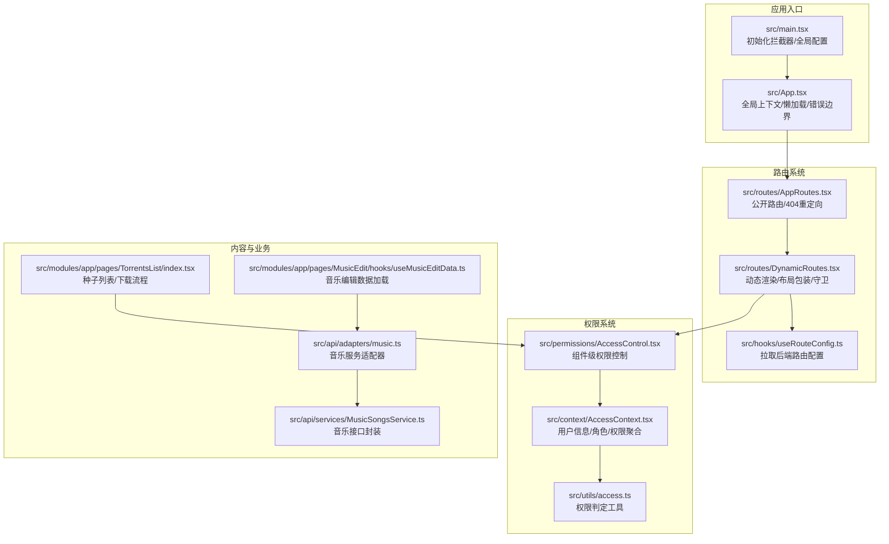
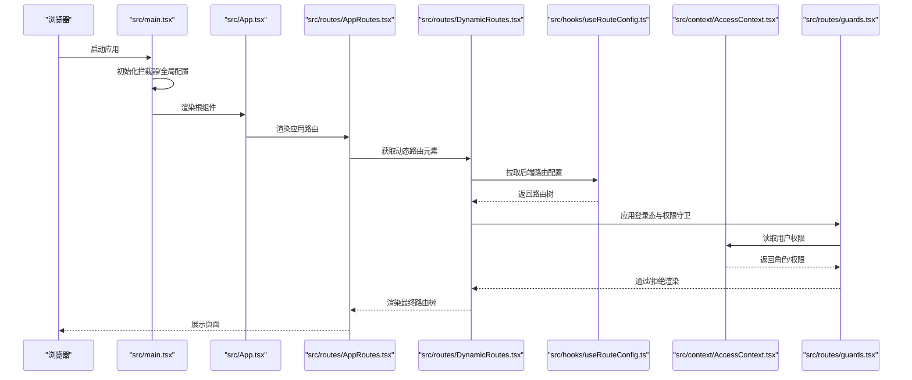
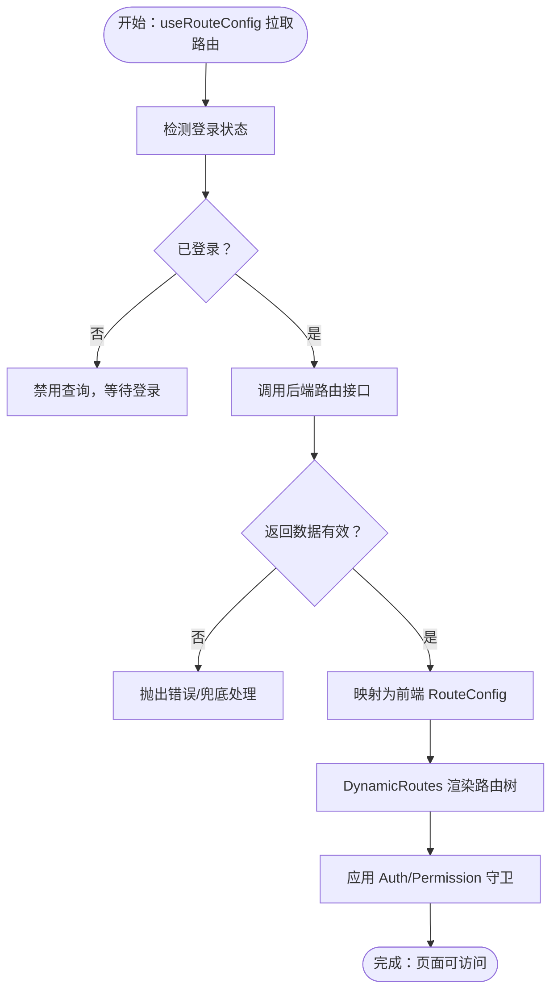
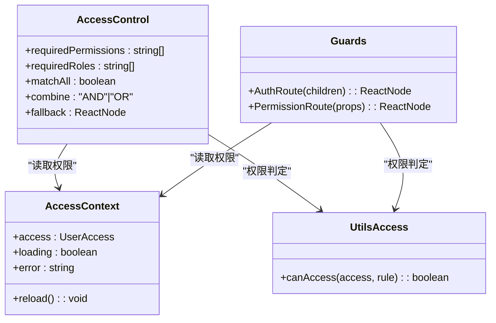
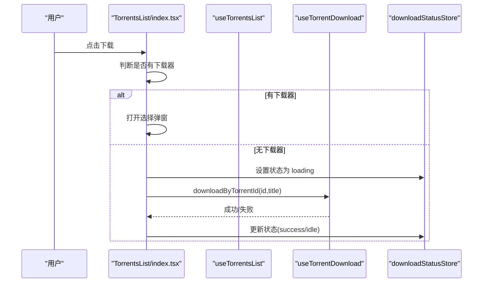
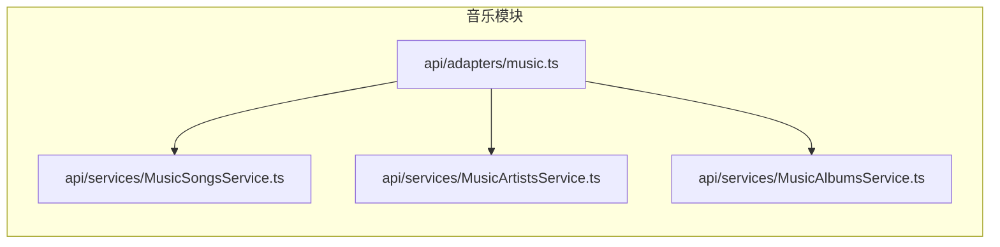
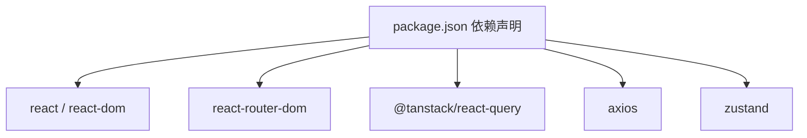

# 核心功能特性

<cite>
**本文引用的文件**
- [README.md](file://README.md)
- [package.json](file://package.json)
- [src/main.tsx](file://src/main.tsx)
- [src/App.tsx](file://src/App.tsx)
- [src/routes/AppRoutes.tsx](file://src/routes/AppRoutes.tsx)
- [src/routes/DynamicRoutes.tsx](file://src/routes/DynamicRoutes.tsx)
- [src/hooks/useRouteConfig.ts](file://src/hooks/useRouteConfig.ts)
- [src/context/AccessContext.tsx](file://src/context/AccessContext.tsx)
- [src/permissions/AccessControl.tsx](file://src/permissions/AccessControl.tsx)
- [src/utils/access.ts](file://src/utils/access.ts)
- [src/routeConfig.ts](file://src/types/routeConfig.ts)
- [src/api/index.ts](file://src/api/index.ts)
- [src/api/adapters/music.ts](file://src/api/adapters/music.ts)
- [src/api/services/MusicSongsService.ts](file://src/api/services/MusicSongsService.ts)
- [src/modules/app/pages/TorrentsList/index.tsx](file://src/modules/app/pages/TorrentsList/index.tsx)
- [src/modules/app/pages/MusicEdit/hooks/useMusicEditData.ts](file://src/modules/app/pages/MusicEdit/hooks/useMusicEditData.ts)
- [docs/api-requirements/2025-12-18_剧集分集与种子管理_需求文档.md](file://docs/api-requirements/2025-12-18_剧集分集与种子管理_需求文档.md)
</cite>

## 目录
1. [引言](#引言)
2. [项目结构](#项目结构)
3. [核心组件](#核心组件)
4. [架构总览](#架构总览)
5. [详细组件分析](#详细组件分析)
6. [依赖分析](#依赖分析)
7. [性能考虑](#性能考虑)
8. [故障排查指南](#故障排查指南)
9. [结论](#结论)
10. [附录](#附录)

## 引言
本文件面向 zTorrent-site 项目的使用者与开发者，系统化梳理平台的核心功能特性，包括种子上传下载管理、多模态内容管理（电影、电视剧、音乐）、用户权限系统、动态路由系统、实时数据同步等。文档通过“功能全景图 + 架构理解”的双层视角，帮助不同背景的读者快速掌握系统设计与实现要点，并提供可视化图表与溯源来源，便于进一步深入。

## 项目结构
项目采用前端单页应用架构，基于 React 19 与 React Router v7，结合 TanStack Query 实现数据拉取与缓存；后端通过 OpenAPI 生成的客户端服务暴露 REST 接口，前端通过动态路由与权限系统实现灵活的页面与功能编排。

**图表来源**
- [src/main.tsx](file://src/main.tsx#L1-L18)
- [src/App.tsx](file://src/App.tsx#L1-L52)
- [src/routes/AppRoutes.tsx](file://src/routes/AppRoutes.tsx#L1-L115)
- [src/routes/DynamicRoutes.tsx](file://src/routes/DynamicRoutes.tsx#L1-L308)
- [src/hooks/useRouteConfig.ts](file://src/hooks/useRouteConfig.ts#L1-L109)
- [src/context/AccessContext.tsx](file://src/context/AccessContext.tsx#L1-L181)
- [src/permissions/AccessControl.tsx](file://src/permissions/AccessControl.tsx#L1-L43)
- [src/utils/access.ts](file://src/utils/access.ts#L1-L65)
- [src/modules/app/pages/TorrentsList/index.tsx](file://src/modules/app/pages/TorrentsList/index.tsx#L1-L167)
- [src/api/adapters/music.ts](file://src/api/adapters/music.ts#L1-L35)
- [src/api/services/MusicSongsService.ts](file://src/api/services/MusicSongsService.ts#L1-L49)
- [src/modules/app/pages/MusicEdit/hooks/useMusicEditData.ts](file://src/modules/app/pages/MusicEdit/hooks/useMusicEditData.ts#L1-L37)

**章节来源**
- [README.md](file://README.md#L1-L11)
- [package.json](file://package.json#L1-L148)
- [src/main.tsx](file://src/main.tsx#L1-L18)
- [src/App.tsx](file://src/App.tsx#L1-L52)

## 核心组件
- 动态路由系统：根据后端返回的路由树动态渲染页面，支持布局包装、重定向、新标签页打开、404 局部处理等。
- 权限系统：提供用户角色与权限聚合、组件级权限控制、路由级权限守卫，支持多种匹配策略。
- 种子上传下载管理：提供种子列表、分类筛选、排序、分页、下载器集成与直接下载两种模式。
- 多模态内容管理：通过 OpenAPI 服务适配器对接电影、电视剧、音乐等模块，统一数据加载与交互。
- 实时数据同步：基于 TanStack Query 的查询键与刷新策略，结合本地存储事件实现跨标签页状态同步。

**章节来源**
- [src/routes/DynamicRoutes.tsx](file://src/routes/DynamicRoutes.tsx#L1-L308)
- [src/hooks/useRouteConfig.ts](file://src/hooks/useRouteConfig.ts#L1-L109)
- [src/context/AccessContext.tsx](file://src/context/AccessContext.tsx#L1-L181)
- [src/permissions/AccessControl.tsx](file://src/permissions/AccessControl.tsx#L1-L43)
- [src/utils/access.ts](file://src/utils/access.ts#L1-L65)
- [src/modules/app/pages/TorrentsList/index.tsx](file://src/modules/app/pages/TorrentsList/index.tsx#L1-L167)
- [src/api/adapters/music.ts](file://src/api/adapters/music.ts#L1-L35)

## 架构总览
下图展示了从应用启动到页面渲染、权限校验与数据加载的关键流程，体现“动态路由 + 权限控制 + 数据拉取”的协同关系。

**图表来源**
- [src/main.tsx](file://src/main.tsx#L1-L18)
- [src/App.tsx](file://src/App.tsx#L1-L52)
- [src/routes/AppRoutes.tsx](file://src/routes/AppRoutes.tsx#L1-L115)
- [src/routes/DynamicRoutes.tsx](file://src/routes/DynamicRoutes.tsx#L1-L308)
- [src/hooks/useRouteConfig.ts](file://src/hooks/useRouteConfig.ts#L1-L109)
- [src/context/AccessContext.tsx](file://src/context/AccessContext.tsx#L1-L181)
- [src/routes/guards.tsx](file://src/routes/guards.tsx#L1-L103)

## 详细组件分析

### 动态路由系统
- 设计思路：后端维护路由树（含路径、组件名、布局、权限、重定向等），前端通过 Hook 拉取并映射为前端路由配置，再由渲染器递归生成 React Router 路由树。
- 实现方式：
  - 路由配置来源：后端接口返回的树形结构，前端映射为 RouteConfig 类型。
  - 渲染策略：支持父子路由、索引路由、重定向（含新标签页）、布局包装（app/admin/forum）。
  - 安全与体验：未启用路由不渲染；加载中显示进度条；404 局部处理。
- 用户体验：页面切换流畅、权限与可见性由后端统一治理，前端仅做渲染与包装。

**图表来源**
- [src/hooks/useRouteConfig.ts](file://src/hooks/useRouteConfig.ts#L1-L109)
- [src/routes/DynamicRoutes.tsx](file://src/routes/DynamicRoutes.tsx#L1-L308)

**章节来源**
- [src/routes/AppRoutes.tsx](file://src/routes/AppRoutes.tsx#L1-L115)
- [src/routes/DynamicRoutes.tsx](file://src/routes/DynamicRoutes.tsx#L1-L308)
- [src/hooks/useRouteConfig.ts](file://src/hooks/useRouteConfig.ts#L1-L109)

### 权限系统
- 设计思路：用户登录后，同时拉取用户资料与聚合权限，形成角色与权限集合；组件级与路由级分别使用不同粒度的控制策略。
- 实现方式：
  - 用户态聚合：AccessContext 负责并发拉取用户资料与聚合权限，回退到 JWT 解析用户名，保证 UI 可用性。
  - 组件级控制：AccessControl 接收 requiredPermissions/requiredRoles/matchAll/combine 等规则，按策略计算是否渲染。
  - 路由级守卫：AuthRoute 仅判断登录态；PermissionRoute 支持角色与权限的 AND/OR 组合与全/部分匹配。
- 用户体验：权限变更即时生效，组件与路由均能精确控制可见性与可操作性。

**图表来源**
- [src/context/AccessContext.tsx](file://src/context/AccessContext.tsx#L1-L181)
- [src/permissions/AccessControl.tsx](file://src/permissions/AccessControl.tsx#L1-L43)
- [src/utils/access.ts](file://src/utils/access.ts#L1-L65)
- [src/routes/guards.tsx](file://src/routes/guards.tsx#L1-L103)

**章节来源**
- [src/context/AccessContext.tsx](file://src/context/AccessContext.tsx#L1-L181)
- [src/permissions/AccessControl.tsx](file://src/permissions/AccessControl.tsx#L1-L43)
- [src/utils/access.ts](file://src/utils/access.ts#L1-L65)
- [src/routes/guards.tsx](file://src/routes/guards.tsx#L1-L103)

### 种子上传下载管理
- 设计思路：种子列表作为容器组件，聚合业务状态与 UI 行为；下载流程区分“有下载器（弹窗选择）”和“无下载器（直接下载）”两种模式。
- 实现方式：
  - 列表与筛选：分类词典、搜索、排序、分页由业务 Hook 管理；视图模式本地状态即时响应。
  - 下载流程：根据是否存在可用下载器决定交互；下载状态通过 Store 管理并在 UI 上反馈。
- 用户体验：操作直观、状态明确、支持多种视图与筛选条件。

**图表来源**
- [src/modules/app/pages/TorrentsList/index.tsx](file://src/modules/app/pages/TorrentsList/index.tsx#L1-L167)

**章节来源**
- [src/modules/app/pages/TorrentsList/index.tsx](file://src/modules/app/pages/TorrentsList/index.tsx#L1-L167)

### 多模态内容管理（电影/电视剧/音乐）
- 设计思路：通过 OpenAPI 生成的服务封装不同模块的接口，配合适配器统一调用入口，业务页面按需加载数据。
- 实现方式：
  - 音乐模块：适配器集中导出歌曲、专辑、播放列表、歌词、评论等常用操作；页面 Hook 并行拉取数据并缓存。
  - 电视剧/剧集：需求文档明确了分集与种子关联的扩展方向，前端将围绕 SeriesService 与 Episode/Season 相关接口进行扩展。
- 用户体验：模块解耦、接口统一、数据加载高效。

**图表来源**
- [src/api/adapters/music.ts](file://src/api/adapters/music.ts#L1-L35)
- [src/api/services/MusicSongsService.ts](file://src/api/services/MusicSongsService.ts#L1-L49)

**章节来源**
- [src/api/adapters/music.ts](file://src/api/adapters/music.ts#L1-L35)
- [src/api/services/MusicSongsService.ts](file://src/api/services/MusicSongsService.ts#L1-L49)
- [src/modules/app/pages/MusicEdit/hooks/useMusicEditData.ts](file://src/modules/app/pages/MusicEdit/hooks/useMusicEditData.ts#L1-L37)
- [docs/api-requirements/2025-12-18_剧集分集与种子管理_需求文档.md](file://docs/api-requirements/2025-12-18_剧集分集与种子管理_需求文档.md#L1-L15)

### 用户权限系统
- 设计思路：权限来源于后端聚合接口，前端提供组件级与路由级两层控制，支持“角色 OR 权限 OR”等灵活策略。
- 实现方式：
  - 组件级：AccessControl 接收规则，内部调用工具函数进行判定，支持自定义回退 UI。
  - 路由级：AuthRoute 与 PermissionRoute 分别处理登录态与权限校验，支持 admin 特权豁免。
- 用户体验：权限变更即时生效，界面元素按策略显示/隐藏，避免无效交互。

**章节来源**
- [src/permissions/AccessControl.tsx](file://src/permissions/AccessControl.tsx#L1-L43)
- [src/utils/access.ts](file://src/utils/access.ts#L1-L65)
- [src/routes/guards.tsx](file://src/routes/guards.tsx#L1-L103)

### 动态路由系统
- 设计思路：后端维护路由树，前端仅负责渲染与包装，实现“配置驱动”的页面与导航管理。
- 实现方式：
  - 渲染器递归遍历路由树，支持索引路由、重定向、新标签页打开、布局包装与 404 局部处理。
  - Hook 从后端拉取配置，带缓存与重试策略，登录态变化触发重新拉取。
- 用户体验：页面可随时由后端调整，无需前端热更新即可生效。

**章节来源**
- [src/routes/DynamicRoutes.tsx](file://src/routes/DynamicRoutes.tsx#L1-L308)
- [src/hooks/useRouteConfig.ts](file://src/hooks/useRouteConfig.ts#L1-L109)

### 实时数据同步
- 设计思路：利用 TanStack Query 的查询键与刷新策略，结合本地存储事件，实现跨标签页状态同步与自动刷新。
- 实现方式：
  - 查询键：useRouteConfig 使用固定键，登录态变化触发 refetch。
  - 事件监听：监听 authChange 与 storage 事件，确保多标签页权限与路由状态一致。
- 用户体验：权限与路由配置变更后，多标签页几乎同时生效，减少重复登录或刷新。

**章节来源**
- [src/hooks/useRouteConfig.ts](file://src/hooks/useRouteConfig.ts#L1-L109)
- [src/context/AccessContext.tsx](file://src/context/AccessContext.tsx#L1-L181)

## 依赖分析
- 外部依赖：React 19、React Router v7、TanStack Query、Axios、Zustand、TailwindCSS 等。
- 内部依赖：API 服务通过 OpenAPI 自动生成，路由与权限模块相互解耦，业务页面通过 Hook 与 Context 组合使用。

**图表来源**
- [package.json](file://package.json#L1-L148)

**章节来源**
- [package.json](file://package.json#L1-L148)

## 性能考虑
- 路由配置缓存：useRouteConfig 设置 5 分钟缓存，降低频繁刷新带来的后端压力。
- 并行加载：AccessContext 并行拉取用户资料与聚合权限，缩短首屏等待时间。
- 懒加载与骨架屏：动态路由与页面组件均采用懒加载与骨架屏，提升首屏与切换体验。
- 下载状态管理：下载状态 Store 避免不必要的重渲染，提升交互响应速度。

[本节为通用指导，无需具体文件分析]

## 故障排查指南
- 路由不生效或 404：
  - 检查后端路由配置是否返回有效树形结构；确认 isEnabled/isVisible 字段正确。
  - 查看动态路由渲染日志，定位重定向或布局包装问题。
- 权限不足导致页面空白：
  - 检查 AccessContext 是否成功聚合权限；确认 requiredPermissions/requiredRoles 配置。
  - 使用 AccessControl 的 fallback 自定义兜底 UI。
- 登录后仍被重定向：
  - 确认本地存储存在有效的 accessToken；检查 authChange 事件是否正常触发。
- 种子下载异常：
  - 无下载器时直接下载会更新状态 Store；检查下载状态回调与错误提示。
  - 有下载器时确认弹窗组件状态管理是否正确。

**章节来源**
- [src/hooks/useRouteConfig.ts](file://src/hooks/useRouteConfig.ts#L1-L109)
- [src/context/AccessContext.tsx](file://src/context/AccessContext.tsx#L1-L181)
- [src/permissions/AccessControl.tsx](file://src/permissions/AccessControl.tsx#L1-L43)
- [src/modules/app/pages/TorrentsList/index.tsx](file://src/modules/app/pages/TorrentsList/index.tsx#L1-L167)

## 结论
zTorrent-site 通过“动态路由 + 权限控制 + 数据拉取”的架构，实现了灵活、可配置、可扩展的功能体系。种子管理、多模态内容与权限系统在统一的基础设施之上协同工作，既保障了用户体验，也为后续扩展（如剧集分集与种子管理）提供了清晰的接口与流程基线。

[本节为总结性内容，无需具体文件分析]

## 附录
- 关键文件速览：
  - 应用入口与全局上下文：[src/main.tsx](file://src/main.tsx#L1-L18)、[src/App.tsx](file://src/App.tsx#L1-L52)
  - 路由系统：[src/routes/AppRoutes.tsx](file://src/routes/AppRoutes.tsx#L1-L115)、[src/routes/DynamicRoutes.tsx](file://src/routes/DynamicRoutes.tsx#L1-L308)、[src/hooks/useRouteConfig.ts](file://src/hooks/useRouteConfig.ts#L1-L109)
  - 权限系统：[src/context/AccessContext.tsx](file://src/context/AccessContext.tsx#L1-L181)、[src/permissions/AccessControl.tsx](file://src/permissions/AccessControl.tsx#L1-L43)、[src/utils/access.ts](file://src/utils/access.ts#L1-L65)
  - 业务模块：种子列表 [src/modules/app/pages/TorrentsList/index.tsx](file://src/modules/app/pages/TorrentsList/index.tsx#L1-L167)、音乐适配器 [src/api/adapters/music.ts](file://src/api/adapters/music.ts#L1-L35)、音乐接口 [src/api/services/MusicSongsService.ts](file://src/api/services/MusicSongsService.ts#L1-L49)、音乐编辑数据 [src/modules/app/pages/MusicEdit/hooks/useMusicEditData.ts](file://src/modules/app/pages/MusicEdit/hooks/useMusicEditData.ts#L1-L37)
  - 需求文档：[docs/api-requirements/2025-12-18_剧集分集与种子管理_需求文档.md](file://docs/api-requirements/2025-12-18_剧集分集与种子管理_需求文档.md#L1-L15)

[本节为补充索引，无需具体文件分析]