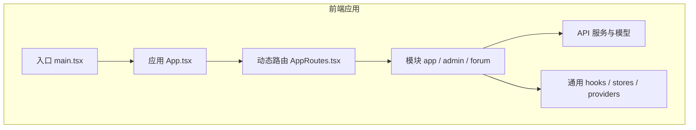
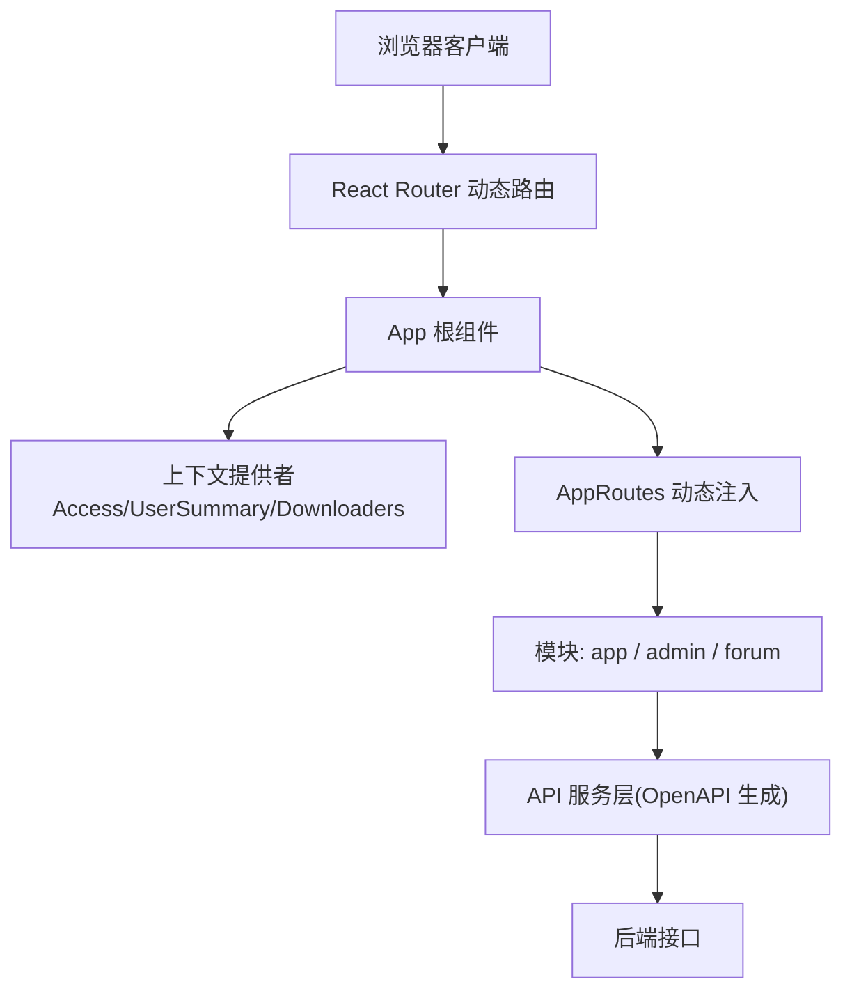
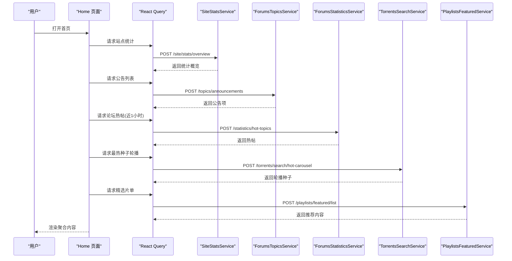
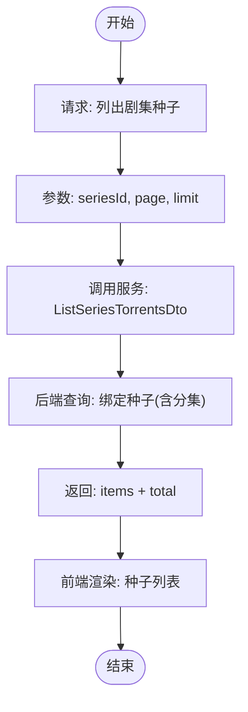
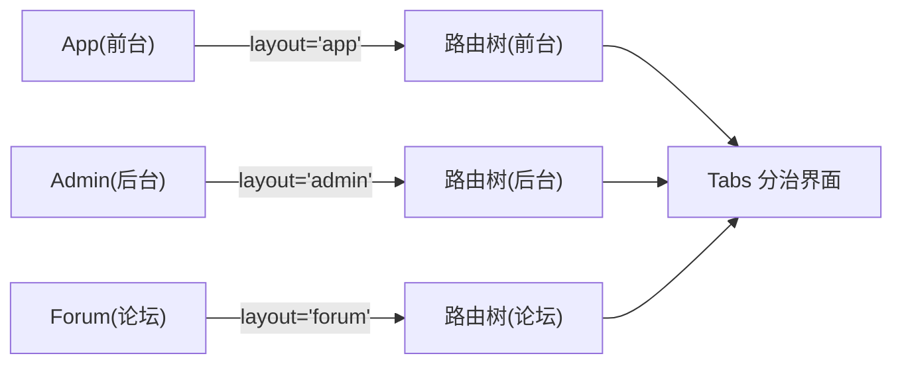
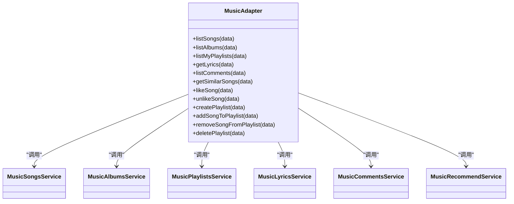
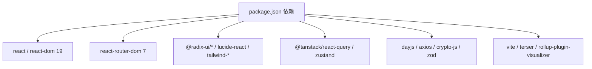

# 项目介绍

<cite>
**本文引用的文件**   
- [README.md](file://README.md)
- [package.json](file://package.json)
- [src\App.tsx](file://src\App.tsx)
- [src\main.tsx](file://src\main.tsx)
- [src\routes\AppRoutes.tsx](file://src\routes\AppRoutes.tsx)
- [src\modules\app\pages\Home.tsx](file://src\modules\app\pages\Home.tsx)
- [src\api\adapters\music.ts](file://src\api\adapters\music.ts)
- [src\api\services\MusicPlaylistsService.ts](file://src\api\services\MusicPlaylistsService.ts)
- [src\api\models\ListSeriesTorrentsDto.ts](file://src\api\models\ListSeriesTorrentsDto.ts)
- [src\api\models\ListSeriesTorrentsResponseDto.ts](file://src\api\models\ListSeriesTorrentsResponseDto.ts)
- [docs\PRD.md](file://docs\PRD.md)
- [docs\api-requirements\2025-12-18_剧集分集与种子管理_需求文档.md](file://docs\api-requirements\2025-12-18_剧集分集与种子管理_需求文档.md)
</cite>

## 目录
1. [引言](#引言)
2. [项目结构](#项目结构)
3. [核心组件](#核心组件)
4. [架构总览](#架构总览)
5. [详细组件分析](#详细组件分析)
6. [依赖分析](#依赖分析)
7. [性能考虑](#性能考虑)
8. [故障排查指南](#故障排查指南)
9. [结论](#结论)
10. [附录](#附录)

## 引言
zTorrent-site 是一个基于 React 19 的现代化种子分享平台，围绕“电影、电视剧、音乐等多媒体内容”的采集、组织、分发与社区互动展开。项目以模块化架构为核心，采用动态路由与服务化 API，覆盖前台门户、后台管理与论坛社区三大业务域，提供种子检索、剧集分集与种子绑定、音乐播放列表、站点统计与热榜、悬赏主题等能力。

- 核心价值主张
  - 一站式多媒体内容管理：支持电影、电视剧、音乐等多品类资源的收录与展示。
  - 结构化的种子与剧集关系：通过“剧集-分集-种子”的三层关系模型，提升资源定位与分发效率。
  - 社区驱动的内容生态：结合论坛热帖、悬赏主题、收藏与推荐，构建活跃的用户互动体系。
  - 开放的 API 适配层：通过 OpenAPI 自动生成的服务封装，降低前后端协作成本。

- 目标用户群体
  - 内容消费者：寻找高质量影视与音乐资源的普通用户。
  - 内容运营者：负责审核、推荐、促销与权限管理的管理员。
  - 内容创作者：上传与维护种子、剧集、音乐播放列表的贡献者。

- 解决的问题
  - 多媒体资源分散、检索困难：通过统一分类、搜索与轮播推荐提升发现效率。
  - 剧集与种子关系混乱：通过标准化的“剧集-分集-种子”绑定，减少错配与重复。
  - 社区互动与激励不足：通过悬赏主题、榜单与统计，增强用户粘性与参与度。

- 业务背景与发展现状
  - 业务背景：平台以种子分享为核心，逐步扩展至影视、音乐与社区互动，形成“内容-关系-社区”的闭环。
  - 发展现状：前台门户已具备首页聚合、站点统计、热榜轮播、悬赏与论坛热帖等功能；后台管理与论坛模块持续完善；API 层通过 OpenAPI 自动生成，接口规范与类型安全得到保障。

- 愿景、使命与核心理念
  - 愿景：成为多媒体资源高效分发与社区共治的标杆平台。
  - 使命：以技术驱动内容治理，以社区激发价值创造。
  - 核心理念：模块化架构、服务化 API、数据驱动与用户体验优先。

## 项目结构
项目采用“模块化 + 动态路由 + 服务化 API”的组织方式，主要目录与职责如下：
- src：前端源代码
  - api：OpenAPI 自动生成的服务与模型，以及音乐适配器
  - modules：前台(app)、后台(admin)、论坛(forum)三大业务模块
  - routes：动态路由与路由守卫
  - components、hooks、stores、providers、utils：通用组件与工具
- docs：产品与需求文档
- scripts：路由与权限同步、端点校验等开发辅助脚本
- 根目录：构建配置、包管理与环境变量

**图表来源**
- [src\main.tsx](file://src\main.tsx#L1-L18)
- [src\App.tsx](file://src\App.tsx#L1-L52)
- [src\routes\AppRoutes.tsx](file://src\routes\AppRoutes.tsx#L1-L115)

**章节来源**
- [README.md](file://README.md#L1-L11)
- [package.json](file://package.json#L1-L148)

## 核心组件
- 应用入口与初始化
  - main.tsx：初始化 Axios 拦截器与 OpenAPI 配置，挂载 QueryProvider 与根组件 App。
  - App.tsx：全局加载器、主题切换、错误边界、上下文提供者与路由容器。
- 动态路由与访问控制
  - AppRoutes.tsx：懒加载公开页面与受保护页面，动态注入路由元素，统一 404 处理与登录拦截。
- 前台门户与内容聚合
  - Home.tsx：首页聚合站点统计、公告、最热种子轮播、精华推荐、悬赏主题与论坛热帖，使用 React Query 与服务层对接后端接口。
- API 与服务适配
  - OpenAPI 自动生成的服务封装与模型类型，音乐模块通过适配器统一调用。
  - 剧集-种子管理相关接口：提供“剧集分集列表”“种子绑定/解绑”等能力，支撑精细化内容关系管理。

**章节来源**
- [src\main.tsx](file://src\main.tsx#L1-L18)
- [src\App.tsx](file://src\App.tsx#L1-L52)
- [src\routes\AppRoutes.tsx](file://src\routes\AppRoutes.tsx#L1-L115)
- [src\modules\app\pages\Home.tsx](file://src\modules\app\pages\Home.tsx#L1-L802)
- [src\api\adapters\music.ts](file://src\api\adapters\music.ts#L1-L35)
- [src\api\services\MusicPlaylistsService.ts](file://src\api\services\MusicPlaylistsService.ts#L1-L46)

## 架构总览
整体架构以 React 19 为核心，配合动态路由、React Query、OpenAPI 生成的服务层与模块化业务域，形成“入口 -> 路由 -> 模块 -> 服务 -> 数据”的清晰链路。

**图表来源**
- [src\main.tsx](file://src\main.tsx#L1-L18)
- [src\App.tsx](file://src\App.tsx#L1-L52)
- [src\routes\AppRoutes.tsx](file://src\routes\AppRoutes.tsx#L1-L115)

## 详细组件分析

### 前台门户首页（Home）
首页承担“内容聚合与导流”的核心职责，通过多个数据源与组件组合，向用户呈现站点状态、热门内容与社区动态。

**图表来源**
- [src\modules\app\pages\Home.tsx](file://src\modules\app\pages\Home.tsx#L113-L291)

**章节来源**
- [src\modules\app\pages\Home.tsx](file://src\modules\app\pages\Home.tsx#L1-L802)

### 剧集-分集-种子管理（API 与流程）
平台对“剧集-分集-种子”的关系进行建模与管理，支持按剧集维度查询绑定种子、按季/集维度精确绑定，提升资源定位与分发精度。

**图表来源**
- [docs\api-requirements\2025-12-18_剧集分集与种子管理_需求文档.md](file://docs\api-requirements\2025-12-18_剧集分集与种子管理_需求文档.md#L17-L90)
- [src\api\models\ListSeriesTorrentsDto.ts](file://src\api\models\ListSeriesTorrentsDto.ts#L1-L19)
- [src\api\models\ListSeriesTorrentsResponseDto.ts](file://src\api\models\ListSeriesTorrentsResponseDto.ts#L1-L16)

**章节来源**
- [docs\api-requirements\2025-12-18_剧集分集与种子管理_需求文档.md](file://docs\api-requirements\2025-12-18_剧集分集与种子管理_需求文档.md#L17-L90)

### 路由管理与三态架构（PRD）
PRD 文档提出“三态架构”（App/Admin/Forum）与“视窗分治”的路由管理方案，强调在管理层面解耦、通过 Tabs 分治与交互约束避免跨域误操作。

**图表来源**
- [docs\PRD.md](file://docs\PRD.md#L17-L87)

**章节来源**
- [docs\PRD.md](file://docs\PRD.md#L1-L113)

### 音乐模块适配器
音乐模块通过适配器统一暴露常用操作（歌曲/专辑/播放列表/歌词/相似推荐/点赞等），屏蔽具体服务差异，便于上层复用。

**图表来源**
- [src\api\adapters\music.ts](file://src\api\adapters\music.ts#L1-L35)
- [src\api\services\MusicPlaylistsService.ts](file://src\api\services\MusicPlaylistsService.ts#L1-L46)

**章节来源**
- [src\api\adapters\music.ts](file://src\api\adapters\music.ts#L1-L35)
- [src\api\services\MusicPlaylistsService.ts](file://src\api\services\MusicPlaylistsService.ts#L1-L46)

## 依赖分析
- 前端框架与生态
  - React 19 与 React Router 7：提供现代前端运行时与路由能力。
  - TailwindCSS 4：提供原子化样式与主题系统。
  - React Query：提供数据获取、缓存与状态管理。
  - OpenAPI TypeScript Codegen：自动生成服务与模型，保证类型安全。
- UI 与工具库
  - Radix UI、Lucide React、Sonner、Recharts、Framer Motion 等，提升交互与可视化体验。
- 开发与构建
  - Vite 6、ESLint、Prettier、Rollup 插件等，保障开发体验与产物质量。

**图表来源**
- [package.json](file://package.json#L5-L91)

**章节来源**
- [package.json](file://package.json#L1-L148)

## 性能考虑
- 路由与页面懒加载：通过 React.lazy 与 Suspense，减少首屏体积与首次渲染压力。
- 查询缓存与去抖：React Query 的 staleTime、SWR 模式与合理键值设计，降低重复请求与网络开销。
- 主题与图标：使用轻量图标库与原子化样式，避免不必要的重绘与回流。
- 构建优化：Vite 与 Terser 的按需打包与压缩策略，缩短构建时间与产物体积。

## 故障排查指南
- 登录与访问控制
  - 若出现未登录跳转或 404 重定向，检查本地存储中的令牌与路由守卫逻辑。
- 数据加载失败
  - 关注 React Query 的 error 与 loading 状态，核对服务层调用与后端接口返回。
- 路由异常
  - 检查动态路由注入与组件注册是否正确，确认路径前缀与 layout 字段一致。
- API 类型不匹配
  - 使用 OpenAPI 生成的模型与服务，确保请求/响应字段与接口定义一致。

**章节来源**
- [src\routes\AppRoutes.tsx](file://src\routes\AppRoutes.tsx#L73-L115)
- [src\modules\app\pages\Home.tsx](file://src\modules\app\pages\Home.tsx#L113-L291)

## 结论
zTorrent-site 以模块化与服务化为核心，围绕“种子分享 + 媒体内容 + 社区互动”构建了完整的业务闭环。通过动态路由、统一 API 适配与数据聚合，平台在用户体验、内容治理与运营效率方面实现了平衡。未来可在以下方向持续演进：进一步完善后台与论坛模块的交互与数据模型、强化内容审核与权限体系、引入更丰富的推荐与个性化能力。

## 附录
- 快速启动
  - 安装依赖后启动开发服务器，即可访问前台门户与相关页面。
- 常用脚本
  - dev：启动客户端开发服务器
  - api:generate：拉取后端 OpenAPI 并生成前端服务与模型
  - permissions:sync：同步权限配置
  - endpoints:guard / endpoints:test：校验端点方法与守卫

**章节来源**
- [README.md](file://README.md#L6-L11)
- [package.json](file://package.json#L126-L138)