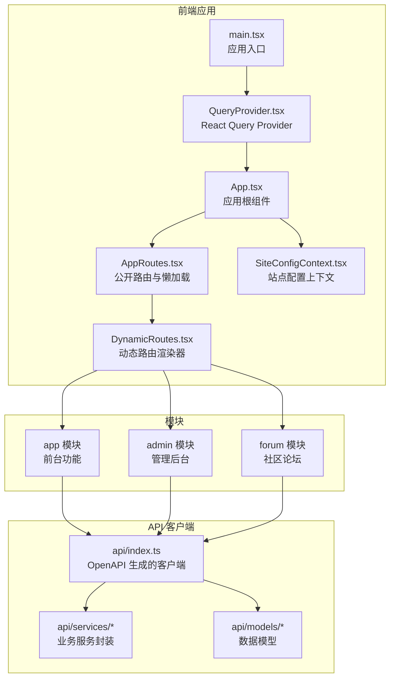
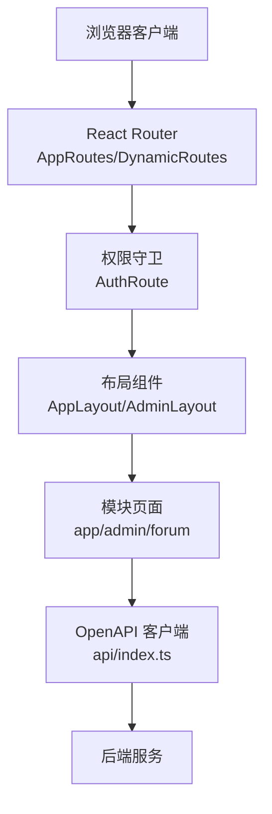
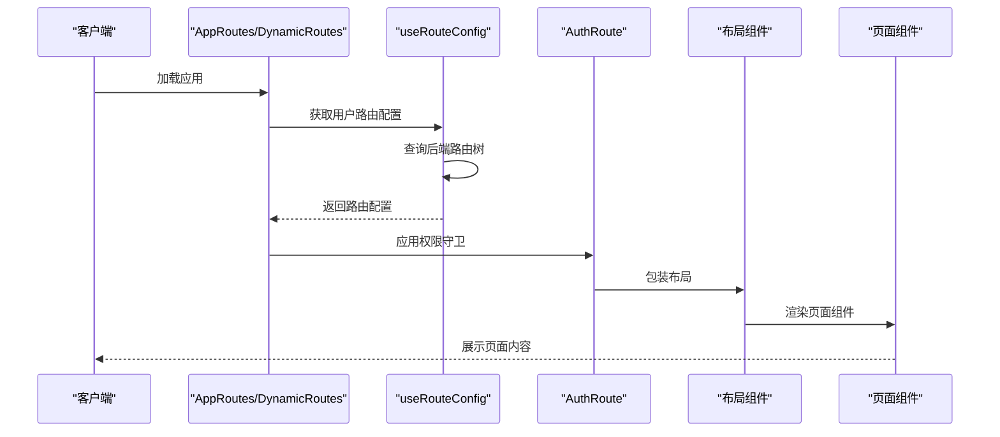
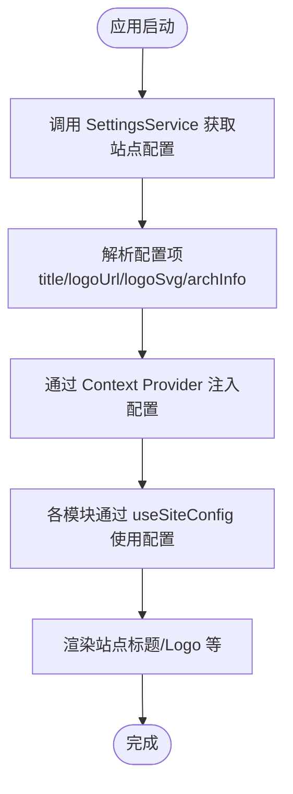
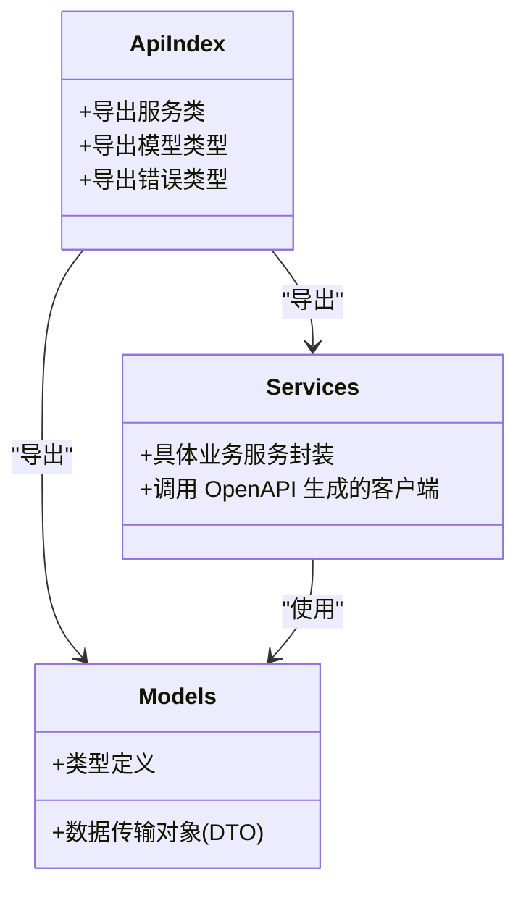
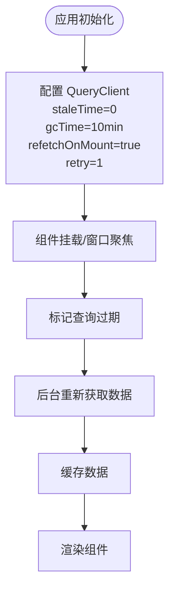
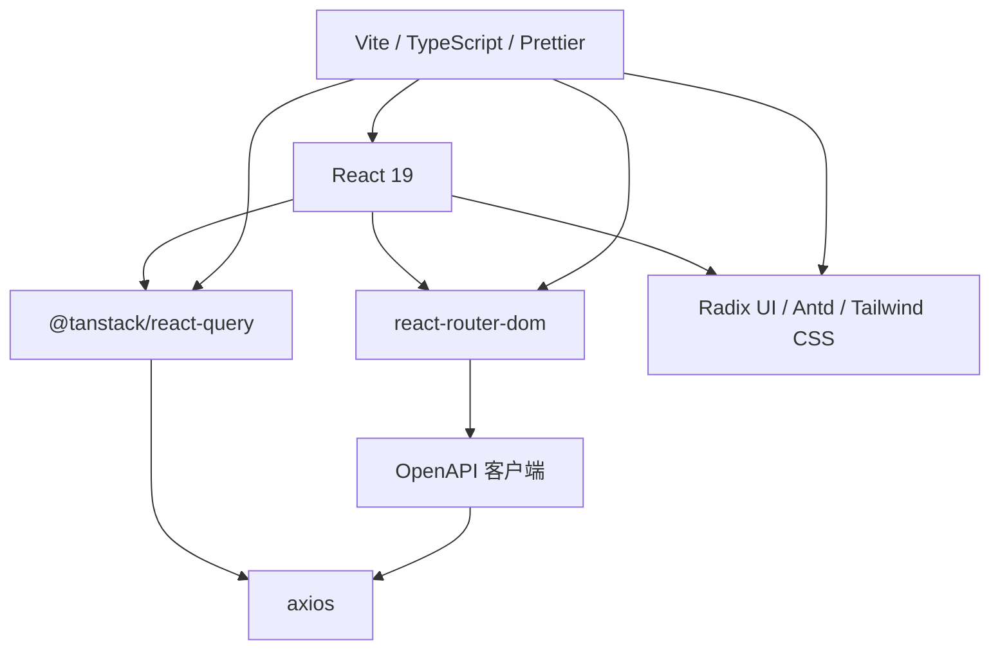

# 项目概述

<cite>
**本文档引用的文件**
- [README.md](file://README.md)
- [package.json](file://package.json)
- [src\App.tsx](file://src\App.tsx)
- [src\main.tsx](file://src\main.tsx)
- [src\routes\AppRoutes.tsx](file://src\routes\AppRoutes.tsx)
- [src\routes\DynamicRoutes.tsx](file://src\routes\DynamicRoutes.tsx)
- [src\providers\QueryProvider.tsx](file://src\providers\QueryProvider.tsx)
- [src\context\SiteConfigContext.tsx](file://src\context\SiteConfigContext.tsx)
- [src\types\routeConfig.ts](file://src\types\routeConfig.ts)
- [src\hooks\useRouteConfig.ts](file://src\hooks\useRouteConfig.ts)
- [src\api\index.ts](file://src\api\index.ts)
- [implementation_plan.md](file://implementation_plan.md)
- [docs\PRD.md](file://docs\PRD.md)
</cite>

## 目录
1. [引言](#引言)
2. [项目结构](#项目结构)
3. [核心组件](#核心组件)
4. [架构总览](#架构总览)
5. [详细组件分析](#详细组件分析)
6. [依赖关系分析](#依赖关系分析)
7. [性能考量](#性能考量)
8. [故障排除指南](#故障排除指南)
9. [结论](#结论)
10. [附录](#附录)

## 引言
zTorrent-site 是一个基于 React 19 的种子分享平台，支持电影、电视剧、音乐等多媒体内容的管理与分享。该项目采用模块化架构，结合动态路由系统与 API 驱动的权限控制，构建了一个可扩展的内容分发与社区互动平台。项目强调前后端分离、数据驱动的路由配置、以及现代化的前端状态管理与网络请求策略。

## 项目结构
项目采用按功能域划分的模块化组织方式，主要包含以下核心模块：
- 应用前台模块（app）：面向普通用户的核心功能，如种子浏览、详情展示、评论、收藏、下载等。
- 管理后台模块（admin）：面向管理员的系统配置、内容审核、用户管理、路由管理等功能。
- 论坛模块（forum）：面向社区用户的讨论与互动功能。
- API 客户端：基于 OpenAPI 自动生成的 TypeScript 客户端，覆盖站点各业务领域的服务接口。
- 路由与权限：动态路由系统与权限守卫，确保用户只能访问授权范围内的页面与功能。

**图表来源**
- [src\main.tsx](file://src\main.tsx#L1-L18)
- [src\App.tsx](file://src\App.tsx#L1-L52)
- [src\routes\AppRoutes.tsx](file://src\routes\AppRoutes.tsx#L1-L115)
- [src\routes\DynamicRoutes.tsx](file://src\routes\DynamicRoutes.tsx#L1-L308)
- [src\providers\QueryProvider.tsx](file://src\providers\QueryProvider.tsx#L1-L30)
- [src\context\SiteConfigContext.tsx](file://src\context\SiteConfigContext.tsx#L1-L50)
- [src\api\index.ts](file://src\api\index.ts#L1-L642)

**章节来源**
- [README.md](file://README.md#L1-L11)
- [package.json](file://package.json#L1-L148)
- [src\main.tsx](file://src\main.tsx#L1-L18)
- [src\App.tsx](file://src\App.tsx#L1-L52)
- [src\routes\AppRoutes.tsx](file://src\routes\AppRoutes.tsx#L1-L115)
- [src\routes\DynamicRoutes.tsx](file://src\routes\DynamicRoutes.tsx#L1-L308)
- [src\providers\QueryProvider.tsx](file://src\providers\QueryProvider.tsx#L1-L30)
- [src\context\SiteConfigContext.tsx](file://src\context\SiteConfigContext.tsx#L1-L50)
- [src\api\index.ts](file://src\api\index.ts#L1-L642)

## 核心组件
- 应用入口与初始化：应用通过 main.tsx 初始化全局拦截器与 OpenAPI 配置，随后在 QueryProvider 包裹下渲染根组件 App。
- 应用根组件：App.tsx 负责全局加载器、主题切换、错误边界、认证上下文与用户摘要上下文的初始化，并在首次挂载时预加载字典与偏好分类数据。
- 路由系统：AppRoutes.tsx 定义公开路由（登录、注册、忘记密码），并通过 DynamicRoutes.tsx 实现动态路由渲染，支持按布局类型（app/admin/forum/none）进行分组与嵌套。
- 动态路由渲染器：DynamicRoutes.tsx 根据后端返回的路由配置，动态生成路由树，支持重定向、新标签页打开、布局包装与权限守卫。
- 站点配置上下文：SiteConfigContext.tsx 从后端拉取站点设置（如标题、Logo 等），并在应用内提供统一的站点信息。
- API 客户端：api/index.ts 暴露了由 OpenAPI 自动生成的服务与模型，涵盖种子、电影、剧集、音乐、论坛、用户、权限等多个领域。

**章节来源**
- [src\main.tsx](file://src\main.tsx#L1-L18)
- [src\App.tsx](file://src\App.tsx#L1-L52)
- [src\routes\AppRoutes.tsx](file://src\routes\AppRoutes.tsx#L1-L115)
- [src\routes\DynamicRoutes.tsx](file://src\routes\DynamicRoutes.tsx#L1-L308)
- [src\context\SiteConfigContext.tsx](file://src\context\SiteConfigContext.tsx#L1-L50)
- [src\api\index.ts](file://src\api\index.ts#L1-L642)

## 架构总览
项目采用“前端模块化 + 动态路由 + API 驱动”的架构模式：
- 前端模块化：app、admin、forum 三大模块相对独立，通过动态路由系统统一接入。
- 动态路由：路由配置由后端提供，前端根据 layout 字段进行布局包装与权限控制。
- API 驱动：所有业务数据通过 OpenAPI 生成的客户端访问，确保类型安全与契约一致。
- 状态管理：使用 React Query 进行数据缓存、失效与重取，提升用户体验与性能。

**图表来源**
- [src\routes\AppRoutes.tsx](file://src\routes\AppRoutes.tsx#L1-L115)
- [src\routes\DynamicRoutes.tsx](file://src\routes\DynamicRoutes.tsx#L1-L308)
- [src\api\index.ts](file://src\api\index.ts#L1-L642)

## 详细组件分析

### 动态路由系统
动态路由系统是项目的核心之一，它允许后端以树形结构提供路由配置，前端据此生成完整的路由表。该系统的关键特性包括：
- 布局聚合：通过 layout 字段区分 app/admin/forum/none，分别应用不同的布局组件。
- 权限控制：路由配置包含权限列表，结合 AuthRoute 实现细粒度访问控制。
- 重定向与新标签页：支持在当前页面或新标签页打开重定向链接。
- 子路由与索引路由：支持嵌套子路由与 index 路由，满足复杂页面结构。
- 兜底与容错：当后端未返回特定布局的根节点时，前端会应用本地兜底配置，确保模块可访问。

**图表来源**
- [src\routes\AppRoutes.tsx](file://src\routes\AppRoutes.tsx#L1-L115)
- [src\routes\DynamicRoutes.tsx](file://src\routes\DynamicRoutes.tsx#L1-L308)
- [src\hooks\useRouteConfig.ts](file://src\hooks\useRouteConfig.ts#L1-L109)

**章节来源**
- [src\types\routeConfig.ts](file://src\types\routeConfig.ts#L1-L49)
- [src\hooks\useRouteConfig.ts](file://src\hooks\useRouteConfig.ts#L1-L109)
- [src\routes\DynamicRoutes.tsx](file://src\routes\DynamicRoutes.tsx#L1-L308)
- [docs\PRD.md](file://docs\PRD.md#L1-L113)

### 站点配置上下文
SiteConfigContext.tsx 从后端 SettingsService 拉取站点配置（如标题、Logo 等），并将这些配置注入到应用上下文中，供各模块共享使用。该机制确保了站点信息的集中管理与动态更新。

**图表来源**
- [src\context\SiteConfigContext.tsx](file://src\context\SiteConfigContext.tsx#L1-L50)

**章节来源**
- [src\context\SiteConfigContext.tsx](file://src\context\SiteConfigContext.tsx#L1-L50)

### API 客户端与服务层
API 客户端由 OpenAPI 自动生成，覆盖站点各业务领域，包括但不限于：
- 种子相关：种子搜索、详情、评论、上传、推广、置顶等。
- 内容管理：电影、剧集、音乐专辑/歌曲/歌词等的增删改查与审核流程。
- 社区功能：论坛帖子、标签、订阅、举报、统计等。
- 用户与权限：用户资料、角色、权限、通知、RSS 等。
- 系统管理：导航、设置、日志审计、惩罚记录、推荐配置等。

**图表来源**
- [src\api\index.ts](file://src\api\index.ts#L1-L642)

**章节来源**
- [src\api\index.ts](file://src\api\index.ts#L1-L642)

### 数据流与状态管理
应用使用 React Query 进行数据管理，其默认配置强调即时刷新与缓存持久化，以提升页面切换与回访的体验。查询配置包括：
- 立即视为过期（staleTime: 0），确保窗口焦点或组件挂载时后台自动刷新。
- 缓存保留时间较长（gcTime: 10 分钟），保证用户返回页面时的“秒开”体验。
- 挂载时重新获取（refetchOnMount: true）与有限次重试（retry: 1）。

**图表来源**
- [src\providers\QueryProvider.tsx](file://src\providers\QueryProvider.tsx#L1-L30)

**章节来源**
- [src\providers\QueryProvider.tsx](file://src\providers\QueryProvider.tsx#L1-L30)

## 依赖关系分析
项目的技术栈围绕 React 19 与现代前端工具链构建，关键依赖包括：
- 路由与导航：react-router-dom v7.x 提供声明式路由与导航能力。
- 状态管理：@tanstack/react-query 提供数据缓存、失效与重取。
- UI 组件库：Radix UI、Ant Design 组件与 Tailwind CSS，结合自研组件体系。
- 网络请求：axios 与 OpenAPI 自动生成的客户端，确保类型安全与契约一致。
- 构建工具：Vite 提供快速开发与生产构建，配合 TypeScript 与 Prettier 等工具链。

**图表来源**
- [package.json](file://package.json#L1-L148)

**章节来源**
- [package.json](file://package.json#L1-L148)

## 性能考量
- 动态路由与懒加载：通过 React.lazy 与 Suspense 实现页面级懒加载，减少首屏负载。
- 查询缓存策略：React Query 的短 staleTime 与较长 gcTime 平衡了实时性与性能。
- 全局加载器与进度条：在路由切换与配置加载期间提供视觉反馈，改善用户体验。
- 组件拆分与模块化：将大型页面拆分为多个子组件，降低单文件复杂度，便于维护与优化。

## 故障排除指南
- 路由配置异常：若后端未返回特定布局的根节点，前端会应用兜底配置以确保模块可访问。若仍无法加载，请检查后端路由配置与权限。
- 认证状态不同步：useRouteConfig 监听认证事件与 storage 事件，确保登录状态变化时路由配置正确刷新。
- 站点配置缺失：SiteConfigContext 在拉取失败时会回退为空配置，检查后端设置接口与网络连接。
- API 调用失败：确认 OpenAPI 客户端初始化与拦截器配置正常，检查后端接口可用性与 CORS 设置。

**章节来源**
- [src\hooks\useRouteConfig.ts](file://src\hooks\useRouteConfig.ts#L1-L109)
- [src\context\SiteConfigContext.tsx](file://src\context\SiteConfigContext.tsx#L1-L50)
- [src\main.tsx](file://src\main.tsx#L1-L18)

## 结论
zTorrent-site 通过模块化架构、动态路由系统与 API 驱动的设计，构建了一个可扩展、可维护且用户体验优良的种子分享平台。项目在技术选型上注重现代化与工程化，结合 React Query 的数据管理策略与 OpenAPI 的类型安全，为后续的功能迭代与性能优化奠定了坚实基础。

## 附录
- 发展历程与规划：项目文档中包含实施计划与产品需求文档，体现了从路由系统重构到页面组件现代化的演进方向。
- 差异化特点：通过三态架构（App/Admin/Forum）与 Tabs 视图的路由管理，提升了管理员的工作效率与系统的可维护性。

**章节来源**
- [implementation_plan.md](file://implementation_plan.md#L1-L45)
- [docs\PRD.md](file://docs\PRD.md#L1-L113)