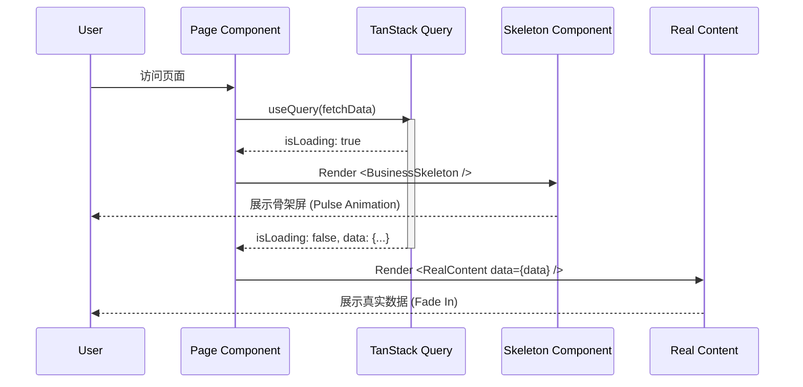

# 20251223-skeleton-screen-solution.md

## 1. 方案源数据 (Metadata)

| 属性        | 内容                                  |
| :---------- | :------------------------------------ |
| **Feature** | Skeleton Screen (骨架屏 Loading 方案) |
| **Status**  | 🟢 Proposed (Draft)                   |
| **Author**  | Resource Agent (Solution Architect)   |
| **Date**    | 2025-12-23                            |

## 2. 需求与现状分析 (Analysis)

> **一句话摘要**: 为解决异步数据加载时的白屏与布局跳变问题，构建一套基于 Shadcn UI 且适配 "Premium Dark Mode" 设计语言的骨架屏组件体系。

- **场景与痛点**:
  - **用户**: 访问电影列表、详情页等数据密集型页面时，面对长时间的 Loading Spinner 或白屏，体验断裂且廉价。
  - **核心痛点**:
    - 布局抖动 (Layout Shift): 数据加载前后 DOM 结构差异大。
    - 视觉降级: 简单的 Spinner 无法传递"高级感"。
- **现有系统结合点**:
  - 利用现有的 `src/components/ui/skeleton.tsx` 作为原子组件。
  - 结合 `TanStack Query` 的 `isLoading` 状态进行控制。
  - 样式需匹配 `index.css` 中的深色毛玻璃风格 (`bg-neutral-*`).
- **核心目标**:
  - **无缝过渡**: 骨架屏布局应与真实内容 1:1 对应。
  - **组件化**: 封装通用的业务骨架组件 (如 `MovieCardSkeleton`, `PageHeaderSkeleton`)。

## 3. 顶层架构设计 (High-Level Design)

### 3.1 设计理念

- **Atomic Design (原子化设计)**:
  - Level 1: `Skeleton` (基础原子，带动画)
  - Level 2: `TextSkeleton`, `ImageSkeleton` (通用分子)
  - Level 3: `MovieCardSkeleton`, `RowSkeleton` (业务组织)
  - Level 4: `MoviePageSkeleton` (完整模板)
- **Shimmer Effect (微光效果)**: 使用 Tailwind 的 `animate-pulse` 配合深色梯队颜色，营造呼吸感。

### 3.2 核心全景图 (System Architecture)



## 4. 详细实施方案 (Detailed Implementation)

### 4.1 基础组件层 (Primitives)

**Target**: `src/components/ui/skeleton.tsx` (现有优化)

确保基础组件支持 `className` 覆盖，并预设深色模式样式：

```tsx
import { cn } from "@/utils/utils";

function Skeleton({ className, ...props }: React.HTMLAttributes<HTMLDivElement>) {
  return <div className={cn("animate-pulse rounded-md bg-neutral-800/50", className)} {...props} />;
}
export { Skeleton };
```

### 4.2 业务骨架层 (Business Skeletons)

**Target Directory**: `src/components/skeletons`

需新建以下业务专属骨架屏：

#### 1. 媒体卡片骨架 (`MediaCardSkeleton`)

用于首页、列表页的网格展示。

```tsx
// src/components/skeletons/MediaCardSkeleton.tsx
export function MediaCardSkeleton() {
  return (
    <div className="flex flex-col gap-2">
      {/* Poster Aspect Ratio 2:3 */}
      <Skeleton className="aspect-[2/3] w-full rounded-xl" />
      <div className="space-y-1">
        <Skeleton className="h-4 w-3/4" />
        <Skeleton className="h-3 w-1/2" />
      </div>
    </div>
  );
}
```

#### 2. 列表容器骨架 (`GridSkeleton`)

用于包裹卡片，解决列表页的 Loading。

```tsx
// src/components/skeletons/GridSkeleton.tsx
export function GridSkeleton({ count = 20 }: { count?: number }) {
  return (
    <div className="grid grid-cols-2 gap-4 sm:grid-cols-3 md:grid-cols-4 lg:grid-cols-5">
      {Array.from({ length: count }).map((_, i) => (
        <MediaCardSkeleton key={i} />
      ))}
    </div>
  );
}
```

#### 3. 详情页骨架 (`DetailSkeleton`)

用于 `/movie/:id` 或 `/series/:id`。

- **Hero Section**: 大背景图 + 标题 + 按钮组
- **Info Bar**: 元数据条
- **Cast List**: 圆形头像列表

### 4.3 页面集成 (Integration)

**Target**: `src/pages/Movies/index.tsx` (示例)

```tsx
const { data, isLoading } = useQuery(...)

if (isLoading) {
  return (
    <div className="page-container">
       <div className="mb-6 flex items-center justify-between">
          <Skeleton className="h-8 w-32" /> {/* Title */}
          <Skeleton className="h-10 w-24" /> {/* Filter Button */}
       </div>
       <GridSkeleton count={24} />
    </div>
  )
}
```

## 5. 验证与测试 (Verification & Testing)

- **手动验证步骤**:
  1. 在 `Chrome DevTools` -> `Network` 中开启 `Slow 3G`。
  2. 刷新电影列表页。
  3. 观察骨架屏是否立即出现。
  4. 观察骨架屏布局是否与真实卡片高度一致（无布局跳动）。
  5. 检查动画是否流畅，颜色是否融入 Dark Mode。

## 6. 实施路线图 (Roadmap)

| 阶段         | 目标 (Milestone)   | 涉及文件 (Files)                                  | 为何重要         |
| :----------- | :----------------- | :------------------------------------------------ | :--------------- |
| **P0: 基础** | 确认 Skeleton 原语 | `src/components/ui/skeleton.tsx`                  | 统一设计语言     |
| **P1: 列表** | 实现卡片与网格骨架 | `src/components/skeletons/MediaCardSkeleton.tsx`  | 高频页面体验提升 |
| **P2: 详情** | 实现详情页骨架     | `src/components/skeletons/DetailPageSkeleton.tsx` | LCP 优化         |
| **P3: 整合** | 替换现有 Spinner   | `src/pages/Movies/index.tsx` 等                   | 全面落地         |

## 7. 决策与风险 (Trade-offs & Risks)

- **关键决策**:
  - **粒度选择**: 选择 **组件级骨架** 而非 **整页图片骨架**。
  - **原因**: 组件级骨架更灵活，适应响应式布局变化，维护成本低于整页 SVG 方案。
- **潜在风险**:
  - 🟡 **[中风险]**: 骨架高度与真实内容不匹配导致 "Layout Shift"。
  - **预案**: 严格按照真实组件的 `aspect-ratio` 和 `padding` 设置骨架尺寸，使用 `clsx` 复用真实组件的布局类名。
